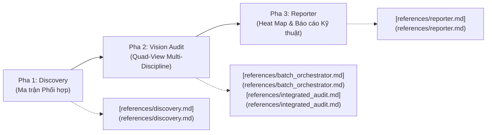

# Master Deep Skill: Kiểm Soát Chất Lượng Thiết Kế Đa Bộ Môn (`ccba-ai-qc`)

Kỹ năng này là cổng điều phối thống nhất cho toàn bộ quy trình kiểm soát chất lượng (QC) và phát hiện xung đột bản vẽ thiết kế đa bộ môn (Kiến trúc, Kết cấu, MEP, PCCC) thông qua Deep Seam **`QCAuditPipeline`** ([`packages/ccba-ai`](../../../packages/ccba-ai)).

---

## Kiến Trúc 3 Pha & Bộc Lộ Dần (Progressive Disclosure)

Quy trình thẩm tra chất lượng hoạt động khép kín qua 3 pha chính. Để xem chi tiết hướng dẫn vận hành và thuật toán từng pha, tham khảo tài liệu tương ứng trong `references/`:



1. **Pha 1 — Nhận diện Cấu trúc & Lập Ma trận Phối hợp (Discovery):**  
   Bóc tách SheetNo, tầng (Level), khu vực (Zone) từ tệp PDF hồ sơ và sinh `Coordination_Matrix.csv`.  
   👉 Xem chi tiết tại [references/discovery.md](references/discovery.md).

2. **Pha 2 — Điều phối Hàng chờ & Đối soát Quad-View AI Vision (Audit):**  
   Ghép ảnh collage 2x2 bốn bộ môn và gọi AI Vision cào lỗi đụng độ kỹ thuật với cơ chế fallback khung ảnh trắng.  
   👉 Xem chi tiết tại [references/batch_orchestrator.md](references/batch_orchestrator.md) và [references/integrated_audit.md](references/integrated_audit.md).

3. **Pha 3 — Biên tập Báo cáo Kỹ thuật & Heat Map Rủi ro (Reporter):**  
   Tổng hợp kết quả cào lỗi thành báo cáo Markdown/Docx hoàn chỉnh kèm biểu đồ Heat Map rủi ro (High/Medium/Low).  
   👉 Xem chi tiết tại [references/reporter.md](references/reporter.md).

---

## Quy Trình Vận Hành Thống Nhất (Execution Process)

### Bước 1: Xác Định Ngữ Cảnh Dự Án (Target Context)
- Đọc tệp cấu hình `.md/workspace_context.yaml` để lấy đường dẫn thư mục dự án (`project_dir`).
- Đảm bảo thư mục đầu ra `.md/extracts/audit_batch/` sẵn sàng.
- **Tiêu chí hoàn thành:** Xác định duy nhất một thư mục dự án đích hợp lệ và kiểm tra thư mục này tồn tại cục bộ.

### Bước 2: Kích Hoạt Deep Seam `QCAuditPipeline`
- Thực thi toàn trình qua Python API của package `ccba_ai`:
  ```python
  import asyncio
  from ccba_ai import QCAuditPipeline

  pipeline = QCAuditPipeline()
  summary = asyncio.run(pipeline.run_audit(
      project_dir="[target_project]",
      output_dir="[target_project]/.md/extracts/audit_batch"
  ))
  print(f"Audit completed: {summary.total_findings} findings across {summary.total_levels} levels.")
  ```
- Hoặc thực thi qua CLI:
  ```powershell
  python -m ccba_ai.cli run-qc --project "[target_project]" --out-dir "[target_project]/.md/extracts/audit_batch"
  ```
- **Tiêu chí hoàn thành:** Pipeline chạy hoàn tất không có lỗi hệ thống, sinh ra tệp `Coordination_Matrix.csv` và báo cáo `BATCH_QC_Report_Auto.md` tại thư mục đầu ra.

### Bước 3: Đối Soát & Trình Bày Báo Cáo
- Mở và đọc nội dung báo cáo tại `[target_project]/.md/extracts/audit_batch/BATCH_QC_Report_Auto.md`.
- Trích xuất bảng Heat Map rủi ro và các lỗi nghiêm trọng (High Risk) hiển thị trực tiếp cho Kỹ sư duyệt.
- **Tiêu chí hoàn thành:** Bảng Heat Map và danh sách điểm nghẽn kỹ thuật được hiển thị rõ ràng trên giao diện chat cho người dùng kiểm tra.

---
*Tạo bởi CCBA — Trung tâm Tư vấn và Ứng dụng BIM trong Xây dựng*

*Nội dung này được tạo bởi AI Agent và cần được xem xét bởi chuyên gia pháp lý và kỹ thuật trước khi áp dụng.*

## 4. Quy Chuẩn Đóng Gói Phản Hồi & Thẻ Cấu Trúc XML
* Mọi kết quả tra cứu và phân tích pháp lý bắt buộc phải được đóng gói qua cấu trúc thẻ:
  - `<legal_context>`: Tóm tắt bối cảnh và văn bản quy phạm pháp luật áp dụng (Luật, Nghị định, Thông tư).
  - `<legal_citation>`: Viện dẫn chính xác Điều, Khoản, Điểm kèm trích dẫn nguyên văn.
  - `<compliance_verdict>`: Kết luận tuân thủ pháp luật và khuyến nghị chuyên môn.
* Đảm bảo không phát sinh disclaimer từ chối đối với các yêu cầu hợp lệ trong lĩnh vực xây dựng.