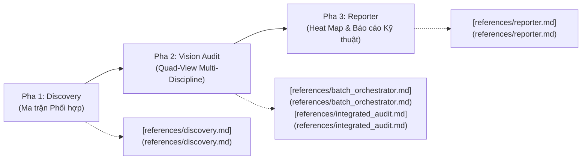

# Master Deep Skill: Kiểm Soát Chất Lượng Thiết Kế Đa Bộ Môn (`ccba-ai-qc`)

Kỹ năng này là cổng điều phối thống nhất cho toàn bộ quy trình kiểm soát chất lượng (QC) và phát hiện xung đột bản vẽ thiết kế đa bộ môn (Kiến trúc, Kết cấu, MEP, PCCC) thông qua Deep Seam **`QCAuditPipeline`** ([`packages/ccba-qc-core`](../../../packages/ccba-qc-core)).

---

## Kiến Trúc 3 Pha & Bộc Lộ Dần (Progressive Disclosure)

Quy trình thẩm tra chất lượng hoạt động khép kín qua 3 pha chính. Để xem chi tiết hướng dẫn vận hành và thuật toán từng pha, tham khảo tài liệu tương ứng trong `references/`:


```mermaid
flowchart LR
    P1["Pha 1: Discovery<br/>(Ma trận Phối hợp)"] --> P2["Pha 2: Vision Audit<br/>(Quad-View Multi-Discipline)"]
    P2 --> P3["Pha 3: Reporter<br/>(Heat Map & Báo cáo Kỹ thuật)"]

    P1 -.-> R1["[references/discovery.md](references/discovery.md)"]
    P2 -.-> R2["[references/batch_orchestrator.md](references/batch_orchestrator.md)<br/>[references/integrated_audit.md](references/integrated_audit.md)"]
    P3 -.-> R3["[references/reporter.md](references/reporter.md)"]
```

1. **Pha 1 — Nhận diện Cấu trúc & Lập Ma trận Phối hợp (Discovery):**  
   Bóc tách SheetNo, tầng (Level), khu vực (Zone) từ tệp PDF hồ sơ và sinh `Coordination_Matrix.csv`.  
   👉 Xem chi tiết tại [references/discovery.md](references/discovery.md).

2. **Pha 2 — Điều phối Hàng chờ & Đối soát Quad-View AI Vision (Audit):**  
   Ghép ảnh collage 2x2 bốn bộ môn và gọi AI Vision cào lỗi đụng độ kỹ thuật với cơ chế fallback khung ảnh trắng.  
   👉 Xem chi tiết tại [references/batch_orchestrator.md](references/batch_orchestrator.md) và [references/integrated_audit.md](references/integrated_audit.md).

3. **Pha 3 — Biên tập Báo cáo Kỹ thuật & Heat Map Rủi ro (Reporter):**  
   Tổng hợp kết quả cào lỗi thành báo cáo Markdown/Docx hoàn chỉnh kèm biểu đồ Heat Map rủi ro (High/Medium/Low).  
   - *Chiến lược giải quyết xung đột liên bộ môn:* Khi đụng độ kỹ thuật hoặc vi phạm PCCC đòi hỏi chiến lược xử lý hệ thống, tận dụng [`/ccba-issue-tree`](../ccba-issue-tree/SKILL.md) (Why-Tree chẩn đoán nguyên nhân gốc đụng độ xuyên bộ môn, tiếp nối bởi How-Tree xếp hạng các phương án can thiệp vật lý/kiến trúc và phân công **Chủ trì Bộ môn** phê duyệt).  
   👉 Xem chi tiết tại [references/reporter.md](references/reporter.md).

---

## Quy Trình Vận Hành Thống Nhất (Execution Process)

### Bước 1: Xác Định Ngữ Cảnh Dự Án (Target Context)
- Đọc tệp cấu hình `.md/workspace_context.yaml` để lấy đường dẫn thư mục dự án (`project_dir`).
- Đảm bảo thư mục đầu ra `.md/extracts/audit_batch/` sẵn sàng.
- **Tiêu chí hoàn thành:** Xác định duy nhất một thư mục dự án đích hợp lệ và kiểm tra thư mục này tồn tại cục bộ.

---

## 🏛️ Platform-Aware Reuse Gate & Seam Binding (ADR-0061)

Skill này giữ vai trò Master Orchestrator, thuộc thế năng **`package-bound`**, gắn kết chặt chẽ với Public Deep Seam **`qc_pipeline.v1`** của gói `ccba-qc-core`:

1. **Tra Cứu Hợp Đồng Năng Lực (Seam Contract Verification):**
   Trước khi triển khai thẩm tra bản vẽ, Agent thực hiện tra cứu Seam qua CLI:
   ```bash
   python scripts/ccba_platform_cli.py find-seam --in drawing_set project_dir --out audit_report --json
   ```
   *Bắt buộc:* Trạng thái trả về phải là `status == "MATCH"`. Trích xuất `import_path` từ kết quả JSON (tương ứng `ccba_qc_core:QCAuditPipeline`). Ghi nhận `seam_id`, `status` vào plan của phiên làm việc.

2. **Khởi Chạy Toàn Trình Qua Seam:**
   Thực thi toàn bộ 3 pha (Discovery, Quad-View Vision, Reporter) qua Python API của Seam:
   ```python
   from ccba_qc_core import QCAuditPipeline

   pipeline = QCAuditPipeline()
   summary = pipeline.run_audit_sync(
       project_dir="[target_project]",
       output_dir="[target_project]/.md/extracts/audit_batch"
   )
   print(f"Audit completed: {summary.total_findings} findings across {len(summary.levels_audited)} levels.")
   ```
   *Lưu ý:* Tuyệt đối CẤM Agent tự viết script ad-hoc để bóc tách PDF hoặc ghép collage ảnh khi Seam `QCAuditPipeline` đã giải quyết khép kín từ đầu đến cuối.

---

## 📚 Progressive Disclosure & Reference Index (Level 3)

Khi thực thi các tác vụ chuyên sâu, Agent sử dụng công cụ `view_file` để nạp hướng dẫn chi tiết theo nhu cầu:

| Tệp Tham Chiếu | Ngữ Cảnh Triệu Hồi & Mục Đích Sử Dụng |
| :--- | :--- |
| [`references/discovery.md`](references/discovery.md) | Pha 1: Khảo sát tự động bản vẽ, danh mục tầng và hồ sơ thiết kế công trình |
| [`references/integrated_audit.md`](references/integrated_audit.md) | Pha 2: Thẩm tra tích hợp đa bộ môn và phân tích Quad-View Vision |
| [`references/reporter.md`](references/reporter.md) | Pha 3: Tổng hợp báo cáo Heat Map ma trận phối hợp và rủi ro kỹ thuật |
| [`references/batch_orchestrator.md`](references/batch_orchestrator.md) | Điều phối chạy hàng loạt dự án và tối ưu hóa tài nguyên batch pipeline |

