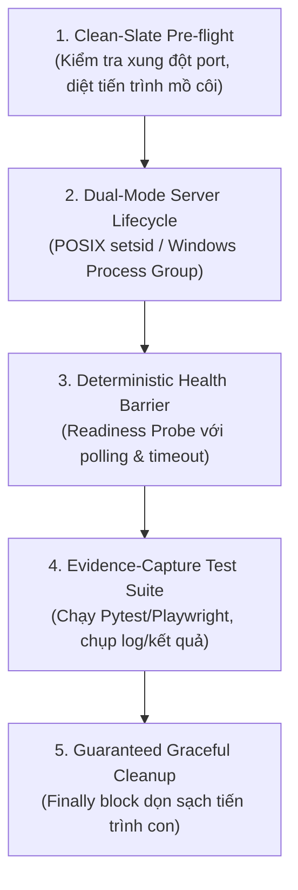

# Kỹ Năng Khởi Tạo & Bảo Trì Bộ Kiểm Định Ứng Dụng (ccba-create-verification-skill)

Kỹ năng này tự động thiết lập bộ kỹ năng kiểm định tự động chuyên biệt `verify-<app>` cho bất kỳ ứng dụng nào trong hệ sinh thái CCBA (Web, REST API, CLI, Worker, hoặc Spoke repository).

Được kế thừa và nâng cấp từ triết lý `create-verification-skill` của Cursor `pstack`, bộ kiểm định này tuân thủ nghiêm ngặt nguyên tắc **Vệ Sinh Spoke (ADR-0044)**: toàn bộ mã kiểm thử và kịch bản thực thi được cô lập bên trong `.agents/skills/verify-<app>/harness/`, tuyệt đối không làm phình thư mục `scripts/` vượt quá giới hạn 15 kịch bản.

---

## 5 Khối Chức Năng Cốt Lõi Trong Kỹ Năng Kiểm Định `verify-<app>`

Mỗi kỹ năng `verify-<app>` được tạo ra phải bao gồm đầy đủ 5 khối cấu trúc sau:



### 1. Clean-Slate Pre-flight (Tiền Kiểm Sạch Sẽ)
- Kiểm tra xem cổng dịch vụ (port) mục tiêu có đang bị chiếm dụng bởi tiến trình khác hay không.
- Nếu có tiến trình chiếm dụng ngoài ý muốn, cảnh báo hoặc thực hiện ngắt kết nối an toàn.

### 2. Dual-Mode Server Lifecycle (Quản Trị Vòng Đời Tiến Trình Đa Nền Tảng)
- Khởi động server trong một nhóm tiến trình riêng biệt (Process Group) để đảm bảo có thể dừng toàn bộ cây tiến trình con một cách triệt để khi kết thúc bài test.
- **Quy chuẩn đa hệ điều hành bắt buộc**:
  ```python
  import os
  import subprocess
  import sys

  is_win = sys.platform == "win32"
  kwargs = {}
  if is_win:
      # Windows: Khởi tạo Process Group mới
      kwargs["creationflags"] = subprocess.CREATE_NEW_PROCESS_GROUP
  else:
      # Linux / macOS (POSIX): Sử dụng setsid
      kwargs["preexec_fn"] = os.setsid

  proc = subprocess.Popen(server_cmd, **kwargs)
  ```

### 3. Deterministic Health Barrier (Rào Chắn Sẵn Sàng Xác Định)
- Tuyệt đối CẤM dùng `time.sleep(N)` tùy tiện để chờ server khởi động.
- BẮT BUỘC sử dụng vòng lặp kiểm tra HTTP endpoint (ví dụ: gửi request thăm dò readiness probe) với timeout xác định (ví dụ tối đa 15s, thăm dò mỗi 200ms).

### 4. Evidence-Capture Test Suite (Thực Thi Kiểm Thử & Thu Thập Bằng Chứng)
- Chạy toàn bộ các kịch bản kiểm thử (API, UI, hoặc integration tests).
- Lưu giữ kết quả có cấu trúc (JUnit XML, JSON log, hoặc test artifacts) để phục vụ CI/CD và báo cáo nghiệm thu.

### 5. Guaranteed Graceful Cleanup (Dọn Dẹp Đảm Bảo Tuyệt Đối)
- Quá trình dừng server BẮT BUỘC nằm trong khối `finally:` để đảm bảo không để lại tiến trình mồ côi (zombie processes) ngay cả khi bài test thất bại:
  ```python
  try:
      # Chạy test suite...
      pass
  finally:
      if is_win:
          subprocess.run(["taskkill", "/F", "/T", "/PID", str(proc.pid)], check=False)
      else:
          import signal
          try:
              os.killpg(os.getpgid(proc.pid), signal.SIGTERM)
          except ProcessLookupError:
              pass
  ```

---

## Chế Độ Hoạt Động Kép (Dual-Mode Operation) & Tự Động Nhận Diện

Kỹ năng tự động xác định chế độ vận hành dựa trên hiện trạng hệ thống tệp:
- **Nếu chưa tồn tại `.agents/skills/verify-<app>/harness/`** $\rightarrow$ Kích hoạt **Mode 1: Khởi Tạo Mới (`scaffold`)**.
- **Nếu đã tồn tại `.agents/skills/verify-<app>/harness/`** $\rightarrow$ Kích hoạt **Mode 2: Bảo Trì & Sửa Sai Lệch (`maintain`)**.

---

## Quy Trình Triển Khai Cho AI Agent

### Mode 1 — Khởi Tạo Mới (`scaffold`)
1. **Khảo Sát Ứng Dụng (App Discovery):**
   - Xác định loại ứng dụng: Web (FastAPI, Flask, Next.js), CLI, Worker, hoặc Thư viện.
   - Xác định lệnh khởi động server (nếu có), cổng mặc định, và probe kiểm tra sức khỏe (readiness check hoặc command ping).
   - **Tiêu chí hoàn thành:** Xác định đầy đủ loại ứng dụng, lệnh khởi chạy, cổng lắng nghe, và cơ chế probe sẵn sàng.
2. **Khởi Tạo Cấu Trúc Thư Mục Cục Bộ:**
   - Tạo thư mục `.agents/skills/verify-<app>/`.
   - Tạo thư mục con `.agents/skills/verify-<app>/harness/` chứa các kịch bản thực thi.
   - **Tiêu chí hoàn thành:** Thư mục `.agents/skills/verify-<app>/harness/` được tạo thành công trên hệ thống tệp.
3. **Sinh Tệp Định Nghĩa Kỹ Năng (`verify-<app>/SKILL.md`):**
   - Định nghĩa frontmatter chuẩn (`name: verify-<app>`, `category: verification`, v.v.).
   - Hướng dẫn các bước chạy kiểm định và đối chiếu trạng thái theo 5 khối cấu trúc.
   - **Tiêu chí hoàn thành:** Tệp `.agents/skills/verify-<app>/SKILL.md` được sinh ra với đầy đủ frontmatter và quy trình 5 khối.
4. **Khởi Tạo Features Map (`features/INDEX.md`):**
   - Lập danh mục các tính năng hiện có của ứng dụng theo chuẩn `features_map_guide.md`.
   - **Tiêu chí hoàn thành:** Tệp `features/INDEX.md` được khởi tạo với bảng ánh xạ các tính năng chính và bài kiểm thử tương ứng.
5. **Chạy Thử Nghiệm Xác Minh (Dry-Run Verification):**
   - Thực thi thử kịch bản harness để xác nhận hệ thống có thể khởi động, chạy probe, và dọn dẹp sạch sẽ với exit code 0.
   - **Tiêu chí hoàn thành:** Kịch bản harness thực thi dry-run thành công và thoát với mã exit code 0.

### Mode 2 — Bảo Trì & Sửa Sai Lệch Drift (`maintain`)
1. **Kiểm Tra Nguồn Gốc Thay Đổi (Pre-Remediation Provenance Check - COND-01):**
   - Đối chiếu commit history hoặc tài liệu API: nếu thay đổi là chủ đích thiết kế (đổi route, port, schema) $\rightarrow$ sửa `harness/`; nếu là lỗi hồi quy ngoài ý muốn (regression) $\rightarrow$ **CẤM SỬA `harness/`**, giữ nguyên bài test và yêu cầu sửa mã nguồn ứng dụng.
   - **Tiêu chí hoàn thành:** Phân loại chính xác nguyên nhân lỗi thuộc diện Lệch Hợp Đồng (Contract Drift) hay Lỗi Hồi Quy (Regression).
2. **Đối Chiếu Bề Mặt Tính Năng (Surface Diff):**
   - So sánh các route/command hiện hành với tài liệu `features/INDEX.md` để khoanh vùng điểm lệch.
   - **Tiêu chí hoàn thành:** Xác định danh sách các điểm trôi lệch giữa code và tài liệu.
3. **Thực Thi Quan Sát Thực Tế (Observed Live Pass):**
   - Chạy 1 pass harness đại diện để ghi nhận log lỗi thực tế thay vì suy đoán cảm tính.
   - **Tiêu chí hoàn thành:** Thu thập toàn văn stack trace và log lỗi thực tế từ lần chạy kiểm định.
4. **Khắc Phục Tận Gốc Trong Thư Mục `harness/`:**
   - Cập nhật lệnh CLI, port, timeout, probe URL hoặc schema assertions bên trong `.agents/skills/verify-<app>/harness/`. Tuyệt đối không tạo file rác tại thư mục gốc `scripts/` (ADR-0044).
   - **Tiêu chí hoàn thành:** Kịch bản trong `harness/` và `features/INDEX.md` được cập nhật đồng bộ.
5. **Xác Minh Thoát Sạch Tuyệt Đối (Clean Exit Verification):**
   - Chạy lại bài kiểm định, bảo đảm đạt exit code 0 và tiêu diệt sạch toàn bộ cây tiến trình con.
   - **Tiêu chí hoàn thành:** Toàn bộ harness chạy thành công với exit code 0, không còn tiến trình zombie.

---

## Progressive Disclosure & Reference Index (Level 3)

| Tệp Tham Chiếu | Ngữ Cảnh Triệu Hồi & Mục Đích Sử Dụng |
| :--- | :--- |
| `references/features_map_guide.md` | Hướng dẫn thiết lập và duy trì Features Map (`features/INDEX.md`) cho ứng dụng |
| `references/maintain_drift_guide.md` | Hướng dẫn phát hiện & khắc phục 4 dạng drift kiểm định, chống test tampering và bảo vệ Spoke cleanliness |

---

*Tạo bởi CCBA — Trung tâm Tư vấn và Ứng dụng BIM trong Xây dựng*

*Nội dung này tuân thủ Hiến pháp Nền tảng CCBA (ADR-0009 & ADR-0044).*
