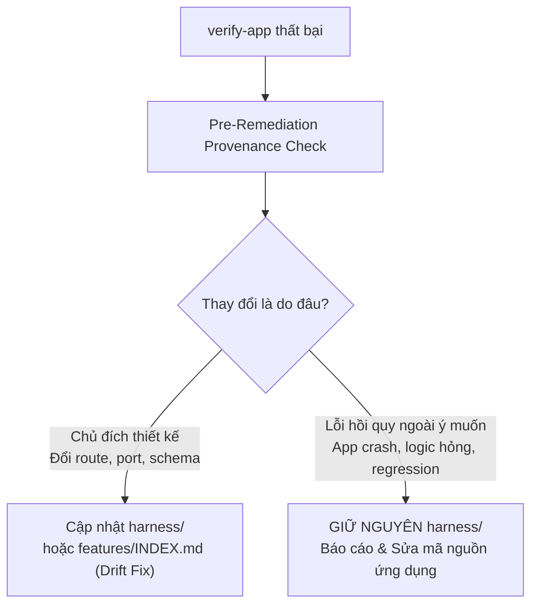

# Cẩm Nang Bảo Trì & Khắc Phục Sai Lệch Kiểm Định (Verification Drift Guide)

Tài liệu hướng dẫn phát hiện, phân loại và khắc phục sai lệch (drift) giữa mã nguồn ứng dụng và bộ kỹ năng kiểm định tự động (`verify-<app>`), tuân thủ chuẩn mực **Pstack Phase 2 & ADR-0044**.

---

## 1. Nguyên Tắc Cốt Lõi: Phân Định Hồi Quy vs. Lệch Hợp Đồng (COND-01)

Khi bài kiểm định trong `verify-<app>` thất bại (exit code khác 0), AI Agent **tuyệt đối không được vội vã sửa code kiểm thử trong `harness/` để biến test thành màu xanh (Test Tampering / False Green)**.

Trước khi tiến hành bất kỳ chỉnh sửa nào, Agent bắt buộc phải thực hiện bước **Kiểm Tra Nguồn Gốc Thay Đổi (Pre-Remediation Provenance Check)**:

1. **Trường hợp 1: Sai lệch hợp đồng chủ đích (Intentional Contract Drift)**
   - Ứng dụng chủ động nâng cấp: đổi route `/api/v1/health` $\to$ `/api/v2/health`, đổi port mặc định `8000` $\to$ `8080`, hoặc thêm trường bắt buộc vào response JSON theo PR/Ticket đã duyệt.
   - **Hành động:** Tiến hành cập nhật kịch bản kiểm thử trong `harness/` và đồng bộ lại `features/INDEX.md`.

2. **Trường hợp 2: Lỗi hồi quy ngoài ý muốn (Unintended Application Regression)**
   - Ứng dụng bị crash, trả về mã 500, đứt gãy kết nối cơ sở dữ liệu, hoặc logic nghiệp vụ trả về kết quả sai do commit mã mới.
   - **Hành động:** **CẤM SỬA `harness/`**. Giữ nguyên bài test, phân tích nguyên nhân gốc (Root Cause) và yêu cầu sửa mã nguồn ứng dụng để phục hồi tính tương thích.

---

## 2. Bốn Dạng Drift Phổ Biến & Quy Trình Khắc Phục

### 2.1. Endpoint & Command Drift (Sai Lệch Lệnh & Cổng Dịch Vụ)
- **Dấu hiệu:** `Clean-Slate Pre-flight` hoặc `Deterministic Health Barrier` báo lỗi Connection Refused, Port Conflict, hoặc Unknown CLI flag.
- **Khắc phục:**
  - Kiểm tra lệnh khởi chạy server mới trong tài liệu/cấu hình của ứng dụng.
  - Cập nhật lệnh gọi subprocess trong `harness/` để khớp với CLI cờ mới.
  - Điều chỉnh cổng thăm dò readiness probe.

### 2.2. Schema & Contract Drift (Sai Lệch Lược Đồ Dữ Liệu)
- **Dấu hiệu:** Server khởi động thành công, probe PASS, nhưng các bài assert trong `Evidence-Capture Test Suite` bị văng `KeyError`, `ValidationError`, hoặc sai kiểu dữ liệu.
- **Khắc phục:**
  - So sánh schema JSON thực tế nhận được qua `curl` / HTTP client với schema mong đợi trong `features/INDEX.md`.
  - Cập nhật assertions trong harness nếu schema mới là chuẩn thiết kế chính thức.

### 2.3. Readiness & Timing Drift (Sai Lệch Thời Gian Sẵn Sàng)
- **Dấu hiệu:** Server cần nhiều thời gian hơn để nạp mô hình AI, kết nối cơ sở dữ liệu, hoặc khởi tạo bộ nhớ cache, dẫn đến Health Barrier báo timeout.
- **Khắc phục:**
  - Tuyệt đối KHÔNG chèn `time.sleep(N)` tùy tiện.
  - Tăng trần thời gian chờ có giới hạn xác định (`max_wait_seconds: 30` hoặc `60`), kết hợp giảm chu kỳ thăm dò (poll interval `250ms`).

### 2.4. Process Tree Drift (Tiến Trình Nền Phức Hợp)
- **Dấu hiệu:** Sau khi kết thúc kiểm thử, còn sót lại các tiến trình con mồ côi (Celery workers, uvicorn reloaders, node daemons) chiếm dụng RAM hoặc port.
- **Khắc phục:**
  - Củng cố cơ chế dọn dẹp theo nhóm tiến trình (Process Group):
    - **Windows:** Bắt buộc dùng `taskkill /F /T /PID <pid>`.
    - **POSIX:** Bắt buộc dùng `os.killpg(os.getpgid(proc.pid), signal.SIGTERM)` kèm fallback `SIGKILL`.

---

## 3. Quy Tắc Vệ Sinh Spoke (ADR-0044 Spoke Cleanliness Rule)

Khi bảo trì và sửa lỗi cho kỹ năng `verify-<app>` tại Spoke repository:
1. **Cô Lập Triệt Để:** Toàn bộ các script sửa lỗi, file helper, test fixtures bắt buộc nằm gọn trong thư mục `.agents/skills/verify-<app>/harness/`.
2. **Cấm Ô Nhiễm Thư Mục Gốc:** TUYỆT ĐỐI CẤM tạo thêm script phụ tại thư mục gốc `scripts/` của Spoke repo. Việc tạo script rác ở `scripts/` sẽ vi phạm trần 15 kịch bản theo ADR-0044 và bị `check_spoke_cleanliness.py` chặn cứng tại CI.

---

*Tài liệu tham chiếu thuộc bộ chuẩn mực Pstack Phase 2 — CCBA Agent Services Platform.*
