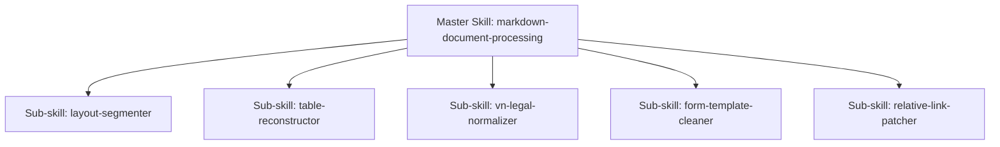

# Master Skill: Markdown Document Processing

Kỹ năng này điều phối toàn bộ quy trình chuyển đổi, làm sạch và chuẩn hóa tài liệu Markdown trong CCBA Agent Services Platform. Khi gặp các tài liệu bị lỗi định dạng (vỡ bảng, placeholder sai tiêu đề, đứt gãy liên kết tương đối), Agent sử dụng Kỹ năng này để điều động các sub-skill tương ứng xử lý.

## Kiến trúc Kỹ năng & Triggers

Quy trình xử lý Markdown được phân rã thành 5 Sub-skills:

1. **`layout-segmenter`** ( triggers: `pdf preprocessor`, `chunk`, `layout` )
2. **`table-reconstructor`** ( triggers: `process-table`, `vỡ bảng`, `lệch cột` )
3. **`vn-legal-normalizer`** ( triggers: `vn-legal`, `pháp luật`, `chuẩn hóa văn bản` )
4. **`form-template-cleaner`** ( triggers: `clean-form`, `biểu mẫu`, `placeholder`, `lỗi tiêu đề` )
5. **`relative-link-patcher`** ( triggers: `patch-links`, `liên kết tương đối`, `mục lục index` )

## Hướng dẫn Vận hành Chung cho Agent

Khi nhận được yêu cầu xử lý tài liệu, hãy tuân thủ quy trình sau:
1. **Bước 1: Chuyển đổi thô (CLI):** Chạy `/convert-markdown [file_path]` để thực hiện convert toàn bộ tài liệu từ file Word/PDF.
2. **Bước 2: Đánh giá chất lượng:** Kiểm tra xem file `.md` đầu ra có bị dính lỗi vỡ bảng hoặc lỗi placeholder tiêu đề biểu mẫu không.
3. **Bước 3: Gọi Sub-skills sửa lỗi:**
   * Nếu có bảng biểu bị vỡ dọc $\rightarrow$ Gọi Sub-skill `table-reconstructor` để chạy lệnh `process-table`.
   * Nếu có biểu mẫu bị dính dấu chấm lửng/placeholder làm tiêu đề $\rightarrow$ Gọi Sub-skill `form-template-cleaner` để chạy lệnh `clean-form`.
   * Nếu các link tương đối chưa chuẩn $\rightarrow$ Gọi Sub-skill `relative-link-patcher` để chạy lệnh `patch-links`.

## 🛑 Điều cấm & Quy tắc rào chắn (Negative Constraints)
- **Tuyệt đối không sử dụng dấu chấm lửng (`...`)**: Trong tất cả câu trả lời, ví dụ minh họa hoặc tài liệu Markdown xuất ra, không bao giờ dùng ba dấu chấm lửng `...` để viết tắt hoặc làm ví dụ. Hãy tự viết đầy đủ chi tiết hoặc tự sinh văn bản mẫu cụ thể.
