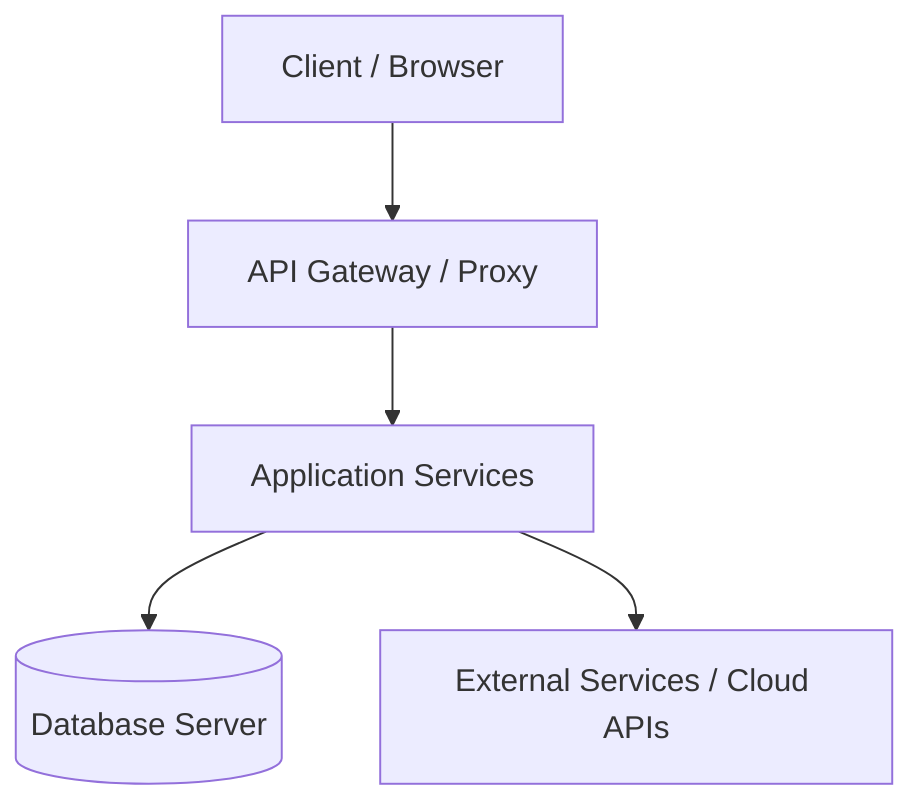

# Kiến trúc Hệ thống & Luồng Dữ liệu (System Architecture)

Tài liệu này đặc tả kiến trúc kỹ thuật, mô hình thực thể và luồng dữ liệu (Data Flow) của hệ thống.

---

## 1. Bản đồ Kiến trúc (Architecture Map)
[Mô tả tổng quan về các thành phần cấu thành hệ thống và mối liên hệ giữa các tầng: Frontend, Backend, Database, Gateway, External APIs]

---

## 2. Luồng Dữ liệu (Data Flow)
Mô tả chi tiết cách thức dữ liệu di chuyển từ đầu vào đến đầu ra:

### Luồng 1: [Ví dụ: Yêu cầu xử lý hồ sơ PDF]
1.  **Input**: Người dùng tải tệp PDF lên giao diện.
2.  **Transform**: Hệ thống gọi bộ tiền xử lý hình ảnh, phân đoạn trang (segmentation).
3.  **Process**: Nạp context vào AI Vision để đối soát.
4.  **Output**: Xuất báo cáo va chạm thiết kế và lưu vào DB.

---

## 3. Quản trị Tài nguyên & Biến môi trường
Mọi biến cấu hình bắt buộc phải khai báo mẫu tại `.env.example` và tuân thủ định dạng kiểm định:

- `` `API_GATEWAY_URL` ``: URL kết nối tới LiteLLM Spark Server.
- `` `DB_CONNECTION_STRING` ``: Chuỗi kết nối Database bảo mật (phải qua quét Maskara).

---

## 4. Kiểm định và Ràng buộc
- Mọi code reference trong tài liệu này (như các hàm, lớp) phải được kiểm chứng tồn tại trong codebase thực tế.
- Chạy linter kiểm định tài liệu trước khi commit:
  `python scripts/validate_docs.py . --changed`

---
*Tạo bởi CCBA — Trung tâm Tư vấn và Ứng dụng BIM trong Xây dựng*

*Nội dung này được tạo bởi AI Agent và cần được xem xét bởi chuyên gia pháp lý và kỹ thuật trước khi áp dụng.*
