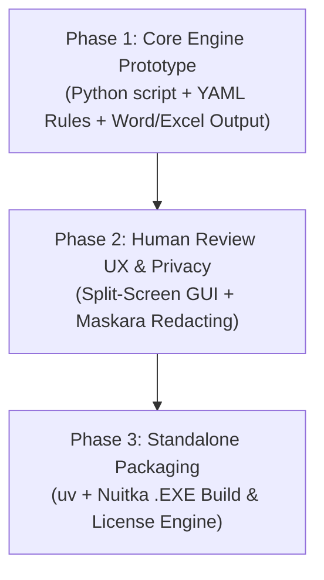

# 📜 CCBA Brainstorming Session Document
**Chủ đề:** Micro-Agent Tool Audit Thẩm tra PCCC/MEP (Chủ đề: `software`)  
**Ngày thực hiện:** 2026-07-23  
**Nguồn tham chiếu:** [Goon's Solo Playbook](https://goonnguyen.substack.com) (Duy /zuey/) & CCBA Agent Platform  
**Trạng thái:** Chốt Kế hoạch & Lộ trình Prototype  

---

## 1. Intake & Ràng buộc
- **Mục tiêu:** Chuyển đổi các Kỹ năng AI Audit nội bộ của CCBA (PCCC, MEP, Legal Intel) thành một công cụ độc lập (**Micro-Agent Desktop Executable**) dành cho kỹ sư tư vấn thiết kế và chủ đầu tư.
- **Ràng buộc tiêu chuẩn:** 
  - Tuân thủ tiêu chuẩn chất lượng KISS (Keep It Simple, Stupid).
  - Bảo mật dữ liệu dự án (Privacy-First / BYOK).
  - Định dạng đầu ra chính quy tuân thủ Nghị định 105/2025/NĐ-CP & Luật 55/2024.

---

## 2. Nhật ký Ý tưởng Phát tán (Dữ liệu Nguyên văn - Tagged)

### Vòng 1: Mô hình Sản phẩm
- `(user)` op 1 *(Option 1: Packaged Micro-Agent Tools — Đóng gói các skill chuyên biệt thành công cụ CLI/Desktop App chạy local)*
- `(AI)` Build 1 — Zero-Config Local Executable: Đóng gói toàn bộ engine thành 1 file `.exe` duy nhất, kéo-thả bản vẽ PDF/file IFC vào để nhận báo cáo Markdown/Word trong 30s.
- `(AI)` Build 2 — Bring-Your-Own-Key (BYOK) & Privacy Guard: Kỹ sư dùng API Key cá nhân, ứng dụng tự động che mờ thông tin nhạy cảm qua `maskara-privacy`.
- `(AI)` Build 3 — Modular Skill Licensing: Bản cơ bản miễn phí, mở khóa các Kỹ năng Thẩm định chuyên sâu bằng file license `.lic`.
- `(AI)` Build 4 — Auto-Sync Legal Registry: Tự động đồng bộ Tiêu chuẩn / Quy chuẩn PCCC mới nhất từ CCBA Hub.

### Vòng 2: Đầu ra Sản phẩm (Deliverables & Value-Add)
- `(user)` ứng dụng của build 1. Ngoài ra với gói hồ sơ thiết kế cần kiểm tra/thẩm tra, hệ thống tiến hành phân tích đánh ra và tạo ra bảng kết quả checklist/comments sheets cùng option tạo bản dự thảo báo cáo thẩm tra
- `(AI)` Build 1 — Dual-Format Output: Tự động sinh đồng thời file Excel `Coordination_Matrix_Checklist.xlsx` (chi tiết từng vị trí lỗi) và file Word `Dự_Thảo_Báo_Cáo_Thẩm_Tra.docx` (chuẩn mẫu NĐ 105/2025 trình ký).
- `(AI)` Build 2 — Visual Redline Overlay: Xuất file PDF bản vẽ có khoanh vùng đỏ (redline boxes) tại đúng vị trí vi phạm PCCC/MEP.
- `(AI)` Build 3 — Auto Response Sheet Generator: Sinh sẵn tab gợi ý kịch bản giải trình để tư vấn thiết kế đối đáp với cơ quan Công an PCCC (PC07) hoặc Sở Xây dựng.
- `(AI)` Build 4 — Compliance Hash & Audit Trail: Mã hóa Hash thời điểm quét và bản vẽ đầu vào để minh minh bạch trách nhiệm thẩm định.

### Vòng 3: Giao diện & Human-in-the-Loop
- `(user)` tôi không rõ, hãy gợi ý giúp tôi *(Yêu cầu đề xuất giải pháp giao diện duyệt lỗi con người)*
- `(AI)` Model A — Split-Screen Quad-View: Màn hình đối soát song song (bên trái danh sách lỗi AI, bên phải zoom vị trí bản vẽ PDF). Duyệt phím tắt siêu tốc `[Y] Duyệt` / `[N] Bỏ qua`.
- `(AI)` Model B — Interactive Draft Matrix: Duyệt và chỉnh sửa ghi chú trực tiếp trên Bảng nháp trước khi xuất Báo cáo chính thức.
- `(AI)` Model C — AI Legal Assistant Sidekick: Trợ lý AI giải thích điều khoản pháp lý gốc tại chỗ khi kỹ sư phân vân về kết quả duyệt lỗi.

### Vòng 4: Kiến trúc Kỹ thuật & Đóng gói
- `(user)` 1 *(Lựa chọn 1: Đi sâu chi tiết kỹ thuật đóng gói PyInstaller/uv, kết nối AI Gateway, bảo mật dữ liệu)*
- `(AI)` Technical Build 1 — Standalone Executable (`uv` + Nuitka/PyInstaller): Bundle toàn bộ dependencies thành file `ccba-pccc-audit.exe` (~45-60MB).
- `(AI)` Technical Build 2 — Offline-First & Resilient Gateway: Tích hợp `api-circuit-breaker`, cắt nhỏ bản vẽ PDF, lưu đệm cache SQLite/DuckDB để resume khi mất mạng.
- `(AI)` Technical Build 3 — Data Sanitization & Audit Log: Tích hợp `maskara-privacy` + `append-only-logger` bảo vệ thông tin công trình và ghi log an toàn.
- `(AI)` Technical Build 4 — Lightweight Rule Engine Sync: Tách tri thức pháp lý thành các file `rules.yaml` nguyên khối, cho phép cập nhật TCVN/QCVN mới mà không cần recompile app.

---

## 3. Phân nhóm Ý tưởng (Categories)

1. **Core Engine & Pipeline:** Quét PDF, kết nối LiteLLM AI Gateway (`ccba-ai`), phân tích vi phạm PCCC/MEP theo Rule Engine YAML.
2. **Dual Deliverables Engine:** Tự động sinh file Excel `Checklist_Matrix.xlsx` và Word `Dự_thảo_Báo_cáo_Thẩm_tra.docx` kèm Redline PDF.
3. **Human-in-the-Loop Review UX:** Giao diện Split-Screen đối soát lỗi AI với bản vẽ PDF + Trợ lý tra cứu VBPL tại chỗ.
4. **Security & Distribution:** Đóng gói `.exe` standalone qua `uv`/Nuitka, che thông tin dự án qua `maskara-privacy`, BYOK API Key.

---

## 5. Ưu tiên Lộ trình Triển khai (Action Items)

### Bước tiếp theo (Action Items):
1. **[Tạo Prototype Core]** Xây dựng Python script thô trích xuất text/image từ PDF bản vẽ mẫu PCCC, đối chiếu với file `pccc_rules.yaml`, và gọi `ccba-ai` để sinh file Word/Excel.
2. **[Tạo Rule Base mẫu]** Soạn thảo file `rules_qcvn06_pccc.yaml` mẫu chứa 10 quy chuẩn vi phạm PCCC phổ biến (đầu phun sprinkler, khoảng cách lối thoát nạn, quạt tăng áp giếng thang).
3. **[Kiểm định & Demo]** Chạy test thử nghiệm trên 1 bộ bản vẽ PCCC thực tế để đo độ chính xác và tốc độ phản hồi.
