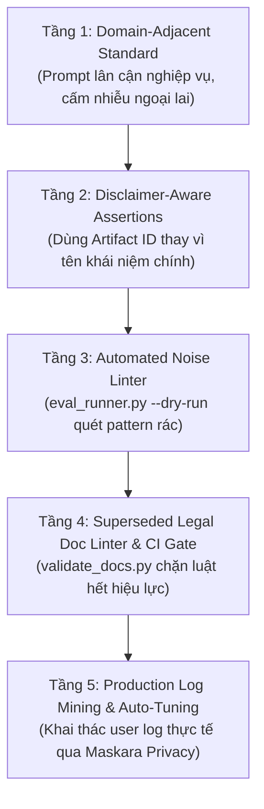

# Biên Bản Phiên Brainstorming: Hoàn Thiện Rào Chắn Evaluation & Thống Nhất Ngôn Ngữ Pháp Lý

**Phiên**: `brainstorm-skills-eval-legal-guardrails`  
**Chủ đề**: Tự động hóa phòng chống Noise Prompts, Tối ưu hóa Evals và Thống nhất Ngôn ngữ Pháp lý Chuẩn  
**Ngày thực hiện**: 2026-07-24  
**Trạng thái**: 🟢 **Đã tổng hợp & Nâng cấp Mô Hình 5 Tầng Phòng Vệ**  

---

## 1. Ý tưởng Phát tán thu được (Ideas Collection)

### Nhóm A: Quy chuẩn Thiết kế Negative Cases & Assertions
- `(user)` Phát hiện vấn đề prompt nhiễu (quicksort, Fibonacci, sick leave email) không sát ngữ cảnh nghiệp vụ.
- `(AI)` **Quy chuẩn Domain-Adjacent**: Bắt buộc chọn negative prompts ở biên giới nghiệp vụ lân cận (ví dụ: copywriting hỏi về dầm thép uốn; completion-checklist hỏi về tiến độ MS Project).
- `(AI)` **Disclaimer-Aware Assertions**: Không dùng tên skill hoặc tên khái niệm tổng quát trong `negative_regex`. Chỉ dùng tên sản phẩm đầu ra đặc thù (như `checklist_master.yaml` hay `Phụ lục VIb`) để tránh bị FAILED oan do Disclaimer khước từ phạm vi của AI.

### Nhóm B: Phân định Ranh giới & Tương tác giữa các Skills Giao thoa
- `(user)` Đặt câu hỏi về việc gộp skill `legal-document-tracker` và `bigbim-vbpl-digest`.
- `(AI)` **Giữ phân tách Single Responsibility Principle**:
  - `legal-document-tracker`: Phụ trách vĩ mô (Registry, vòng đời `current`/`superseded`, so sánh thay đổi, Impact Report).
  - `bigbim-vbpl-digest`: Phụ trách vi mô (RAG lookup trích dẫn từng điều/khoản/chunk cụ thể của NĐ 175/2024 & ISO 19650).
- `(AI)` **Kỹ thuật Cross-Skill Negative Evaluation**: Dùng chính prompt của Skill A làm Negative Test Case cho Skill B để kiểm thử chính xác rào chắn router mà không cần prompt nhiễu ngoại lai.

### Nhóm C: Thống nhất Ngôn ngữ Pháp lý Chuẩn (Ubiquitous Legal Language)
- `(user)` Phát hiện các ví dụ cũ viện dẫn văn bản bị thay thế và đính chính chính xác **Luật Xây dựng 2025 là Luật 135/2025/QH15** (thay vì Luật 55 là Luật Quy hoạch đô thị và nông thôn).
- `(AI)` **Single Source of Truth**: Sử dụng `resources/legal_registry.yaml` làm nguồn duy nhất xác định `status: current` vs `status: superseded`.
- `(AI)` **Linter Tự động hóa**: Bổ sung quy tắc linter vào `scripts/validate_docs.py` để quét phát hiện các ví dụ hoặc test cases viện dẫn văn bản đã bị thay thế mà không có ghi chú.

### Nhóm D: Khai thác Log Thực tế & Tự Động Sinh Evals (Production Log Mining)
- `(user)` Đề xuất kết hợp cơ chế phân tích log tương tác thực tế từ người dùng để cập nhật test cases.
- `(AI)` **Production Log Mining Pipeline**: Thu thập các prompt thực tế từ `transcript.jsonl` và telemetry logs.
- `(AI)` **Privacy-Safe Redaction**: Kích hoạt `maskara-privacy` che giấu thông tin nhạy cảm (tên dự án, doanh nghiệp, API keys) trước khi đưa vào test suite.
- `(AI)` **Failure-Driven Auto-Tuning**: Tự động đóng gói các câu hỏi làm Agent chọn nhầm skill từ log thành Negative Test Cases thực chiến mới.

---

## 2. Mô Hình Giải Pháp Phòng Vệ 5 Tầng Khép Kín (5-Layer Defense Model)

1. **Tầng 1 — Quy chuẩn Thiết kế Domain-Adjacent**:
   - Nghiêm cấm dùng các bài toán lập trình hoặc mẫu đơn hành chính rác làm negative case cho skill chuyên môn.
   - Bắt buộc dùng câu hỏi thuộc lĩnh vực lân cận hoặc dùng câu hỏi của Skill A làm negative test cho Skill B (Cross-Skill Evaluation).
2. **Tầng 2 — Quy chuẩn Assertions Chống False Negative (Disclaimer-Aware)**:
   - Không đặt tên skill/khái niệm chính vào `negative_regex` để tránh dính Disclaimer khước từ phạm vi của AI.
   - Bắt buộc dùng Primary Artifact Identifiers (như `checklist_master.yaml`, `Phụ lục VIb`).
3. **Tầng 3 — Tự động hóa Chặn Prompt Nhiễu (Automated Noise Linter)**:
   - Tích hợp trực tiếp vào `eval_runner.py --dry-run`. Tự động quét và block nếu phát hiện các pattern rác (`quicksort`, `fibonacci`, `bubble sort`, `sick leave`...).
4. **Tầng 4 — Superseded Legal Doc Linter & CI Gate**:
   - Tích hợp vào `scripts/validate_docs.py`. Tự động kiểm tra số hiệu văn bản hết hiệu lực (NĐ 06/2021, NĐ 15/2021, Luật XD 2014) và bắt buộc cập nhật về **Luật Xây dựng 2025 (135/2025/QH15)** hoặc ghi chú chú thích thay thế.
5. **Tầng 5 — Production Log Mining & Failure-Driven Auto-Tuning**:
   - Tự động lọc prompt thực tế từ user logs, bảo mật thông tin qua `maskara-privacy`, tự động nạp các kịch bản sai số thực tế thành test cases mới giúp bộ Evals liên tục tiến hóa (Living Test Suite).

---

## 3. Danh sách Action Items

| STT | Tác vụ | File tác động | Trạng thái |
|:---:|:-------|:--------------|:----------:|
| 1 | Tích hợp Noise Prompt Linter vào dry-run validator | `[MODIFY] .agents/skills/eval-gate/scripts/eval_runner.py` | ✅ Completed |
| 2 | Loại bỏ 100% Noise Prompts trong 11 file evals JSON | `[MODIFY] .agents/skills/eval-gate/test_cases/eval_*.json` | ✅ Completed |
| 3 | Tích hợp Superseded Legal Doc Linter vào `validate_docs.py` | `[MODIFY] scripts/validate_docs.py` | ✅ Completed |
| 4 | Chuẩn hóa chú thích Luật Xây dựng 2025 (135/2025/QH15) & NĐ 105/2025 | `[MODIFY] docs/adr/0010-skills-integration-and-rag-boundaries.md` | ✅ Completed |
| 5 | Xây dựng pipeline Production Log Mining & Redaction cho Evals | `[NEW] .agents/skills/eval-gate/scripts/log_eval_miner.py` | 🟢 Planned |

---
*Tạo bởi CCBA Platform Brainstorming Workflow — 2026*
