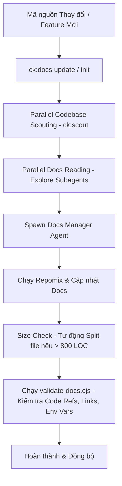

# Báo cáo Nghiên cứu Kỹ thuật: Docs Manager Agent trong ClaudeKit

Báo cáo này cung cấp kết quả phân tích kiến trúc, cơ chế hoạt động và cách thức tích hợp công cụ **Repomix** của **Docs Manager Agent** thuộc hệ sinh thái **ClaudeKit-Engineer**. Đồng thời, báo cáo đề xuất hướng kế thừa và porting các tính năng này sang hệ thống **ccba-agent-platform**.

---

## 1. Tổng quan về Docs Manager Agent

Trong hệ sinh thái ClaudeKit, **Docs Manager Agent** đóng vai trò là một chuyên gia soạn thảo kỹ thuật (Technical Writer) chuyên biệt, chịu trách nhiệm duy trì tính nhất quán và chính xác của tài liệu kỹ thuật so với thực tế mã nguồn (codebase). 

Định vị của Docs Manager Agent được tóm tắt qua triết lý: **"Verify before you document" (Xác minh trước khi viết tài liệu)**. Tác nhân này hoạt động dựa trên giả định rằng tài liệu cũ/sai lệch (stale docs) còn nguy hiểm hơn là không có tài liệu, vì chúng làm lãng phí thời gian của lập trình viên.



---

## 2. Các Cơ chế Hoạt động Cốt lõi

### 2.1. Duy trì Đồng bộ Tài liệu Kỹ thuật (Synchronized Technical Documentation)
Docs Manager Agent quản lý và đồng bộ một cấu trúc thư mục tài liệu chuẩn tại `./docs`:
- `docs/project-overview-pdr.md`: Tổng quan dự án và Yêu cầu phát triển sản phẩm (PDR).
- `docs/codebase-summary.md`: Tóm tắt cấu trúc codebase (được cập nhật tự động bằng Repomix).
- `docs/code-standards.md`: Các tiêu chuẩn viết code và cấu trúc thư mục.
- `docs/system-architecture.md`: Tài liệu kiến trúc hệ thống (hỗ trợ tích hợp sơ đồ SVG từ `ck:tech-graph`).
- `docs/project-roadmap.md` & `docs/deployment-guide.md`: Lộ trình phát triển và hướng dẫn triển khai.

**Quy trình đồng bộ hóa (Upstream Sync & Update Workflow):**
1. **Parallel Codebase Scouting (`ck:scout`)**: Trước khi viết, một tác nhân scout sẽ quét codebase để đếm dòng code (LOC) trong từng thư mục (bỏ qua các thư mục rác, cache, credentials như `.git`, `node_modules`, `.claude`...).
2. **Parallel Documentation Reading (Explore Subagents)**: Nếu số lượng file tài liệu trong dự án lớn ($\ge 4$ files), tác nhân chính sẽ sinh ra các subagents `Explore` để đọc tài liệu song song và báo cáo lại các khu vực cần cập nhật, giúp tối ưu hóa thời gian xử lý và giảm tải context window.
3. **Spawn Docs Manager Agent**: Tác nhân chính khởi chạy Docs Manager Agent, truyền toàn bộ context đã scout và tóm tắt tài liệu để tiến hành cập nhật.

### 2.2. Tự động Cập nhật Tài liệu API (Automatic API Docs Update)
Khi có sự thay đổi trong định nghĩa API hoặc cấu trúc route:
- Agent tự động phân tích phạm vi thay đổi trong các file route/controller.
- Áp dụng các quy tắc đặt tên (`camelCase`, `snake_case`, `PascalCase`) khớp chính xác với mã nguồn thực tế hoặc đặc tả Swagger/OpenAPI.
- Cập nhật các đoạn code ví dụ (code snippets), đảm bảo chúng có thể chạy được (verify every code example compiles/runs).

### 2.3. Đảm bảo Tính Chính xác của Tài liệu (Ensures Documentation Accuracy)

Để tránh hiện tượng ảo giác (hallucination) khi viết tài liệu, ClaudeKit áp dụng **Accuracy Protocol** cực kỳ nghiêm ngặt:

#### A. Quy tắc Viết Dựa trên Bằng chứng (Evidence-Based Writing)
- **Functions/Classes**: Phải được tìm thấy thực tế trong mã nguồn thông qua lệnh grep trước khi đưa vào tài liệu.
- **Config Keys**: Phải đối chiếu và tồn tại trong tệp `.env.example`.
- **File References / API Endpoints**: Không tự suy đoán hoặc sáng tạo ra các endpoint hay đường dẫn file không tồn tại. Nếu code mập mờ, chỉ viết mô tả ý đồ ở mức high-level thay vì bịa ra cú pháp cụ thể.

#### B. Công cụ Hậu kiểm Tự động: `validate-docs.cjs`
Sau khi cập nhật tài liệu, Agent bắt buộc phải chạy script kiểm tra:
```bash
node .claude/scripts/validate-docs.cjs docs/
```
Script này thực hiện kiểm định tĩnh (Static Verification) trên toàn bộ các file `.md` trong thư mục `docs/`:
1. **Kiểm tra Code References**: Trích xuất các ký hiệu đặt trong dấu backticks như `` `methodName()` `` hoặc `` `ClassName` ``. Script sẽ thực hiện chạy lệnh `grep` để tìm xem từ khóa này có thực sự xuất hiện dưới dạng khai báo (`function methodName`, `class ClassName`, `const methodName`...) trong thư mục nguồn (`src/`, `lib/`...) hay không.
2. **Kiểm tra Internal Links**: Xác minh mọi liên kết tương đối dạng `[text](./path.md)` có trỏ đúng đến tệp tin đang tồn tại hay không.
3. **Kiểm tra Config Keys (Env Vars)**: Tìm các biến môi trường được viết dạng `` `ENV_VAR` `` hoặc `$ENV_VAR` trong tài liệu và đối soát xem chúng có được định nghĩa trong file `.env.example` của dự án hay không.

#### C. Quản lý Giới hạn Dòng (Size Limit Management)
Docs Manager Agent cưỡng chế giới hạn kích thước tệp tin tài liệu dưới 800 dòng (mặc định cấu hình qua `docs.maxLoc`).
- Nếu một file tài liệu có xu hướng vượt quá 800 LOC, Agent sẽ chủ động phân rã nó theo cấu trúc modular:
  - `docs/{topic}/index.md`: Đóng vai trò mục lục dẫn hướng.
  - `docs/{topic}/{subtopic}.md`: Chứa nội dung chi tiết của từng phần độc lập.

---

## 3. Tích hợp Repomix trong Quản lý Codebase Summary

### 3.1. Repomix là gì?
**Repomix** (trước đây là Repopack) là công cụ đóng gói toàn bộ mã nguồn của một repository thành một tệp văn bản duy nhất (định dạng XML, Markdown hoặc JSON) đã qua tối ưu hóa để nạp vào context window của các LLM có context lớn (như Claude 3.5/4.5, Gemini 1.5/2.0).

### 3.2. Vai trò của Repomix trong Docs Manager Agent
Trong quy trình hoạt động của Docs Manager Agent, Repomix đóng vai trò là **Công cụ nén tri thức** (Knowledge Compactor):
1. **Tạo snapshot codebase**: Agent thực hiện chạy lệnh:
   ```bash
   repomix --style xml -o repomix-output.xml
   ```
   Lệnh này đóng gói toàn bộ cấu trúc dự án và nội dung các file (đã loại bỏ các file bị ignore qua `.gitignore` và `.repomixignore`) vào một file XML duy nhất.
2. **Tích hợp Token Counting Tree**: Repomix hỗ trợ đếm số lượng token của từng file và thư mục thông qua tham số `--token-count-tree`, giúp Docs Manager đánh giá được những module nào quá lớn để có phương án bỏ qua hoặc chia nhỏ context.
3. **Phát hiện dữ liệu nhạy cảm**: Tích hợp công cụ **Secretlint** để quét và ngăn chặn việc đóng gói các khóa API, mật khẩu, file `.env` hoặc thông tin nhạy cảm vào tệp output.
4. **Sinh tóm tắt tự động**: Tệp XML output (`repomix-output.xml`) được nạp trực tiếp làm context đầu vào để LLM sinh ra hoặc cập nhật tệp `docs/codebase-summary.md` một cách toàn diện và chính xác nhất, không bỏ sót bất kỳ tệp nguồn quan trọng nào.

---

## 4. Đánh giá Khả năng Kế thừa cho CCBA Agent Platform

Hiện tại, hệ thống `ccba-agent-platform` đã có sẵn các cấu phần tri thức và một số wrapper tương tự (ví dụ: `scripts/repomix_pack.py` để chạy repomix). Dưới đây là ma trận đánh giá khả năng kế thừa tính năng của Docs Manager Agent:

| Tính năng Upstream | Mức độ phù hợp | Phương án triển khai tại CCBA Platform | Độ phức tạp |
| :--- | :--- | :--- | :--- |
| **Quy trình `ck:docs`** | **Cao (80%)** | Kế thừa mô hình phân rã tài liệu tiêu chuẩn (`project-overview-pdr.md`, `system-architecture.md`...) và quy chuẩn chia nhỏ tệp dưới 800 LOC. | Thấp |
| **Hậu kiểm `validate-docs.cjs`** | **Cực kỳ cao (95%)** | Port trực tiếp script sang Python hoặc Node.js và tích hợp vào quy trình QC của CCBA (như công cụ `validate_docs.py` đã được ghi nhận trong Hiến pháp Layer 1). | Thấp |
| **Tích hợp Repomix** | **Đã có sẵn (100%)** | CCBA đã có `scripts/repomix_pack.py` (chạy qua npx repomix). Cần cấu hình thêm phần tự động cập nhật tóm tắt codebase `.md/knowledge/codebase_summary.md` mỗi khi chạy pipeline. | Đã hoàn thành |

---
*Tạo bởi CCBA — Trung tâm Tư vấn và Ứng dụng BIM trong Xây dựng*

*Nội dung này được tạo bởi AI Agent và cần được xem xét bởi chuyên gia pháp lý và kỹ thuật trước khi áp dụng.*
