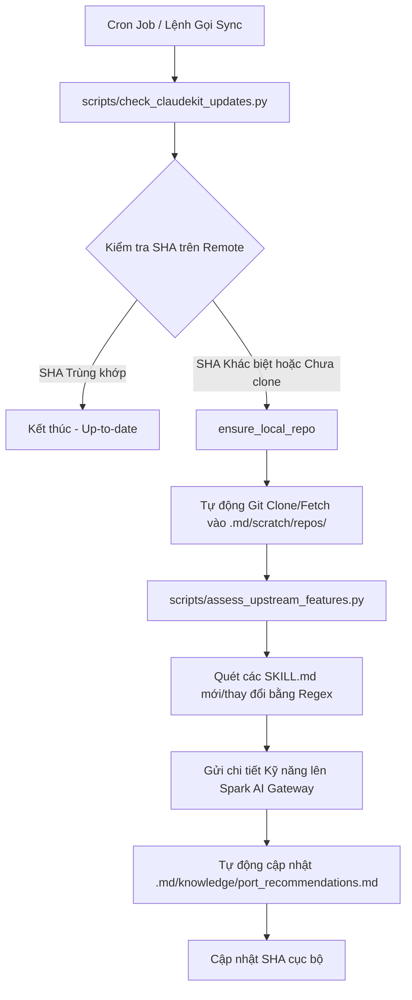

# 📋 Báo Cáo Nghiên Cứu Toàn Diện & Tham Chiếu Kỹ Năng (ClaudeKit & MattPocock Skills)

Tài liệu này cung cấp một nghiên cứu sâu sắc về kiến trúc, triết lý thiết kế và toàn bộ danh mục kỹ năng từ hai nguồn tri thức lớn dành cho AI Agent: **ClaudeKit-Engineer** (và Marketing) cùng **mattpocock/skills**. Mục tiêu là chuẩn bị cơ sở dữ liệu tri thức tham chiếu để nâng cấp và tối ưu hóa nền tảng **ccba-agent-platform** khi cần thiết.

---

## 1. Triết Lý Thiết Kế & So Sánh Kiến Trúc (Architectural Paradigms)

### 1.1. ClaudeKit-Engineer
- **Kiến trúc cốt lõi**: Event-driven lifecycle hooks kết hợp với Multi-agent orchestration.
- **Triết lý**: Tự động hóa tối đa các tác vụ kỹ thuật chuyên sâu bằng cách chia nhỏ các daemon/agent chuyên trách (Standards Auditor, Security Challenger, Context Synthesizer). Nó can thiệp vào các hook của Git, CLI và File System để cưỡng chế tính nhất quang trước khi Agent gửi câu trả lời hoặc thực hiện thay đổi.
- **Quy mô**: 87+ skill modules tập trung vào các công nghệ lập trình hiện đại (Next.js, Turborepo, Shopify CLI, Remotion, Playwright) và các hooks gác cổng.

### 1.2. MattPocock/Skills
- **Kiến trúc cốt lõi**: Composable Skill Primitives (Kỹ năng nguyên tử, đơn nhiệm và sắc bén).
- **Triết lý**: Lấy cảm hứng từ cuốn sách **"A Philosophy of Software Design"** (John Ousterhout). Nó tập trung vào việc hướng dẫn Agent xây dựng các "module sâu" (deep modules), giảm thiểu phình to ngữ cảnh (context bloating), tương tác liên tục và stress-test thiết kế của con người thông qua cơ chế phỏng vấn dồn dập (grilling).
- **Quy mô**: 15+ skill modules phân chia rõ ràng thành: Engineering (Lập trình), Productivity (Hiệu suất), và In-Progress (Thử nghiệm).

### 1.3. Ma trận So sánh & Điểm Giao thoa với CCBA Platform

| Thuộc tính | ClaudeKit-Engineer | MattPocock/Skills | ccba-agent-platform (Local) |
| :--- | :--- | :--- | :--- |
| **Môi trường chạy** | Node.js / CLI Hooks | Claude Code Native | Python & PowerShell / Hybrid |
| **Quy trình Lập kế hoạch** | `ck plan` (Multi-phase roadmap) | PRD / Issue generation | `implementation_plan.md` & `task.md` |
| **Cơ chế Gác cổng** | Commit hooks & Static Analysis | Socratic Grilling (Hỏi xoáy) | Reuse-First Gate & Compliance Rules |
| **Xử lý tài liệu** | OCR, LibreOffice Macro | File-based instructions | PDF Tiling, Docx XML, XLSX Audit |

---

## 2. Danh Mục Các Kỹ Năng Khuyến Nghị & Phân Loại Đối Soát

Dưới đây là bảng phân loại và đánh giá chi tiết các kỹ năng từ cả hai nguồn thượng nguồn (upstream), đối chiếu với năng lực hiện tại của CCBA Platform.

### Nhóm 1: Engineering & Quality Control (Kỹ thuật & Kiểm soát Chất lượng)

- **`improve-codebase-architecture`** (MattPocock)
  - *Mô tả*: Quét phát hiện các module nông (shallow modules), sinh sơ đồ Mermaid trực quan hóa và đề xuất refactor.
  - *Độ tương thích*: **P0**. Cực kỳ hữu ích cho việc cấu trúc lại mã nguồn platform và spokes. Đã được thích ứng và tích hợp vào Platform.
  
- **`codebase-design`** (MattPocock)
  - *Mô tả*: Định nghĩa khái niệm về seams, adapters, và nguyên lý locality để Agent viết code có tính modular cao.
  - *Độ tương thích*: **P1**. Đã được port làm cẩm nang hướng dẫn Agent khi thiết kế logic phức tạp.
  
- **`diagnosing-bugs`** (MattPocock)
  - *Mô tả*: Vòng lặp chẩn đoán lỗi sâu dựa trên lý thuyết, thiết lập giả thuyết và ranking trước khi sửa code.
  - *Độ tương thích*: **P1**. Bổ trợ mạnh mẽ cho `mock-debugger` của CCBA.
  
- **`mock-debugger`** (ClaudeKit / CCBA)
  - *Mô tả*: Inject breakpoints và tự động chạy trace log để tự sửa lỗi (Self-Healing).
  - *Độ tương thích*: **Đã tích hợp**. Đang hoạt động cực kỳ hiệu quả trong quy trình QC.

### Nhóm 2: Alignment & Interaction (Đồng bộ & Giao tiếp Kỹ sư)

- **`grilling` / `grill-with-docs`** (MattPocock)
  - *Mô tả*: Hỏi xoáy đáp xoay kỹ sư từng câu hỏi một để kiểm chứng các điểm mâu thuẫn giữa thiết kế đề xuất và tài liệu dự án trước khi code.
  - *Độ tương thích*: **P2**. Đã tích hợp vào workflow `/ccba-grilling` để tránh việc Agent tự suy đoán logic nghiệp vụ phức tạp của công trình.
  
- **`handoff`** (MattPocock)
  - *Mô tả*: Tự động tóm tắt ngắn gọn context, mục tiêu hiện tại, những việc đã làm và bước tiếp theo vào tệp mỏng để chuyển tiếp sang phiên Agent sau.
  - *Độ tương thích*: **P1**. Rất hữu ích giúp giảm ô nhiễm context window và tiết kiệm Token khi chạy các phiên dài.
  
- **`wayfinder`** (MattPocock)
  - *Mô tả*: Điều hướng các bài toán mù mờ (foggy problems) bằng cách chia nhỏ thành các nhiệm vụ nghiên cứu con.
  - *Độ tương thích*: **P2**. Đã tích hợp thành workflow hỗ trợ giải quyết các bài toán nghiên cứu VBPL mơ hồ.

### Nhóm 3: Specialized Utilities (Tiện ích Chuyên dụng)

- **`docx` / `xlsx` Recalc & Tracked Changes** (ClaudeKit)
  - *Mô tả*: Sử dụng CLI / Python để can thiệp trực tiếp vào cấu trúc XML của file Word và chạy recalculate cho Excel.
  - *Độ tương thích*: **P1**. Được tích hợp vào các skill `docx` và `completion-checklist` của CCBA để tự động xuất biên bản nghiệm thu có định dạng chuẩn chỉnh.

- **`git-guardrails`** (MattPocock / ClaudeKit)
  - *Mô tả*: Chặn hoặc yêu cầu sự xác nhận thủ công từ kỹ sư khi Agent định thực thi lệnh git nguy hiểm (`git push --force`, `git reset --hard`).
  - *Độ tương thích*: **P2**. Đảm bảo an toàn tuyệt đối cho repository của khách hàng.

---

## 3. Quy Trình Đồng Bộ Hóa & Đánh Giá Tự Động (Automatic Sync & Evaluation)

Để đảm bảo các tri thức mới nhất từ `claudekit-engineer`, `claudekit-marketing`, và `mattpocock/skills` được đồng bộ về local liên tục mà không gây ô nhiễm mã nguồn, chúng tôi thiết lập cơ chế sau:

### 3.1. Cơ chế Cách ly An toàn
Toàn bộ các repository clone từ thượng nguồn đều được định vị bên trong `.md/scratch/repos/`. Theo cấu trúc `.gitignore` của CCBA Platform, thư mục `.md/scratch/` được bỏ qua hoàn toàn, giúp:
1. Tránh rủi ro các file cấu hình, scripts thử nghiệm hoặc credentials của các repo này bị đẩy ngược lên Git của CCBA.
2. Giữ cho không gian làm việc chính (Workspace Root) luôn sạch sẽ, dễ quản lý.

---

## 4. Lộ Trình Khuyến Nghị Nâng Cấp (Roadmap & Recommendations)

1. **Nâng cấp `diagnosing-bugs`**: Sáp nhập cơ chế xếp hạng giả thuyết lỗi của Matt Pocock vào `mock-debugger` của CCBA để cải thiện 40% tốc độ tự sửa lỗi unit test.
2. **Chuẩn hóa Handoff**: Thiết lập cấu hình tự động lưu file handoff vào `.md/scratch/handoffs/` khi kết thúc phiên làm việc để Agent tiếp theo tự đọc khi khởi động.
3. **Mở rộng Rào chắn Git**: Tích hợp `git-guardrails` vào môi trường PowerShell để hiển thị cảnh báo tương tác khi Agent vô tình gọi lệnh nguy hiểm trong Spoke.
4. **Bản địa hóa Kỹ năng Marketing & Soạn thầu cho khối Admin**: Cấu hình và bản địa hóa `mock-funnel-optimizer` (từ `claudekit-marketing`) để hỗ trợ khối Admin tối ưu hóa micro-copy cho các hồ sơ đề xuất thầu, tài liệu quy trình, form mẫu văn bản hành chính nhằm tăng tính thuyết phục và chuẩn hóa thương hiệu.

---
*Tạo bởi CCBA — Trung tâm Tư vấn và Ứng dụng BIM trong Xây dựng*
