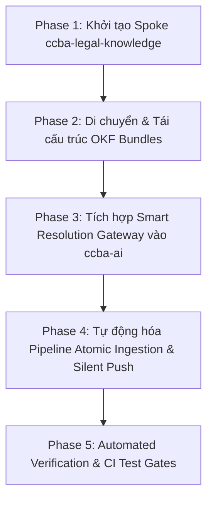

# WAYFINDER MAP — THIẾT LẬP KNOWLEDGE SPOKE `ccba-legal-knowledge` VÀ TÁI CẤU TRÚC OKF

> **Trạng thái:** Đã chốt 8/8 ADRs (Accepted) qua phiên Grilling với User  
> **Mục tiêu:** Khởi tạo Spoke tri thức `ccba-legal-knowledge`, tái cấu trúc kho VBPL thành mô hình Native-First đường dẫn nông và tích hợp Smart Resolution Gateway vào `ccba-ai`.

---

## 🗺️ 1. TỔNG QUAN BẢN ĐỒ LỘ TRÌNH (WAYFINDER ROADMAP)

---

## 📋 2. CHI TIẾT CÁC TICKET TRIỂN KHAI (IMPLEMENTATION TICKETS)

### 🎫 Ticket 01: Khởi tạo Knowledge Spoke `ccba-legal-knowledge`
- **Mục tiêu:** Tạo Repository Spoke độc lập tại `D:\GitHubProjects\ccba-legal-knowledge`.
- **Hành động:**
  - Chạy `/ccba-init-spoke` với tên `ccba-legal-knowledge` và `project.mode: delivery`.
  - Khai báo `workspace_context.yaml` tại Root và thiết lập `legal_docs/` ở cấp 1 (ADR-006 & ADR-007).
  - Khai báo `legal_registry.yaml` ngay tại Project Root của Spoke (ADR-007).

### 🎫 Ticket 02: Tái cấu trúc & Di chuyển dữ liệu OKF Bundles (Native-First Structure)
- **Mục tiêu:** Di chuyển toàn bộ dữ liệu từ Hub `.md/legal_docs/` sang Spoke mới.
- **Cấu trúc phẳng 4 khối:**
  - `legal_docs/REGULATION_QCVN/` (QCVN 04, QCVN 06...)
  - `legal_docs/STANDARD_TCVN/` (TCVN 3890...)
  - `legal_docs/LAW_LUAT/` (Luật XD 2025...)
  - `legal_docs/DECREE_NGHI_DINH/` (NĐ 217/2026...)
- **Áp dụng ADR-004 & ADR-005:**
  - Đổi tên `concept.md` sang tên văn bản chuẩn hóa (`qcvn_04_2021_bxd.md`, `qcvn_06_2022_bxd.md`).
  - Đóng gói tệp Văn bản Hợp nhất (`qcvn_04_2021_bxd_hop_nhat_2026.md`).
  - Phân tách Thông tư hành chính (`thong_tu_31_2026_tt_bxd.md`) và Sửa đổi kỹ thuật (`sua_doi_01_2026_qcvn_04_2021_bxd.md`).

### 🎫 Ticket 03: Nâng cấp Python Package `ccba-ai` (Smart Resolution Gateway)
- **Mục tiêu:** Tích hợp module `legal_knowledge` vào `packages/ccba-ai` (ADR-001).
- **Cơ chế 3 tầng:**
  - Tầng 1: Đọc local path `D:\GitHubProjects\ccba-legal-knowledge\legal_docs\`.
  - Tầng 2: Fallback đọc Embedded Registry từ Package `ccba-legal-intel`.
  - Tầng 3: Fallback gọi REST API Gateway Server Spark (`100.83.192.30:8090`).

### 🎫 Ticket 04: Nâng cấp `tvpl_vip_crawler.py` (Atomic Ingestion & Dual Sync)
- **Mục tiêu:** Tự động hóa cào dữ liệu và đồng bộ 2 chiều (ADR-002 & ADR-003).
- **Hành động:**
  - Cập nhật crawler tự động ghi OKF Bundle mới trực tiếp vào Spoke `ccba-legal-knowledge`.
  - Tự động chạy `validate_docs.py` & silent `git commit/push` ngầm tại repo Spoke.
  - Tự động dọn dẹp bảng biểu trên tệp `.docx` gốc và upload trực tiếp lên Google Drive (`1b9vm_1KQ8Fg8Crr1Q-i2xmE62UIHy-_2`) phục vụ NotebookLM.

### 🎫 Ticket 05: Kiểm định CI/CD & Automated Verification Suite
- **Mục tiêu:** Đảm bảo 100% test suite PASSED trước khi bàn giao.
- **Hành động:**
  - Kiểm tra 0 broken links trong `index.md` tất cả Bundles.
  - Parse thử `metadata.yaml` và `legal_registry.yaml`.
  - Chạy `pytest tests/test_legal_registry_rag.py tests/test_legal_grounding_gate.py`.

---

## 🎯 3. TIÊU CHÍ HOÀN THÀNH (COMPLETION CRITERIA)

- [x] Đã chốt 8/8 ADRs với Người dùng.
- [ ] Spoke `ccba-legal-knowledge` được khởi tạo và chứa 100% dữ liệu OKF Bundles.
- [ ] Package `ccba-ai` có module `legal_knowledge` truy vấn thành công.
- [ ] Crawler `tvpl_vip_crawler.py` cào và đẩy ngầm dữ liệu lên Spoke thành công.
- [ ] 100% unit tests passed.
