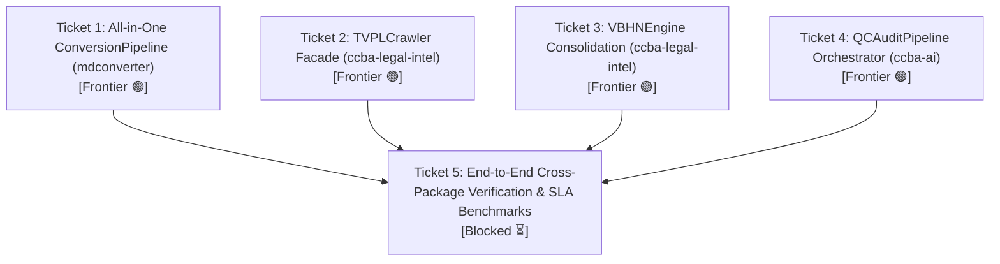

# Danh Sách Tickets: Triển Khai Hoàn Thiện Ruột 4 Deep Seams

> **Tài liệu tham chiếu**: [Đặc tả Kỹ thuật `spec-deep-seams-implementation.md`](../../specs/spec-deep-seams-implementation.md) & [ADR-0011](../../adr/adr_20260815_224158_chuan_hoa_deep_seams_cho_4_sub_systems_t.md)  
> **Nguyên tắc thực thi**: Chỉ thực hiện các ticket nằm ở **Biên giới (Frontier)** — các ticket không bị chặn hoặc tất cả blockers của nó đã hoàn thành `[x]`. Sau mỗi ticket, thực hiện kiểm định CI Gates (`ruff`, `mypy`, fast tests) trước khi sang ticket tiếp theo.

---

---

## Ticket 1: Triển khai All-in-One Deep Seam `ConversionPipeline` (`mdconverter`) ✅

**Nghiệp vụ cần làm:**
Người dùng hoặc AI Agent có thể chuyển đổi bất kỳ tài liệu nào (PDF, DOCX) sang Markdown chuẩn sạch chỉ với một lệnh gọi duy nhất `ConversionPipeline.convert(path)`. Pipeline tự động phát hiện định dạng, chọn engine tối ưu, tự động dựng lại bảng biểu bị vỡ, tự khôi phục tiêu đề biểu mẫu bị lỗi placeholder và tự động vá các liên kết phụ lục tương đối.

**Bị chặn bởi:** Không có — [x] Hoàn thành.

- [x] Tích hợp `TableReconstructor`, `FormTemplateCleaner` và `LinkPatcherPostProcessor` vào luồng xử lý mặc định của `ConversionPipeline`.
- [x] Bổ sung phương thức đồng bộ thuận tiện `convert(file: Path | str) -> ConversionResult`.
- [x] Viết test suite `packages/mdconverter/tests/test_pipeline_all_in_one.py` (Fast SLA 1.77s).
- [x] Đạt 100% PASS trên `ruff check` và `mypy`.

---

## Ticket 2: Triển khai Facade Deep Seam `TVPLCrawler` (`ccba-legal-intel`) ✅

**Nghiệp vụ cần làm:**
Người dùng hoặc AI Agent có thể tải toàn bộ nội dung văn bản pháp luật và tệp tin đính kèm DOCX từ Thư Viện Pháp Luật qua một giao diện duy nhất `TVPLCrawler.fetch_document(url_or_id)` mà không cần tự khởi tạo CookieVault hay quản lý Session Mutex thủ công. Tự động chuyển đổi giữa HTTP Crawler nhanh và CDP Browser VIP Crawler khi gặp Cloudflare/Anti-bot.

**Bị chặn bởi:** Không có — [x] Hoàn thành.

- [x] Hiện thực hóa class `TVPLCrawler` đóng gói trọn vẹn `CookieVault`, `TVPLSessionMutex`, `TVPLCrawlerEngine`, `TVPLVIPCrawler`.
- [x] Cung cấp các methods: `fetch_document(url_or_id, download_attachments=True)` và `search(query, max_results)`.
- [x] Re-export `TVPLCrawler` trong `ccba_legal/__init__.py`.
- [x] Viết test suite `packages/ccba-legal-intel/tests/test_tvpl_crawler_facade.py` với Mock Provider (Fast SLA < 1.0s).
- [x] Đạt 100% PASS trên `ruff check` và `mypy`.

---

## Ticket 3: Triển khai Unified Deep Seam `VBHNEngine` (`ccba-legal-intel`) ✅

**Nghiệp vụ cần làm:**
Chuyên viên pháp lý hoặc AI Agent có thể truyền vào văn bản gốc và văn bản sửa đổi qua hàm `VBHNEngine.merge_documents(base_doc, amending_doc)` để nhận về văn bản hợp nhất (VBHN) hoàn chỉnh chuẩn OKF kèm bảng thống kê các điều/khoản được Sửa đổi, Bổ sung, Bãi bỏ mà không cần can thiệp vào các bước AST trung gian.

**Bị chặn bởi:** Không có — [x] Hoàn thành.

- [x] Hiện thực hóa class `VBHNEngine` tự động xâu chuỗi `ASTParser` $\rightarrow$ `DeltaPatchGenerator` $\rightarrow$ `VBHNMerger` $\rightarrow$ `OKFStructureProcessor` $\rightarrow$ `OKFBundlePackager`.
- [x] Cung cấp method `merge_documents(base_doc, amending_doc, doc_meta=None) -> MergedLegalDocument`.
- [x] Re-export `VBHNEngine` và `MergedLegalDocument` trong `ccba_legal/__init__.py`.
- [x] Viết test suite `packages/ccba-legal-intel/tests/test_vbhn_engine.py` (Fast SLA 2.36s).
- [x] Đạt 100% PASS trên `ruff check` và `mypy`.

---

## Ticket 4: Triển khai Orchestrator Deep Seam `QCAuditPipeline` (`ccba-ai`) ✅

**Nghiệp vụ cần làm:**
Kỹ sư thẩm tra hoặc AI Agent có thể gọi `QCAuditPipeline.run_audit(project_dir)` để tự động quét toàn bộ hồ sơ bản vẽ PDF, tự căn chỉnh ma trận bản vẽ Quad-View 4 bộ môn (Kiến trúc - Kết cấu - MEP - PCCC), chạy kiểm tra đối soát Vision đa luồng và xuất ra báo cáo kỹ thuật hoàn chỉnh mà không cần tự xử lý Coordination Matrix thủ công.

**Bị chặn bởi:** Không có — [x] Hoàn thành.

- [x] Hiện thực hóa class `QCAuditPipeline` tự động điều phối `QCDiscoveryEngine` $\rightarrow$ Quad-View Image Cropping $\rightarrow$ `QCAuditEngine` $\rightarrow$ `QCReporterEngine`.
- [x] Cung cấp cả 2 interface async `run_audit(...)` và sync wrapper `run_audit_sync(...)`.
- [x] Re-export `QCAuditPipeline` và `AuditReportSummary` trong `ccba_ai/__init__.py`.
- [x] Viết test suite `packages/ccba-ai/tests/test_qc_pipeline.py` với Mock Discovery & Vision Audit (Fast SLA 1.78s).
- [x] Đạt 100% PASS trên `ruff check` và `mypy`.

---

## Ticket 5: Kiểm định Toàn Trình & Rào Chắn Dependency Contracts (End-to-End Verification) ✅

**Nghiệp vụ cần làm:**
Toàn bộ 4 Deep Seams mới hoạt động ăn khớp với nhau, tuân thủ tuyệt đối 5 contracts ranh giới kiến trúc, không làm rò rỉ bất kỳ private submodule nào và bảo đảm 100% các bộ test suites monorepo đều vượt qua kiểm định với SLA < 2.0s.

**Bị chặn bởi:** [x] Hoàn thành.

- [x] Chạy `check_dependency_contracts.py` đảm bảo 5/5 contracts KEPT (0 violations, 210 files scanned).
- [x] Chạy `run_isolated_tests.py --all --fast` đảm bảo 10/10 package targets đạt PASS siêu tốc.
- [x] Chạy `test_fast_test_suites.py` xác thực SLA toàn hệ thống.
- [x] Đạt 100% PASS trên `ruff check` (0 errors) và `mypy`.
