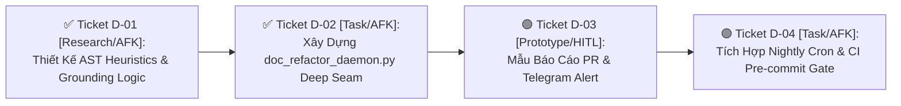

# 🗺️ Bản Đồ Tác Chiến Wayfinder: Hệ Thống Tự Tiến Hóa & Bảo Trì Tài Liệu Tự Động (Doc-Auto-Evolution)

> **Mã Vấn Đề (Issue Slug):** `doc-auto-evolution`  
> **Trạng thái Bản đồ:** `Active / Charted`  
> **Khởi tạo:** 2026-08-16  
> **Nhãn (Labels):** `wayfinder:map`, `architecture:llm-wiki`, `tooling:doc-ratchet`, `automation:server-spark`

---

## 1. Điểm Đích (Destination)

Xây dựng và đưa vào vận hành hoàn chỉnh **Động Cơ Tự Tiến Hóa & Bảo Trì Tài Liệu Tự Động (`DocAutoEvolutionEngine` / `doc_refactor_daemon.py`)**, bảo đảm toàn bộ 7+ tài liệu tri thức trọng yếu (`CONTEXT.md`, `session_learnings.md`, `AGENTS.md`, `index.md`, `log.md`, `docs/adr/`, `docs/rules/`) được **liên tục cập nhật, đối soát code thực tế (Code-Grounding), cân bằng cấu trúc Trụ cột và tạo Pull Request tự động qua đêm trên Server Spark**.

---

## 2. Ghi Chú & Ràng Buộc Kiến Trúc (Notes & Non-Negotiables)

* **Ràng buộc 1 (Zero-Deletion Invariant):** Động cơ AI **chỉ được phép Thêm (Append), Gom nhóm/Phân rã (Rebalance), hoặc Làm rõ (Clarify)**. Tuyệt đối cấm xóa bỏ bài học/tri thức cũ nếu không có thẻ `[DEPRECATED]` từ con người.
* **Ràng buộc 2 (Code-Grounding Gate):** Mọi thuật ngữ, pattern, hoặc quy tắc mới đề xuất bắt buộc phải có dẫn chứng mã nguồn thực tế (tên file, function, test case, hoặc commit SHA). Nếu không `grep` thấy trong repository $\rightarrow$ Tự động hủy đề xuất.
* **Ràng buộc 3 (Parse-Protection Invariant):** Bảo vệ tuyệt đối 100% nội dung do con người viết tay nằm trong cặp thẻ `<!-- DEVELOPER-NOTES-START -->` ... `<!-- DEVELOPER-NOTES-END -->`.
* **Ràng buộc 4 (Isolated Git Branch & HITL PR):** Tiến trình qua đêm lúc 00:00 bắt buộc tạo branch riêng biệt `docs/auto-refactor-YYYYMMDD`, commit thay đổi và mở Pull Request GitHub kèm Telegram notification — **tuyệt đối không push trực tiếp vào `main`**.
* **Ràng buộc 5 (KISS & High Performance):** Quét và phân tích toàn bộ cây tài liệu trong thời gian $\le 1.5$ giây.

---

## 3. Quyết Định Đã Chốt (Decisions So Far)

* ✅ **[Ticket D-02: Deep Seam doc_refactor_daemon.py](file:///d:/GitHubProjects/ccba-agent-platform/scripts/eval/doc_refactor_daemon.py):** Hoàn thành đóng gói động cơ `DocAutoEvolutionEngine` (AST Grounding, Zero-Deletion Guard, Pillar Balance Auditor, Windows UTF-8 Safe Console) và đạt 9/9 unit tests PASS (2.7s).
* ✅ **[Ticket D-01: AST Heuristics & Code-Grounding Logic](research-d01.md):** Hoàn tất nghiên cứu thuật toán đếm/phân rã Pillar ($N \ge 15$), AST Symbol Indexer xác thực dẫn chứng code, và rào chắn Zero-Deletion/Parse-Protection.
* ✅ **[Refactor CONTEXT.md into 6 Domains](file:///d:/GitHubProjects/ccba-agent-platform/CONTEXT.md):** Đã phân loại 100% thuật ngữ hệ thống thành 6 Trục Miền Nghiệp Vụ và thiết lập Mục lục điều hướng $O(1)$.
* ✅ **[Rebalance session_learnings.md into 8 Pillars](file:///d:/GitHubProjects/ccba-agent-platform/.md/knowledge/session_learnings.md):** Đã phân rã Trụ Cột 7 quá tải thành Trụ Cột 7 (Hub-Spoke Sync) và Trụ Cột 8 (Quản trị IDOP, Server Spark & Viện IBST).
* ✅ **[Tri-Repo Server Sibling Protocol (ADR 0042)](file:///d:/GitHubProjects/ccba-agent-platform/docs/adr/0042-tiered-ai-pre-submission-gate-and-tri-repo-sync.md):** Đã thiết lập cơ chế kéo mã 3 kho lưu trữ trước 00:00 trên Server Spark.
* ✅ **[Unified Document Governance Tools](file:///d:/GitHubProjects/ccba-agent-platform/scripts/doc_auditor.py):** Đã có sẵn `WikiHealthLinter`, `DocAuditor`, `CrossRefValidator`, `test_validate_docs.py`.

---

## 4. Biên Giới Ticket Đang Mở (Frontier Tickets)

| Mã Ticket | Phân Loại | Loại Hình | Tên Nhiệm Vụ & Mục Tiêu | Trạng Thái |
| :--- | :---: | :---: | :--- | :---: |
| **`D-01`** | `Research` | `AFK` | **Khảo sát Thuật toán Phân tích Cấu trúc & Code-Grounding**: Nghiên cứu heuristics phát hiện Pillar phình to (>15 patterns), thuật toán regex/AST trích xuất references, và logic tra cứu nhanh symbol trong codebase. | ✅ **COMPLETED** |
| **`D-02`** | `Task` | `AFK` | **Xây dựng Deep Seam `doc_refactor_daemon.py`**: Triển khai class `DocAutoEvolutionEngine` bọc toàn bộ chu trình (Quét sức khỏe $\rightarrow$ Code Grounding $\rightarrow$ Auto-Balancing $\rightarrow$ Git Branch & Commit). | ✅ **COMPLETED** |
| **`D-03`** | `Prototype` | `HITL` | **Thiết kế Mẫu Báo cáo PR & Thông báo Telegram**: Xây dựng mẫu Markdown PR trực quan (Trước/Sau, Dẫn chứng code, Rủi ro) và template tin nhắn Telegram tóm tắt 3 dòng. | 🟢 **UNBLOCKED** |
| **`D-04`** | `Task` | `AFK` | **Tích hợp Hạ Tầng Server Spark & CI Gate**: Bổ sung `doc_refactor_daemon.py` vào kịch bản Linux Cron `run_nightly_tuner.sh` và `bootstrap_spark_server.sh`. | 🟢 **UNBLOCKED** |

---

## 5. Sương Mù Chưa Xác Định Rõ (Not Yet Specified)

* 🌫️ *Cơ chế Embedding Semantic Clustering để tự động phát hiện các pattern có nội dung tương đồng nhưng khác câu chữ trong `session_learnings.md` và đề xuất hợp nhất.*
* 🌫️ *Tự động cập nhật sơ đồ Mermaid trong tài liệu khi phát hiện có module mới được thêm vào thư mục `packages/`.*

---

## 6. Ngoài Phạm Vi (Out of Scope)

* ❌ *Không tự ý xóa bỏ bất kỳ dòng văn bản nào nếu chưa có nhãn `[DEPRECATED]`.*
* ❌ *Không tự động merge Pull Request vào `main` (Bắt buộc giữ Human-In-The-Loop).*
* ❌ *Không dịch tự động sang các ngôn ngữ khác ngoài Tiếng Việt & English chuyên ngành.*

---
*Tạo bởi CCBA — Trung tâm Tư vấn và Ứng dụng BIM trong Xây dựng*
