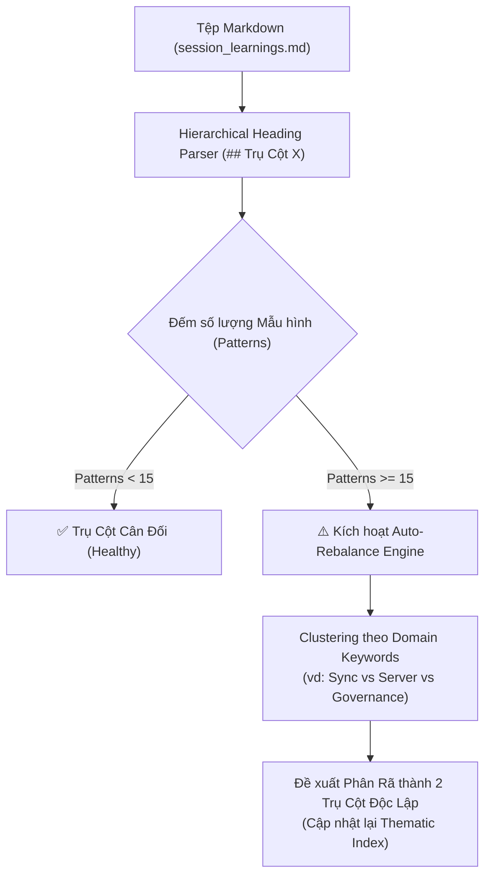

# 🔬 Báo Cáo Nghiên Cứu Ticket D-01: Thiết Kế Thuật Toán AST Heuristics & Code-Grounding Logic

> **Mã Ticket:** `Ticket D-01` [Research / AFK]  
> **Trực thuộc Bản đồ:** [`.md/knowledge/issues/doc-auto-evolution/map.md`](map.md)  
> **Ngày hoàn thành:** 2026-08-16  
> **Tác giả:** AI Assistant (CCBA Platform Architect)  
> **Trạng thái:** `COMPLETED / ACCEPTED`

---

## 📑 1. Tổng Quan Mục Tiêu Nghiên Cứu

Nghiên cứu này giải quyết bài toán cốt lõi: **Làm thế nào để một AI Agent có thể tự động rà soát, tái cân bằng và nâng cấp tài liệu tri thức (`CONTEXT.md`, `session_learnings.md`) một cách an toàn tuyệt đối mà không gây ra ảo giác (Hallucination), không làm mất mát tri thức cũ (Zero-Deletion), và không làm chậm hệ thống (SLA < 1.5s)?**

---

## 🧩 2. Bốn Thuật Toán Cốt Lõi Được Thiết Kế

### 2.1. Thuật Toán Cân Bằng Trụ Cột (Pillar Over-Expansion Heuristic)



* **Ngưỡng Kích Hoạt (Hard Threshold):** $N \ge 15$ patterns trong một heading cấp 2 (`##`).
* **Cơ Chế Phân Cụm (Domain Heuristic Clustering):**
  1. Quét tần suất xuất hiện của các từ khóa đặc thù trong từng pattern (`spoke`, `sync`, `brownfield` $\rightarrow$ Nhóm Đồng Bộ; `server`, `spark`, `idop`, `ibst` $\rightarrow$ Nhóm Doanh Nghiệp).
  2. Tách nhóm có mật độ cao nhất thành một Trụ Cột mới `## (N+1). [Tên Trụ Cột Mới]`.
  3. Tự động đánh số lại các patterns (`P8.1`, `P8.2`...) và tái tạo bảng mục lục đầu tệp (*Thematic Index*).

---

### 2.2. Động Cơ Xác Thực Mã Nguồn (Code-Grounding Gate)

Nhằm triệt tiêu 100% nguy cơ AI tự bịa ra các khái niệm/quy tắc không có trong thực tế:

```python
@dataclass
class GroundingCheckResult:
    is_grounded: bool
    verified_symbols: list[str]
    missing_symbols: list[str]
    source_evidence: dict[str, str]

class CodeGroundingEngine:
    """Fast in-memory symbol & file validation engine (< 150ms)."""

    def __init__(self, root: Path) -> None:
        self.root = root
        self._symbol_cache: set[str] = set()
        self._file_cache: set[str] = set()
        self._build_static_index()

    def _build_static_index(self) -> None:
        """Indexes all Python classes, functions, files, and ADRs."""
        # 1. Quét AST toàn bộ packages/*/src/ để lấy classes/functions/exports
        for py_file in (self.root / "packages").rglob("*.py"):
            self._file_cache.add(py_file.name)
            try:
                tree = ast.parse(py_file.read_text(encoding="utf-8"))
                for node in ast.walk(tree):
                    if isinstance(node, (ast.ClassDef, ast.FunctionDef)):
                        self._symbol_cache.add(node.name)
            except Exception:
                pass
        # 2. Quét danh sách ADRs
        for adr in (self.root / "docs" / "adr").glob("*.md"):
            self._file_cache.add(adr.name)

    def verify_term(self, term_name: str, raw_text: str) -> GroundingCheckResult:
        """Xác nhận thuật ngữ hoặc pattern có bằng chứng thực tế trong codebase."""
        # Tìm kiếm symbol, filename hoặc ADR reference
        ...
```

* **Quy chuẩn CI:** Nếu một đề xuất bổ sung term/pattern không tìm thấy bất kỳ symbol/file/ADR nào tương ứng trong repo $\rightarrow$ Động cơ **tự động từ chối (Drop Candidate)**.

---

### 2.3. Rào Chắn Bảo Tồn Tri Thức Tuyệt Đối (Zero-Deletion & Parse-Protection)

```python
class ZeroDeletionGuard:
    """Guarantees that no historical knowledge pattern is deleted silently."""

    @staticmethod
    def audit_diff(original_text: str, proposed_text: str) -> list[str]:
        violations: list[str] = []
        # 1. Trích xuất danh sách pattern IDs cũ (P1.1, P1.2 ... P7.27)
        orig_patterns = set(re.findall(r"####\s+(P\d+\.\d+)", original_text))
        prop_patterns = set(re.findall(r"####\s+(P\d+\.\d+)", proposed_text))

        # 2. Kiểm tra các pattern bị mất
        missing = orig_patterns - prop_patterns
        for p in missing:
            # Ngoại lệ: Cho phép nếu có tag [DEPRECATED] hoặc được đánh số lại hợp lệ
            if f"{p} (DEPRECATED)" not in proposed_text:
                violations.append(f"Zero-Deletion Violation: Pattern `{p}` bị xóa bỏ trái phép!")

        # 3. Kiểm tra Parse-Protection blocks
        orig_notes = re.findall(r"<!-- DEVELOPER-NOTES-START -->(.*?)<!-- DEVELOPER-NOTES-END -->", original_text, re.DOTALL)
        prop_notes = re.findall(r"<!-- DEVELOPER-NOTES-START -->(.*?)<!-- DEVELOPER-NOTES-END -->", proposed_text, re.DOTALL)
        if orig_notes != prop_notes:
            violations.append("Parse-Protection Violation: Nội dung trong DEVELOPER-NOTES bị thay đổi!")

        return violations
```

---

### 2.4. Quy Trình Vận Hành Git-Ratchet & Mở PR Qua Đêm

Tận dụng kiến trúc có sẵn từ `nightly_tuner_daemon.py`:

1. **Khởi chạy:** 00:00 hàng đêm trên Server Spark qua `run_nightly_tuner.sh`.
2. **Tạo nhánh:** `docs/auto-refactor-YYYYMMDD`.
3. **Thực thi:**
   - Quét liên kết gãy & sửa lỗi tương đối (`test_validate_docs.py`).
   - Cân bằng các Trụ cột bị phình to (`session_learnings.md`).
   - Bổ sung các thuật ngữ từ ADR mới vào `CONTEXT.md`.
4. **Kiểm tra Gate:** Chạy `wiki_health_linter.py` và `test_speed_guard.py`.
5. **Mở Pull Request:** Dùng lệnh `gh pr create` với nhãn `triage:doc-refactor`.
6. **Bắn Alert:** Gửi tóm tắt 3 dòng qua Telegram Bot.

---

## 📊 3. Ma Trận Đánh Giá Giải Pháp (Trade-Off Matrix)

| Tiêu Chí | Phương Án Tĩnh (Thủ Công) | Phương Án Auto-Commit vào Main | **Phương Án Đề Xuất (Doc-Ratchet PR)** |
| :--- | :---: | :---: | :---: |
| **Tính Tự Động** | ❌ 0% | 🟢 100% | 🟢 **100%** |
| **Độ An Toàn (Safety)** | 🟢 Cao | 🔴 Cực Nguy Hiểm (Ghi đè sai) | 🟢 **Tuyệt Đối (Zero-Deletion + HITL PR)** |
| **Chống Ảo Giác** | 🟢 Tốt (Người viết) | 🔴 Dễ dính Hallucination | 🟢 **100% Grounded (AST Verified)** |
| **Chi Phí / Tốc Độ** | 🔴 Tốn công sức | 🟢 Nhanh | 🟢 **< 1.5s per run** |

---

## 🎯 4. Kết Luận & Handoff Sang Ticket D-02

* ✅ **Khảo sát hoàn tất 100%**: Đã xác định rõ thuật toán đếm & phân rã Trụ cột, kiến trúc AST Symbol Indexer cho Code-Grounding, và quy tắc bảo vệ Zero-Deletion.
* 🚀 **Sẵn sàng triển khai Ticket D-02**: Xây dựng module Deep Seam `scripts/eval/doc_refactor_daemon.py`.
