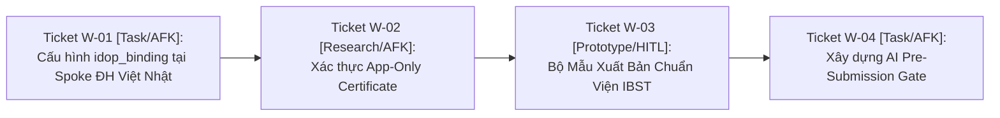

# 🗺️ Bản Đồ Tác Chiến Wayfinder: Hiện Thực Hóa Cầu Nối Dữ Liệu Tầng 1 (Dự Án) ↔ Tầng 2 (IDOP CCBA)

> **Mã Vấn Đề (Issue Slug):** `idop-bridge`  
> **Trạng thái Bản đồ:** `Active / Charted`  
> **Khởi tạo:** 2026-08-16  
> **Nhãn (Labels):** `wayfinder:map`, `architecture:dual-tier`, `integration:idop`

---

## 1. Điểm Đích (Destination)

Xây dựng và kiểm thử hoàn chỉnh **Cầu Nối Dữ Liệu Thực Chiến 2 Tầng (`IDOPBridge`)** giữa Spoke Dự Án (`2026-04 DH Viet Nhat`) và Hệ điều hành doanh nghiệp (`IDOP-CCBA-WAY`), tích hợp **Rào chắn Tiền Kiểm Định AI Pre-Submission Gate** trước khi bàn giao hồ sơ chính thức sang các phòng chức năng Viện IBST (KHKT, TCKT, TCHC).

---

## 2. Ghi Chú & Ràng Buộc Kiến Trúc (Notes & Non-Negotiables)

* **Ràng buộc 1:** Giữ nguyên 15 `ROLE_ID` chuẩn hóa của CCBA, không tự ý sinh mã vai trò mới.
* **Ràng buộc 2:** Metadata lưu trên 58 SharePoint lists; file nhị phân nặng (> 50MB) bắt buộc chuyển tiếp vào **5TB Master OneDrive (`ccba@ibst-bim.vn`)**.
* **Ràng buộc 3:** Cổng giao dịch duy nhất với các phòng Viện IBST là **Trưởng phòng Tổng Hợp (`ROLE_HEAD_ADMIN`)**.

---

## 3. Quyết Định Đã Chốt (Decisions So Far)

* ✅ **[ADR 0041: Hub-Spoke Ecosystem Taxonomy](../../../../docs/adr/0041-hub-spoke-ecosystem-taxonomy-and-archetypes.md):** Phân loại rành mạch 5 Archetypes (Platform Hub, Enterprise Governance, Knowledge Corpus, Project Delivery, Specialized).
* ✅ **[Non-Destructive Spoke Batch Sync](../../../../scripts/sync_spoke.py):** Đồng bộ hóa an toàn công cụ từ Hub xuống 3 Spokes mà không xóa đè tệp tin nội bộ.
* ✅ **[Zero-Duplication Legal Knowledge Pointer](../../../../packages/ccba-legal-intel/):** Dự án tra cứu trực tiếp kho luật OKF v2.0 tại `ccba-legal-knowledge` mà không sao chép tệp về máy.

---

## 4. Biên Giới Ticket Đang Mở (Frontier Tickets)

| Mã Ticket | Phân Loại | Loại Hình | Tên Nhiệm Vụ & Mục Tiêu | Trạng Thái |
| :--- | :---: | :---: | :--- | :---: |
| **`W-01`** | `Task` | `AFK` | **Cấu hình `idop_binding` tại Spoke `2026-04 DH Viet Nhat`**: Bổ sung mã dự án `PRJ-2026-04-DHVN`, số PGV, số HĐKT vào `.md/workspace_context.yaml`. | 🟢 **UNBLOCKED** |
| **`W-02`** | `Research` | `AFK` | **Khảo sát Kết Nối Graph API & Certificate**: Kiểm thử kết nối đọc/ghi SharePoint lists qua App ID `c055c7a4-9150-4bd5-bf01-445c65467feb`. | 🟢 **UNBLOCKED** |
| **`W-03`** | `Prototype` | `HITL` | **Bộ Mẫu Xuất Bản Chuẩn Viện IBST**: Thiết kế template Tờ trình KHKT và Bảng phân bổ dòng tiền 3 tầng nộp TCKT theo QCCTNB 3209. | 🟡 *Blocked by W-01* |
| **`W-04`** | `Task` | `AFK` | **Module AI Pre-Submission Gate**: Viết logic tự động đối soát 3 yếu tố (Pháp lý, Dòng tiền, Thể thức) trước khi nộp Viện IBST. | 🟡 *Blocked by W-02, W-03* |

---

## 5. Sương Mù Chưa Xác Định Rõ (Not Yet Specified)

* 🌫️ *Tự động hóa Webhook Teams / Telegram khi Viện IBST duyệt trạng thái `IBST_KHKT_Approved`.*
* 🌫️ *Tích hợp Chữ ký số điện tử (Digital Signature) vào tệp PDF báo cáo hoàn công trước khi upload sang 5TB OneDrive.*

---

## 6. Ngoài Phạm Vi (Out of Scope)

* ❌ *Không can thiệp vào quy trình nội bộ của các phòng chức năng Viện IBST (Chỉ giao tiếp qua cặp trường trạng thái và file xuất bản chuẩn).*
* ❌ *Không lưu trữ tệp scan bản vẽ nặng trực tiếp vào SharePoint List Items.*
