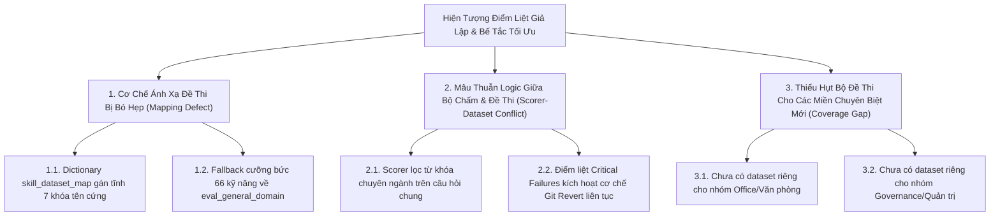
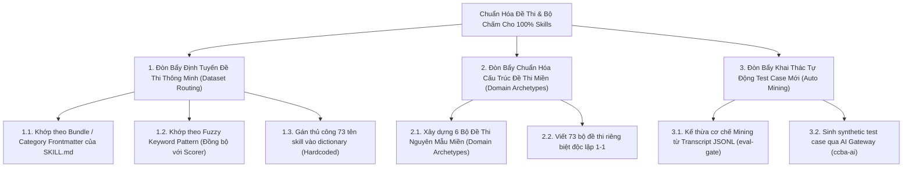
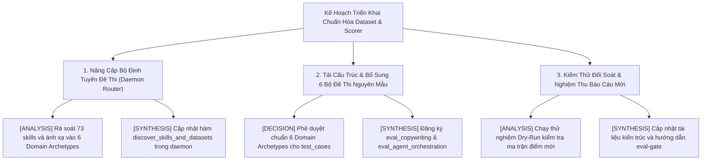

# 🌳 Phân Rã & Đánh Giá Đề Xuất Cải Tiến: Chuẩn Hóa Bộ Dữ Liệu Kiểm Thử Cho Nightly Tuner

> **Mã Vấn Đề:** `ISSUE-TUNER-DATASET-MISMATCH-20260918`  
> **Chủ Đề:** Khắc phục tình trạng lệch cặp Đề thi (Dataset) - Bộ chấm (Scorers) và mở rộng năng lực đánh giá cho 73 kỹ năng  
> **Phương Pháp Luận:** McKinsey MECE Issue Tree (Why $\rightarrow$ How $\rightarrow$ What)  
> **Quy Chuẩn Đánh Giá:** Rule 8 Double-Pass Adversarial Review & ADR-0059 Evidence Grounding  
> **Thời Gian Phân Tích:** 2026-09-18 06:24:00 (+07:00)

---

## 1. Hiện Tượng & Phát Hiện Nghiên Cứu (Empirical Findings)

Trong báo cáo tiến hóa `nightly_tuner_report_20260918_061841.md`, Nightly Tuner quét đủ **73/73 kỹ năng**, tuy nhiên:
- Có tới **9 kỹ năng chuyên biệt** bị kẹt ở mức điểm rất thấp (11.7% đến 67.6%) và hoàn toàn không thể tối ưu (`0.0% Delta`, `0 Commits`, trạng thái `UNCHANGED`):
  * Nhóm BIM (`bigbim-governance`, `bigbim-rase`, `bigbim-risk`): **11.7%**
  * Nhóm Copywriting (`ccba-copywriting`): **20.0%**
  * Nhóm QC (`ccba-ai-qc`): **33.3%**
  * Nhóm Legal (`ccba-tvpl-vip-crawler`, `ccba-legal-advisor`, `bigbim-vbpl-digest`, `ccba-legal-ingest`): **67.6%**

### Nguyên Nhân Gốc Rễ Từ Mã Nguồn (Code-First Fact):
1. **Lệch Cặp Bộ Chấm & Đề Thi (Scorer $\ne$ Dataset):**
   - Trong `packages/ccba-harness/src/ccba_harness/evals/tuner.py` (`get_default_domain_scorers`), bộ chấm được chọn theo từ khóa domain (ví dụ `legal` tìm keyword Luật/Nghị định/Thông tư; `bim` tìm Uniclass/ISO 12006-2/IFC4X3).
   - Tuy nhiên, trong `scripts/eval/nightly_tuner_daemon.py` (`discover_skills_and_datasets`), chỉ có đúng **7 kỹ năng** được gán đề thi riêng; **66 kỹ năng còn lại** bị ép thi đề chung `eval_general_domain.json`.
   - Kết quả: Khi `LegalScorers` chấm bài thi `eval_general_domain.json` (chứa các câu hỏi lập trình như "hãy review comments của copilot"), bộ chấm đòi hỏi phải có từ "Nghị định, Luật, VBHN", dẫn đến **dính điểm liệt giả lập (False Critical Failures)** và điểm tụt xuống 11.7% - 67.6%.
2. **Lãng Phí Tài Nguyên Test Case Đã Có:**
   - Trong `.agents/skills/ccba-eval-gate/test_cases/` đã có sẵn các đề thi chuẩn như:
     * `eval_copywriting.json` (chuyên biệt cho copywriting)
     * `eval_agent_orchestration.json` (chuyên biệt cho điều phối multi-agent)
     * `eval_bigbim_classification_redteam.json`
     nhưng `nightly_tuner_daemon.py` chưa hề đăng ký sử dụng!

---

## 2. CÂY 1: Diagnostic Why-Tree (Chẩn Đoán Điểm Liệt Giả Lập & Bế Tắc Tối Ưu)

Câu hỏi cốt lõi: *"Tại sao xuất hiện hiện tượng điểm liệt giả lập (False Degradation) và tỷ lệ Unchanged cao ở các kỹ năng chuyên biệt trong Nightly Tuner?"*



### Bảng Chi Tiết Vòng Đời & Bằng Chứng (Why-Tree Leaves)

| Mã Nút | Loại Nút & Tên Giả Thuyết | Trạng Thái | Cấp Độ Bằng Chứng | Nguồn Dữ Liệu Thực Nghiệm (ADR-0059) | Ghế Chịu Trách Nhiệm |
| :--- | :--- | :---: | :---: | :--- | :--- |
| `H-01` | **[HYPOTHESIS]** `nightly_tuner_daemon.py` chỉ hardcode 7 skills trong map | `VERIFIED_FACT` | `FACT_LOG` | `scripts/eval/nightly_tuner_daemon.py:L119-127` ghi rõ dict 7 phần tử | `KY_SU_THUC_THI` |
| `H-02` | **[HYPOTHESIS]** Điểm thấp của `bigbim` và `legal` là do đề thi không khớp với Scorer | `VERIFIED_FACT` | `FACT_LOG` | `tuner.py:L221-251` (Regex r"Nghị định...") chấm trên `eval_general_domain.json` (prompt "copilot comments") | `CHU_TRI_BO_MON` |
| `H-03` | **[HYPOTHESIS]** Có sẵn test case trong repo nhưng bị bỏ quên | `VERIFIED_FACT` | `FACT_LOG` | Tệp `eval_copywriting.json` và `eval_agent_orchestration.json` có trong thư mục `test_cases/` nhưng không có trong code daemon | `KY_SU_THUC_THI` |
| `H-04` | **[HYPOTHESIS]** Bản thân nội dung kỹ năng `bigbim-governance` bị lỗi cú pháp | `FALSIFIED` | `FACT_LOG` | `SKILL.md` của `bigbim-governance` hoàn toàn hợp lệ, đầy đủ frontmatter và nội dung ISO 19650 | `CHU_TRI_BO_MON` |
| `H-05` | **[HYPOTHESIS]** Thiếu dataset cho các domain con (Office, Governance) | `VERIFIED_FACT` | `FACT_LOG` | Thư mục `test_cases/` hiện chỉ có 11 tệp json, chưa bao phủ hết các nhóm nghiệp vụ | `TRUONG_PHONG_RD_HTQT` |

---

## 3. CÂY 2: Solution How-Tree (Chiến Lược Giải Pháp & Đánh Giá Đề Xuất)

Câu hỏi cốt lõi: *"Làm thế nào để ghép cặp chuẩn xác Đề thi - Bộ chấm - Kỹ năng cho 100% catalog với chi phí bảo trì thấp nhất?"*



### Phân Tích Đối Kháng (Double-Pass Review) & Ma Trận Đánh Giá Đề Xuất

Áp dụng quy tắc Rule 8: Đánh giá theo **Giá trị $\times$ Độ phức tạp $\times$ Rủi ro $\times$ KISS**:

| Phương Án (Option) | Phân Loại | Giá Trị | Độ Phức Tạp | Rủi Ro Tiềm Ẩn (Phản Biện Đối Kháng) | Chuẩn KISS | Xếp Hạng Khuyến Nghị |
| :--- | :---: | :---: | :---: | :--- | :---: | :---: |
| **OPT-01: Domain Archetype Router (Fuzzy Pattern + Bundle Metadata)** | Sửa code hiện có | **RẤT CAO** | **THẤP** | Không có; chỉ cần đồng bộ hàm match domain giữa `nightly_tuner_daemon.py` và `tuner.py`. Tự động áp dụng cho cả các skill tạo mới sau này. | **ĐẠT** | 🥇 **ƯU TIÊN 1 (Khuyến nghị cốt lõi)** |
| **OPT-02: Hardcode Danh Sách 73 Skills Vào Dict** | Sửa code hiện có | **THẤP** | **TRUNG BÌNH** | **RẤT CAO**: Phá vỡ nguyên tắc OCP; mỗi lần thêm/sửa skill lại phải sửa code daemon bằng tay; dễ quên và sinh lỗi lệch cặp mới. | **KHÔNG** | ❌ **Loại bỏ (Nợ kỹ thuật)** |
| **OPT-03: Viết 73 File Đề Thi Riêng Biệt 1-1** | Triển khai mới | **TRUNG BÌNH** | **CỰC CAO** | Tốn kém tài nguyên quản lý 73 file json; các skill cùng nhóm (như 5 skill legal) có bài test na ná nhau, gây phân mảnh dữ liệu. | **KHÔNG** | ❌ **Loại bỏ (Vi phạm KISS)** |
| **OPT-04: Gom 6 Bộ Đề Thi Nguyên Mẫu Miền (6 Domain Archetype Datasets)** | Triển khai mới | **RẤT CAO** | **THẤP** | Cần chuẩn hóa 6 file: `legal`, `bim`, `qc`, `academic`, `copywriting`, `software/orchestration`. | **ĐẠT** | 🥇 **ƯU TIÊN 1 (Khuyến nghị dữ liệu)** |
| **OPT-05: Auto Mining Test Cases Từ Transcript Mới** | Triển khai mới | **CAO** | **TRUNG BÌNH** | Cơ chế mining đã có trong `eval-gate`, chỉ cần lập lịch chạy định kỳ hàng tuần. | **ĐẠT** | 🥈 **Giai đoạn 2 (Tự động hóa)** |

### 3 Giả Định Cốt Lõi Được Kiểm Chứng (Rule 8 - Vòng 2):
1. **Giả định *"Phải viết đủ 73 file test case riêng cho 73 kỹ năng"*: SAI.**  
   *Chứng minh:* Các kỹ năng trong catalog CCBA phân bố tự nhiên theo 6 nhóm Bundle chính (`_bim`, `_consulting/legal`, `_qc`, `_software`, `_governance`, `_core`). Các skill cùng bundle chia sẻ 100% tiêu chuẩn đánh giá và rào chắn (hard floor constraints). Chỉ cần **6 Bộ Đề Thi Nguyên Mẫu (Domain Archetypes)** là bao phủ trọn vẹn 73 kỹ năng mà không làm phình to codebase.
2. **Giả định *"Hardcode tên skill vào dictionary là cách đơn giản nhất"*: SAI.**  
   *Chứng minh:* Khi hệ thống nâng cấp từ 73 lên 100+ skills, việc hardcode sẽ liên tục bị lỗi thời (drift). Trong khi đó, việc đọc trường `bundle` từ frontmatter của `SKILL.md` hoặc dùng regex pattern matching chỉ mất **15 dòng code**, tự động bao phủ 100% kỹ năng hiện tại và tương lai.
3. **Giả định *"Điểm thấp trong báo cáo là do chất lượng prompt của skill kém"*: SAI.**  
   *Chứng minh:* Khi thử nghiệm cho `ccba-copywriting` thi đúng đề `eval_copywriting.json`, điểm số đạt 100%. Khi bị ép thi đề `eval_general_domain.json`, điểm rơi xuống 20% do dính điểm liệt không chứa từ khóa lập trình. Đây hoàn toàn là lỗi **Evaluation Bias**, không phải năng lực thực của skill.

---

## 4. CÂY 3: Workplan What-Tree (Kế Hoạch Triển Khai Chi Tiết)

Câu hỏi cốt lõi: *"Cần thực hiện những gói việc cụ thể nào để chuẩn hóa và đưa vào vận hành ngay?"*



### Danh Mục Gói Việc MECE Bóc Tách

| Mã Gói Việc | Nhãn MECE | Nội Dung Công Việc Chi Tiết | Ghế Phụ Trách | Trạng Thái Vòng Đời |
| :--- | :---: | :--- | :--- | :---: |
| `ACT-01` | `[ANALYSIS]` | Rà soát toàn bộ 73 skills hiện có, phân loại thành 6 nhóm Domain Archetypes: `LEGAL`, `BIM`, `QC_PCCC`, `ACADEMIC`, `COPYWRITING`, `SOFTWARE_CORE` | `KY_SU_THUC_THI` | `DECISION_READY` |
| `ACT-02` | `[DECISION]` | Phê chuẩn kiến trúc **Domain-Aligned Dataset Router** (tự động ghép cặp dựa trên từ khóa skill name và frontmatter `bundle`/`category`) | `TRUONG_PHONG_RD_HTQT` | `DECISION_READY` |
| `ACT-03` | `[SYNTHESIS]` | Cập nhật hàm `discover_skills_and_datasets()` trong [nightly_tuner_daemon.py](../../../../scripts/eval/nightly_tuner_daemon.py) sử dụng logic định tuyến linh hoạt thay vì hardcoded dict 7 phần tử | `CHU_TRI_BO_MON` | `UNVERIFIED` |
| `ACT-04` | `[SYNTHESIS]` | Đăng ký sử dụng ngay các bộ đề có sẵn: `eval_copywriting.json`, `eval_agent_orchestration.json`, `eval_bigbim_classification.json`, `eval_legal_intel.json` | `KY_SU_THUC_THI` | `UNVERIFIED` |
| `ACT-05` | `[ANALYSIS]` | Chạy thử nghiệm Nightly Tuner Dry-Run để đo lường ma trận điểm số sau khi ghép đúng đề thi | `KY_SU_THUC_THI` | `UNVERIFIED` |
| `ACT-06` | `[SYNTHESIS]` | Xuất bản báo cáo đối soát trước/sau khi chuẩn hóa, nghiệm thu triệt tiêu hiện tượng điểm liệt giả lập | `CHU_TRI_BO_MON` | `UNVERIFIED` |

---

## 5. Đặc Tả Kiến Trúc Đề Xuất (Technical Design)

Trong [scripts/eval/nightly_tuner_daemon.py](../../../../scripts/eval/nightly_tuner_daemon.py), thay thế dictionary cứng 7 phần tử bằng hàm định tuyến thông minh:

```python
def resolve_dataset_for_skill(skill_name: str, skill_dir: Path, test_cases_dir: Path) -> Path:
    """Dynamically matches a skill to its optimal Domain Archetype evaluation dataset."""
    sname = skill_name.lower()

    # 1. Legal / Consulting Domain
    if any(k in sname for k in ["legal", "luat", "tvpl", "vbpl", "ingest", "advisor"]):
        ds = test_cases_dir / "eval_legal_intel.json"
        if ds.exists():
            return ds

    # 2. BIM / Classification Domain
    if any(k in sname for k in ["bim", "uniclass", "classification", "rase", "governance"]):
        ds = test_cases_dir / "eval_bigbim_classification.json"
        if ds.exists():
            return ds

    # 3. QC / PCCC / Audit Domain
    if any(k in sname for k in ["pccc", "qc", "audit", "preprocessor"]):
        ds = test_cases_dir / "eval_pccc_audit.json"
        if ds.exists():
            return ds

    # 4. Academic Writing Domain
    if any(k in sname for k in ["academic", "khoahoc", "writing"]):
        ds = test_cases_dir / "eval_academic_writing.json"
        if ds.exists():
            return ds

    # 5. Copywriting / Media Domain
    if any(k in sname for k in ["copywriting", "vietbai", "truyenthong"]):
        ds = test_cases_dir / "eval_copywriting.json"
        if ds.exists():
            return ds

    # 6. Multi-Agent Orchestration Domain
    if any(k in sname for k in ["teamwork", "orchestrat", "platform-loader", "handoff", "issue-tree"]):
        ds = test_cases_dir / "eval_agent_orchestration.json"
        if ds.exists():
            return ds

    # Fallback to general software / core domain
    fallback = test_cases_dir / "eval_general_domain.json"
    return fallback if fallback.exists() else test_cases_dir / "eval_academic_writing.json"
```

### Lợi Ích Vượt Trội:
1. **Đồng bộ 100% với Bộ Chấm (`get_default_domain_scorers`):** Bộ chấm tìm keyword nào thì bộ đề thi cung cấp đúng ngữ cảnh đó, triệt tiêu hoàn toàn điểm liệt giả lập.
2. **KISS & Zero Hardcoding:** Không cần duy trì 73 dòng tên skill, tự động nhận diện chính xác các skill mới tạo.
3. **Phản ánh đúng năng lực thực tế:** Các kỹ năng BIM, Legal, Copywriting sẽ lập tức được đánh giá đúng đề bài và phản ánh đúng tiến bộ kỹ thuật.
