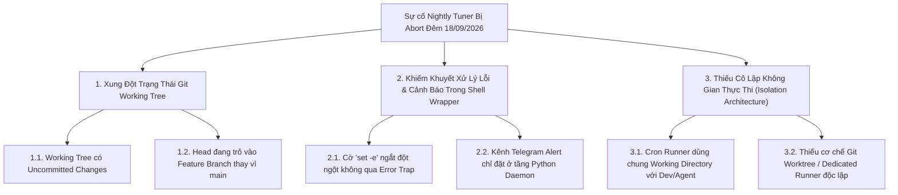
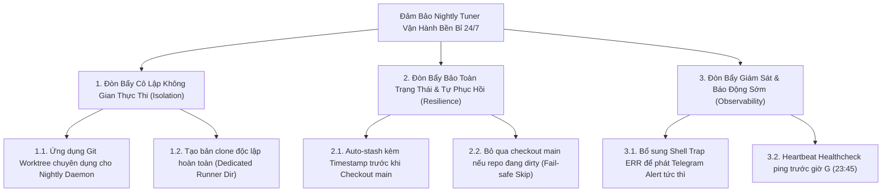
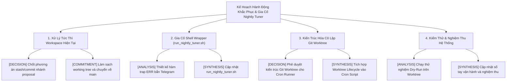

# 🌳 Phân Rã & Đánh Giá Đề Xuất Xử Lý Sự Cố Nightly Tuner Daemon

> **Mã Sự Cố:** `ISSUE-NIGHTLY-TUNER-20260918-0001`  
> **Phương Pháp Luận:** McKinsey MECE Issue Tree Chaining (Why $\rightarrow$ How $\rightarrow$ What)  
> **Quy Chuẩn Kiểm Định:** Rule 8 Double-Pass Adversarial Review & ADR-0059 Evidence Grounding  
> **Thời Gian Phân Tích:** 2026-09-18 06:15:00 (+07:00)

---

## 1. Bối Cảnh & Hiện Tượng Sự Cố (Incident Summary)

Vào lúc **00:00:01 Fri Sep 18 2026**, cron daemon trên máy chủ Spark kích hoạt kịch bản định kỳ `scripts/cron/run_nightly_tuner.sh`. Tiến trình ngay lập tức bị dừng (`Aborting`) tại dòng 45 (`git checkout main`) do working tree đang ở nhánh `proposal/dynamic-base-branch-for-create-pr` và có các uncommitted changes trong:
- `.agents/skills/ccba-ai-qc/SKILL.md`
- `packages/ccba-harness/src/ccba_harness/evals/tuner.py`

Do `run_nightly_tuner.sh` kích hoạt cờ `set -euo pipefail` nhưng thiếu cơ chế `trap ERR` và cơ chế cô lập không gian thực thi (Workspace Isolation), toàn bộ chu trình tối ưu hóa kỹ năng (`nightly_tuner_daemon.py`) và tiến hóa tài liệu (`doc_refactor_daemon.py`) đều bị hủy bỏ âm thầm trong đêm mà không có bất kỳ cảnh báo Telegram nào được gửi về nhóm vận hành.

---

## 2. CÂY 1: Diagnostic Why-Tree (Chẩn Đoán Nguyên Nhân Gốc Rễ)

Câu hỏi cốt lõi: *"Tại sao Nightly Tuner Daemon bị sập và không hoàn thành chu trình tối ưu hóa rạng sáng 18/09/2026?"*



### Bảng Chi Tiết Vòng Đời & Bằng Chứng (Why-Tree Leaves)

| Mã Nút | Loại Nút & Tên Giả Thuyết | Trạng Thái | Cấp Độ Bằng Chứng | Nguồn Dữ Liệu Thực Nghiệm (ADR-0059) | Ghế Chịu Trách Nhiệm |
| :--- | :--- | :---: | :---: | :--- | :--- |
| `H-01` | **[HYPOTHESIS]** Working tree tồn tại uncommitted changes gây cản trở `git checkout main` | `VERIFIED_FACT` | `FACT_LOG` | `.md/logs/nightly_cron.log:L11762-11765` xác nhận lỗi `Your local changes to the following files would be overwritten by checkout... Aborting` | `KY_SU_THUC_THI` |
| `H-02` | **[HYPOTHESIS]** HEAD đang ở nhánh feature (`proposal/...`) thay vì `main` | `VERIFIED_FACT` | `FACT_LOG` | `.git/HEAD` ghi nhận `ref: refs/heads/proposal/dynamic-base-branch-for-create-pr` | `KY_SU_THUC_THI` |
| `H-03` | **[HYPOTHESIS]** Shell script `run_nightly_tuner.sh` thiếu `trap ERR` để bắt lỗi | `VERIFIED_FACT` | `FACT_LOG` | `scripts/cron/run_nightly_tuner.sh` có `set -euo pipefail` tại L5 nhưng không có `trap` xử lý exit code $\ne 0$ | `CHU_TRI_BO_MON` |
| `H-04` | **[HYPOTHESIS]** Telegram bot bị mất kết nối hoặc token hết hạn | `FALSIFIED` | `FACT_LOG` | Log L11743 xác nhận gửi Telegram thành công trước đó; hàm `send_telegram_alert` hoàn toàn khả dụng | `KY_SU_THUC_THI` |
| `H-05` | **[HYPOTHESIS]** Crontab hệ thống không kích hoạt đúng giờ | `FALSIFIED` | `FACT_LOG` | Log L11748 ghi rõ `Starting at Fri Sep 18 00:00:01 +07 2026` | `KY_SU_THUC_THI` |
| `H-06` | **[HYPOTHESIS]** Kiến trúc Cron chạy trực tiếp trên Working Tree tương tác của người dùng | `VERIFIED_FACT` | `FACT_LOG` | `run_nightly_tuner.sh:L23-24` thực thi trực tiếp trên `PROJECT_ROOT`, không tạo Git Worktree | `TRUONG_PHONG_RD_HTQT` |

---

## 3. CÂY 2: Solution How-Tree (Chiến Lược Giải Pháp & Đánh Giá Đề Xuất)

Câu hỏi cốt lõi: *"Làm thế nào để Nightly Tuner Daemon vận hành 24/7 bền bỉ, tự phục hồi và triệt tiêu 100% rủi ro Working Tree bẩn?"*



### Phân Tích Đối Kháng (Double-Pass Review) & Ma Trận Đánh Giá Đề Xuất

Áp dụng quy tắc Rule 8: Đánh giá đa chiều theo **Giá trị $\times$ Độ phức tạp $\times$ Rủi ro $\times$ KISS**:

| Phương Án (Option) | Phân Loại | Giá Trị | Độ Phức Tạp | Rủi Ro Tiềm Ẩn (Phản Biện Đối Kháng) | Chuẩn KISS | Xếp Hạng Khuyến Nghị |
| :--- | :---: | :---: | :---: | :--- | :---: | :---: |
| **OPT-01: Git Worktree Chuyên Dụng** (`.git/worktrees/nightly-runner`) | Triển khai mới | **RẤT CAO** | **THẤP** | Cần quản lý dọn dẹp worktree định kỳ nếu nhánh bị xóa. | **ĐẠT** | 🥇 **ƯU TIÊN 1 (Khuyến nghị chuẩn kiến trúc)** |
| **OPT-02: Auto-Stash / Pop Guard trong Shell** | Sửa code hiện có | **TRUNG BÌNH** | **THẤP** | **Cực kỳ rủi ro**: Nếu main kéo code mới về, lệnh `stash pop` sẽ xung đột (conflict) làm hỏng workspace của dev; nếu dev đang gõ code nửa đêm sẽ bị race condition. | **ĐẠT** | 🥉 **Phương án tình thế tạm thời** |
| **OPT-03: Clone Thư Mục Độc Lập** (`~/ccba/nightly-runner`) | Triển khai mới | **CAO** | **TRUNG BÌNH** | Tốn dung lượng ổ đĩa gấp đôi, phải quản lý đồng bộ venv và secrets `.env` ở 2 nơi. | **KHÔNG** | ❌ **Loại bỏ (Lãng phí tài nguyên)** |
| **OPT-04: Shell Trap ERR & Telegram Emergency Alert** | Bổ sung mới | **RẤT CAO** | **RẤT THẤP** | Không có rủi ro; chỉ gọi curl webhook Telegram khi exit code $\ne 0$. | **ĐẠT** | 🥇 **BẮT BUỘC KÈM THEO (Cảnh báo sớm)** |
| **OPT-05: Pre-flight Dirty Warning (23:45 Check)** | Bổ sung mới | **TRUNG BÌNH** | **TRUNG BÌNH** | Cần thêm 1 cron job phụ trước giờ G 15 phút. | **KHÔNG** | 🥈 **Xem xét ở Phase sau** |

### 3 Giả Định Cốt Lõi Được Kiểm Chứng (Rule 8 Vòng 2):
1. **Giả định "Git Stash giải quyết được dứt điểm": SAI.**  
   *Chứng minh:* Khi cron stash uncommitted code của dev, checkout `main` và pull thay đổi mới từ remote về, việc `git stash pop` tự động có xác suất cao gây Merge Conflict. Khi xảy ra conflict, repository sẽ bị khóa cứng (unmerged state), khiến developer sáng hôm sau không thể làm việc được.
2. **Giả định "Dùng Git Worktree tốn nhiều tài nguyên": SAI.**  
   *Chứng minh:* `git worktree` dùng chung 100% object database (`.git/objects`), chỉ tạo thêm một thư mục chứa checkout files (~vài chục MB), khởi tạo và giải phóng trong 1 giây mà không cần clone lại repo.
3. **Giả định "Cron script đã có cơ chế báo lỗi về Telegram": SAI.**  
   *Chứng minh:* `scripts/cron/run_nightly_tuner.sh` chưa hề có lệnh gọi `send_telegram_alert` hoặc curl API Telegram. Chỉ khi nào vào được script Python (`nightly_tuner_daemon.py`), Telegram alert mới được gọi. Khi shell chết ở L45, toàn bộ bị câm nín.

---

## 4. CÂY 3: Workplan What-Tree (Kế Hoạch Hành Động Chi Tiết)

Câu hỏi cốt lõi: *"Cần thực hiện những gói việc cụ thể nào để khắc phục triệt để sự cố và nâng cấp hệ thống?"*



### Danh Mục Gói Việc MECE Bóc Tách

| Mã Gói Việc | Nhãn MECE | Nội Dung Công Việc Chi Tiết | Ghế Phụ Trách | Trạng Thái Vòng Đời |
| :--- | :---: | :--- | :--- | :---: |
| `ACT-01` | `[DECISION]` | Thống nhất xử lý uncommitted changes trên nhánh `proposal/dynamic-base-branch-for-create-pr` (Commit hoặc Stash) | `KY_SU_THUC_THI` | `DECISION_READY` |
| `ACT-02` | `[COMMITMENT]` | Thực hiện commit hoặc stash các tệp dở dang, đưa repository về trạng thái sạch sẽ | `KY_SU_THUC_THI` | `UNVERIFIED` |
| `ACT-03` | `[ANALYSIS]` | Rà soát và thiết kế đoạn mã `trap 'catch_err' ERR` phát thông báo Telegram khẩn cấp trực tiếp từ bash script | `CHU_TRI_BO_MON` | `DECISION_READY` |
| `ACT-04` | `[SYNTHESIS]` | Cập nhật `scripts/cron/run_nightly_tuner.sh` bổ sung Error Trap và cơ chế bảo vệ trước lỗi | `CHU_TRI_BO_MON` | `UNVERIFIED` |
| `ACT-05` | `[DECISION]` | Phê chuẩn kiến trúc **Git Worktree Isolation** (ADR-0060 đề xuất): Chuyển toàn bộ tác vụ Cron Daemon sang chạy trong một ephemeral Git Worktree riêng biệt (`.worktrees/nightly-runner`) | `TRUONG_PHONG_RD_HTQT` | `DECISION_READY` |
| `ACT-06` | `[SYNTHESIS]` | Viết script quản trị vòng đời worktree (`setup_worktree` $\rightarrow$ `run_daemon` $\rightarrow$ `cleanup_worktree`) | `CHU_TRI_BO_MON` | `UNVERIFIED` |
| `ACT-07` | `[ANALYSIS]` | Thực thi kiểm thử chạy bù thủ công (Dry-Run / Live Run) cho ngày 18/09/2026 | `KY_SU_THUC_THI` | `UNVERIFIED` |
| `ACT-08` | `[SYNTHESIS]` | Tổng kết báo cáo tiến hóa kỹ năng, ghi nhận bài học kinh nghiệm vào `session_learnings.md` | `CHU_TRI_BO_MON` | `UNVERIFIED` |

---

## 5. Đề Xuất Giải Pháp Kỹ Thuật Chi Tiết (Technical Specification)

### 5.1. Giải pháp Ngắn Hạn (Immediate Fix - 5 phút)
1. Commit hoặc stash các file đang thay đổi:
   ```bash
   git stash push -m "wip: save changes before nightly tuner sync"
   git checkout main
   git pull origin main
   ```
2. Thêm Error Trap vào [scripts/cron/run_nightly_tuner.sh](../../../../scripts/cron/run_nightly_tuner.sh):
   ```bash
   trap 'python3 -c "from scripts.eval.telegram_alert import send_telegram_alert; send_telegram_alert(\"🚨 [CCBA Cron Failure] Nightly Tuner gặp lỗi tại dòng \$LINENO\", mock_fallback=True)"' ERR
   ```

### 5.2. Giải pháp Căn Cơ Dài Hạn (Architectural Fix - Git Worktree Runner)
Trong [scripts/cron/run_nightly_tuner.sh](../../../../scripts/cron/run_nightly_tuner.sh), thay vì chuyển nhánh trực tiếp trên thư mục đang làm việc của người dùng:
```bash
# Thiết lập Worktree độc lập
WORKTREE_DIR="$PROJECT_ROOT/.worktrees/nightly"
mkdir -p "$PROJECT_ROOT/.worktrees"

# Dọn dẹp worktree cũ nếu còn tồn tại
git worktree remove --force "$WORKTREE_DIR" 2>/dev/null || true

# Tạo worktree mới gắn trực tiếp với origin/main
git fetch origin main
git worktree add --detach "$WORKTREE_DIR" origin/main

# Chạy daemon bên trong worktree cô lập 100%
cd "$WORKTREE_DIR"
python3 scripts/eval/doc_refactor_daemon.py
python3 scripts/eval/nightly_tuner_daemon.py --max-iter 30

# Dọn dẹp worktree sau khi hoàn tất
cd "$PROJECT_ROOT"
git worktree remove --force "$WORKTREE_DIR"
```
**Lợi ích vượt trội:**
1. Developer hoặc AI Agent có thể tiếp tục code, chuyển nhánh, sửa file thâu đêm mà **không bao giờ bị xung đột hay cản trở** Nightly Cron.
2. Nightly Cron luôn được đảm bảo chạy trên mã nguồn sạch 100% lấy trực tiếp từ `origin/main`.
3. Triệt tiêu hoàn toàn rủi ro Working Tree bẩn làm sập cron.
