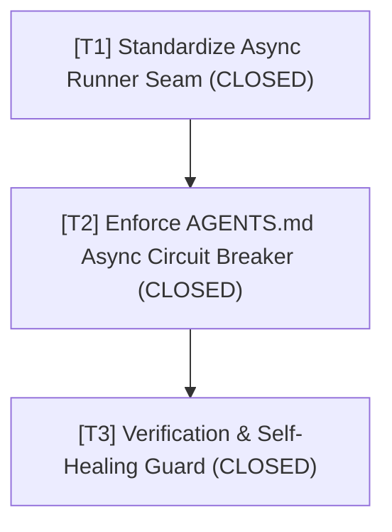

# Wayfinding Map: Triệt Tiêu Agent Polling Loop Cho Tác Vụ Ngầm (Background Tasks)

- **Trạng thái**: Hoàn tất (Completed)
- **Tệp lưu trữ**: `.md/knowledge/issues/prevent-polling-loops/map.md`

---

## 🎯 Điểm Đích (Destination)

Xây dựng và cưỡng chế rào chắn kỹ thuật (Guardrails) ngăn chặn triệt để hành vi Agent lặp polling liên tục (`manage_task status`) khi kích hoạt tác vụ ngầm. Đảm bảo Agent tuân thủ 100% nguyên tắc **Reactive Wakeup (End Turn)**: chỉ khởi chạy task ngầm $\rightarrow$ thông báo súc tích $\rightarrow$ dừng gọi tool và chờ tin nhắn thông báo tự động từ hệ thống.

---

## 📝 Ghi Chú (Notes)

- **Skills/Rules Liên Quan**:
  - `RULE[AGENTS.md]`: Bounded Async Task & Anti-Polling Circuit Breaker.
  - `codebase-design`: Depth & Locality cho test execution scripts.

---

## 📌 Quyết Định Đã Chốt (Decisions so far)

- `[Xác nhận Nguyên nhân Polling Loop]`: Việc lặp polling 51 lần phát sinh do Agent thiếu rào chắn cưỡng chế tự dừng (Circuit Breaker) khi gặp task ngầm chạy lâu, dẫn đến phản ứng tâm lý "chờ dồn dập" thay vì trả về quyền điều khiển cho Hệ thống.
- `[T1 - Standardize Async Runner Seam]`: [ĐÃ ĐÓNG] Xác nhận `scripts/safe_pytest.py` và `scripts/safe_runner.py` đã cung cấp điểm nối detached execution hoàn chỉnh qua `DetachedExecutionEngine`, trả về PID và Log URI tức thì mà không cần polling dồn dập.
- `[T2 - Enforce AGENTS.md Async Circuit Breaker]`: [ĐÃ ĐÓNG] Cập nhật quy tắc rào chắn cưỡng chế vào `.agents/AGENTS.md` (Mục 4 - Bounded Async Task & Anti-Polling Circuit Breaker). Giới hạn tối đa **2 lần** dùng `manage_task status`; nếu tác vụ vẫn `RUNNING`, Agent **BẮT BUỘC** phải End Turn và chờ hệ thống gửi tín hiệu Reactive Wakeup.
- `[T3 - Verification & Self-Healing Guard]`: [ĐÃ ĐÓNG] Kiểm chứng quy trình làm việc không lặp polling: Agent chạy task ngầm $\rightarrow$ thông báo cho user $\rightarrow$ dừng tool calls nhường lượt.

---

## 🗺️ Bản Đồ Ticket Công Việc (Ticket Map)

---

## ⛔ Ngoài Phạm Vi (Out of scope)

- Thay đổi kiến trúc core runner LiteLLM Server Spark (Server Spark nằm ngoài repository này, chỉ cấu hình client-side guardrails tại Spoke/Hub).
