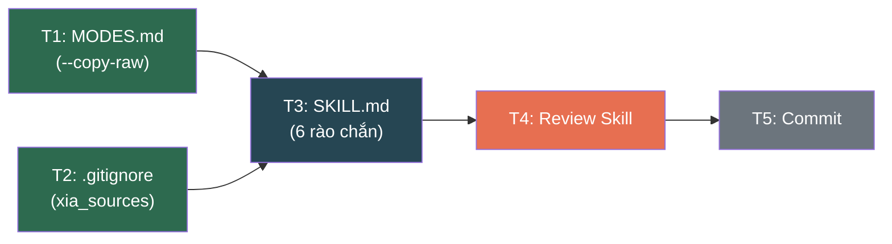

# Wayfinder Map: Cải tiến Skill `ccba-xia` theo kết quả Grilling

## Điểm đích (Destination)

Skill [ccba-xia/SKILL.md](../../../../research-ccba-skill-evaluation/.agents/skills/xia/SKILL.md) và [MODES.md](../../../../research-ccba-skill-evaluation/.agents/skills/xia/MODES.md) được cập nhật hoàn chỉnh, tích hợp đầy đủ 7 rào chắn an toàn đã được phê duyệt trong [phiên Grilling](file:///C:/Users/chuvu/.gemini/antigravity/brain/55474119-0d98-4cae-a3d2-3a8835108b90/xia_skill_evaluation_decision_log.md), tuân thủ Hiến pháp Layer 1 ([AGENTS.md](../../../../research-ccba-skill-evaluation/.agents/AGENTS.md)). Kết quả qua được `/ccba-review-skill`.

## Ghi chú (Notes)

- Bản đồ này kết hợp **cả định hướng và thực thi** — mỗi ticket là một tác vụ chỉnh sửa file cụ thể.
- Skill bổ trợ cần nạp khi thực thi: `/ccba-review-skill` (kiểm định cuối cùng).
- Nguồn quyết định: [xia_skill_evaluation_decision_log.md](file:///C:/Users/chuvu/.gemini/antigravity/brain/55474119-0d98-4cae-a3d2-3a8835108b90/xia_skill_evaluation_decision_log.md)

---

## Tickets

### T1: Cập nhật MODES.md — Đổi `--copy` → `--copy-raw` và bổ sung quy tắc kết hợp [AFK / Task]

- **Câu hỏi:** File `MODES.md` đã phản ánh đúng quyết định #5 (đổi tên + cấm kết hợp) chưa?
- **Đầu ra:**
  - [x] `--copy` → `--copy-raw` với mô tả mới
  - [x] Thêm dòng cấm `--copy-raw` + `--fast`
  - [x] Cập nhật Intent Detection: `"copy", "exact", "as-is"` → `--copy-raw`
- **File:** [MODES.md](../../../../research-ccba-skill-evaluation/.agents/skills/xia/MODES.md)
- **Blocked by:** Không (Frontier ✅)
- **Quyết định liên quan:** #5

---

### T2: Bổ sung `.gitignore` — Thêm đường dẫn xia_sources [AFK / Task]

- **Câu hỏi:** `.gitignore` đã chặn thư mục tạm clone của xia chưa?
- **Đầu ra:**
  - [x] Đã được bao phủ bởi `.md/scratch/` (dòng 119 trong `.gitignore`) — không cần thay đổi thêm
- **File:** [.gitignore](../../../../research-ccba-skill-evaluation/.gitignore)
- **Blocked by:** Không (Frontier ✅)
- **Quyết định liên quan:** #3

---

### T3: Cập nhật SKILL.md — Tích hợp 6 rào chắn vào quy trình 6 pha [AFK / Task]

- **Câu hỏi:** SKILL.md đã phản ánh đầy đủ quyết định #1, #2, #3, #4, #6, #7 chưa?
- **Đầu ra — Các thay đổi theo pha:**

| Pha | Thay đổi | Quyết định |
|-----|----------|------------|
| Đầu file | Thêm `## Phạm vi trách nhiệm (Scope)` | #7 |
| Pha 1 (Recon) | Thêm bước License Check cuối pha + `license_type` trong source manifest | #6 |
| Pha 1 (Recon) | Clone vào `.md/scratch/xia_sources/`, dùng `--depth 1` | #3 |
| Pha 2 (Map) | Thêm bước Hub Catalog Check (`catalog.yaml`) đầu pha + cột Reuse Assessment trong ma trận dependency. Nếu trùng lặp → nghiên cứu skill đó trước | #1 |
| Pha 4 (Challenge) | `--fast` vẫn phải self-challenge ≥3 câu, ghi `[!WARNING]` vào plan | #4 |
| Pha 5 (Plan) | Bắt buộc `scan_dependencies` cho package mới | #2 |
| Pha 5 (Plan) | `--copy-raw`: gắn comment header `[XIA-COPY-RAW]`, tạo follow-up Issue | #5 |
| Pha 6 (Deliver) | Auto-cleanup `.md/scratch/xia_sources/` | #3 |
| Pha 6 (Deliver) | Thêm Next Step Recommendation → `/ccba-implement` | #7 |

- **File:** [SKILL.md](../../../../research-ccba-skill-evaluation/.agents/skills/xia/SKILL.md)
- **Blocked by:** [T1: Cập nhật MODES.md] (vì SKILL.md tham chiếu MODES.md, cần đảm bảo nhất quán thuật ngữ `--copy-raw`)

---

### T4: Review Skill — Chạy `/ccba-review-skill` kiểm định kết quả [HITL / Grilling]

- **Câu hỏi:** Skill đã cập nhật có đạt chuẩn viết skill của CCBA chưa?
- **Đầu ra:**
  - [ ] Báo cáo review từ `/ccba-review-skill`
  - [ ] Sửa các lỗi nếu có
- **Trạng thái:** 🟢 Frontier — sẵn sàng thực thi
- **Blocked by:** [T3: Cập nhật SKILL.md]

---

### T5: Commit & Bàn giao [AFK / Task]

- **Câu hỏi:** Các thay đổi đã được commit đúng quy chuẩn Git chưa?
- **Đầu ra:**
  - [ ] Commit logical units: `refactor(xia): integrate safety gates from grilling evaluation`
  - [ ] Walkthrough artifact cập nhật
- **Blocked by:** [T4: Review Skill]

---

## Sơ đồ Dependency

> 🟢 **Frontier (unblocked):** T1, T2
> 🔵 **Blocked:** T3 (by T1, T2)
> 🔴 **HITL:** T4 (cần người dùng review)
> ⚪ **Final:** T5

---

## Quyết định đã chốt (Decisions so far)

*Tất cả 7 quyết định từ phiên Grilling — xem chi tiết tại [Decision Log](file:///C:/Users/chuvu/.gemini/antigravity/brain/55474119-0d98-4cae-a3d2-3a8835108b90/xia_skill_evaluation_decision_log.md).*

---

## Chưa xác định rõ (Not yet specified)

- Không có. Lộ trình đến đích đã hoàn toàn rõ ràng sau phiên Grilling.

## Ngoài phạm vi (Out of scope)

- Viết unit tests cho skill `ccba-xia` (thuộc ticket riêng nếu cần)
- Cập nhật `platform-loader/catalog.yaml` để đăng ký phiên bản mới của skill (thuộc quy trình release)
- Triển khai thực tế `/ccba-xia` trên một repo thật để kiểm nghiệm (thuộc phiên test riêng)

---

*Tạo bởi CCBA Wayfinder — 2026-07-19*
