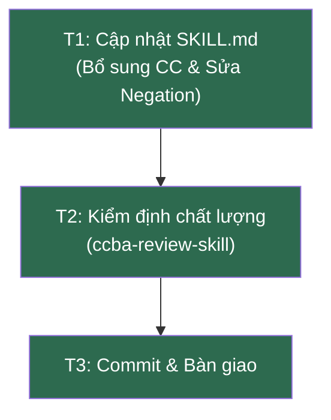

# Bản đồ Wayfinder: Cải tiến Kỹ năng `youtube-learn` theo kết quả Review

## Điểm đích (Destination)

Kỹ năng [youtube-learn/SKILL.md](file:///d:/GitHubProjects/ccba-agent-platform/.agents/skills/youtube-learn/SKILL.md) được cập nhật hoàn chỉnh, tích hợp đầy đủ các tiêu chí hoàn thành (Completion Criteria) cho từng Phase, chuyển dịch rào chắn phủ định (Negation) sang hướng tích cực, vượt qua kiểm định chất lượng của `/ccba-review-skill`.

## Ghi chú (Notes)

- Kỹ năng bổ trợ cần nạp: `/ccba-review-skill` (kiểm định chất lượng cuối cùng).
- File cần sửa đổi: `.agents/skills/youtube-learn/SKILL.md`.

---

## Tickets

### T1: Bổ sung Completion Criteria và sửa lỗi Negation [AFK / Task]

- **Câu hỏi:** Cập nhật các Phase trong `SKILL.md` để bổ sung tiêu chí hoàn thành riêng biệt và tích cực hóa rào chắn ở Phase 1?
- **Đầu ra:**
  - [x] Bổ sung `user-invocable: true` vào frontmatter.
  - [x] Bổ sung `Tiêu chí hoàn thành:` định lượng cho Phase 1, Phase 2, Phase 3, Phase 4.
  - [x] Sửa đổi rào chắn API Key ở Phase 1 để hướng dẫn in thông báo lỗi và thoát an toàn thay vì ghi "dừng ngay lập tức".
- **File:** [SKILL.md](file:///d:/GitHubProjects/ccba-agent-platform/.agents/skills/youtube-learn/SKILL.md)
- **Trạng thái:** ✅ Hoàn tất
- **Blocked by:** Không

---

### T2: Kiểm định chất lượng qua `/ccba-review-skill` [HITL / Grilling]

- **Câu hỏi:** File sau khi chỉnh sửa có hoàn toàn PASS kiểm định chất lượng viết skill không?
- **Đầu ra:**
  - [x] Báo cáo kiểm định PASS từ `/ccba-review-skill`.
- **Trạng thái:** ✅ Hoàn tất
- **Blocked by:** Không

---

### T3: Commit & Bàn giao thay đổi [AFK / Task]

- **Câu hỏi:** Đóng gói thay đổi và commit theo quy chuẩn Git?
- **Đầu ra:**
  - [x] Commit với message: `refactor(youtube-learn): add completion criteria and fix negation from review`
  - [x] Đẩy (push) thay đổi lên remote.
- **Trạng thái:** ✅ Hoàn tất
- **Blocked by:** Không

---

## Sơ đồ Dependency

> ✅ **Tất cả các ticket đã được hoàn tất.**

---

## Quyết định đã chốt (Decisions so far)

- **QĐ1 (T1):** Bổ sung thuộc tính `user-invocable: true` vào frontmatter của skill `youtube-learn`, hoàn thiện các tiêu chí hoàn thành (`Completion Criteria`) định lượng cho cả 4 Phase và điều chỉnh rào chắn Whisper STT từ phủ định cứng nhắc sang hướng tích cực. (Xem commit `14ca2ed`).
- **QĐ2 (T2):** Kiểm định chất lượng qua `/ccba-review-skill` và `validate_docs.py` cho kết quả PASS (không phát hiện lỗi).
- **QĐ3 (T3):** Đóng gói và push thành công các thay đổi lên remote branch `main`.

## Chưa xác định rõ (Not yet specified)

- Không có. Lộ trình cải tiến kỹ năng này cực kỳ rõ ràng và ngắn gọn.

## Ngoài phạm vi (Out of scope)

- Chỉnh sửa logic Python thực tế của package `ccba-youtube-learn` (chỉ tập trung tối ưu hóa tài liệu kỹ năng `SKILL.md`).
- Thay đổi workflow wrapper `ccba-youtube-learn.md` (vì wrapper đã tuân thủ chuẩn mỏng).

---
*Tạo bởi CCBA Wayfinder — 2026-07-20*
