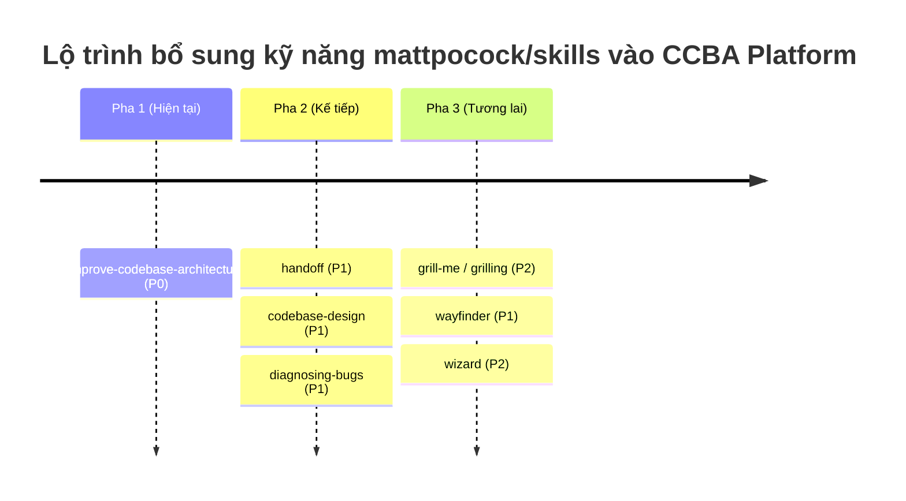

# 📋 Báo Cáo Nghiên Cứu và Đánh Giá Chuyển Dịch (Upstream Porting Recommendations)

*Tài liệu nghiên cứu so sánh và đánh giá toàn diện việc chuyển dịch (porting) các kỹ năng từ kho chứa `mattpocock/skills` vào hệ thống CCBA Agent Platform.*

---

## 1. Tổng Quan Nghiên Cứu (Recon Summary)

Kho chứa `mattpocock/skills` cung cấp các kỹ năng (Skills) và quy trình (Workflows) mẫu được thiết kế tối ưu cho AI Agent (đặc biệt là Claude Code). Triết lý cốt lõi của các kỹ năng này là **"A Philosophy of Software Design"** (John Ousterhout), tập trung vào việc hướng dẫn Agent thiết kế các module sâu (deep modules), giảm thiểu phình to ngữ cảnh (context bloating), và tương tác chặt chẽ với người dùng qua cơ chế phỏng vấn liên tục (grilling).

Qua trinh sát cấu trúc dự án nguồn, chúng tôi phân loại thành các nhóm kỹ năng chính phù hợp với CCBA Agent Platform và tiến hành đánh giá toàn diện để chuẩn bị sẵn sàng cho việc bổ sung trong tương lai.

---

## 2. Đánh Giá Toàn Diện Các Nhóm Kỹ Năng (Comprehensive Skills Evaluation)

### Lớp 1: Engineering Skills (Kỹ năng Lập trình & Kiến trúc)
Tập trung vào phát triển, kiểm thử, rà soát và cấu trúc codebase.

| Tên Kỹ Năng | Mô Tả & Mục Tiêu | Đánh Giá Độ Hữu Dụng Với CCBA | Đề Xuất Porting |
| :--- | :--- | :--- | :---: |
| `improve-codebase-architecture` | Quét codebase tìm "module nông", xuất báo cáo HTML visual (Mermaid + Tailwind) và thảo luận cải tiến với user. | **Cực kỳ hữu ích (P0).** Hỗ trợ đắc lực cho Agent khi refactor platform hoặc các ứng dụng Spoke của khách hàng. | **PORT (Pha 1)** |
| `codebase-design` | Hướng dẫn Agent thiết kế các module sâu, xác định seam (mối nối), adapter và đảm bảo locality. | **Hữu ích (P1).** Làm cẩm nang kiến trúc phần mềm cho Agent khi thiết kế chức năng mới. | **PORT (Pha 2)** |
| `diagnosing-bugs` | Vòng lặp chẩn đoán lỗi sâu và regression cho các bug khó. | **Hữu ích (P1).** Có thể tích hợp trực tiếp để nâng cấp hệ thống `mock_debugger.py` hiện có. | **PORT (Pha 2)** |
| `domain-modeling` | Xây dựng và duy trì Domain Model và Ubiquitous Language trong `CONTEXT.md` và ADRs. | **Hữu ích (P2).** Giúp Agent bám sát ngôn ngữ nghiệp vụ của dự án xây dựng/BIM. | **PORT (Pha 3)** |
| `resolving-merge-conflicts` | Hướng dẫn Agent giải quyết xung đột Git merge/rebase một cách an toàn. | **Hữu ích (P2).** Rất cần thiết cho các Agent daemon tự động chạy CI/CD hoặc đồng bộ code. | **RESERVE** |
| `tdd` | Quy trình Test-Driven Development (Red-Green-Refactor). | **Trung bình (P2).** Thích hợp khi Agent viết các tính năng/scripts phức tạp cần bảo đảm kiểm thử. | **RESERVE** |
| `to-issues` / `to-prd` | Chuyển đổi cuộc hội thoại thành Issue/PRD trên Issue Tracker. | **Thấp (P3).** Quy trình lập kế hoạch (`implementation_plan.md`) hiện tại của CCBA đã làm tốt việc này. | **IGNORE** |
| `triage` | Điều phối Issues/PRs qua bộ lọc phân loại và viết brief cho Agent. | **Thấp (P3).** Phù hợp với các dự án mã nguồn mở quy mô lớn, chưa cần cho CCBA. | **IGNORE** |
| `ask-matt` | Router điều hướng người dùng đến skill phù hợp trong repo. | **Không cần thiết.** CCBA đã có `platform-loader` tự động điều phối các workflow. | **IGNORE** |

---

### Lớp 2: Productivity Skills (Kỹ năng Giao tiếp & Hiệu suất)
Tập trung tối ưu hóa giao tiếp Agent-User và quản lý trạng thái phiên làm việc.

| Tên Kỹ Năng | Mô Tả & Mục Tiêu | Đánh Giá Độ Hữu Dụng Với CCBA | Đề Xuất Porting |
| :--- | :--- | :--- | :---: |
| `handoff` | Đóng gói phiên làm việc thành tài liệu handoff nhỏ gọn để chuyển tiếp cho Agent tiếp theo. | **Cực kỳ hữu ích (P1).** Giúp tiết kiệm token và tăng tốc độ xử lý khi chuyển giao context. | **PORT (Pha 2)** |
| `grill-me` / `grilling` | Phỏng vấn người dùng một cách dồn dập (từng câu một) để stress-test kế hoạch thiết kế. | **Hữu ích (P2).** Tăng chất lượng alignment giữa Agent và Kỹ sư trước khi viết code lớn. | **PORT (Pha 3)** |
| `teach` | Hướng dẫn người dùng học một khái niệm hoặc kỹ năng mới trong workspace. | **Thấp (P3).** Ít ứng dụng thực tế trong môi trường sản xuất của CCBA. | **IGNORE** |
| `writing-great-skills` | Cẩm nang viết các file `SKILL.md` hiệu quả và dễ đoán. | **Hữu ích (P2).** Làm tài liệu tham khảo cho kỹ sư khi muốn đóng gói Skill mới lên Hub. | **RESERVE** |

---

### Lớp 3: In-Progress & Misc Skills (Kỹ năng Đang Phát triển & Tiện ích Khác)

| Tên Kỹ Năng | Mô Tả & Mục Tiêu | Đánh Giá Độ Hữu Dụng Với CCBA | Đề Xuất Porting |
| :--- | :--- | :--- | :---: |
| `wayfinder` | Vạch đường qua các bài toán mù mờ, chia nhỏ thành các điều tra con và giải quyết dần. | **Rất triển vọng (P1).** Giúp Agent giải quyết các yêu cầu nghiên cứu lớn/mơ hồ của người dùng. | **PORT (Pha 3)** |
| `wizard` | Tạo script wizard tương tác chạy bash để dẫn dắt con người thiết lập môi trường, điền `.env`... | **Hữu ích (P2).** Cực tốt cho việc viết script bootstrap dự án Spoke hoặc bàn giao cài đặt. | **PORT (Pha 3)** |
| `git-guardrails-claude-code` | Cài đặt hooks chặn các lệnh git nguy hiểm (push, reset --hard, clean) trước khi chạy. | **Hữu ích (P2).** Giúp bảo vệ an toàn cho Agent khi chạy lệnh git tự động trong workspace của user. | **RESERVE** |
| `writing-beats` / `writing-shape` | Kỹ năng viết bài báo, cấu trúc đoạn văn, bài luận theo hành trình. | **Thấp (P3).** CCBA đã có skill `long-form-writer` mạnh mẽ cho tài liệu kỹ thuật/VBPL. | **IGNORE** |
| `migrate-to-shoehorn` | Tool di chuyển test file sang TypeScript shoehorn. | **Không áp dụng.** Chỉ dùng cho stack TypeScript chuyên biệt của tác giả Matt Pocock. | **IGNORE** |
| `scaffold-exercises` | Tạo cấu trúc bài tập cho các khóa học của Total TypeScript. | **Không áp dụng.** Chỉ phục vụ mục đích dạy học của tác giả. | **IGNORE** |
| `setup-pre-commit` | Cài đặt Husky pre-commit hooks + linting trong repo. | **EXISTS.** CCBA đã có sẵn cấu hình pre-commit chuẩn trong repo gốc. | **IGNORE** |

---

### Lớp 4: Deprecated & Personal Skills (Kỹ năng Đã lỗi thời & Cá nhân)

*   `design-an-interface` (Deprecated): Thay thế bởi `codebase-design`. (**IGNORE**)
*   `ubiquitous-language` (Deprecated): Thay thế bởi `domain-modeling`. (**IGNORE**)
*   `qa` & `request-refactor-plan` (Deprecated): Thay thế bởi các quy trình triage/implement mới. (**IGNORE**)
*   `obsidian-vault`: Quản lý ghi chú cá nhân bằng Obsidian. Không thuộc phạm vi CCBA Platform. (**IGNORE**)
*   `edit-article`: Chỉnh sửa bài viết cá nhân. (**IGNORE**)

---

## 3. Câu Hỏi Phản Biện Cốt Lõi Khi Tích Hợp Hệ Thống (Challenge Framework)

Để đảm bảo việc chuyển dịch không gây rủi ro phá vỡ hệ thống hiện tại, chúng tôi thiết lập 5 câu hỏi phản biện dưới đây:

### Q1: Việc xuất báo cáo kiến trúc bằng HTML tự mở (`improve-codebase-architecture`) có tương thích tốt trên Windows?
*   **Cách của nguồn:** Chạy lệnh `start <path>` trên Windows để mở file HTML tạm từ thư mục temp.
*   **Cách của CCBA:** Chúng tôi chạy trên môi trường Windows (PowerShell) của kỹ sư. Việc tạo và mở HTML cục bộ hoàn toàn tương thích và không yêu cầu quyền admin đặc biệt. Tuy nhiên, đường dẫn lưu file cần được cấu hình vào thư mục `.md/scratch/` để dễ quản lý.
*   **Rủi ro/Đánh đổi:** Agent cần xin quyền thực thi lệnh mở trình duyệt. Rủi ro ở mức tối thiểu.

### Q2: Cơ chế lưu trữ tài liệu của `handoff` nên đặt ở đâu để tối ưu?
*   **Cách của nguồn:** Lưu vào thư mục tạm của OS (`$TMPDIR`) để tránh làm bẩn workspace git.
*   **Cách của CCBA:** Hiến pháp CCBA quy định mọi thành phẩm tri thức phải được tập trung và truy vết tại thư mục `.md/` của dự án.
*   **Đề xuất thích ứng:** Sẽ chuyển hướng lưu trữ file handoff về `.md/scratch/handoffs/` và cấu hình `.gitignore` cục bộ bỏ qua thư mục này để vừa không làm bẩn git, vừa giữ tri thức trong tầm kiểm soát của workspace.

### Q3: Việc spawn parallel sub-agents để review code (`code-review`) có làm tăng chi phí API?
*   **Cách của nguồn:** Gọi sub-agent song song để phân tích Standards và Spec riêng biệt nhằm tránh ô nhiễm context.
*   **Cách của CCBA:** Hiện tại QC pipeline chạy tuần tự để tiết kiệm chi phí gọi mô hình qua AI Gateway (LiteLLM Spark).
*   **Đánh giá:** Việc chạy song song chỉ nên áp dụng khi rà soát các pull request lớn hoặc phức tạp. Đối với công việc hằng ngày, quy trình QC tuần tự hiện tại của CCBA là tối ưu hơn về chi phí và tài nguyên.

### Q4: Việc áp dụng thuật ngữ `codebase-design` của Matt Pocock có làm xung đột thuật ngữ BIGBIM?
*   **Đánh giá:** Không xung đột. Các thuật ngữ của Matt Pocock chỉ áp dụng cho mã nguồn phần mềm (như interfaces, seams, adapters), còn các thuật ngữ BIGBIM (Sợi Chỉ Vàng, Sợi Chỉ Đỏ, Unique ID) áp dụng cho luồng thông tin mô hình công trình và hồ sơ pháp lý. Việc phân tách rõ ràng giúp Agent duy trì tính nhất quán.

### Q5: Quy trình phỏng vấn liên tục (`grilling loop`) có làm giảm hiệu suất làm việc nhanh?
*   **Rủi ro:** Khi cần sửa đổi nhanh các lỗi cú pháp hoặc tinh chỉnh nhỏ, việc Agent liên tục hỏi xoáy đáp xoay sẽ gây phiền toái cho kỹ sư.
*   **Giải pháp thích ứng:** Khi port skill này, bắt buộc giữ nguyên tham số `--fast` hoặc `--auto` để bỏ qua cổng phỏng vấn khi người dùng muốn thực thi nhanh.

---

## 4. Kế Hoạch Lộ Trình Triển Khai (Roadmap)

---
*Tạo bởi CCBA — Trung tâm Tư vấn và Ứng dụng BIM trong Xây dựng*
*Nội dung này được tạo bởi AI Agent và cần được xem xét bởi chuyên gia pháp lý và kỹ thuật trước khi áp dụng.*
