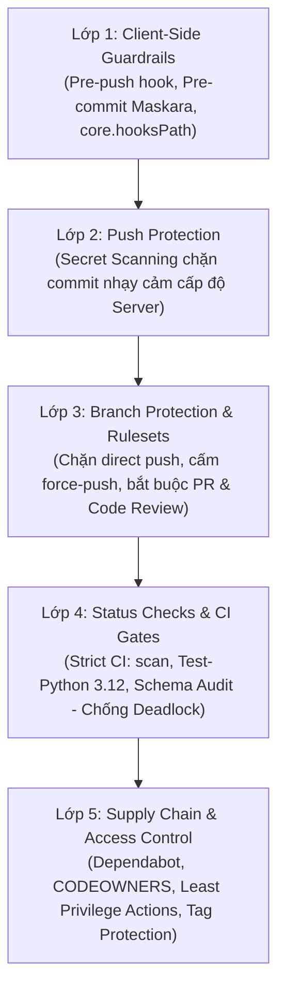

# Kế hoạch Triển khai: Hướng dẫn Setup Bảo vệ Repo trên GitHub

> **Mã quy chuẩn SOP:** `CCBA-SOP-SEC-001` (Rev 1.0 - 2026)  
> **Tài liệu tham chiếu:** ADR 0047, ADR 0058, Guardrail 12 & 13 (`docs/rules/execution_guardrails.md`), The Factory Model  
> **Nhánh thực hiện:** `docs/github-repo-protection-guide`  
> **Mục tiêu:** Xây dựng tài liệu Chuẩn Quy trình Tác nghiệp (SOP) chi tiết, chuẩn hóa cách thiết lập hệ thống bảo vệ toàn diện (Defense-in-Depth) cho Repository trên GitHub trong hệ sinh thái CCBA Platform (Hub) và các phân vùng Spoke.

---

## 1. Bối cảnh & Mục tiêu (Context & Objectives)

Trong quy trình phát triển phần mềm và cộng tác đa tác nhân (Multi-Agent & Multi-Client), một repository không được cấu hình bảo vệ đúng cách có nguy cơ:
- Trực tiếp push code lỗi, thiếu linter hoặc chưa kiểm định vào nhánh `main`.
- Rò rỉ các secrets/API keys nhạy cảm (LiteLLM token, Telegram bot token, OpenAI keys, Cloud credentials).
- Xóa nhầm nhánh chính hoặc force-push ghi đè lịch sử Git commit.
- Bỏ qua các cổng kiểm thử tự động (CI / automated test gates).
- Kẹt deadlock trong PR do cấu hình status check phụ thuộc path filtering.

**Mục tiêu bàn giao:**
1. Tạo tài liệu SOP chi tiết: [`docs/sop/github_repo_protection_guide.md`](../../../../docs/sop/github_repo_protection_guide.md).
2. Cập nhật liên kết tham chiếu tại [`docs/rules/git_conventions.md`](../../../../docs/rules/git_conventions.md) và [`README.md`](../../../../README.md).
3. Đảm bảo 100% tuân thủ Deterministic Hard Completion Lock (ADR-0058) qua `ccba-harness verify-patch` và `validate_docs.py`.

---

## 1.1. CCBA Charter Governance & QC Matrix (ADR-0058 Alignment)

| Thuộc tính | Giá trị quy chuẩn |
| :--- | :--- |
| **Không gian làm việc (Workspace)** | Hub Monorepo (`ccba-agent-platform`) |
| **Ghế chịu trách nhiệm (Seat Role)** | TRUONG_PHONG_RD_HTQT / CHU_TRI_BO_MON |
| **Cấp độ thẩm duyệt (QC Level)** | `QC Level 2` (Technical & Documentation Architecture Review) |
| **Quy chuẩn mã hóa SOP** | `CCBA-SOP-SEC-001` (Rev 1.0 - 2026) |
| **Mô hình thực thi** | The Factory Model (Step 6 Planning $\rightarrow$ Step 7 Route `/ccba-implement`) |

---

## 2. Đánh giá Khả năng Tái Sử Dụng (Reuse Assessment — ADR 0047)

- **Tra cứu `catalog.yaml` & Codebase**:
  - `ccba-git-guardrails` (`.agents/skills/ccba-git-guardrails/SKILL.md`): Cung cấp rào chắn cục bộ ngăn ngừa các lệnh Git nguy hiểm trên terminal máy trạm (`--force`, `reset --hard`, `clean -fd`).
  - `ccba-maskara` (`.agents/skills/ccba-maskara/SKILL.md`): Quét và che giấu secrets trong logs/files.
  - `.github/workflows/security_scan.yml`: Workflow chạy Maskara scan trên mọi PR (Job context: `scan`).
  - `.github/workflows/ci.yml`: Workflow chạy test matrix Python 3.10-3.12 và Schema Audit.
  - `.git/hooks/pre-push`: Hook cục bộ có sẵn tại Hub đọc `stdin` theo vòng lặp chuẩn.
  - `docs/rules/git_conventions.md`: Đã có quy chuẩn đặt tên branch và commit conventions.
  - `docs/rules/execution_guardrails.md`: Đã có quy chuẩn Multi-Client Peer Claim Lock và `--force-with-lease`.
- **Đánh giá & Quyết định**:
  - Tận dụng triệt để các quy chuẩn và workflows sẵn có tại Hub.
  - Không tạo thêm tool trùng lặp; tài liệu sẽ đóng vai trò cẩm nang tích hợp cả cấu hình Web UI GitHub, GitHub Actions và rào chắn phía Client (Git Hooks).

---

## 3. Kiến trúc Nội dung Tài liệu SOP (`docs/sop/github_repo_protection_guide.md`)

Tài liệu được thiết kế theo mô hình phòng thủ 5 lớp (**5-Layer Defense-in-Depth**):

### Nội dung chi tiết các phần:

1. **Mục Đích & Nguyên Tắc Bảo Vệ (Philosophy):**
   - Triết lý Zero-Trust đối với nhánh chính (`main`).
   - Phân biệt giữa Client-side guardrails (phía máy trạm) và Server-side enforcement (phía GitHub).

2. **Cấu hình GitHub Rulesets (Khuyến nghị chuẩn hiện đại thay thế Classic Rules):**
   - Tạo Ruleset: Name `Protect Main Branch`, Enforcement: **Active**.
   - Target branches: `Include default branch` (`main`).
   - **Quy tắc cốt lõi:**
     - *Restrict deletions*: Bật (ngăn xóa nhánh `main`).
     - *Block force pushes*: Bật (chặn 100% force push lên `main` từ server-side; phân biệt với `--force-with-lease` trên feature branch).
     - *Require a pull request before merging*:
       - Required approvals: $\ge 1$.
       - Dismiss stale pull request approvals when new commits are pushed: Bật.
       - Require review from Code Owners: Bật (kèm hướng dẫn tạo `.github/CODEOWNERS`).
       - Require conversation resolution before merging: Bật.
     - *Require linear history*: Bật (chỉ cho phép Squash hoặc Rebase merge, giữ Git graph gọn gàng).
     - *Do not allow bypassing the above settings*: Bật (áp dụng cho cả Administrators/Owners để chống lỡ tay).

3. **Cấu hình Required Status Checks & Bẫy Deadlock Path Filtering:**
   - **Danh sách Checks bắt buộc chuẩn hóa cho Hub/Spoke:**
     - `scan` (từ `.github/workflows/security_scan.yml` - Maskara Security & Privacy Scan).
     - `Test - Python 3.12` (từ `.github/workflows/ci.yml`).
     - `Deterministic Parity & Schema Audit` (từ `.github/workflows/ci.yml`).
   - **Cảnh báo Bẫy Treo PR (Deadlock Trap):** Tuyệt đối KHÔNG cấu hình các job có bộ lọc `paths:` (như `validate` trong `validate-docs.yml`) làm Required Status Check cố định nếu không có generic fallback, vì PR sửa file ngoài danh sách `paths:` sẽ không trigger job, khiến GitHub treo vĩnh viễn ở trạng thái *"Expected — Waiting for status to be reported"*.

4. **Bật Bảo vệ Bí mật (Secret Scanning & Push Protection):**
   - Đường dẫn: Repo Settings $\rightarrow$ Code security and analysis.
   - Bật *Secret scanning*: Quét tự động phát hiện API keys bị lộ trong lịch sử commit.
   - Bật *Secret scanning Push protection*: Chặn ngay lập tức lệnh `git push` nếu phát hiện pattern API keys/tokens (LiteLLM, Telegram, GitHub PAT, OpenAI, AWS/GCP).

5. **Supply Chain Security & Lỗ Hổng Phụ Thuộc:**
   - Kích hoạt *Dependabot alerts* và *Dependabot security updates*.
   - Khai báo mẫu file `.github/dependabot.yml` cho Python (pip/uv) và GitHub Actions.

6. **Phân Quyền Truy Cập Tối Thiểu (Least Privilege) & An Toàn GitHub Actions:**
   - Cấu hình *Workflow permissions* (Settings $\rightarrow$ Actions $\rightarrow$ General): Chọn `Read repository contents and packages permissions`.
   - Tắt cờ `Allow GitHub Actions to create and approve pull requests` (trừ khi có workflow chuyên dụng được cấp quyền trong YAML).
   - Cấu hình *Fork pull request workflows*: Chọn `Require approval for first-time contributors` để ngăn mã khai thác chạy ngầm từ fork PR.

7. **Bảo Vệ Release & Tags (Tag Protection Rules):**
   - Thiết lập Tag rule cho mẫu `v*`: Chỉ cho phép Admin hoặc release CI workflow tạo/xóa tag release.

8. **Rào Chắn Phía Client (Client-Side Git Guardrails):**
   - Đóng gói thư mục version-controlled `.githooks/` chứa **cả 2 hooks**:
     1. `.githooks/pre-commit`: Chạy `python -m ccba_maskara.cli scan` (chặn commit lộ secret).
     2. `.githooks/pre-push`: Đọc `stdin` theo vòng lặp kiểm tra `refs/heads/main` (chặn lệnh push trực tiếp lên `main` và xóa `main`).
   - Hướng dẫn kích hoạt: `git config core.hooksPath .githooks`.
   - Lưu ý tính tương thích đa nền tảng: Cưỡng chế `eol=lf` và `chmod +x` cho các file hook.

9. **Mẫu Cấu Hình File Sẵn Dùng (Ready-to-Use Templates):**
   - Template `.github/CODEOWNERS` (ánh xạ theo 11 ghế Hiến chương CCBA).
   - Template `.githooks/pre-push` và `.githooks/pre-commit`.
   - Template `.github/dependabot.yml`.

10. **Checklist Nghiệm Thu 10 Điểm & Xử Lý Sự Cố (Troubleshooting):**
    - Bảng checklist 10 điểm để maintainer tự đánh giá mức độ an toàn của repo.
    - Hướng dẫn xử lý khi bị Push Protection chặn (cách gỡ commit, revoke token bị lộ).
    - Hướng dẫn xử lý khi gặp PR status check deadlock.

---

## 4. Các Giai đoạn Thực hiện (Phased Execution)

### Giai đoạn 1: Chuẩn bị & Xác nhận Nhánh Làm Việc
- Kiểm tra working tree và xác nhận đang ở nhánh `docs/github-repo-protection-guide`.

### Giai đoạn 2: Biên soạn Tài liệu SOP Hoàn Chỉnh
- Tạo file [`docs/sop/github_repo_protection_guide.md`](../../../../docs/sop/github_repo_protection_guide.md) tuân thủ Golden Layout của SOP CCBA (`CCBA-SOP-SEC-001`).

### Giai đoạn 3: Tích hợp Liên kết & Kiểm định Tự động
- Cập nhật liên kết tham chiếu từ [`docs/rules/git_conventions.md`](../../../../docs/rules/git_conventions.md) và [`README.md`](../../../../README.md).
- Thực thi toàn bộ các cổng kiểm định tự động (Deterministic Hard Completion Lock).
- Lưu bản sao snapshot vào `.md/knowledge/reports/2026-09-github-repo-protection-guide/` theo ADR-0058.

---

## 5. Scoped Verification Plan

| Cổng kiểm định | Lệnh thực thi | Tiêu chí đạt |
| :--- | :--- | :--- |
| **Doc Byte Size & Headings** | `python -m ccba_harness verify-patch --preset doc --target docs/sop/github_repo_protection_guide.md --min-bytes 3000 --required-headings "Mục Đích,GitHub Rulesets,Secret Scanning,Client-Side Git Guardrails,Checklist Nghiệm Thu"` | Exit code 0, PASS |
| **Doc Reference & Link Parity** | `python scripts/validate_docs.py . --src scripts,packages --changed` | Exit code 0, không có broken link |
| **Git Conventions Cross-Link** | `python -m ccba_harness verify-patch --preset doc --target docs/rules/git_conventions.md` | Exit code 0, PASS |
| **Working Tree Cleanliness** | `git status --short` | Chỉ thay đổi đúng 3 files trong phạm vi |
| **Snapshot Mirroring (ADR-0058)** | Lưu bản sao snapshot vào `.md/knowledge/reports/2026-09-github-repo-protection-guide/` | Đầy đủ `implementation_plan.md` & `walkthrough.md` |
