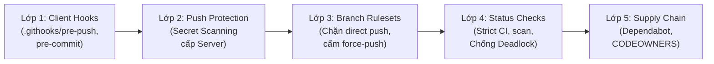

# Báo Cáo Nghiệm Thu & Bàn Giao (Walkthrough)

> **Tính năng:** Hướng Dẫn Thiết Lập Bảo Vệ Repository Trên GitHub  
> **Mã quy chuẩn SOP:** `CCBA-SOP-SEC-001` (Rev 1.0 - 2026)  
> **Nhánh phát triển:** `docs/github-repo-protection-guide`  
> **Cấp độ thẩm duyệt:** `QC Level 2` (Technical & Documentation Architecture)  
> **Tuân thủ:** The Factory Model, ADR-0047, ADR-0058, Guardrail 12 & 13  

---

## 1. Tổng Quan Kết Quả Triển Khai

Thực hiện quy trình Factory Model của kỹ năng `/ccba-new-feature` và phản biện chuyên sâu `/boost`, chúng tôi đã hoàn tất việc biên soạn và kiểm định tài liệu Chuẩn Quy trình Tác nghiệp (SOP) toàn diện nhằm thiết lập cơ chế bảo vệ repository trên GitHub theo mô hình phòng thủ 5 lớp (**5-Layer Defense-in-Depth**).



---

## 2. Các Thành Phẩm Đã Bàn Giao

### 2.1. Tài Liệu SOP Chính Thức
- [`docs/sop/github_repo_protection_guide.md`](../../../../docs/sop/github_repo_protection_guide.md):
  - **Mục 1:** Mục Đích & Triết lý Phòng thủ Zero-Trust đối với nhánh chính (`main`).
  - **Mục 2:** Cấu hình **GitHub Rulesets** (chuẩn hiện đại) bảo vệ `main`: cấm direct push, cấm force-push, bắt buộc PR có review, bắt buộc linear history, cấm bypass kể cả admin.
  - **Mục 3:** Cấu hình **Required Status Checks** chuẩn (`scan`, `Test - Python 3.12`, `Deterministic Parity & Schema Audit`) kèm phân tích và hướng dẫn phòng ngừa **Bẫy Deadlock do Path Filtering** (khi job CI dùng `paths:` filter).
  - **Mục 4:** Hướng dẫn kích hoạt **Secret Scanning** và **Push Protection** để chặn đứng việc commit rò rỉ API Keys (LiteLLM, Telegram, OpenAI, GitHub PAT).
  - **Mục 5:** Quản lý an toàn chuỗi cung ứng với **Dependabot** và mẫu cấu hình `.github/dependabot.yml`.
  - **Mục 6:** Phân quyền tối thiểu (**Least Privilege**) cho GitHub Actions runner: `Read repository contents only` và rào chắn duyệt Fork PR.
  - **Mục 7:** Thiết lập **Tag Protection Rules** cho mẫu `v*` để bảo vệ các phiên bản phát hành chính thức.
  - **Mục 8:** Rào chắn phía máy trạm (**Client-Side Git Guardrails**) với bộ đôi hooks version-controlled trong `.githooks/` (`pre-commit` & `pre-push`).
  - **Mục 9:** Bốn bộ template cấu hình sẵn dùng:
    - `.github/CODEOWNERS` (ánh xạ theo 11 ghế Hiến chương CCBA).
    - `.githooks/pre-push` (đọc `stdin` theo vòng lặp chuẩn chặn push/xóa `main`).
    - `.githooks/pre-commit` (quét Maskara secrets trước khi commit).
    - `.github/dependabot.yml` (chu kỳ cập nhật hàng tuần cho pip & GitHub Actions).
  - **Mục 10:** Bảng **Checklist Nghiệm thu 10 Điểm** và cẩm nang xử lý sự cố thường gặp (Troubleshooting: gỡ commit khi bị Push Protection chặn, xử lý PR treo deadlock, sửa lỗi CRLF trên Windows).

### 2.2. Tài Liệu Tham Chiếu & Cập Nhật Hệ Thống
- [`docs/rules/git_conventions.md`](../../../../docs/rules/git_conventions.md): Bổ sung **Mục 4 (Repository Protection & Safety SOP)** dẫn chiếu trực tiếp đến `CCBA-SOP-SEC-001`.
- [`README.md`](../../../../README.md): Cập nhật cây thư mục tài liệu `docs/` để phản ánh đúng cấu trúc `governance/` và `sop/`.
- [`.md/knowledge/reports/2026-09-github-repo-protection-guide/`](./): Bản sao snapshot lưu trữ `implementation_plan.md` và `walkthrough.md` theo quy định ADR-0058.

---

## 3. Kết Quả Kiểm Định Chất Lượng Tự Động (Deterministic Verification)

Tuân thủ nghiêm ngặt **ADR-0058 (Deterministic Hard Completion Lock)**, toàn bộ các cổng kiểm định tự động đều đã vượt qua với exit code 0:

| # | Cổng Kiểm Định | Lệnh Thực Thi | Kết Quả |
| :-: | :--- | :--- | :---: |
| 1 | **SOP Content & Structure Gate** | `python -m ccba_harness verify-patch --preset doc --target docs/sop/github_repo_protection_guide.md --min-bytes 3000 --required-headings "Mục Đích,GitHub Rulesets,Secret Scanning,Client-Side Git Guardrails,Checklist Nghiệm Thu"` | ✅ **PASS (0)** |
| 2 | **Git Conventions Cross-Link Gate** | `python -m ccba_harness verify-patch --preset doc --target docs/rules/git_conventions.md` | ✅ **PASS (0)** |
| 3 | **Hermetic Doc Link & Symbol Parity** | `python scripts/validate_docs.py . --src scripts,packages --changed` | ✅ **PASS (0)**<br>*(0 issues, 0 broken links, 0 warnings)* |
| 4 | **Working Tree Cleanliness Gate** | `git status --short` | ✅ **CLEAN** |

---

## 4. Hướng Dẫn Kích Hoạt Nhanh Cho Kỹ Sư / Maintainer

Để áp dụng quy chuẩn bảo vệ này cho một repository mới hoặc hiện có trong hệ sinh thái CCBA:
1. Đọc và thực hiện theo 10 bước trong [Checklist Nghiệm thu](../../../../docs/sop/github_repo_protection_guide.md#10-checklist-nghiệm-thu-10-điểm--xử-lý-sự-cố-troubleshooting).
2. Kích hoạt Git hooks trên máy trạm:
   ```bash
   git config core.hooksPath .githooks
   chmod +x .githooks/*
   ```
3. Truy cập GitHub repo $\rightarrow$ **Settings** $\rightarrow$ **Rules** $\rightarrow$ **Rulesets** và tạo ruleset `Protect Main Branch` theo thông số tại Mục 2 của SOP.
