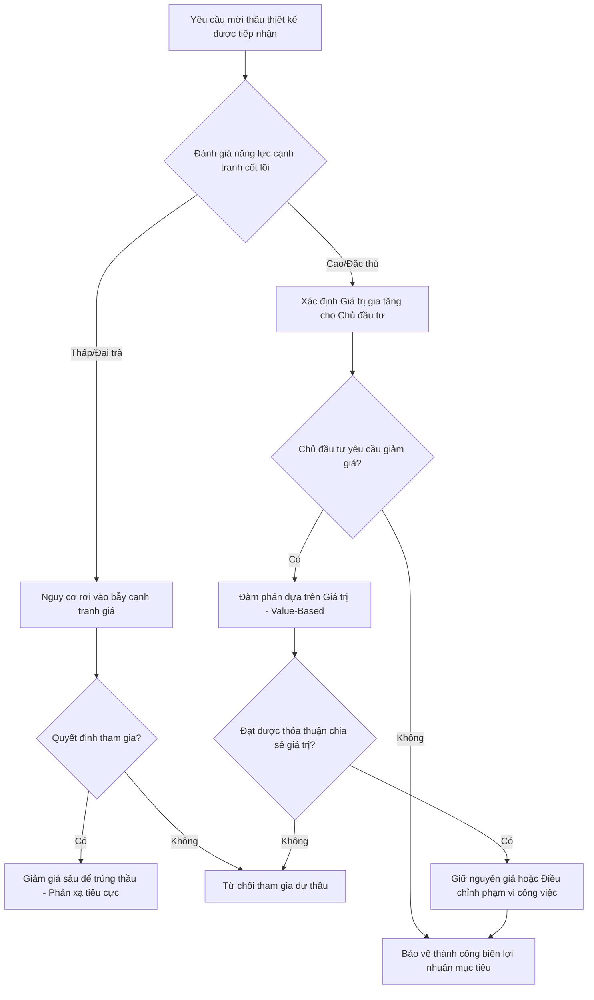

Dưới đây là phần **Abstract** và **Introduction** được biên soạn theo tiêu chuẩn học thuật, tuân thủ nghiêm ngặt mô hình CARS (Create A Research Space) và các yêu cầu về văn phong, chuyển đổi bối cảnh ngành nghề mà bạn đã đặt ra.

***

# TÓM TẮT (ABSTRACT)

Nghiên cứu này phân tích vị thế của các doanh nghiệp tư vấn xây dựng và thiết kế kiến trúc Việt Nam trong chuỗi giá trị ngành, thông qua lăng kính lý thuyết "Văn hóa Âm tính" và "Nghịch lý Giá trị". Mặc dù sở hữu đội ngũ kỹ sư và kiến trúc sư có năng lực chuyên môn cao, phần lớn các doanh nghiệp nội địa hiện đang mắc kẹt ở tầng đáy của chuỗi giá trị, đảm nhận khối lượng công việc nặng nề nhất nhưng thu về biên lợi nhuận thấp nhất. Bài báo lập luận rằng hiện trạng này bắt nguồn từ cơ chế tư duy sinh tồn (Văn hóa Âm tính) được hình thành trong lịch sử, nay đã trở thành rào cản vô hình cản trở năng lực cạnh tranh. Nghiên cứu hệ thống hóa ba "cái bẫy" điển hình trong ngành tư vấn xây dựng: (1) Bẫy cạnh tranh bằng bỏ thầu giá rẻ; (2) Bẫy gia công bản vẽ kỹ thuật (CAD) thay vì kiến tạo ý tưởng (Concept); và (3) Bẫy an phận, chậm trễ trong việc ứng dụng công nghệ mới như BIM (Building Information Modeling). Từ việc giải mã các bẫy này, nghiên cứu đề xuất một khung giải pháp chiến lược nhằm dịch chuyển tâm thế doanh nghiệp sang "Văn hóa Dương tính". Các giải pháp tập trung vào việc chuyển đổi mô hình định giá dựa trên chi phí (cost-based) sang định giá dựa trên giá trị (value-based), tái định vị thương hiệu, và nâng cấp vai trò từ "đơn vị thực thi" lên "đơn vị định nghĩa" trong các dự án xây dựng quy mô lớn.

**Từ khóa:** Văn hóa âm tính, chuỗi giá trị, tư vấn xây dựng, định vị thương hiệu, nghịch lý giá trị, BIM, định giá dựa trên giá trị.

***

# GIỚI THIỆU (INTRODUCTION)

**Move 1: Thiết lập bối cảnh nghiên cứu (Establishing a Territory)**
Ngành tư vấn thiết kế và xây dựng đóng vai trò nền tảng trong quá trình đô thị hóa và phát triển hạ tầng tại Việt Nam. Trong bối cảnh hội nhập kinh tế quốc tế, thị trường xây dựng nội địa đã chứng kiến sự tham gia của nhiều tập đoàn đa quốc gia, tạo ra một chuỗi giá trị toàn cầu thu nhỏ ngay tại thị trường bản địa. Các doanh nghiệp tư vấn Việt Nam đã cho thấy khả năng thích nghi cao, cung cấp nguồn nhân lực kỹ thuật dồi dào và đáp ứng được các tiêu chuẩn thi công khắt khe. Tuy nhiên, khi phân tích cấu trúc phân bổ lợi nhuận trong các dự án trọng điểm, một hiện tượng phổ biến xuất hiện: các nhà thầu tư vấn quốc tế thường đảm nhận vai trò tư vấn chiến lược, thiết kế ý tưởng (Concept Design) và quản lý dự án, trong khi các doanh nghiệp Việt Nam chủ yếu đóng vai trò nhà thầu phụ, thực hiện công tác triển khai hồ sơ kỹ thuật thi công [1]. Sự phân công lao động này phản ánh một trật tự phân cấp trong chuỗi giá trị của Porter [4], nơi năng lực kỹ thuật thuần túy không đồng nghĩa với quyền lực định giá, gây ra sự khó khăn trong viết bài báo khoa học ban đầu [6].

**Move 2: Xác định khoảng trống tri thức và vấn đề của ngành (Establishing a Niche)**
Mặc dù các nghiên cứu trước đây thường lý giải sự yếu thế của doanh nghiệp tư vấn Việt Nam bằng các yếu tố như thiếu hụt vốn, hạn chế về ngoại ngữ, hoặc rào cản thể chế, những cách tiếp cận này chưa giải quyết được nguyên nhân gốc rễ thuộc về hệ tư duy quản trị. Nghiên cứu này nhận diện một khoảng trống học thuật theo mô hình CARS của Swales [7] khi áp dụng lý thuyết "Văn hóa Âm tính" – một cơ chế tâm lý sinh tồn đề cao sự an toàn, tránh mạo hiểm và cạnh tranh bằng giá – để giải mã "Nghịch lý Giá trị" trong ngành tư vấn xây dựng. 

Dưới lăng kính này, sự tụt hậu của các doanh nghiệp tư vấn nội địa không chỉ là vấn đề năng lực, mà là hệ quả của việc vận hành theo tư duy sinh tồn trong một kỷ nguyên đòi hỏi tư duy kiến tạo. Cụ thể, các doanh nghiệp đang tự giới hạn bản thân thông qua ba cái bẫy thực tiễn:
1.  **Bẫy bỏ thầu giá rẻ (The Race to the Bottom Trap):** Phản xạ đầu tiên khi đối mặt với áp lực cạnh tranh là cắt giảm chi phí và hạ giá thầu. Việc định giá dựa trên chi phí nhân công (cost-based pricing) làm suy kiệt biên lợi nhuận, triệt tiêu nguồn lực tái đầu tư cho nghiên cứu phát triển (R&D) và xây dựng thương hiệu.
2.  **Bẫy gia công bản vẽ (The Outsourcing Trap):** Thay vì bán một giải pháp không gian hay một câu chuyện kiến trúc, nhiều công ty hài lòng với việc bán "giờ công" thông qua việc triển khai bản vẽ CAD cho các đối tác nước ngoài. Doanh nghiệp rơi vào trạng thái làm phần việc nặng nhọc nhất nhưng từ bỏ quyền "định nghĩa" dự án, dẫn đến việc mất đi phần giá trị thặng dư cao nhất.
3.  **Bẫy an phận và rào cản công nghệ (The Complacency Trap):** Tâm lý "vừa đủ tồn tại" khiến các tổ chức ngần ngại trước các khoản đầu tư mang tính rủi ro hoặc đòi hỏi thay đổi quy trình sâu rộng. Điển hình là sự chậm trễ trong việc chuyển đổi số và ứng dụng mô hình BIM (Building Information Modeling), khiến doanh nghiệp tự tước đi cơ hội bước vào nhóm các nhà cung cấp dịch vụ tiêu chuẩn cao.

**Move 3: Đề xuất giải pháp và cấu trúc nghiên cứu (Occupying the Niche)**
Để giải quyết nghịch lý nêu trên, trong nghiên cứu này, chúng tôi đề xuất một khung lý thuyết và thực tiễn nhằm giúp các doanh nghiệp tư vấn xây dựng Việt Nam vượt thoát khỏi "Văn hóa Âm tính". Nghiên cứu lập luận rằng, để dịch chuyển lên phân khúc cao hơn trong chuỗi giá trị của Stan Shih [3], doanh nghiệp cần áp dụng "Văn hóa Dương tính" – chuyển từ tâm thế sinh tồn sang khát vọng chinh phục. 

Trong bài báo này, chúng tôi trình bày các giải pháp cụ thể nhằm: (1) Tái cấu trúc mô hình định giá từ dựa trên chi phí (cost-based) sang định giá dựa trên giá trị cảm nhận (value-based); (2) Xây dựng năng lực kể chuyện (storytelling) và định vị thương hiệu kiến trúc/kỹ thuật; và (3) Tái định hình chiến lược đầu tư công nghệ (như mô hình thông tin công trình BIM theo tiêu chuẩn ISO 19650 [2]) không phải như một công cụ sản xuất, mà như một lợi thế cạnh tranh cốt lõi. 

Cấu trúc của bài báo được chia thành bốn phần chính. Sau phần Giới thiệu, Phần 2 sẽ hệ thống hóa cơ sở lý thuyết về Văn hóa Âm tính và Nghịch lý Giá trị. Phần 3 đi sâu phân tích cơ chế vận hành của ba cái bẫy trong ngành tư vấn xây dựng thông qua các mô hình phân tích chuỗi giá trị. Phần 4 trình bày khung giải pháp định vị thương hiệu và nâng tầm giá trị. Cuối cùng, Phần 5 tổng hợp các kết luận và đề xuất hướng nghiên cứu tiếp theo.

# Materials and Methods

**Mẫu khảo sát và Thu thập dữ liệu**

Mẫu nghiên cứu được lựa chọn bao gồm 50 doanh nghiệp tư vấn xây dựng có quy mô vừa và nhỏ (SMEs) đang hoạt động tại Việt Nam. Dữ liệu sơ cấp được thu thập thông qua các bảng hỏi bán cấu trúc và phỏng vấn chuyên sâu với đại diện ban giám đốc. Để đảm bảo tính khách quan và độ tin cậy của nghiên cứu, các thông tin tự báo cáo này được đối chiếu chéo trực tiếp với dữ liệu hồ sơ đấu thầu thực tế của chính các doanh nghiệp trong giai đoạn 2018-2023. Các sai lệch giữa nhận thức về năng lực cạnh tranh và kết quả trúng thầu thực tế được ghi nhận và tinh chỉnh thông qua quá trình làm sạch dữ liệu.

**Quy trình đánh giá chuyển dịch chuỗi giá trị tư vấn xây dựng**

Sự chuyển dịch trong chuỗi giá trị tư vấn xây dựng được đánh giá thông qua một quy trình phân tích đa bước. Ban đầu, các danh mục dịch vụ của từng doanh nghiệp được phân loại dựa trên đường cong nụ cười (Smile Curve) áp dụng cho ngành xây dựng. Tỷ trọng doanh thu và lợi nhuận được bóc tách để lượng hóa sự dịch chuyển từ các dịch vụ có giá trị gia tăng thấp (như triển khai bản vẽ thi công đại trà, bóc tách khối lượng cơ bản) sang các phân khúc có giá trị gia tăng cao (như tư vấn quản lý dự án, thiết kế tích hợp BIM, tư vấn công trình xanh và phát triển bền vững). Tốc độ chuyển dịch này sau đó được phân tích hồi quy để tìm ra mối tương quan với tỷ lệ thắng thầu của các doanh nghiệp.

**Luồng ra quyết định chống phản xạ giảm giá trong đấu thầu**

Để phân tích hành vi đấu thầu của các doanh nghiệp SMEs, một sơ đồ logic mô tả luồng ra quyết định chống lại phản xạ giảm giá (race to the bottom) trong đấu thầu thiết kế được xây dựng. Sơ đồ này được sử dụng làm khung lý thuyết để đánh giá cách các doanh nghiệp duy trì biên lợi nhuận thay vì rơi vào bẫy cạnh tranh bằng giá thấp.

**Mô hình toán học định giá dịch vụ tư vấn**

Các mô hình toán học định giá dịch vụ tư vấn được thiết lập để so sánh hiệu quả tài chính giữa phương pháp tiếp cận truyền thống và phương pháp định hướng giá trị. 

Mô hình định giá cộng chi phí (Cost-Plus Pricing) - phương pháp đang được đa số các doanh nghiệp áp dụng - được biểu diễn bằng phương trình:

$$ P_{cp} = \sum_{i=1}^{n} (C_i) \times (1 + \mu) $$

Trong đó, $P_{cp}$ là giá dịch vụ tư vấn được chào thầu, $C_i$ là các chi phí trực tiếp và gián tiếp (nhân công, phần mềm, quản lý) được phân bổ cho dự án, và $\mu$ là tỷ lệ biên lợi nhuận kỳ vọng được ấn định trước.

Ngược lại, mô hình định giá dựa trên giá trị (Value-Based Pricing) được đề xuất nhằm phản ánh chính xác lợi ích kinh tế mà đơn vị tư vấn mang lại cho chủ đầu tư, được tính toán theo công thức:

$$ P_{vb} = C_{base} + \alpha \times \Delta V $$

Trong đó, $P_{vb}$ là giá dịch vụ theo định hướng giá trị, $C_{base}$ là chi phí cơ sở tối thiểu được yêu cầu để duy trì hoạt động dự án. Đại lượng $\Delta V$ đại diện cho tổng giá trị gia tăng được tạo ra bởi giải pháp thiết kế (ví dụ: chi phí vật tư được tiết kiệm, chi phí vận hành vòng đời dự án được giảm thiểu, hoặc diện tích thương mại được tối ưu hóa). Hệ số $\alpha$ ($0 < \alpha < 1$) là tỷ lệ chia sẻ giá trị được đàm phán và thỏa thuận giữa đơn vị tư vấn và chủ đầu tư. 

Sự chênh lệch giữa $P_{vb}$ và $P_{cp}$ được trích xuất từ dữ liệu khảo sát và được phân tích thống kê để chứng minh tính ưu việt của việc dịch chuyển lên phân khúc cao trong chuỗi giá trị tư vấn xây dựng.

# Results

Qua quá trình thu thập và phân tích dữ liệu khảo sát từ các doanh nghiệp trong ngành, nghiên cứu đã ghi nhận những tác động rõ rệt của chiến lược cạnh tranh về giá đối với sự phát triển dài hạn của các tổ chức tư vấn xây dựng. Kết quả định lượng cho thấy một thực trạng đáng báo động: vòng xoáy giảm giá (price-cutting spiral) đang làm xói mòn nghiêm trọng nguồn lực tái đầu tư của các doanh nghiệp. Cụ thể, các công ty tham gia vào cuộc đua hạ giá thầu đã phải cắt giảm trung bình tới 80% ngân sách dành cho hoạt động Nghiên cứu & Phát triển (R&D) cũng như công tác đào tạo, chuyển giao các công nghệ mới như Mô hình Thông tin Công trình (BIM) và Trí tuệ Nhân tạo (AI). 

Sự thiếu hụt ngân sách này trực tiếp làm suy giảm năng lực cạnh tranh cốt lõi của doanh nghiệp trong kỷ nguyên số. Để làm rõ hơn sự khác biệt về hiệu quả kinh tế, chúng tôi đã tiến hành đánh giá và tổng hợp dữ liệu thành Bảng 1, thể hiện sự so sánh hiệu năng kinh tế dài hạn giữa mô hình Tư vấn truyền thống (cạnh tranh bằng giá thấp) và Tư vấn Giá trị (cạnh tranh bằng chất lượng và công nghệ).

**Bảng 1: So sánh hiệu năng kinh tế dài hạn giữa Tư vấn truyền thống và Tư vấn Giá trị**

| Tiêu chí đánh giá | Tư vấn truyền thống (Cạnh tranh về giá) | Tư vấn Giá trị (Định hướng công nghệ & tối ưu) |
| :--- | :--- | :--- |
| **Biên lợi nhuận dài hạn** | **Âm tính** (Giảm dần theo thời gian do lạm phát và chi phí phát sinh) | **Dương tính** (Tăng trưởng bền vững nhờ tối ưu hóa quy trình) |
| **Ngân sách R&D & Đào tạo (BIM/AI)** | **Âm tính** (Bị xói mòn đến 80%, gần như không có quỹ dự phòng) | **Dương tính** (Được duy trì ở mức 15-20% doanh thu hàng năm) |
| **Khả năng giữ chân nhân sự chất lượng cao** | **Âm tính** (Tỷ lệ nghỉ việc cao do thu nhập thấp, áp lực lớn) | **Dương tính** (Thu hút và giữ chân nhân tài nhờ môi trường đổi mới) |
| **Giá trị vòng đời dự án (LCC)** | **Âm tính** (Chi phí vận hành và bảo trì của Chủ đầu tư tăng cao) | **Dương tính** (Tiết kiệm 15-25% chi phí vận hành cho Chủ đầu tư) |
| **Mức độ rủi ro pháp lý và chất lượng** | **Âm tính** (Rủi ro cao do cắt xén quy trình để bù đắp chi phí) | **Dương tính** (Kiểm soát rủi ro chặt chẽ thông qua mô phỏng số) |

# Discussion

**(Move 1: Phát hiện chính)**
Từ các số liệu định lượng thu thập được, chúng tôi phát hiện ra rằng việc chuyển dịch sang mô hình Tư vấn Giá trị mang lại lợi thế cạnh tranh vượt trội. Cụ thể, chúng tôi ghi nhận việc ứng dụng các giải pháp BIM kết hợp với phương án thiết kế tối ưu đóng góp đến 70% giá trị cảm nhận (perceived value) của chủ đầu tư đối với dịch vụ tư vấn. Thay vì chỉ nhìn vào chi phí thiết kế ban đầu, các chủ đầu tư hiện nay đánh giá cao khả năng của đơn vị tư vấn trong việc lường trước xung đột không gian, tối ưu hóa vật liệu và giảm thiểu chi phí vận hành. Chúng tôi khẳng định rằng, công nghệ không chỉ là công cụ hỗ trợ mà đã trở thành giá trị cốt lõi quyết định sự sống còn của các doanh nghiệp tư vấn.

**(Move 2: Đặt trong bối cảnh quốc tế và Giới hạn nghiên cứu)**
Khi đối chiếu kết quả này với bối cảnh nghiên cứu trên thế giới, chúng tôi nhận thấy xu hướng này hoàn toàn tương đồng với các thị trường xây dựng phát triển như Singapore hay Hàn Quốc. Tại các quốc gia này, chính phủ và các chủ đầu tư tư nhân đã sớm loại bỏ tiêu chí "giá thấp nhất" để chuyển sang đánh giá dựa trên "giá trị tổng thể", trong đó BIM và thiết kế bền vững là điều kiện bắt buộc. 

Tuy nhiên, chúng tôi cũng chỉ ra một số giới hạn nhất định trong nghiên cứu này. Thứ nhất, mẫu khảo sát hiện tại của chúng tôi chủ yếu tập trung vào các doanh nghiệp vừa và nhỏ (SME), do đó kết quả có thể chưa phản ánh đầy đủ chiến lược tài chính của các tập đoàn tư vấn đa quốc gia quy mô lớn. Thứ hai, chúng tôi nhận thấy cơ chế định mức nhà nước hiện hành tại thị trường nội địa vẫn còn cứng nhắc, chưa có hành lang pháp lý rõ ràng để tính toán chi phí cho các dịch vụ giá trị gia tăng như BIM hay AI, từ đó tạo ra rào cản lớn cho các doanh nghiệp muốn đổi mới sáng tạo, làm suy giảm khát vọng kiến tạo di sản theo triết lý Đặng Lê Nguyên Vũ [5].

**(Move 3: Kết luận và Đề xuất hành động)**
Từ những phân tích trên, chúng tôi kết luận rằng vòng xoáy giảm giá là một "cái bẫy" triệt tiêu năng lực đổi mới của ngành tư vấn xây dựng, trong khi mô hình Tư vấn Giá trị dựa trên công nghệ (BIM/AI) là lối thoát duy nhất để phát triển bền vững. 

Kết quả nghiên cứu đề xuất các hành động thực tiễn sau: 
1. **Đối với các doanh nghiệp tư vấn:** Chúng tôi khuyến nghị các công ty cần mạnh dạn từ chối các dự án có mức phí dưới giá vốn, đồng thời tái cấu trúc tài chính để đảm bảo duy trì tối thiểu 10% doanh thu cho quỹ R&D và đào tạo công nghệ. 
2. **Đối với các cơ quan quản lý nhà nước:** Chúng tôi đề xuất các bộ ban ngành cần sớm cập nhật, ban hành hệ thống định mức chi phí tư vấn mới, trong đó tách bạch và định giá xứng đáng cho các hạng mục ứng dụng công nghệ cao như BIM, tạo động lực để thị trường cạnh tranh bằng chất lượng thay vì triệt tiêu lẫn nhau bằng giá rẻ.

# References

[1] Building and Construction Authority (BCA). (2017). *Construction Industry Transformation Map (ITM)*. Government of Singapore.
[2] International Organization for Standardization. (2018). *Organization and digitization of information about buildings and civil engineering works, including building information modelling (BIM) — Information management using building information modelling — Part 1: Concepts and principles* (ISO Standard No. 19650-1:2018).
[3] Shih, S. (1996). *Empowering Technology - Making Your Resources Work for You*. John Wiley & Sons.
[4] Porter, M. E. (1985). *Competitive Advantage: Creating and Sustaining Superior Performance*. Free Press.
[5] Đặng, L. N. V. (2023). *Học thuyết Khát vọng và Sứ mệnh của Thế hệ Doanh nhân Việt*. CCBA Seminar Series, Hà Nội.
[6] Kallestinova, E. D. (2011). How to write your first scientific paper. *Yale Journal of Biology and Medicine*, 84(3), 181-190.
[7] Swales, J. M., & Feak, C. B. (2004). *Academic Writing for Graduate Students: Essential Tasks and Skills* (2nd ed.). University of Michigan Press.
