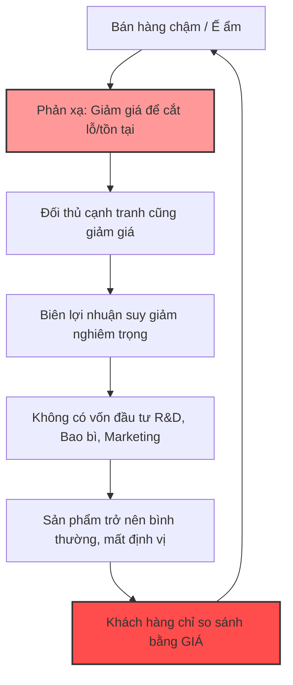

# TÀI LIỆU TÓM TẮT KIẾN THỨC (CONCEPT NOTES)
**Chủ đề:** Vượt qua "Văn hóa Âm tính" - Định vị lại Giá trị Việt Nam trong Chuỗi Giá trị Toàn cầu
**Đơn vị nghiên cứu:** CCBA (Center for Case Study and Business Administration)

---

## TÓM TẮT ĐIỀU HÀNH (EXECUTIVE SUMMARY)
Tài liệu này phân tích sâu sắc nghịch lý trong nền kinh tế và văn hóa kinh doanh của người Việt: **"Làm phần nặng nhất nhưng hưởng phần lợi nhuận thấp nhất"**. Dựa trên tư tưởng của Đặng Lê Nguyên Vũ về "Văn hóa Âm tính", bài giảng bóc tách nguyên nhân gốc rễ khiến các doanh nghiệp Việt Nam thường mắc kẹt ở tầng đáy của chuỗi giá trị (gia công, bán thô). Thông qua 4 cái bẫy thực tiễn và các mô hình tư duy mới, tài liệu cung cấp bộ khung giải pháp để chuyển đổi từ chiến lược "sinh tồn" sang chiến lược "chinh phục và định giá trị".


---

## 1. NGUYÊN NHÂN GỐC RỄ: KHÁI NIỆM "VĂN HÓA ÂM TÍNH"

### 1.1. Định nghĩa và Bối cảnh lịch sử
"Văn hóa âm tính" không phải là một thuật ngữ mang tính chê bai hay miệt thị. Về bản chất, đây là một **cơ chế sinh tồn (survival mechanism)** được hình thành qua hàng ngàn năm lịch sử đối mặt với chiến tranh, thiên tai, và nền nông nghiệp lúa nước bấp bênh. 


Đặc trưng của cơ chế này là:
*   Sự nhẫn nại, chịu đựng, bảo toàn lực lượng.
*   Tránh nổi bật, ngại mạo hiểm ("làm sao để mùa sau vẫn còn gạo ăn").
*   Thích nghi với hoàn cảnh thay vì khát khao chinh phục hay thay đổi hoàn cảnh.

### 1.2. Sự lỗi thời của cơ chế sinh tồn trong kỷ nguyên toàn cầu hóa
Trong quá khứ, văn hóa âm tính là **trí tuệ sinh tồn**. Tuy nhiên, khi bước vào nền kinh tế thị trường toàn cầu, nó trở thành một **"cái trần vô hình" (invisible ceiling)**. Sống sót là chưa đủ; thị trường yêu cầu khả năng định nghĩa giá trị, kể câu chuyện thương hiệu và chiếm lĩnh tâm trí khách hàng.

**Bảng so sánh: Hệ tư duy Âm tính (Sinh tồn) vs. Hệ tư duy Dương tính (Chinh phục)**

| Tiêu chí | Văn hóa Âm tính (Tư duy Sinh tồn) | Văn hóa Dương tính (Tư duy Chinh phục) |
| :--- | :--- | :--- |
| **Mục tiêu cốt lõi** | Tồn tại, ổn định, an toàn | Phát triển, ảnh hưởng, dẫn dắt |
| **Cách nhìn rủi ro** | Mối đe dọa cần né tránh | Cơ hội để bứt phá và đổi mới |
| **Định giá sản phẩm** | Dựa trên chi phí sản xuất (Cost-based) | Dựa trên giá trị cảm nhận (Value-based) |
| **Lợi thế cạnh tranh** | Chăm chỉ, giá rẻ, gia công tốt | Sáng tạo, thương hiệu, câu chuyện |
| **Câu hỏi trung tâm** | "Làm sao để bán được hàng hôm nay?" | "Làm sao để trở thành thứ không thể thiếu?" |


---

## 2. BỐN CÁI BẪY THỰC TIỄN TRONG KINH DOANH VIỆT NAM

Văn hóa âm tính không trừu tượng, nó vận hành trong từng quyết định kinh doanh nhỏ nhất. Dưới đây là 4 cái bẫy điển hình:

### Bẫy 1: Khát vọng chỉ vừa đủ tồn tại (The "Just Enough" Trap)
*   **Case study:** Quán bún bò Huế ở Đà Nẵng. Bán 200 tô/ngày, chất lượng xuất sắc, khách đông.
*   **Vấn đề:** Chủ quán hài lòng với sự ổn định ("đủ rồi, quản nhiều mệt lắm"). Khát vọng dừng lại ở mức kiếm sống, khiến một sản phẩm có tiềm năng trở thành thương hiệu vùng miền bị giới hạn thành một quán ăn địa phương.
*   **Hệ quả:** Tay nghề giỏi không thành hệ thống, ký ức vùng miền không thành tài sản.


### Bẫy 2: Sản phẩm tốt nhưng không có câu chuyện (The "Commodity" Trap)
*   **Case study:** Nông dân trồng thanh long ở Bình Thuận.
*   **Vấn đề:** Sản phẩm tốt, đẹp mã nhưng bán theo dạng hàng hóa thô (commodity), cân ký tính tiền. Người nông dân không thể trả lời câu hỏi: *"Tại sao khách hàng ở Thượng Hải hay Singapore phải chọn thanh long của tôi?"*
*   **Hệ quả:** Giá cả phụ thuộc hoàn toàn vào biến động thị trường. Không có câu chuyện $\rightarrow$ Không có niềm tin $\rightarrow$ Bị ép giá.


### Bẫy 3: Giảm giá như một phản xạ sinh tồn (The "Race to the Bottom" Trap)
*   **Case study:** Người bán đặc sản online.
*   **Vấn đề:** Khi ế hàng, phản xạ đầu tiên và duy nhất là giảm giá (20%, freeship, mua 2 tặng 1). 
*   **Hệ quả:** Biên lợi nhuận mỏng dần $\rightarrow$ Không có tiền đầu tư bao bì, hình ảnh, dịch vụ $\rightarrow$ Sản phẩm trông rẻ tiền $\rightarrow$ Khách hàng tiếp tục so sánh giá $\rightarrow$ Lại phải giảm giá. Doanh nghiệp chết vì dạy khách hàng thói quen "chỉ mua khi có khuyến mãi".

**Sơ đồ Logic: Vòng lặp Âm tính của việc Giảm giá (Mermaid Diagram)**




### Bẫy 4: Làm phần nặng nhất, giữ phần rẻ nhất (The "Outsourcing" Trap)
*   **Case study:** Xưởng may gia công tại Bình Dương.
*   **Vấn đề:** May áo chất lượng xuất khẩu châu Âu, nhận vài USD tiền gia công. Cùng chiếc áo đó, gắn mác thương hiệu Paris, bán 150 USD.
*   **Hệ quả:** Người Việt Nam dùng đôi tay và sự chăm chỉ để hiện thực hóa giấc mơ và câu chuyện của người khác. Tầng "Thực hiện" (Gia công) luôn nhận giá trị thấp nhất, trong khi tầng "Định nghĩa" (Thương hiệu, Phân phối) chiếm trọn lợi nhuận.


---

## 3. MÔ HÌNH TOÁN HỌC VÀ THUẬT TOÁN ĐỊNH GIÁ TRỊ

Sự khác biệt giữa chai mật ong 120.000đ và 500.000đ nằm ở công thức định giá. 


### 3.1. Công thức Toán học (LaTeX)

**1. Định giá theo tư duy Âm tính (Cost-based Pricing):**
Người bán chỉ nhìn vào chi phí vật lý để cộng thêm một mức biên lợi nhuận nhỏ.
$$ P_{cost} = C_{production} + C_{labor} + M_{minimal} $$
*(Trong đó: $P$ là giá bán, $C$ là chi phí sản xuất/nhân công, $M$ là biên lợi nhuận kỳ vọng thấp)*

**2. Định giá theo tư duy Dương tính (Value-based Pricing):**
Người bán định giá dựa trên **Giá trị cảm nhận (Perceived Value)** của khách hàng.
$$ P_{value} = V_{functional} + V_{emotional} + V_{social} - F_{friction} $$
*(Trong đó: $V_{functional}$ là công năng, $V_{emotional}$ là cảm xúc/câu chuyện, $V_{social}$ là đẳng cấp xã hội, $F_{friction}$ là lực cản mua hàng)*

**3. Khoảng trống Giá trị (Value Gap):**
Phần lợi nhuận khổng lồ rơi vào tay những người biết kể chuyện và xây dựng thương hiệu chính là:
$$ \Delta \pi = P_{value} - P_{cost} $$

### 3.2. Mô phỏng Thuật toán ra quyết định (Python Code Snippet)
Dưới đây là mã nguồn mô phỏng logic ra quyết định của một chủ doanh nghiệp khi đối mặt với việc hàng bán chậm, thể hiện sự khác biệt giữa tư duy "Âm tính" và "Dương tính".

```python
class BusinessMindset:
    def __init__(self, product_cost, brand_value, current_sales):
        self.product_cost = product_cost
        self.brand_value = brand_value
        self.current_sales = current_sales
        self.price = product_cost * 1.2 # Default 20% margin

    def yin_culture_reaction(self):
        """Phản xạ sinh tồn: Giảm giá khi ế hàng"""
        if self.current_sales < 100:
            print("Hàng ế! Phản xạ: Giảm giá 20%")
            self.price = self.price * 0.8
            self.brand_value -= 10 # Mất giá trị thương hiệu
        return self.price, self.brand_value

    def yang_culture_reaction(self):
        """Phản xạ chinh phục: Tăng giá trị cảm nhận"""
        if self.current_sales < 100:
            print("Hàng ế! Phản xạ: Kể lại câu chuyện, nâng cấp bao bì")
            investment = 5
            self.product_cost += investment
            self.brand_value += 50 # Tăng mạnh giá trị cảm nhận
            self.price = self.product_cost + self.brand_value
        return self.price, self.brand_value

# Khởi tạo sản phẩm (VD: Mật ong)
honey_bottle = BusinessMindset(product_cost=100, brand_value=0, current_sales=50)

# Kết quả của tư duy Âm tính
price_yin, brand_yin = honey_bottle.yin_culture_reaction()
# Kết quả: Giá giảm, thương hiệu đi xuống.

# Kết quả của tư duy Dương tính
price_yang, brand_yang = honey_bottle.yang_culture_reaction()
# Kết quả: Giá tăng cao nhờ cộng gộp giá trị thương hiệu (500k vs 120k).
```

---

## 4. KHUNG TƯ DUY CHUYỂN ĐỔI: 3 CÂU HỎI CỐT LÕI

Để thoát khỏi "cái trần vô hình", doanh nghiệp không cần phải liều lĩnh mù quáng, mà cần thay đổi **câu hỏi trung tâm**.


1.  **Về Sản phẩm:** *Tôi đang bán một sản phẩm vật lý, hay đang bán một LÝ DO để khách hàng chọn tôi thay vì đối thủ rẻ hơn?*
    *   Nếu lý do duy nhất là giá rẻ, khách hàng sẽ rời đi khi có người rẻ hơn. Đó là "mượn tạm" khách hàng, không phải xây dựng.
2.  **Về Định giá:** *Tôi đang định giá bằng CHI PHÍ bỏ ra, hay bằng GIÁ TRỊ người mua cảm nhận được?*
    *   Người nuôi ong tính giá theo chi phí $\rightarrow$ 120.000đ.
    *   Người kể chuyện tính giá theo sự an tâm và tự hào của người mua $\rightarrow$ 500.000đ.
3.  **Về Tầm nhìn:** *Mục tiêu của tôi là SỐNG SÓT qua ngày, hay tạo ra một TÀI SẢN lớn hơn đời mình?*
    *   Câu hỏi nhỏ bảo đảm một giới hạn nhỏ. Câu hỏi lớn mở ra cơ hội định hình lại chuỗi giá trị.


## KẾT LUẬN
Văn hóa âm tính không phải là lỗi của cá nhân, nó là di sản của lịch sử. Tuy nhiên, **di sản là điểm xuất phát, không phải điểm kết thúc**. Trong chuỗi giá trị toàn cầu hiện đại, người làm ra sản phẩm chưa chắc là người giữ lợi nhuận cao nhất. Quyền lực và tài sản thuộc về những người có khả năng **Định nghĩa (Define)**, **Đóng gói (Package)**, và **Kể chuyện (Storytelling)**. 

Khoảng cách giữa 120.000đ và 500.000đ không nằm ở con ong hay giọt mật, nó nằm ở **câu hỏi mà người bán dám đặt ra cho giá trị của chính mình**.