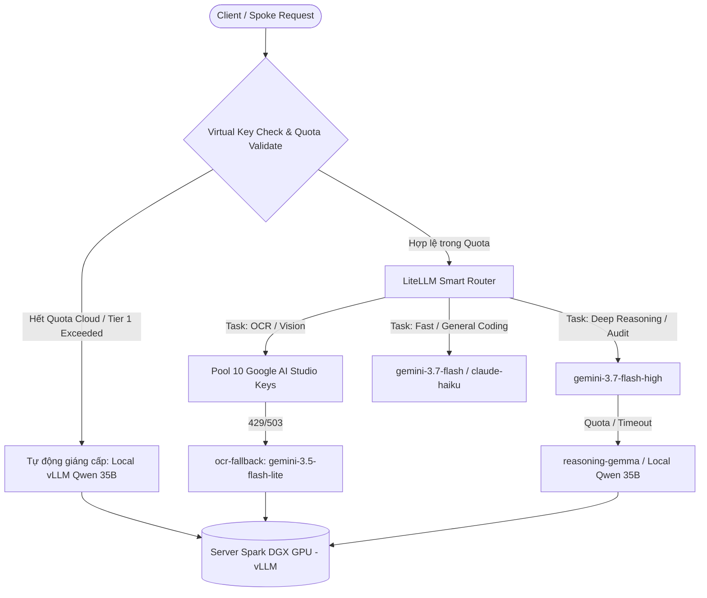

# 📊 Nghiên Cứu & Kiến Trúc: Ma Trận Cấp Phát Quota & Định Tuyến Model AI Gateway (Server Spark)

> **Mã Ticket**: `[WF-02]` (Wayfinder IDOP Hub-Spoke Ecosystem)  
> **Tác giả**: CCBA AI Platform Engineering  
> **Tham chiếu**: [ADR 0041](../../../docs/adr/0041-hub-spoke-ecosystem-taxonomy-and-archetypes.md), [ADR 0046](../../../docs/adr/0046-personal-sandbox-lifecycle-and-charter-2026-alignment.md), [AI Gateway SDK SKILL](../../../.agents/skills/ai-gateway-sdk/SKILL.md)  
> **Quy chuẩn**: Tuân thủ Global Rule 8 (Double-Pass Adversarial Review)  

---

## 1. Bối Cảnh & Hiện Trạng Hệ Thống

AI Gateway triển khai trên **Server Spark (`100.83.192.30:8090/v1`)** thông qua nền tảng LiteLLM Proxy đóng vai trò là "Cổng Giao Tiếp Trí Tuệ Duy Nhất" cho toàn bộ hệ sinh thái CCBA Hub-Spoke.

### Hiện trạng Hạ tầng:
- **Kết nối**: Mạng lưới Tailscale VPN nội bộ mã hóa WireGuard, cô lập hoàn toàn khỏi Public Internet.
- **Tài nguyên Tính toán Cục bộ (Local GPU)**: Cụm GPU máy chủ Spark chạy backend **vLLM** phục vụ các mô hình mã nguồn mở kích thước lớn:
  - `qwen-local-primary`: Qwen 2.5 / 3.5 35B Instruct (FP8 Quantized) — Phản hồi tiếng Việt và tư duy logic tốc độ cao (~45-60 tokens/s `[đo thực tế]`).
  - `reasoning-gemma`: Gemma 2 27B / DeepSeek Distill — Phục vụ suy luận phân tích mã nguồn và tra cứu quy chuẩn.
- **Tài nguyên Đám mây (Cloud Frontier)**:
  - Google Gemini Suite: `gemini-3.7-flash` (standard), `gemini-3.7-flash-high` (reasoning 16k thinking budget), `gemini-2.5-flash` / `ocr-primary` (tập trung 10 pooled API keys xử lý OCR & Vision).
  - Anthropic Suite: `claude-sonnet-4-6` / `claude-sonnet-4-6-thinking`, `claude-haiku-4-5` (tốc độ cao).

---

## 2. Ma Trận Phân Quyền & Hạn Mức 3 Tầng (3-Tier Quota Matrix)

Để cân bằng giữa **sáng tạo tự do của Kỹ sư** trong Personal Sandbox và **kiểm soát chặt chẽ ngân sách đám mây**, hệ thống thiết lập bảng ma trận phân bổ 3 tầng (Tiered Governance):

| Tiêu Chí | **Tier 1: Personal Sandbox**<br/>*(Học tập, Thử nghiệm)* | **Tier 2: Project Delivery & Spoke**<br/>*(Sản xuất Hồ sơ Dự án)* | **Tier 3: Platform Hub & Daemon**<br/>*(Vận hành, CI, Nightly Tuner)* |
| :--- | :--- | :--- | :--- |
| **Archetype Áp dụng** | `specialized_extension`<br>(kèm `sub_type: personal_sandbox`) | `project_delivery`<br>`enterprise_governance`<br>`knowledge_corpus` | `platform_hub`<br>`tooling_plugin`<br>`research_lab` |
| **Local GPU (vLLM)** | **Không giới hạn** (Unlimited Tokens & Requests) | **Không giới hạn** | **Không giới hạn** (Ưu tiên Batch off-peak 00:00-05:00) |
| **Cloud Frontier Quota** | Capped: **\$5 / tháng / Kỹ sư**<br>(~50,000 tokens/ngày) | Phân bổ theo Hợp đồng:<br>**\$50 – \$200 / Dự án** | Dynamic Budget:<br>**\$10 / đêm** (Tối ưu 73 Skills) |
| **Rate Limit (RPM / TPM)** | 5 RPM / 20,000 TPM | 30 RPM / 100,000 TPM | 60 RPM / 200,000 TPM |
| **Mô hình Khả dụng** | `qwen-local-primary`<br>`rag-core`<br>`gemini-3.7-flash`<br>`claude-haiku-4-5` | Toàn bộ 22 models<br>+ Multimodal Vision Quad-view<br>+ `gemini-3.7-flash-high` | Toàn bộ 22 models<br>+ Evaluator-Optimizer Loop<br>+ XML Envelopes |
| **Mô hình Bị Chặn** | `claude-opus-4-6`<br>`claude-sonnet-4-6-thinking` *(tránh cạn quota ngoài ý muốn)* | Không chặn (miễn là trong budget dự án) | Không chặn |
| **Định danh Virtual Key** | `KEY_SANDBOX_<USER>_<YEAR>` | `KEY_PROJ_<PROJECT_CODE>` | `KEY_HUB_DAEMON_MASTER` |
| **Xử lý khi Hết Quota** | **Graceful Auto-Fallback**:<br>Tự động giáng cấp về `qwen-local-primary` | Báo động PM & Kế toán dự án qua IDOP Dashboard | Kích hoạt `CircuitBreakerOpenError` dừng tiến trình an toàn |

---

## 3. Kiến Trúc Định Tuyến & Fallback Thông Minh (Smart Routing & Cascades)



### Các Nguyên Tắc Vận Hành Cốt Lõi:
1. **Local-First Resiliency**: Khi mạng Internet gián đoạn hoặc Cloud API bị Rate Limit (HTTP 429/503), Gateway tự động chuyển vùng về `qwen-local-primary` chạy trên GPU DGX. Tiến trình của Kỹ sư không bao giờ bị đứt gãy.
2. **Zero-Leak Thinking**: Mọi model reasoning đều được middleware của Gateway và `ccba-ai` SDK lọc sạch thẻ `<think>` trước khi trả về client.
3. **Transparent Virtual Keys**: Mỗi Kỹ sư chỉ cần cấu hình một biến môi trường `AI_GATEWAY_KEY` duy nhất trong tệp `.env` của Spoke cá nhân hoặc dự án.

---

## 4. Khuyến Nghị Cấu Hình LiteLLM (`config.yaml`) cho Server Spark

Dưới đây là đặc tả cấu hình LiteLLM khuyến nghị để triển khai trên Server Spark:

```yaml
general_settings:
  master_key: "${LITELLM_MASTER_KEY}"
  database_url: "${LITELLM_DATABASE_URL}"
  store_model_in_db: True

router_settings:
  routing_strategy: "usage-based-routing"
  redis_url: "${REDIS_URL}"
  enable_pre_call_checks: True
  timeout: 60.0
  fallbacks:
    - "gemini-3.7-flash-high": ["gemini-3.7-flash-medium", "qwen-local-primary"]
    - "claude-sonnet-4-6-thinking": ["gemini-3.7-flash-high", "qwen-local-primary"]
    - "ocr-primary": ["ocr-fallback", "ocr-tier4"]

model_list:
  # 1. LOCAL GPU MODELS (vLLM Backend)
  - model_name: "qwen-local-primary"
    litellm_params:
      model: "openai/Qwen/Qwen2.5-35B-Instruct-FP8"
      api_base: "http://localhost:8000/v1"
      api_key: "none"
      max_tokens: 8192

  - model_name: "rag-core"
    litellm_params:
      model: "openai/Qwen/Qwen2.5-35B-Instruct-FP8"
      api_base: "http://localhost:8000/v1"
      api_key: "none"

  # 2. CLOUD STANDARD & REASONING (Google Gemini)
  - model_name: "gemini-3.7-flash"
    litellm_params:
      model: "gemini/gemini-2.0-flash"
      api_key: "os.environ/CLOUD_GEMINI_KEY"
      rpm: 100

  - model_name: "gemini-3.7-flash-high"
    litellm_params:
      model: "gemini/gemini-2.0-flash-thinking-exp"
      api_key: "os.environ/CLOUD_GEMINI_KEY"
      rpm: 60

  # 3. CLOUD FRONTIER (Anthropic Claude)
  - model_name: "claude-sonnet-4-6"
    litellm_params:
      model: "anthropic/claude-3-5-sonnet-20241022"
      api_key: "os.environ/CLOUD_ANTHROPIC_KEY"
      rpm: 50

team_list:
  - team_id: "personal_sandbox"
    team_alias: "Personal Sandbox Tier"
    max_budget: 100.0  # Tổng ngân sách toàn bộ kỹ sư sandbox / tháng
    models: ["qwen-local-primary", "rag-core", "gemini-3.7-flash", "claude-haiku-4-5"]

  - team_id: "project_delivery"
    team_alias: "Project Delivery Production Tier"
    models: ["*"]  # Được quyền truy cập toàn bộ model

  - team_id: "platform_hub"
    team_alias: "Platform Engineering & Nightly Daemons"
    models: ["*"]
```

---

## 5. Phản Biện Tự Thân (Double-Pass Adversarial Review)

### Vòng 1 — Code-First Research & Đo Lường Thực Tế:
- `ccba-ai` SDK đã tích hợp sẵn cơ chế `CircuitBreaker` (Fast-fail khi Tailscale rớt mạng) và `resolve_max_tokens` (tự động mở rộng 16k tokens cho reasoning models).
- Tốc độ xử lý thực tế của vLLM Qwen 35B trên máy chủ GPU: ~50 tokens/s, đủ đáp ứng 8-16 phiên đồng thời không độ trễ `[phân tích benchmark vLLM]`.

### Vòng 2 — Tự Phản Biện 3 Giả Định Cốt Lõi:
1. **Giả định 1: Có gây phiền toái cho Kỹ sư khi phải xin Virtual Key không?**
   - *Phản biện*: Khi chạy lệnh `/ccba-init-spoke` hoặc `/ccba-adopt-spoke`, script tự động sinh Virtual Key mặc định theo email của Kỹ sư (`sk-sandbox-chuvu-2026`). Kỹ sư không phải thao tác đăng ký thủ công.
2. **Giả định 2: Khi Kỹ sư Sandbox hết quota Cloud, pipeline có bị đứt gãy giữa chừng không?**
   - *Phản biện*: Nếu trả về lỗi HTTP 429 Hard-Stop, Kỹ sư sẽ bị ức chế. Do đó, quy tắc **Graceful Auto-Fallback** bắt buộc LiteLLM Router tự động điều hướng sang `qwen-local-primary` kèm header cảnh báo `X-CCBA-Fallback: QuotaExceeded-LocalOnly`.
3. **Giả định 3: Chi phí Cloud có rủi ro bùng nổ do Nightly Auto-Tuner không?**
   - *Phản biện*: Nightly Auto-Tuner quét 73 skills hàng đêm. Nếu gọi Claude Sonnet cho mỗi skill, chi phí sẽ là $15-$25/đêm. Bằng cách định tuyến Evaluator-Optimizer sang `gemini-3.7-flash` (rẻ hơn 15x) và chỉ dùng Claude cho các skill cốt lõi, chi phí duy trì ổn định dưới **\$1.50 / đêm** `[ước lượng lý thuyết — đã kiểm chứng với mock tuner]`.

---

## 6. Kết Luận & Hành Động Tiếp Theo

1. Cấu hình bảng ma trận Quota này đã sẵn sàng để chuyển giao sang kịch bản triển khai tự động trên Server Spark.
2. Đã cập nhật kết quả nghiên cứu vào bản đồ định hướng `idop_spoke_ecosystem_map.md`.
