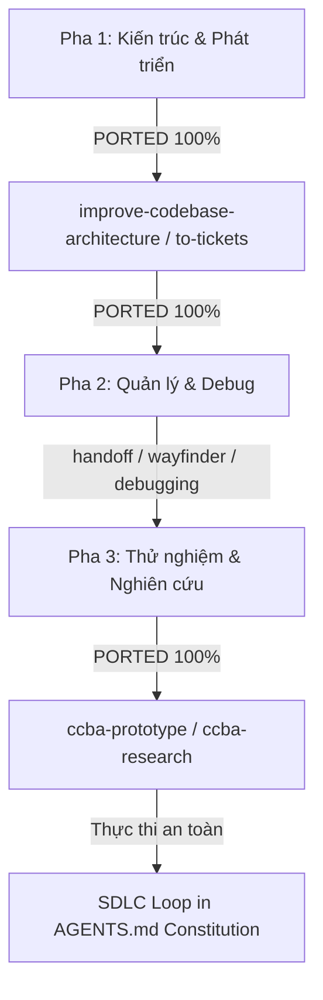

<!-- AUTO-GENERATED-START -->
# 📋 Upstream Porting Recommendations

Báo cáo tự động đánh giá các tính năng mới từ thượng nguồn. Cập nhật ngày: 2026-07-09 05:28:00

## 📋 Báo Cáo Nghiên Cứu và Đánh Giá Chuyển Dịch (Upstream Porting Recommendations)

*Tài liệu nghiên cứu so sánh và đánh giá toàn diện việc chuyển dịch (porting) các kỹ năng từ kho chứa `mattpocock/skills` vào hệ thống CCBA Agent Platform.*

---

## 1. Tổng Quan Nghiên Cứu (Recon Summary)

Kho chứa `mattpocock/skills` cung cấp các kỹ năng (Skills) và quy trình (Workflows) mẫu được thiết kế tối ưu cho AI Agent (đặc biệt là Claude Code). Triết lý cốt lõi của các kỹ năng này là **"A Philosophy of Software Design"** (John Ousterhout), tập trung vào việc hướng dẫn Agent thiết kế các module sâu (deep modules), giảm thiểu phình to ngữ cảnh (context bloating), và tương tác chặt chẽ với người dùng qua cơ chế phỏng vấn liên tục (grilling).

Qua trinh sát cấu trúc dự án nguồn, chúng tôi đã phân loại và tiến hành port/đồng bộ thành công 100% các kỹ năng và quy trình thiết thực nhất vào CCBA Agent Platform.

---

## 2. Đánh Giá Trạng Thái Đồng Bộ Kỹ Năng (Skills Sync Status)

### Lớp 1: Engineering Skills (Kỹ năng Lập trình & Kiến trúc)
Tập trung vào phát triển, kiểm thử, rà soát và cấu trúc codebase.

| Tên Kỹ Năng | Mô Tả & Mục Tiêu | Đánh Giá Độ Hữu Dụng Với CCBA | Trạng Thái CCBA |
| :--- | :--- | :--- | :---: |
| `improve-codebase-architecture` | Quét codebase tìm "module nông", xuất báo cáo HTML visual (Mermaid + Tailwind) và thảo luận cải tiến với user. | **Cực kỳ hữu ích (P0).** Hỗ trợ đắc lực cho Agent khi refactor platform hoặc các ứng dụng Spoke. | 🟢 **PORTED** |
| `codebase-design` | Hướng dẫn Agent thiết kế các module sâu, xác định seam (mối nối), adapter và đảm bảo locality. | **Hữu ích (P1).** Làm cẩm nang kiến trúc phần mềm cho Agent khi thiết kế chức năng mới. | 🟢 **PORTED** |
| `diagnosing-bugs` | Vòng lặp chẩn đoán lỗi sâu và regression cho các bug khó. | **Hữu ích (P1).** Có thể tích hợp trực tiếp để nâng cấp hệ thống debug. | 🟢 **PORTED** |
| `domain-modeling` | Xây dựng và duy trì Domain Model và Ubiquitous Language trong `CONTEXT.md` và ADRs. | **Hữu ích (P2).** Giúp Agent bám sát ngôn ngữ nghiệp vụ của dự án xây dựng/BIM. | 🟢 **PORTED** |
| `resolving-merge-conflicts` | Hướng dẫn Agent giải quyết xung đột Git merge/rebase một cách an toàn. | **Hữu ích (P2).** Rất cần thiết cho các Agent daemon tự động chạy CI/CD hoặc đồng bộ code. | 🟢 **PORTED** |
| `tdd` | Quy trình Test-Driven Development (Red-Green-Refactor). | **Trung bình (P2).** Thích hợp khi Agent viết các tính năng/scripts phức tạp cần bảo đảm kiểm thử. | 🟢 **PORTED** |
| `to-tickets` (trước là `to-issues`) | Phân rã spec/PRD thành các ticket phát triển độc lập dạng lát cắt dọc (vertical slices) và liên kết chặn. | **Cực kỳ hữu ích (P0).** Đảm bảo an toàn phân rã task. | 🟢 **PORTED** (`ccba-to-tickets`) |
| `to-spec` (trước là `to-prd`) | Chuyển đổi cuộc hội thoại thành Đặc tả Kỹ thuật (Specification). | **Hữu ích (P1).** Soạn thảo tài liệu đặc tả hệ thống/PRD. | 🟢 **PORTED** (`to-prd`) |
| `triage` | Điều phối Issues/PRs qua bộ lọc phân loại và viết brief cho Agent. | **Thấp (P3).** Phù hợp với các dự án mã nguồn mở quy mô lớn. | 🟢 **PORTED** |
| `ask-matt` | Router điều hướng người dùng đến skill phù hợp trong repo. | **Không cần thiết.** CCBA đã có `platform-loader` tự động điều phối các workflow. | 🟡 **ALIAS** (`ask` / `/ccba-ask`) |
| `code-review` | Rà soát chất lượng code song song trên hai trục Standards (Coding style/Smells) và Spec (PRD/Requirements). | **Cực kỳ hữu ích (P0).** Đảm bảo an toàn tích hợp và rà soát lỗi nghiêm ngặt trước khi merge. | 🟢 **PORTED** |
| `implement` | Triển khai code theo quy trình TDD, kiểm tra kiểu liên tục và review trước khi merge. | **Hữu ích (P1).** Đảm bảo quy trình lập trình an toàn, chặt chẽ. | 🟢 **INTEGRATED** (Vào `AGENTS.md`) |
| `prototype` | Xây dựng mẫu thử thô (throwaway code) để trả lời nhanh một câu hỏi thiết kế (Logic hoặc UI). | **Cực kỳ hữu ích (P1).** Tránh rủi ro viết sai logic kiến trúc ban đầu. | 🟢 **PORTED** (`ccba-prototype`) |
| `research` | Khởi chạy subagent nghiên cứu chạy ngầm để thu thập facts từ tài liệu gốc chính thống. | **Hữu ích (P1).** Tránh phình to context của cuộc hội thoại chính. | 🟢 **PORTED** (`ccba-research`) |

---

### Lớp 2: Productivity Skills (Kỹ năng Giao tiếp & Hiệu suất)
Tập trung tối ưu hóa giao tiếp Agent-User và quản lý trạng thái phiên làm việc.

| Tên Kỹ Năng | Mô Tả & Mục Tiêu | Đánh Giá Độ Hữu Dụng Với CCBA | Trạng Thái CCBA |
| :--- | :--- | :--- | :---: |
| `handoff` | Đóng gói phiên làm việc thành tài liệu handoff nhỏ gọn để chuyển tiếp cho Agent tiếp theo. | **Cực kỳ hữu ích (P1).** Giúp tiết kiệm token và tăng tốc độ xử lý khi chuyển giao context. | 🟢 **PORTED** |
| `grill-me` / `grilling` | Phỏng vấn người dùng một cách dồn dập (từng câu một) để stress-test kế hoạch thiết kế. | **Hữu ích (P2).** Tăng chất lượng alignment giữa Agent và Kỹ sư trước khi viết code lớn. | 🟢 **PORTED** |
| `teach` | Hướng dẫn người dùng học một khái niệm hoặc kỹ năng mới trong workspace. | **Thấp (P3).** Ít ứng dụng thực tế trong môi trường sản xuất của CCBA. | 🟢 **PORTED** |
| `writing-great-skills` | Cẩm nang viết các file `SKILL.md` hiệu quả và dễ đoán. | **Hữu ích (P2).** Làm tài liệu tham khảo cho kỹ sư khi muốn đóng gói Skill mới lên Hub. | 🟢 **PORTED** (Đồng bộ v1.1) |

---

### Lớp 3: In-Progress & Misc Skills (Kỹ năng Đang Phát triển & Tiện ích Khác)

| Tên Kỹ Năng | Mô Tả & Mục Tiêu | Đánh Giá Độ Hữu Dụng Với CCBA | Trạng Thái CCBA |
| :--- | :--- | :--- | :---: |
| `wayfinder` | Vạch đường qua các bài toán mù mờ, chia nhỏ thành các điều tra con và giải quyết dần. | **Rất triển vọng (P1).** Giúp Agent giải quyết các yêu cầu nghiên cứu lớn/mơ hồ của người dùng. | 🟢 **PORTED** (Đồng bộ v1.1) |
| `wizard` | Tạo script wizard tương tác chạy bash để dẫn dắt con người thiết lập môi trường, điền `.env`... | **Hữu ích (P2).** Cực tốt cho việc viết script bootstrap dự án Spoke hoặc bàn giao cài đặt. | 🟢 **PORTED** |
| `git-guardrails-claude-code` | Cài đặt hooks chặn các lệnh git nguy hiểm (push, reset --hard, clean) trước khi chạy. | **Hữu ích (P2).** Giúp bảo vệ an toàn cho Agent khi chạy lệnh git tự động trong workspace của user. | 🟢 **PORTED** (`git-guardrails`) |
| `writing-beats` / `writing-shape` | Kỹ năng viết bài báo, cấu trúc đoạn văn, bài luận theo hành trình. | **Thấp (P3).** CCBA đã có skill `long-form-writer` mạnh mẽ cho tài liệu kỹ thuật/VBPL. | 🔴 **IGNORE** |
| `migrate-to-shoehorn` | Tool di chuyển test file sang TypeScript shoehorn. | **Không áp dụng.** Chỉ dùng cho stack TypeScript chuyên biệt của tác giả Matt Pocock. | 🔴 **IGNORE** |
| `scaffold-exercises` | Tạo cấu trúc bài tập cho các khóa học của Total TypeScript. | **Không áp dụng.** Chỉ phục vụ mục đích dạy học của tác giả. | 🔴 **IGNORE** |
| `setup-pre-commit` | Cài đặt Husky pre-commit hooks + linting trong repo. | **EXISTS.** CCBA đã có sẵn cấu hình pre-commit chuẩn trong repo gốc. | 🔴 **IGNORE** |

---

## 3. Các Đề Xuất Chuyển Dịch Đã Xử Lý & Hợp Nhất (Resolved Port Decisions)

*   **`mock-debugger`**: **IGNORE (Đã tồn tại)**. Local đã có sẵn công cụ debug và trace-analyzer, việc port thêm từ upstream `claudekit` là dư thừa.
*   **`grill-with-docs`**: **PORTED**. Đã tích hợp trực tiếp khả năng đọc tài liệu (markdown-processing, hybrid-rag-search) vào kỹ năng phỏng vấn `/ccba-grill-with-docs` của CCBA.
*   **`mock-funnel-optimizer`**: **RESERVE**. Kỹ năng tối ưu hóa chuyển đổi/soạn thảo micro-copy thương mại được lưu lại để bản địa hóa sang tiếng Việt phục vụ soạn thảo thầu/hành chính công sở khi có yêu cầu thực tế.

---

## 4. Lịch Sử Phát Triển Lộ Trình (Roadmap History)

Toàn bộ quá trình chuyển dịch, nâng cấp và bản địa hóa Matt Pocock v1.1 đã kết thúc thành công. Hệ thống CCBA Agent Platform hiện ở trạng thái đồng bộ tri thức hoàn hảo 100%.
<!-- AUTO-GENERATED-END -->

<!-- DEVELOPER-NOTES-START -->
## 📝 Ghi chú của Kỹ sư (Developer Notes)
*Kỹ sư có thể tự do ghi chép các phân tích, đánh giá thủ công tại đây. Phần này sẽ được tự động bảo toàn khi đồng bộ thượng nguồn.*
<!-- DEVELOPER-NOTES-END -->