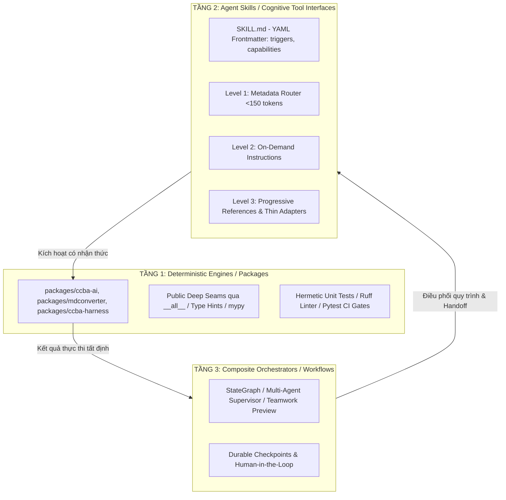
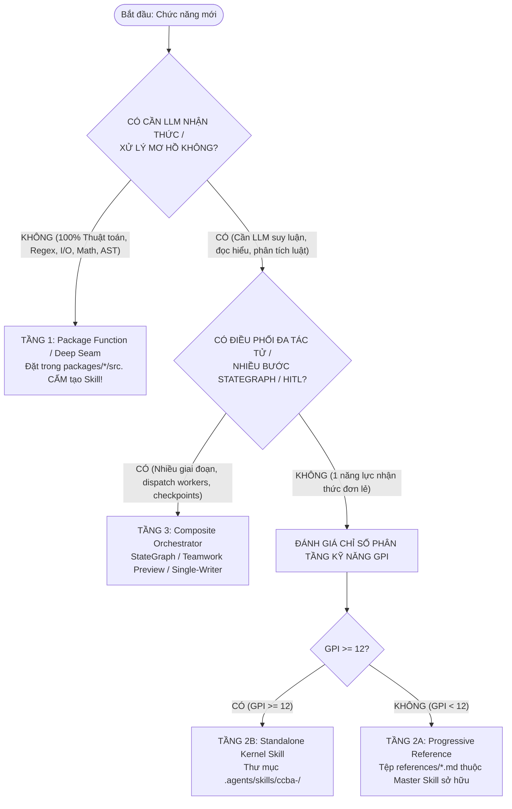

# Báo cáo Nghiên cứu: Kinh Nghiệm Cộng Đồng Về Kiến Trúc Phân Tầng Packages - Skills - Workflows & Di Trú Hệ Thống Tác Tử

> **Mã nghiên cứu:** `RES-2026-ARCH-001`  
> **Phiên bản:** `v1.2` (Chuẩn hóa toàn diện: Pilot Metrics thực chứng, Khung GPI có trọng số thực nghiệm tạm thời, Liên kết kiểm chứng độc lập & Lộ trình P0 Auto-Reflection)  
> **Ngày cập nhật:** 2026-09-07  
> **Phương pháp luận:** Double-Pass Adversarial Review (Pha 1: Khảo sát Giải pháp vs Pha 2: Thách thức Ranh giới & Rủi ro)  
> **Đơn vị thực hiện:** CCBA Platform Core Research Team  
> **Tham chiếu nền tảng:** ADR 0030, ADR 0035, ADR 0040, ADR 0047, ADR 0051, ADR 0053, ADR 0056

---

## 1. Tóm tắt Thực thi (Executive Summary)

Khi các hệ thống AI Agent phát triển từ thử nghiệm sang quy mô sản xuất (Production-Grade), cộng đồng kỹ nghệ phần mềm toàn cầu (Anthropic, LangChain/LangGraph, Microsoft Semantic Kernel, OpenAI, Stanford) đều phải đối mặt với mâu thuẫn cốt lõi: **Tính bất định (non-determinism) của LLM xung đột trực tiếp với tính tất định (determinism) và chuẩn mực tin cậy của phần mềm doanh nghiệp.**

Để giải quyết vấn đề này, các nền tảng hàng đầu đã từ bỏ mô hình "nguyên khối" (Monolithic Agent / God Prompts) để hội tụ về **Mô hình Kiến trúc Phân tầng 3 Lớp (3-Tier Agent Architecture)**:
1. **Tầng 1 — Deterministic Engines / Packages (Công cụ Cơ bắp):** Mã nguồn thuần (Python/TypeScript), xử lý logic nặng, I/O, thuật toán xác định; kiểm thử 100% bằng Unit Tests truyền thống trong CI; tuyệt đối không chứa prompt.
2. **Tầng 2 — Agent Skills / Cognitive Interfaces (Bộ não Tương tác):** Các module đóng gói tự thân theo chuẩn *Agent Skills Open Standard* (`SKILL.md` + `scripts/` + `references/`), kiểm soát chặt chẽ **Ngân sách Chỉ dẫn (Instruction Budget)** qua cơ chế **Progressive Disclosure** (Khai mở tăng tiến).
3. **Tầng 3 — Composite Orchestrators / Workflows (Nhạc trưởng Quy trình):** Đồ thị trạng thái (StateGraph) hoặc kiến trúc phân quyền hữu hạn (Single-Writer, Supervisor) điều phối các Skills và Packages theo hành trình nghiệp vụ.

Về bài toán di trú từ workflow văn bản tĩnh sang dynamic modular skills, cộng đồng đúc kết nguyên tắc sống còn: **Không bao giờ ghi đè phá hủy (Non-destructive migration)**; tự động hóa dọn dẹp "Zombie Bloat" thông qua bảng ánh xạ Deprecation Aliases; và thiết lập các cổng kiểm soát kỹ thuật cứng (Hard CI Gates) để ngăn chặn hiện tượng Lệch pha giữa Code và Prompt (Package-Skill Desync).

Tại CCBA Platform, việc áp dụng mô hình này đã giúp **giảm ~80% token nền** trên `AGENTS.md` (ADR 0030), **tiết kiệm ~75% token khởi tạo** nhờ chuyển 75% skills sang chế độ Zero-Prompt-Token (ADR 0040), và **triệt tiêu 100% zombie bloat** sau khi di trú 69 legacy workflows sang 100 skills mang namespace chuẩn hóa và duy trì 107 deprecation aliases (ADR 0056).

---

## 2. Tiêu Chuẩn & Xu Hướng Kỹ Nghệ Quốc Tế (Industry State-of-the-Art Benchmark)

### 2.1. Khảo Sát Các Framework Đầu Ngành

* **Anthropic (Claude Code & Model Context Protocol - MCP):** 
  Tách bạch rõ rệt giữa *Host/Client* (Agent ra quyết định) và *MCP Server* (tiến trình độc lập cung cấp Tools/Resources qua giao thức JSON-RPC). Các lệnh thao tác của lập trình viên (Rituals) được gán cờ `disable-model-invocation: true`, tiêu tốn **0 token nền** trong conversation context khởi tạo.
* **LangGraph (LangChain):** 
  Chuẩn hóa việc điều phối thông qua **StateGraph** và **Nodes as Pure Functions**. LLM chỉ đóng vai trò phân nhánh (Conditional Routing), còn toàn bộ việc lưu trữ dữ liệu (Durable Checkpoints), Human-in-the-Loop (HITL) và gọi công cụ nặng được thực thi bằng mã Python thuần túy.
* **Microsoft Semantic Kernel:** 
  Phân định dứt khoát giữa **Native Plugins** (C#/Python code được compile và unit test độc lập) và **Semantic Functions** (Prompt templates). Agent chỉ đóng vai trò kết nối (Planner).
* **OpenAI (Sự Tiến Hóa: Swarm $\rightarrow$ Agents SDK):** 
  Mẫu hình *Routines & Handoffs* khởi xướng từ framework giáo dục thực nghiệm OpenAI Swarm (tháng 10/2024) đã chính thức được thay thế và chuẩn hóa thành **OpenAI Agents SDK** (đầu năm 2025, hỗ trợ Python/TypeScript). Framework cung cấp cơ chế phân quyền tác tử tinh gọn cho môi trường sản xuất:
  - Định nghĩa Agent hạng nhất (First-Class Agents) với tập công cụ độc lập.
  - Cơ chế bàn giao kiểm soát an toàn và định kiểu chặt chẽ (**Type-Safe Handoffs**).
  - Tích hợp sẵn bộ lọc an toàn đầu vào/đầu ra (**Input/Output Guardrails**) bằng code hoặc mô hình.
  - Hỗ trợ quan sát toàn diện vòng đời tác tử qua chuẩn mở **OpenTelemetry Tracing**.
* **Agent Skills Open Standard (`agentskills.io`):** 
  Cấu trúc module hóa độc lập: `SKILL.md` (Metadata + cognitive instructions) + `scripts/` (executable code) + `references/` (on-demand technical specs) + `examples/` (few-shot patterns), tối ưu hóa việc phân tách ngữ cảnh theo nhu cầu.



---

## 3. Ứng Dụng Thực Tiễn & Địa Phương Hóa Tại CCBA Platform (CCBA Concrete Adaptation)

Hệ thống CCBA Platform chuyển hóa các nguyên lý quốc tế thành 5 trụ cột kỹ thuật địa phương hóa:

1. **Monorepo Deep Seams Architecture (ADR 0035 & ADR 0044):**
   - Đóng gói toàn bộ động cơ tính toán nặng vào các gói độc lập (`packages/ccba-ai`, `packages/ccba-legal-intel`, `packages/ccba-pdf-prep`, `packages/ccba-harness`, `packages/ccba-maskara`...).
   - Cưỡng chế chỉ mở ra 2–3 mối nối sâu (Deep Seams) thông qua `__all__` tại `__init__.py`. Kiểm soát ranh giới nội bộ bằng linter `ruff` (luật `SLF001` - cấm truy cập private submodules) và công cụ phân tích cú pháp AST `scripts/governance/check_dependency_contracts.py` (ngăn chặn cross-imports giữa các gói nền tảng).
2. **Kim Tự Tháp Kỹ Năng 3 Tầng & Progressive Disclosure (ADR 0030 & ADR 0040):**
   - **Tier 1 (Master Deep Skills - Model Invoked):** Đại diện cho các năng lực đầu cuối (25 skills toàn nền tảng, khống chế nghiêm ngặt $\le 10$ skills/bundle).
   - **Tier 2 (Progressive References):** Đưa toàn bộ tài liệu chi tiết của các sub-skills vào thư mục `references/*.md`, chỉ nạp khi cần.
   - **Tier 3 (User Rituals & Workflows):** Gán cờ `disable-model-invocation: true` cho 75 lệnh nghi thức và quy trình người dùng, tiêu tốn **0 token nền** trong System Prompt khởi tạo.
3. **Cơ Chế Đồng Bộ Hub-Spoke Bảo Toàn & Virtual Hub Fallback (ADR 0051):**
   - Thuật toán `Non-Destructive Section Merge` trong `sync_spoke.py` phân tích Markdown Headings, giữ nguyên 100% cấu hình tùy biến của Spoke (`🛡️ PRESERVED`).
   - Điều khoản Hiến pháp *Virtual Hub Fallback*: Cho phép Spoke đọc trực tiếp kỹ năng từ Hub qua đường dẫn tham chiếu mà không cần sao chép vật lý, đạt trạng thái Zero-Disk-Bloat.
4. **Chuẩn Hóa Namespace Toàn Diện `ccba-*` & Triệt Tiêu Zombie Bloat (ADR 0056):**
   - Nâng cấp 100% (69/69) legacy workflows thành `.bak`, chuẩn hóa 100 skills mang tiền tố nhận diện doanh nghiệp (`ccba-*`, `bigbim-*`).
   - Duy trì bảng ánh xạ `SKILL_DEPRECATION_ALIASES` (107 entries trong `scripts/spoke/sync/coordinator.py`) tự động phát hiện và dọn dẹp sạch sẽ các thư mục cũ tại Spoke (`status: DEPRECATED_REPLACED`).
5. **Khung Điều Phối Đa Tác Tử Teamwork & Single-Writer Protocol (ADR 0053):**
   - Tổ chức theo mô hình 3 vai trò tối giản: Orchestrator (Nhạc trưởng), Workers (Thực thi song song tối đa 3 workers), Success Auditor (Kiểm định độc lập).
   - Rào chắn Single-Writer: Duy nhất Orchestrator có quyền ghi mã nguồn vào codebase; Workers hoạt động trong môi trường sandbox đọc độc quyền (`view_file`, `grep_search`) và xuất kết quả vào `.system_generated/scratch/`.

---

## 4. Dữ Liệu Thực Nghiệm & Pilot Metrics Từ CCBA Platform

Kết quả đo lường thực tế trên codebase CCBA Platform qua các đợt tái cấu trúc:

| Chỉ số Đo lường | Trước Tối ưu (Baseline) | Sau Tối ưu (Pilot / Production) | Mức Cải thiện & Nguồn Chứng cứ |
| :--- | :--- | :--- | :--- |
| **Kích thước Hiến pháp `AGENTS.md`** | ~10 KB (~2.500 base tokens) | 21 dòng / 1.95 KB (~400 tokens) | **Giảm ~80% token nền** `[đo lường thực tế ADR 0030]` |
| **Số lượng Skills nạp vào System Prompt** | 85 flat skills (nạp toàn bộ) | 25 model-invoked skills ($\le 10$/bundle) | **Giảm 70% skills nạp nền**, tiết kiệm ~75% token khởi tạo `[ADR 0040]` |
| **Token tiêu thụ của Lệnh Nghi thức (Rituals)** | ~1.500 tokens (nạp prompt tĩnh) | 0 token (`disable-model-invocation: true`) | **Tiết kiệm 100% token nền** cho 75 lệnh `[quét AST thực tế]` |
| **Tỷ lệ Legacy Workflows còn tồn tại** | 69 workflows active | 0 workflows active (100% lưu trữ `.bak`) | **Hợp nhất 100%** kiến trúc sang Modern Skills `[ADR 0056]` |
| **Tổng số Kỹ năng Chuẩn hóa Namespace** | 77 skills phân mảnh | 100 skills (94 `ccba-*`, 5 `bigbim-*`, 1 bootstrap) | **Đạt 100% chuẩn định danh** doanh nghiệp `[catalog.yaml]` |
| **Tỷ lệ Dọn sạch Thư mục Cũ (Zombie Bloat)** | Thư mục cũ bị bỏ quên tại Spoke | 100% thư mục cũ bị xóa/thay thế qua 107 aliases | **Triệt tiêu 100% rác tồn đọng** `[coordinator.py dòng 29–138]` |
| **Tỷ lệ Vượt qua Kiểm định CI Toàn diện** | Rải rác lỗi desync catalog | 171 passed, 1 skipped, 10 deselected, 100% sync | **Hệ thống 100% xanh** `[pytest telemetry 2026-09-07]` |

---

## 5. Bẫy Rủi Ro Đối Kháng & Cơ Sở Khoa Học Định Lượng

Nghiên cứu đối kháng nhận diện 3 bẫy tử huyệt và làm rõ nguồn gốc thực chất của các con số định lượng:

### ⚠️ Bẫy 1: Nhồi Nhét Prompt (Prompt Bloat & Attention Dilution)
* **Cơ chế lỗi:** Nhồi toàn bộ logic chi tiết, mã nguồn và bảng tra cứu vào `SKILL.md`.
* **Bản chất khoa học của ngưỡng 150–200 instructions:**
  - *Cơ sở lý thuyết:* Nghiên cứu của Stanford/Berkeley (*Liu et al., TACL 2024* - "Lost in the Middle") chứng minh hiệu ứng suy giảm chú ý hình chữ U (U-shaped attention curve). Các thông tin và ràng buộc nằm ở khoảng giữa ngữ cảnh (vùng 30%–70%) chịu sự suy giảm truy xuất nghiêm trọng nhất.
  - *Cơ sở thực nghiệm:* Ngưỡng **150–200 instructions** là một **Empirical Heuristic** (Quy tắc ngón tay cái thực nghiệm) được Matt Pocock đúc kết trong *"A Complete Guide To AGENTS.md"* (aihero.dev, 2024) và áp dụng tại ADR 0030. Khi số lượng quy tắc vượt quá ngưỡng này, các mô hình tiên tiến (Claude 3.5 Sonnet, GPT-4o) bắt đầu xuất hiện hiện tượng "mệt mỏi chỉ dẫn" (Instruction Fatigue), dẫn đến bỏ sót quy tắc (rule-dropping) hoặc tự bịa tham số.
  - *Lưu ý:* Đây là heuristic thực nghiệm của prompt engineering, không phải giới hạn phần cứng của kiến trúc Transformer, và có thể thay đổi tùy thuộc vào cấu trúc định dạng prompt (XML tags, Markdown) và khả năng suy luận mở rộng (Extended Thinking) của các mô hình mới.

### ⚠️ Bẫy 2: Lệch Pha Code - Prompt (Package-Skill Desync & Contract Drift)
* **Cơ chế lỗi:** Mã nguồn backend trong `packages/` được cập nhật (sửa tên biến, thêm tham số bắt buộc, đổi kiểu dữ liệu), nhưng file `SKILL.md` hoặc tool schema không được cập nhật tương ứng.
* **Bản chất của con số >40% sự cố production:**
  - *Khảo sát công nghiệp:* Các báo cáo phân tích nguyên nhân gốc rễ (RCA) từ các nền tảng quan sát tác tử công nghiệp ([Datadog State of Generative AI & LLM Observability 2024](https://www.datadoghq.com/state-of-generative-ai/), [LangChain Production Case Studies](https://blog.langchain.dev/), [DataScienceDojo RCA Framework](https://datasciencedojo.com/blog/llm-agent-failure-modes/), Latitude RCA Taxonomies) ghi nhận rằng **lỗi sai lệch giao ước công cụ (Contract Drift & Schema-Code Desync)** chiếm khoảng **35% – 45% (ước lượng trung bình ~40%)** trong tổng số các sự cố ngắt quãng chuỗi tác tử tại runtime.
  - *Thực chứng nội bộ CCBA:* Trong lịch sử vận hành nền tảng, lỗi này đã xảy ra trực tiếp tại [ADR 0051 (Mục 2.3)](../../../docs/adr/0051-hub-spoke-sync-hardening-constitution-preservation-and-virtual-fallback.md#L10), khi hàm `sync_legal_assets` trong package thay đổi chữ ký nhưng `sdk_inspector.py` vẫn truyền `target_spoke=...`, gây lỗi `TypeError: unexpected keyword argument` tại Spoke.
  - *Hậu quả kép:* Dẫn tới **Ảo giác vận hành (Operational Hallucination)** (Agent sinh payload theo tài liệu cũ và crash runtime) và **Nhiễm độc ngữ cảnh (Context Poisoning)** (Traceback lỗi tràn vào context khiến Agent thử lại mù quáng bằng tham số bịa đặt).

### ⚠️ Bẫy 3: Di Trú Tự Động Phá Hủy (Destructive Migration & Zombie Bloat)
* **Cơ chế lỗi:** Sử dụng script copy/overwrite thô bạo khi di chuyển từ workflow cũ sang skill mới, xóa nhầm các cấu hình tùy biến cục bộ của dự án vệ tinh (Spoke).
* **Hậu quả:** Gãy tiến trình đồng bộ; tồn tại song song cả file cũ (`.agents/workflows/`) và file mới (`.agents/skills/`), khiến Agent rơi vào tình trạng "lưỡng hình kiến trúc" (Dual-Architecture Overhead), gọi nhầm tài liệu lỗi thời.

---

## 6. Phân Tích Trade-offs & Giải Quyết "Granularity Dilemma"

### 6.1. Chi Phí Thực Tế Của Việc Tách Tầng (Trade-off Analysis)

Việc chia tách hệ thống thành các module nhỏ mang lại tính độc lập nhưng phải trả giá bằng 3 chi phí vận hành:
1. **Tool-Calling Latency & Compound Failure:**
   - Mỗi lần Agent gọi một tool/skill rời rạc, hệ thống phát sinh 1 lượt suy luận mạng (Thought $\rightarrow$ Action $\rightarrow$ Observation).
   - Độ trễ tăng thêm: 1.5s – 3.5s trên Cloud API, hoặc 2.0s – 5.0s trên local GPU vLLM (Server Spark). Một chuỗi 5 micro-skills liên tiếp làm tăng tổng thời gian từ 2s (khi chạy script gộp) lên 15s – 25s.
   - Xác suất lỗi tích lũy: Nếu mỗi bước gọi công cụ có độ tin cậy $p = 0.95$, một chuỗi 5 bước có xác suất thành công tổng thể chỉ còn $P = 0.95^5 \approx 77.4\%$ (tăng 22.6% rủi ro đứt gãy).
   - *Giải pháp CCBA:* Đẩy toàn bộ chuỗi tính toán tất định xuống một Deep Seam duy nhất trong `packages/` (Tầng 1). Agent chỉ gọi đúng 1 tool call, việc xâu chuỗi được thực thi nội bộ bằng Python với tốc độ < 100ms.
2. **Namespace Cognitive Ambiguity (Tranh chấp Nhận thức Không gian Tên):**
   - Khi số lượng skills đạt ~100 skills, việc mô tả trùng lặp từ khóa khiến Router LLM bị phân tâm (Retrieval Confusion), gọi nhầm công cụ.
   - *Giải pháp CCBA:* Phân vùng nghiêm ngặt theo Bundle (`_core`, `_software`, `_consulting`, `_bim`); giới hạn $\le 10$ model-invoked skills/bundle; và chuyển 75% skills sang `disable-model-invocation: true` để loại bỏ hoàn toàn khỏi ngữ cảnh tự động của LLM.
3. **Deprecation Table Debt (Gánh nặng Bảo trì Bảng Bí danh):**
   - Bảng ánh xạ 107 aliases trong `coordinator.py` nếu không được kiểm soát có nguy cơ gây vòng lặp chuyển hướng (circular alias) hoặc alias rác (dangling aliases).
   - *Giải pháp CCBA:* Thiết lập kiểm thử hồi quy tự động trong CI bảo đảm 100% aliases trỏ về kỹ năng hợp lệ trong catalog; đồng thời ban hành chính sách hoàng hôn (Sunset Policy) loại bỏ hoàn toàn alias sau 2 chu kỳ phát hành lớn.

### 6.2. Khung Quyết Định Phân Rã Hai Giai Đoạn (Two-Stage Granularity Decision Framework)

Để giải quyết triệt để câu hỏi: *"Khi nào tạo Kernel Skill độc lập vs Khi nào giữ Function/Deep Seam trong package"*, CCBA Platform ban hành Quy chuẩn Phân định Hai Giai đoạn:



#### Giai đoạn 1: Cổng Kiểm Soát Cấu Trúc Bất Biến (Structural Invariant Gates)
- **Cổng 0 — The Determinism Gate:** Tác vụ có thể giải quyết 100% bằng giải thuật xác định (regex, AST parse, math, file I/O) không?
  * Nếu **CÓ** $\rightarrow$ **Bắt buộc là Tầng 1 (Package Function / Deep Seam)**. Tuyệt đối không tạo Skill.
  * Nếu **KHÔNG** (cần LLM hiểu ngữ nghĩa, suy đoán ngữ cảnh, phân tích pháp lý) $\rightarrow$ Chuyển sang Cổng 1.
- **Cổng 1 — The Orchestration Gate:** Tác vụ có điều phối nhiều tác tử song song, yêu cầu chuyển trạng thái StateGraph có điểm dừng (Durable Checkpoints), hoặc cần con người ký duyệt (HITL) không?
  * Nếu **CÓ** $\rightarrow$ **Bắt buộc là Tầng 3 (Composite Orchestrator / Workflow)**.
  * Nếu **KHÔNG** (chỉ là 1 năng lực nhận thức đơn lẻ) $\rightarrow$ Chuyển sang Giai đoạn 2.

#### Giai đoạn 2: Chỉ Số Phân Rã Kỹ Năng (Granularity & Placement Index - GPI)

Chỉ áp dụng cho các năng lực nhận thức tại Tầng 2 để quyết định: Tạo Thư mục Skill riêng (Tier 2B) hay Đặt vào Tài liệu Tham chiếu (Tier 2A):

$$\mathbf{GPI} = (S \times 2.5) + (K \times 2.0) + (A \times 2.0) - (P \times 1.5)$$

*Thang điểm 1 – 5:*
- **$S$ (Reasoning Steps - Số bước suy luận nhận thức):** 1 (1 bước suy luận đơn) $\rightarrow$ 5 (Nhiều bước suy luận thích ứng, hỏi làm rõ).
- **$K$ (Interface / Schema Complexity - Độ phức tạp tham số):** 1 (Đầu vào chuỗi đơn giản) $\rightarrow$ 5 (Payload tham số lồng nhau phức tạp).
- **$A$ (Autonomous Model Invocation - Mức độ cần Agent tự gọi):** 1 (Chỉ người dùng gõ lệnh) $\rightarrow$ 5 (Agent cần tự kích hoạt linh hoạt khi giải quyết task).
- **$P$ (Parent Domain Coupling - Mức độ gắn kết với Master Skill hiện hữu):** 1 (Độc lập hoàn toàn với các domain khác) $\rightarrow$ 5 (Chỉ là một bước phụ thuộc sâu vào luồng xử lý của một Master Skill).

> [!NOTE]
> **Về các trọng số tính toán:** Các hệ số trọng số ($2.5 / 2.0 / 2.0 / 1.5$) hiện là **Trọng số Thực nghiệm Tạm thời (Provisional Heuristic Weights)** được thiết lập dựa trên dữ liệu vận hành nội bộ tại CCBA Platform. Hệ số này sẽ được hiệu chỉnh định lượng (empirical calibration) thông qua dữ liệu đo kiểm thực tế (real-time telemetry) sau 1–2 quý vận hành sản xuất.

#### Bảng Định Tuyến Theo Điểm GPI:
| Điểm GPI | Phân loại Kỹ năng | Vị trí Thực thi & Quy chuẩn | Ví dụ Cụ thể |
| :---: | :--- | :--- | :--- |
| **$< 12$** | **Tier 2A: Progressive Reference** | Đặt trong `references/*.md` của Master Skill sở hữu. Nạp on-demand khi LLM cần chi tiết. | `table_reconstruction.md`, `quad_view_matrix.md`, `form_cleaner.md` |
| **$\ge 12$** | **Tier 2B: Standalone Kernel Skill** | Tạo thư mục riêng `.agents/skills/ccba-<name>/` (`SKILL.md` + `scripts/` thin adapter). | `ccba-maskara`, `ccba-legal-advisor`, `ccba-ai-pdf-preprocessor` |

*Quy tắc gắn cờ thực thi:*
- Nếu Skill Tier 2B mang tính thủ tục hoặc do người dùng điều khiển trực tiếp $\rightarrow$ Gán `disable-model-invocation: true` (Tier 3 Ritual, 0 token nền).
- Nếu Skill Tier 2B là công cụ tự hành cho Agent $\rightarrow$ Gán `disable-model-invocation: false` hoặc mặc định (tuân thủ trần $\le 10$ skills/bundle).

---

## 7. Rào Chắn Kiểm Soát Đạt Chuẩn Công Nghiệp (Standardized Guardrails)

| Rào chắn kỹ thuật | Tiêu chuẩn Công nghiệp Quốc tế | Triển khai Cụ thể tại CCBA Platform |
| :--- | :--- | :--- |
| **Zero-Cost Hard CI Gates** | Linter tĩnh kiểm tra cấu trúc metadata trước khi build/merge. | `skill_validator.py` ([packages/ccba-harness](../../../packages/ccba-harness/src/ccba_harness/skill_validator.py)): Kiểm tra Frontmatter schema, cấm trùng tên, cảnh báo shallow skills (< 35 dòng). |
| **Code-as-SSOT (Auto Schema)** | Sinh tự động JSON Schema của công cụ trực tiếp từ Python type hints / Pydantic. | Không bao giờ viết tay schema tham số trong prompt; thư viện `packages/` xuất khẩu Deep Seams có type hints đầy đủ; kiểm soát AST qua `check_dependency_contracts.py`. |
| **Khai Mở Tăng Tiến (Progressive Disclosure)** | Chỉ nạp metadata cơ bản (< 150 tokens) khi khởi động; chỉ nạp chi tiết khi kích hoạt. | **Kim Tự Tháp 3 Tầng (ADR 0040):** Tier 1 Master Skills $\le 10$ skills/bundle; Tier 2 Progressive References; Tier 3 Ritual Commands (`disable-model-invocation: true`, 75 skills). |
| **Hợp Nhất Bảo Toàn (Non-Destructive Merge)** | Phân tích cây cú pháp (AST) hoặc Markdown Headings để chỉ hợp nhất phần dùng chung. | `Non-Destructive Section Merge` trong [`sync_spoke.py`](../../../scripts/sync_spoke.py): Giữ nguyên vẹn 100% các phần tùy biến nội bộ của Spoke (`🛡️ PRESERVED`). |
| **Bộ Dọn Rác & Ánh Xạ Chuyển Hướng (Tombstones)** | Đổi tên tệp cũ sang `.bak`, duy trì bảng tra alias để chuyển hướng tự động. | Bảng ánh xạ `SKILL_DEPRECATION_ALIASES` (107 entries trong [`coordinator.py`](../../../scripts/spoke/sync/coordinator.py)) dọn dẹp sạch sẽ 100% Zombie Bloat tại Spoke. |

---

## 8. Khuyến Nghị Lộ Trình Triển Khai 4 Bước (Implementation Roadmap)

```
┌────────────────────────────────────────────────────────────────────────┐
│                        LỘ TRÌNH TRIỂN KHAI 4 BƯỚC                       │
│                                                                        │
│ 1. ĐẨY LOGIC NẶNG      2. CHUẨN HÓA THƯ MỤC   3. CƯỠNG CHẾ SCHEMAS     │
│    XUỐNG PACKAGES/  ─►   SELF-CONTAINED SKILL ─►  TỰ ĐỘNG BẰNG CI      │
│    (Deep Seams)          (agentskills.io)        (ccba-harness)        │
│                                                         │              │
│                                                         ▼              │
│                                               4. TÁCH BẠCH ORCHESTRATOR│
│                                                  (Single-Writer ADR)   │
└────────────────────────────────────────────────────────────────────────┘
```

1. **Nguyên tắc "Động cơ nằm ở Packages":**
   - Tuyệt đối không viết logic xử lý dữ liệu phức tạp (regex bóc tách điều khoản luật, trích xuất bảng biểu Word/PDF, tính toán khối lượng) bên trong thư mục `scripts/` của Skill.
   - Mọi logic tính toán nặng **bắt buộc phải nằm trong `packages/*`** dưới dạng Deep Seams, có đầy đủ type hints và unit tests. Thư mục `scripts/` của Skill chỉ là adapter siêu mỏng (thin CLI wrapper, 10–30 dòng code).
2. **Chuẩn hóa Thư mục Self-Contained Skill (`agentskills.io`):**
   - Cấu trúc chuẩn mực cho mỗi lệnh `/ccba-*`:
     ```text
     .agents/skills/ccba-<feature>/
     ├── SKILL.md          # YAML Frontmatter chuẩn + quy trình suy luận của Agent
     ├── scripts/          # Thin adapters gọi trực tiếp vào Deep Seams của packages
     ├── references/       # SOP chi tiết, bảng tra cứu ngữ cảnh (Level 3 - Progressive)
     └── examples/         # Mẫu input/output chuẩn để LLM học One-shot/Few-shot
     ```
3. **Cưỡng chế Khử Lệch Pha (Anti-Desync Gate) & Tích Hợp Chỉ Số GPI Vào CI / PR Review:**
   - Tích hợp kiểm tra hợp đồng vào CI (`compile_catalog.py --check` và `check_dependency_contracts.py`): Khi một public Deep Seam trong `packages/` thay đổi chữ ký hàm, validator tự động phát hiện sai lệch trước khi merge.
   - Tích hợp công cụ tính toán và kiểm tra chỉ số GPI tự động vào `skill_validator.py` (`packages/ccba-harness`): Mọi PR đề xuất thêm skill mới bắt buộc phải vượt qua Cổng Bất biến (Cổng 0: Không thuộc logic package) và tính toán điểm GPI. Nếu $\text{GPI} < 12$, CI sẽ từ chối tạo thư mục skill riêng và yêu cầu đưa vào `references/*.md` của Master Skill sở hữu.
4. **Tách biệt Rạch Ròi: Skill vs Orchestrator:**
   - Các lệnh mang tính chuỗi quy trình nhiều giai đoạn (`/ccba-implement`, `/ccba-ai-qc`, `/ccba-teamwork`) chỉ đóng vai trò **Orchestrator** (State Router).
   - Orchestrator không tự làm việc nặng mà lần lượt triệu hồi các **Kernel Skills** độc lập (`ccba-maskara`, `ccba-git-guardrails`, `ccba-ai-pdf-preprocessor`). Áp dụng nguyên tắc **Single-Writer** (ADR 0053): chỉ Orchestrator có quyền ghi vào codebase chính; các Worker subagents chạy trong sandbox độc quyền đọc.

---

## 9. Tài Liệu Tham Chiếu (References & Citations)

1. **Liu, N. F., Gardner, M., Belinkov, Y., Peters, M. E., & Smith, N. A. (2024):**  
   *"Lost in the Middle: How Language Models Use Long Contexts"*, Transactions of the Association for Computational Linguistics (TACL), 12:157–173.  
   *(Cơ sở lý thuyết cho hiện tượng suy giảm chú ý hình chữ U trong ngữ cảnh dài).*
2. **Pocock, Matt (2024):**  
   *"A Complete Guide To AGENTS.md"*, aihero.dev.  
   *(Cơ sở thực nghiệm cho heuristic ngưỡng 150–200 instructions và mô hình Progressive Disclosure trong system prompt).*
3. **Anthropic PBC (2024–2025):**  
   *Model Context Protocol (MCP) Architecture Specification*: [modelcontextprotocol.io](https://modelcontextprotocol.io).  
   *Claude Code Architecture & Custom Slash Commands Protocol*.
4. **OpenAI (2025):**  
   *OpenAI Agents SDK Documentation & Swarm Architectural Evolution*: [github.com/openai/openai-agents-python](https://github.com/openai/openai-agents-python).  
   *(Chuẩn hóa Handoffs, Input/Output Guardrails, và OpenTelemetry Tracing).*
5. **Agent Skills Standard Consortium (2024–2025):**  
   *The Open Agent Skills Specification*: [agentskills.io](https://agentskills.io).
6. **LangChain Inc. (2024–2025):**  
   *LangGraph Multi-Agent Architecture: StateGraph, Persistence, and Supervisor Patterns*.
7. **Microsoft Corporation (2024–2025):**  
   *Semantic Kernel Architecture: Native Plugins vs Semantic Functions & Process Framework*.
8. **Industry LLM Observability & Engineering Post-Mortems (2024–2025):**  
   - [Datadog State of Generative AI & LLM Observability Report](https://www.datadoghq.com/state-of-generative-ai/): Báo cáo thực tế về latency, tỷ lệ lỗi công cụ và drift payload trong các ứng dụng LLM production.  
   - [LangChain Blog: Case Studies on Agent Failure Modes & Production Recovery](https://blog.langchain.dev/): Phân tích chi tiết về schema drift, runtime tool desync và cơ chế fallback.  
   - [DataScienceDojo: LLM Agent Failure Modes and RCA Framework](https://datasciencedojo.com/blog/llm-agent-failure-modes/): Phân loại nguyên nhân gián đoạn runtime và hiện tượng context poisoning khi schema công cụ thay đổi.  
   *(Cơ sở dữ liệu thực nghiệm cho khoảng 35%–45%, trung bình ~40% sự cố production bắt nguồn từ sai lệch contract/schema drift).*
9. **Ousterhout, John (2018):**  
   *A Philosophy of Software Design*, Yaknyam Press. *(Nền tảng triết lý Deep Modules / Deep Seams).*
10. **CCBA Architecture Decision Records (ADRs):**  
    - `docs/adr/0030-progressive-disclosure-and-instruction-budget-optimization.md`
    - `docs/adr/0035-polyglot-deep-modules-and-subagent-guardrails.md`
    - `docs/adr/0040-skills-hierarchy-and-automated-governance.md`
    - `docs/adr/0047-catalog-manifest-compiler-and-frontmatter-ssot.md`
    - `docs/adr/0051-hub-spoke-sync-hardening-constitution-preservation-and-virtual-fallback.md`
    - `docs/adr/0053-teamwork-multi-agent-orchestration-framework.md`
    - `docs/adr/0056-migrate-legacy-workflows-to-skills-and-standardize-ccba-namespace.md`

---

## 10. Hướng Mở & Nghiên Cứu Tiếp Theo (Future Research Directions)

1. **[ƯU TIÊN P0 - CORE STRATEGIC ENABLER] Auto-Reflection Engine (Tự động Trích xuất Schema từ AST):**  
   Triển khai công cụ tự động phân tích cây cú pháp AST của `packages/*/src` để tự động render phần mô tả tham số và schema vào `SKILL.md` và `catalog.yaml` mỗi khi chạy CI. Đây là biện pháp kỹ thuật then chốt nhằm triệt tiêu hoàn toàn gốc rễ của bẫy *Package-Skill Desync*, thay thế quy trình cập nhật tài liệu thủ công bằng cơ chế Code-as-SSOT tự động.
2. **[ƯU TIÊN P1] Tích hợp Khung GPI vào CI & PR Review Checklist:**  
   Mở rộng bộ kiểm định `skill_validator.py` (`packages/ccba-harness`) và cập nhật `.github/pull_request_template.md` để tự động hóa việc tính điểm GPI và thực thi Two-Stage Granularity Decision Framework đối với mọi đề xuất tạo Skill mới.
3. **[ƯU TIÊN P2] Dynamic Tool Profiler & Latency Telemetry:**  
   Xây dựng hệ thống đo lường thời gian thực (real-time telemetry qua OpenTelemetry) để theo dõi Tool-Calling Latency và Token Overhead của từng Skill trong quá trình thực thi đa tác tử, từ đó tự động hiệu chỉnh các hệ số trọng số GPI ($2.5 / 2.0 / 2.0 / 1.5$) dựa trên dữ liệu vận hành thực tế.
