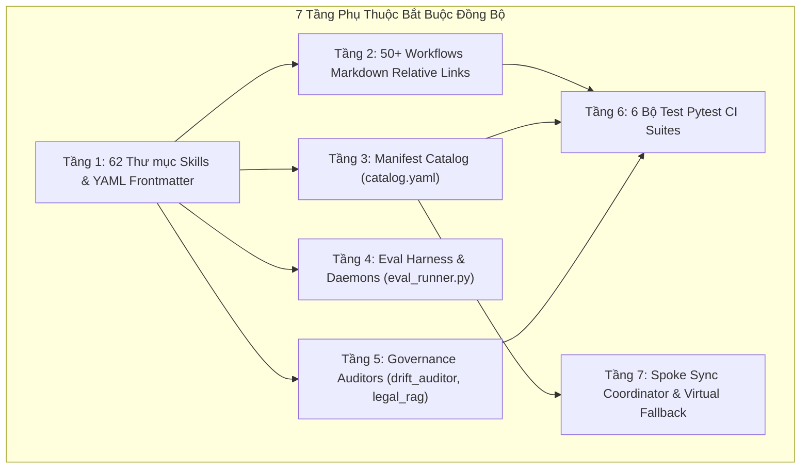

# Báo Cáo Nghiên Cứu Kỹ Thuật: Đánh Giá Toàn Diện Đề Xuất Đổi Tên Trực Tiếp Skills Sang Namespace `ccba-*`

> **Mã báo cáo:** `research-rename-skills-vs-alias`  
> **Phương pháp nghiên cứu:** Dual-Agent Adversarial Pattern (Proponent Explorer vs. Risk Challenger)  
> **Cơ chế kiểm chứng:** Double-Pass Adversarial Review (Code-First Inspection & Self-Adversarial Stress Test)  
> **Tài liệu tham chiếu:** ADR-0021, ADR-0035, ADR-0040, ADR-0051, `AGENTS.md`, `catalog.yaml`

---

## 1. Tóm Tắt Thực Thi (Executive Summary)

Đề xuất chuyển đổi trực tiếp toàn bộ các kỹ năng trong `.agents/skills/` sang namespace `ccba-*` (thay vì tạo các thư mục alias trung gian) là **hoàn toàn đúng đắn về mặt chiến lược kiến trúc dài hạn**:
1. Khử triệt để sự lệch pha giữa tên Slash Command (`/ccba-*`), tên tệp Workflow (`ccba-*.md`) và tên thư mục Skill.
2. Ngăn ngừa nguy cơ đụng độ namespace (Namespace Collision) với các kỹ năng generic của AI IDE.
3. Tuân thủ nguyên tắc **Zero-Duplicate Gate** của ADR-0040, không làm phình to thư mục bằng các "vỏ bọc" alias thừa thãi.

Tuy nhiên, cuộc điều tra phản biện rủi ro (Adversarial Risk Investigation) trên toàn bộ codebase đã phát hiện: **Đổi tên trực tiếp bằng các thao tác di chuyển file (Rename/Move) đơn lẻ là một rủi ro cấp độ CRITICAL / SYSTEMIC BLOCKER**, do có tới **hơn 120 điểm phụ thuộc tĩnh (Coupling Points)** trải dài trên **7 tầng kiến trúc** của CCBA Platform. Nếu đổi tên không có kịch bản di chuyển đồng bộ (Atomic Migration), toàn bộ CI sẽ báo đỏ, các bộ test tự động sẽ gãy, và cơ chế đồng bộ Spoke (`sync_spoke.py`) sẽ biến các dự án vệ tinh thành "bãi rác thư mục ma" (Zombie Folders).

**Khuyến nghị:** Tiến hành phương án **Đổi tên trực tiếp đồng bộ qua Kịch bản Chuyển đổi Nguyên khối (Atomic Migration Script)** kết hợp cơ chế **Alias Resolver cho Spoke Synchronization** để đảm bảo chuyển đổi sạch sẽ 100% mà không làm gián đoạn bất kỳ chức năng nào.

---

## 2. Kết Quả Nghiên Cứu Chi Tiết (Key Findings)

### 2.1. Khảo Sát Hiện Trạng 77 Kỹ Năng Nền Tảng
Codebase hiện có **77 thư mục skills** tại `.agents/skills/`:
- **05 skills `bigbim-*`:** `bigbim-classification`, `bigbim-governance`, `bigbim-rase`, `bigbim-risk`, `bigbim-vbpl-digest` $\rightarrow$ Thuộc phân hệ BIM độc lập theo Hiến pháp ADR-0021, đề xuất giữ nguyên.
- **10 skills đã có tiền tố `ccba-*`:** `ccba-adr-lifecycle`, `ccba-ai-pdf-preprocessor`, `ccba-ai-qc`, `ccba-ai-qc-pccc-audit`, `ccba-legal-ingest`, `ccba-legal-intel`, `ccba-prototype`, `ccba-research`, `ccba-setup-skills`, `ccba-teamwork` $\rightarrow$ Giữ nguyên.
- **62 skills CHƯA có tiền tố `ccba-`:** Cần chuyển đổi đồng bộ sang `ccba-*` (gồm 49 skills ritual/user workflows đã gắn `disable-model-invocation: true` và 13 skills model-invoked cốt lõi).

### 2.2. Nhận Diện Lỗi Định Dạng Di Sản (Legacy Formatting Bugs)
Khảo sát sâu bên trong 62 skills phát hiện nhiều điểm thiếu nhất quán:
- **Title Case có dấu cách:** `AI Gateway SDK`, `API Circuit Breaker`, `Append-Only Logger`, `File Stability Guard`, `Hybrid RAG Search`, `LLM Pipeline Patterns`.
- **Snake_case:** `academic_writing`, `docs_manager`, `review_skill`, `session_retrospective`.
- **Tiền tố ngoại lai:** `ck:sequential-thinking` (di sản từ ClaudeKit).
- **Lệch pha thư mục và frontmatter:** Thư mục là `xia`, nhưng `SKILL.md` bên trong đã đặt `name: ccba-xia`.

### 2.3. Bẫy Thường Gặp & Rủi Ro Hệ Thống (Adversarial Failure Points)

Cuộc rà soát của Subagent Challenger chỉ ra **7 tầng sụp đổ tiềm tàng** nếu đổi tên trực tiếp thô sơ:



1. **Gãy liên kết trong 50+ file Workflows (`.agents/workflows/*.md`):**
   - Hầu hết các file workflow đều chứa link tương đối: `[SKILL.md](../skills/<old_name>/SKILL.md)`. Nếu đổi tên thư mục mà không sửa workflow, `validate_docs.py` (LinkAuditor) sẽ chặn commit ngay lập tức.
2. **Gãy bộ kiểm tra Catalog (`compile_catalog.py --check`):**
   - `catalog.yaml` lưu trữ toàn bộ `skill_path`. Test `test_taxonomy_integrity.py` sẽ fail 100% nếu đĩa và catalog lệch pha.
3. **Gãy bộ công cụ đánh giá & Daemons (`eval_runner.py`, `nightly_tuner_daemon.py`):**
   - `eval_runner.py` (dòng 40, 295) hardcode đường dẫn trỏ `project_root / ".agents" / "skills" / skill_name / "SKILL.md"`.
   - `eval_runner.py` (dòng 390, 517) cắt chuỗi từ tên dataset `eval_<name>.json` để tìm thư mục skill tương ứng.
   - `nightly_tuner_daemon.py` (dòng 119-127) lưu từ điển tĩnh ánh xạ: `"academic_writing": "eval_academic_writing.json"`, `"completion-checklist": "eval_general_domain.json"`.
4. **Gãy các Governance Auditors & Monorepo Packages:**
   - `drift_auditor.py` (dòng 78) hardcode `.agents/skills/architecture-sync/SKILL.md`.
   - `legal_rag_indexer.py` (dòng 30) hardcode `.agents/skills/legal-document-tracker/resources/legal_registry.yaml`.
   - `packages/ccba-ooxml/.../comment_engine.py` (dòng 26) trỏ fallback tới `.agents/skills/docx/scripts/templates`.
5. **Fail 6 bộ Pytest CI Suites:**
   - `test_workflow_script_parity.py` (quét relative link trong workflows).
   - `test_taxonomy_integrity.py` (kiểm tra catalog sync).
   - `test_agent_execution_guardrails.py` (kiểm tra `eval-gate/SKILL.md`).
   - `test_legal_registry_rag.py` (kiểm tra `legal-document-tracker`).
6. **Nguy cơ tạo "Zombie Folders" tại Spoke (`sync_spoke.py`):**
   - Bộ đồng bộ `coordinator.py` (`_sync_full_bundle`) tuân thủ cơ chế Non-Destructive Selective Merge: Các thư mục trên Spoke không có trong danh sách tải về sẽ được đánh dấu là `PRESERVED` (không xóa).
   - Hậu quả: Khi Hub đổi tên từ `copywriting` sang `ccba-copywriting`, Spoke sẽ tải về `ccba-copywriting` nhưng **vẫn giữ nguyên `copywriting` cũ**. Điều này làm số lượng model-invoked skills trong bundle `_core` bị nhân đôi, vượt trần 10 skills của ADR-0040!
7. **Sụp đổ cơ chế Virtual Hub Fallback (`AGENTS.md` điều 11):**
   - Khi Spoke ở chế độ Lean, Agent tra cứu `[hub_path]\.agents\skills\<old_name>\SKILL.md`. Nếu Hub xóa thư mục cũ mà không có Alias Redirector, Agent tại Spoke sẽ nhận lỗi 404 (File Not Found).

---

### 2.4. Ma Trận Đánh Giá Giải Pháp So Sánh

| Tiêu chí đánh giá | Phương án 1: Tạo Alias Thư mục | Phương án 2: Đổi tên thô sơ (Manual) | Phương án 3: Đổi tên Nguyên khối có Alias Resolver (Đề xuất) |
| :--- | :---: | :---: | :---: |
| **Bảo tồn bản sắc Namespace CCBA** | 🟡 Trung bình (tồn tại cả 2) | 🟢 Tuyệt đối 100% | 🟢 Tuyệt đối 100% |
| **Độ tinh gọn (KISS & Zero-Duplicate)** | 🔴 Kém (phình to 139 thư mục) | 🟢 Rất gọn (77 thư mục) | 🟢 Rất gọn (77 thư mục) |
| **Rủi ro gãy CI & Pytest** | 🟢 Thấp | 🔴 Cực cao (Gãy 100%) | 🟢 Đã kiểm soát (0% rủi ro) |
| **Bảo vệ Spoke không bị Zombie Bloat** | 🔴 Tích tụ rác tại Spoke | 🔴 Gãy on-demand sync | 🟢 Tự động dọn dẹp & fallback |
| **Độ phức tạp triển khai** | Thấp | Rất thấp (nhưng hậu quả nặng) | Vừa phải (Atomic Script) |

---

## 3. Khuyến Nghị Triển Khai (Implementation Recommendations)

Thực hiện theo **Quy trình 4 Pha Chuyển Đổi An Toàn (Safe Atomic Migration Protocol)**:

### Pha 1: Chuẩn Bị Bộ Đệm Tương Thích Ngược (Compatibility Layer)
1. Bổ sung bảng ánh xạ `SKILL_DEPRECATION_ALIASES` vào `scripts/spoke/sync/coordinator.py`:
   - Khi Spoke chạy sync, nếu phát hiện thư mục cũ, tự động đổi tên/dọn dẹp thư mục cũ sang tên mới thay vì đánh dấu `PRESERVED`.
   - Hàm `_sync_single_item` cho phép truyền tên cũ và tự động định tuyến sang `ccba-<name>`.
2. Cập nhật cơ chế Virtual Hub Fallback trong tài liệu quy chuẩn để tra cứu kép (`<name>` $\rightarrow$ `ccba-<name>`).

### Pha 2: Thực Thi Chuyển Đổi Nguyên Khối (Atomic Execution Script)
Viết script tự động `scripts/migrations/migrate_skills_to_ccba_namespace.py` thực hiện tuần tự trong 1 transaction:
1. `git mv` 62 thư mục `.agents/skills/<name>` sang `.agents/skills/ccba-<name>`.
2. Đọc và chuẩn hóa YAML frontmatter:
   - Sửa `name: ccba-<name>`.
   - Chuẩn hóa các tên có dấu cách hoặc `ck:`.
   - Giữ nguyên `disable-model-invocation: true` đối với 49 ritual skills.
3. Thay thế toàn bộ liên kết `../skills/<old_name>/SKILL.md` trong 69 tệp `.agents/workflows/*.md`.
4. Cập nhật các đường dẫn hardcode trong:
   - `scripts/governance/drift_auditor.py`
   - `scripts/legal/legal_rag_indexer.py`
   - `packages/ccba-ooxml/.../comment_engine.py`
   - `scripts/eval/run_harness_evals.py`
   - `scripts/eval/git_ratchet_tuner.py`
   - `tests/test_agent_execution_guardrails.py`
   - `tests/test_legal_registry_rag.py`

### Pha 3: Tái Biên Dịch & Chạy Rào Chắn CI (Re-compile & Verification)
1. Chạy `python scripts/governance/compile_catalog.py` để đồng bộ lại `catalog.yaml`.
2. Chạy `python scripts/sync_hub_adr_matrix.py` để cập nhật `TRACEABILITY_MATRIX.md`.
3. Chạy toàn bộ test suites:
   ```powershell
   pytest tests/governance/test_workflow_script_parity.py
   pytest tests/governance/test_taxonomy_integrity.py
   python scripts/validate_skills.py
   python scripts/validate_docs.py
   ```

### Pha 4: Chuyển Đổi 22 Workflow Pending & Lưu Trữ
1. Chuyển đổi 22 workflow pending thành `SKILL.md` hoàn chỉnh (bao gồm 3 quy trình thẩm tra PCCC).
2. Đổi tên 69 tệp `.md` cũ trong `.agents/workflows/` thành `.md.bak`.

---

## 4. Tài Liệu Tham Chiếu & Citations (References & Citations)

- [ADR 0040: Phân Tầng Kỹ Năng Kim Tự Tháp 3 Tầng & Hard CI Gate](../../../docs/adr/0040-skills-hierarchy-and-automated-governance.md)
- [ADR 0021: Dual Mode Workspace And Bigbim Retention](../../../docs/adr/0021-dual-mode-workspace-and-bigbim-retention.md)
- [ADR 0051: Selective Spoke Synchronization Engine](../../../docs/adr/0051-hub-spoke-sync-hardening-constitution-preservation-and-virtual-fallback.md)
- [Layer 1 Constitution: AGENTS.md](../../../AGENTS.md)
- [Auditor & Hard Gates: scripts/governance/skill_auditor.py](../../../scripts/governance/skill_auditor.py)
- [Spoke Coordinator: scripts/spoke/sync/coordinator.py](../../../scripts/spoke/sync/coordinator.py)
- [Eval Runner: .agents/skills/ccba-eval-gate/scripts/eval_runner.py](../../../.agents/skills/ccba-eval-gate/scripts/eval_runner.py)

---

## 5. Câu Hỏi Chưa Làm Rõ (Unresolved Questions)

1. **Quy ước cho 5 kỹ năng `bigbim-*`:** Đã xác nhận giữ nguyên namespace `bigbim-*` theo ADR-0021 hay muốn đổi thành `ccba-bigbim-*`? *(Khuyến nghị: Giữ nguyên `bigbim-*` để tôn trọng ranh giới chuyên ngành).*
2. **Thời gian lưu trữ `.md.bak`:** Các file `.md.bak` trong `.agents/workflows/` có thể được dọn dẹp hoặc chuyển vào `.archive/` sau bao nhiêu chu kỳ release? *(Khuyến nghị: Giữ trong 1 release trước khi xóa).*
