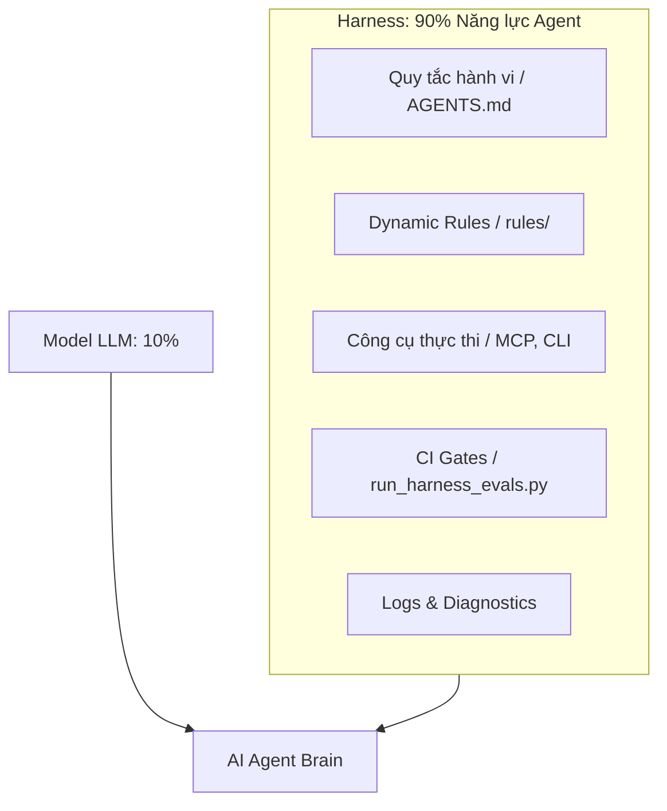

# Nghiên Cứu Tích Hợp: The New SDLC, Vibe Coding & Agentic Engineering

Tài liệu này nghiên cứu, đối chiếu và tổng hợp tri thức từ hai nguồn thông tin chiến lược:
1.  **Bài giảng YouTube:** Khóa học thực hành *"5-Day AI Agents: Intensive Vibe Coding Course"* của Kaggle/Google.
2.  **Whitepaper Kaggle:** *"The New SDLC With Vibe Coding"* (co-authored bởi Addy Osmani, Shubham Saboo và Sokratis Kartakis, phát hành tháng 6/2026).

---

## 1. Bản Đồ Quang Phổ Phát Triển Phần Mềm Mới

Mô hình phát triển phần mềm mới (The New SDLC) không phải là một sự lựa chọn nhị phân, mà là một **Quang phổ chuyển tiếp (Spectrum)** từ sự ngẫu hứng đến tính kỷ luật:

```text
  [ NGẪU HỨNG ] ◄────────────────────────────────────────► [ KỶ LUẬT ]
  ┌────────────────────────┐                    ┌────────────────────────┐
  │      Vibe Coding       │                    │  Agentic Engineering   │
  ├────────────────────────┤                    ├────────────────────────┤
  │ - Intent-driven        │                    │ - Rigorous Spec        │
  │ - Iterative Prompting  │                    │ - Automated Evals      │
  │ - Quick Prototypes     │                    │ - CI/CD Gates          │
  │ - Low Token Cost (Init)│                    │ - High Reliability     │
  └────────────────────────┘                    └────────────────────────┘
```

*   **Vibe Coding (Lập trình Ngẫu hứng):**
    *   *Khái niệm:* Quá trình nhà phát triển sử dụng các câu lệnh ngôn ngữ tự nhiên đơn giản (prompts) để ra lệnh cho AI sinh code, chấp nhận kết quả chạy thử và sửa đổi lặp đi lặp lại một cách ngẫu hứng.
    *   *Ưu điểm:* Cực kỳ hiệu quả cho việc thử nghiệm ý tưởng (prototyping), hackathon, viết script nhanh và học tập.
    *   *Nhược điểm:* Không có tính lặp lại (non-deterministic), dễ sinh ra nợ kỹ thuật lớn (spaghetti/slop code), thiếu tính bảo mật và kiểm thử, chi phí token OpEx tăng vọt theo cấp số nhân khi codebase phình to.
*   **Agentic Engineering (Kỹ nghệ Tác tử):**
    *   *Khái niệm:* Cách tiếp cận có cấu trúc, sử dụng các rào chắn (guardrails), hệ thống kiểm định tự động (linter, typecheck, tests) và sự phê duyệt của con người ở các seam (khớp nối) quan trọng để điều phối các tác tử hoàn thành nhiệm vụ phức tạp.
    *   *Ưu điểm:* Codebase có tính mở rộng cao, bảo mật, ổn định tuyệt đối và có khả năng chạy trên môi trường production.
    *   *Nhược điểm:* Đòi hỏi chi phí đầu tư ban đầu (CapEx) cao để xây dựng Harness.

---

## 2. Triết Lý Cốt Lõi: "An Agent is a Model plus a Harness"

Một luận điểm trung tâm của Whitepaper Google chỉ ra rằng:
> **Năng lực của một AI Agent = 10% Mô hình LLM (Model) + 90% Rào chắn & Công cụ (Harness)**

Khi một tác tử AI thất bại hoặc sinh code lỗi, **nguyên nhân 90% nằm ở việc thiết kế Harness yếu kém** chứ không phải do mô hình LLM kém thông minh.



### Các thành phần cấu tạo nên Harness bao gồm:
1.  **Instructions & Rule Files:** Định hình hành vi và ranh giới hoạt động của Agent (như `AGENTS.md` - Layer 1 Constitution và các Dynamic Rules con).
2.  **Tools & MCP Integration:** Các công cụ giúp Agent tương tác vật lý với hệ thống (Terminal, File System, API Web).
3.  **CI Gates & Automated Evals:** Bộ kiểm tra tính đúng đắn của mã nguồn (Ruff, Mypy, Pytest).
4.  **Observability & Logs:** Ghi nhận vết thực thi để chẩn đoán lỗi cục bộ.

---

## 3. Sự Dịch Chuyển Điểm Nghẽn & Vai Trò Mới Của Kỹ Sư

Trong kỷ nguyên mới, vòng đời phát triển phần mềm (SDLC) được nén lại một cách không đồng đều:
*   **Pha Viết Code (Implementation):** Bị nén cực hạn từ *hàng tuần* xuống *hàng giờ* nhờ AI sinh mã nhanh chóng.
*   **Pha Đặc tả (Specification) & Xác thực (Verification):** Vẫn diễn ra chậm hơn và đòi hỏi sự tập trung tối đa của con người.

Do đó, **điểm nghẽn (bottleneck) của phát triển phần mềm đã dịch chuyển từ Tốc độ gõ code (typing speed) sang Đặc tả ý đồ (intent specification) và Xác thực chất lượng (verification).**

### Vai trò của Kỹ sư phần mềm chuyển dịch từ:
*   *Người viết code (Code Writer)* $\rightarrow$ **Người điều phối hệ thống (System Orchestrator)**.
*   *Người thực thi cú pháp* $\rightarrow$ **Người phán xét và kiểm chứng chất lượng (Arbiter of Quality)**.
*   Kỹ sư không còn lập trình trực tiếp, mà họ **lập trình ra môi trường (Harness)** để AI Agent lập trình một cách an sau.

---

## 4. Khuyến Nghị Thực Hành Cho Các Dự Án Spoke Tại CCBA

Để áp dụng các kết quả nghiên cứu này vào thực tế phát triển phần mềm tại CCBA, chúng ta cần tuân thủ 3 nguyên tắc vàng:

### 1. Áp dụng Mô hình Nhà máy (Factory Model SDLC)
*   **Không code trực tiếp khi chưa có Spec:** Luôn bắt đầu bằng việc thảo luận, phỏng vấn Socrates chất vấn giả định thông qua Slash Command `/ccba-new-feature` để xây dựng tệp `implementation_plan.md` hoàn chỉnh.
*   **Cô lập Ngữ cảnh (Context Isolation):** Sau khi duyệt kế hoạch, bắt buộc chuyển sang một session chat mới sạch sẽ để tiến hành code. Tránh trộn lẫn thảo luận và code để ngăn ngừa Context Rot.

### 2. Đầu tư vào Verification Harness (Evals)
*   Mọi dự án Spoke khi khởi tạo bắt buộc phải có script kiểm định tự động cục bộ (`run_harness_evals.py`).
*   Tích hợp chặt chẽ Ruff, Mypy và pytest. Agent chỉ được phép merge PR sau khi toàn bộ các Gate này báo `PASS`.

### 3. Tận dụng Dynamic Rules để tối ưu OpEx
*   Tránh gộp các quy chuẩn nghiệp vụ dài dòng vào `AGENTS.md` toàn cục.
*   Tách biệt thành các rule nhỏ trong thư mục `.agents/rules/` và gọi JIT để tiết kiệm tối đa token sử dụng cho mỗi lượt tương tác chat.

---
*Tạo bởi CCBA — Trung tâm Tư vấn và Ứng dụng BIM trong Xây dựng*

*Nội dung này được tạo bởi AI Agent và cần được xem xét bởi chuyên gia pháp lý và kỹ thuật trước khi áp dụng.*
