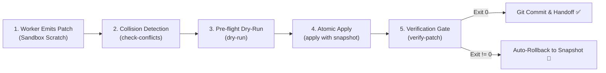

# Đặc Tả Kỹ Thuật: Giao Thức Structured Diff Patch & Single-Writer Protocol Cho Multi-Agent

> **Mã định danh**: `SPEC-2026-TEAMWORK-DIFF-001`  
> **Trạng thái**: Standard / Active  
> **Tham chiếu nền tảng**: [ADR-0035 (Deep Modules)](../../../docs/adr/0035-polyglot-deep-modules-and-subagent-guardrails.md) | [ADR-0053 (Teamwork Framework)](../../../docs/adr/0053-teamwork-multi-agent-orchestration-framework.md) | [ADR-0057 (Two-Stage Decision)](../../../docs/adr/0057-two-stage-granularity-decision-framework-and-gpi.md)

---

## 1. Bối Cảnh & Nguyên Lý Cốt Lõi (Core Principles)

Trong hệ thống điều phối đa tác tử (`ccba-teamwork`), nhiều Worker Subagents thực thi song song các workstreams độc lập. Để bảo đảm tính toàn vẹn tuyệt đối của mã nguồn và triệt tiêu xung đột, hệ thống áp dụng 3 nguyên tắc bất biến:

1. **Nguyên Tắc "Không Can Thiệp Trước" (No Pre-mutation Principle)**:
   - Worker Subagents tuyệt đối **KHÔNG ĐƯỢC PHÉP** gọi các công cụ sửa file trực tiếp (`replace_file_content`, `write_to_file`) trên cây mã nguồn chính (`packages/`, `scripts/`, `docs/`).
   - Mọi đề xuất thay đổi phải được xuất thành tệp bản vá (Patch Artifact) lưu tại thư mục sandbox riêng biệt của Worker:
     `.\.md\scratch\teamwork\{project}\worker_{id}\patches\` (hoặc `.system_generated/scratch/worker_{id}/`).
2. **Giao Thức Tác Tử Ghi Duy Nhất (Single-Writer Protocol — ADR 0053)**:
   - **Lead Orchestrator** là thực thể duy nhất có quyền đọc các patches từ sandbox, thẩm định tính tương thích, phát hiện xung đột và thực hiện ghi chính thức lên codebase.
3. **Kiểm Định Khách Quan Bằng Exit-Code Trước Khi Hợp Nhất (Exit-Code Gate Integration)**:
   - Sau khi áp dụng patch, Orchestrator bắt buộc kích hoạt `ccba-harness verify-patch` (`pytest`, `ruff`, `mypy`). Nếu Exit Code $\ne 0$, toàn bộ codebase phải được tự động hoàn nguyên (**Auto-Rollback**) về trạng thái ban đầu.

---

## 2. Các Định Dạng Patch Được Hỗ Trợ (Supported Patch Formats)

### Định dạng A: Search-Replace Block (Khuyến nghị cho AI Agents)
Định dạng này lấy cảm hứng từ Cursor / Aider / Devin. Agent chỉ cần trích xuất chính xác đoạn code cần thay và đoạn code mới, không cần tính toán số thứ tự dòng:

```text
FILE: packages/ccba-ai/src/ccba_ai/service.py
<<<<<<< SEARCH
def calculate_budget(tokens: int) -> float:
    return tokens * 0.001
=======
def calculate_budget(tokens: int) -> float:
    if tokens < 0:
        raise ValueError("Tokens must be non-negative")
    return tokens * 0.001
>>>>>>> REPLACE
```

- **Quy tắc cú pháp**:
  - `FILE: <relative_path>`: Đường dẫn tương đối từ gốc monorepo.
  - `<<<<<<< SEARCH`: Bắt đầu khối tìm kiếm (phải khớp chính xác 100% với nội dung hiện có trên file).
  - `=======`: Ranh giới phân cách.
  - `>>>>>>> REPLACE`: Khối thay thế mới.

---

### Định dạng B: Unified Diff (`.diff` / `.patch`)
Định dạng tiêu chuẩn Git, thích hợp khi worker sử dụng công cụ `git diff`:

```diff
--- a/scripts/governance/drift_auditor.py
+++ b/scripts/governance/drift_auditor.py
@@ -45,3 +45,4 @@
 def check_drift():
+    # New check
     pass
```

---

### Định dạng C: Structured JSON Manifest (`patch.json`)
Dùng khi trao đổi dữ liệu có cấu trúc qua API giữa các orchestrators:

```json
[
  {
    "file": "packages/ccba-harness/src/ccba_harness/verifier.py",
    "search": "timeout: float = 60.0",
    "replace": "timeout: float = 120.0",
    "rationale": "Extend timeout for heavy e2e tests"
  }
]
```

---

## 3. Quy Trình Vận Hành 5 Bước (The 5-Step Lifecycle)



1. **Bước 1: Worker Xuất Patch vào Sandbox**:
   - Worker chạy scoped tests độc lập trong sandbox, hoàn thiện logic và ghi tệp patch vào `.\.md\scratch\teamwork\{project}\worker_{id}\patches\patch_{feature}.diff`.
2. **Bước 2: Phát Hiện Xung Đột (Collision Detection)**:
   - Orchestrator quét toàn bộ các tệp patch nhận được từ các workers trong cùng batch.
   - Nếu phát hiện **Line Collision** (hai worker cùng chạm vào một đoạn code trong cùng một file), Orchestrator lập tức từ chối, yêu cầu worker chạy sau phải rebase lại patch dựa trên kết quả của worker chạy trước.
3. **Bước 3: Thẩm Tra Tiền Trạm (Pre-flight Dry-Run)**:
   - Đọc nội dung tệp đích trên đĩa, xác thực xem 100% các khối `SEARCH` có tồn tại chính xác không. Nếu có bất kỳ khối nào không khớp (drift / stale patch), dừng lại và báo cáo lỗi chính xác.
4. **Bước 4: Áp Dụng Nguyên Tử (Atomic Apply with Snapshot)**:
   - Orchestrator tạo bản sao lưu trong bộ nhớ (In-Memory Snapshot) cho toàn bộ các file sắp sửa đổi.
   - Ghi đè các khối `REPLACE` lên codebase.
5. **Bước 5: Kích Hoạt Cổng Kiểm Định Exit-Code & Rollback**:
   - Tự động gọi `ccba-harness verify-patch --commands "pytest ..." "ruff check ..." "mypy ..."`.
   - Nếu tất cả lệnh đạt exit code 0 $\rightarrow$ Nghiệm thu và tạo commit Git.
   - Nếu có bất kỳ lệnh nào exit code $\ne 0$ $\rightarrow$ Kích hoạt hàm `rollback()` khôi phục ngay lập tức 100% trạng thái đĩa ban đầu từ Snapshot.

---

## 4. Công Cụ Hỗ Trợ Chính Thức

Hệ thống cung cấp tiện ích CLI:
`python scripts/governance/apply_worker_patch.py [OPTIONS]`

- `--patch <file>`: Nạp một tệp patch đơn lẻ.
- `--patch-dir <dir>`: Quét và nạp toàn bộ các patches trong thư mục sandbox.
- `--check-conflicts`: Chỉ kiểm tra va chạm giữa các patches.
- `--dry-run`: Kiểm tra khớp nối nội dung mà không ghi đĩa.
- `--apply`: Thực hiện áp dụng nguyên tử.
- `--verify`: Tự động gọi `ccba-harness verify-patch` và rollback nếu lỗi.
