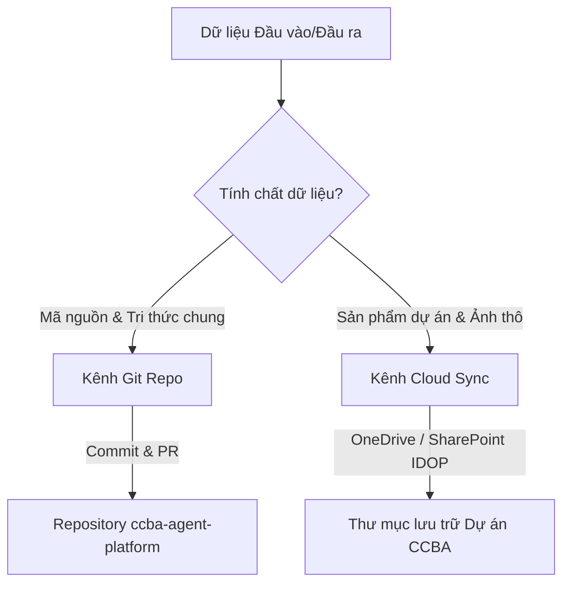

# Đề xuất Kiến trúc: Chiến lược Đồng bộ Tri thức và Phân hoạch Thư mục Hub/Spoke

Tài liệu này đề xuất chiến lược phân hoạch dữ liệu và khớp nối đồng bộ giữa hệ thống quản lý phiên bản Git (Repo nhân) và hệ thống lưu trữ đám mây (Cloud Sync - SharePoint/OneDrive) nhằm bảo vệ tính tinh gọn của hạt nhân Platform Hub, đồng thời tối ưu hóa khả năng cộng tác tài liệu dự án của CCBA.

---

## 1. Bối cảnh & Sự cần thiết

Hiện tại, CCBA Agent Platform đóng hai vai trò song song:
1.  **Hạt nhân Nền tảng (Platform Hub):** Chứa các kịch bản thực thi (workflows), kỹ năng tự động (skills), cẩm nang chung (guidelines) và tệp tri thức tích lũy qua các phiên làm việc (`session_learnings.md`).
2.  **Môi trường Thực thi (Spoke/Runtime):** Nơi các kỹ sư và AI Agent trực tiếp chạy công cụ để sản xuất tài liệu (như cào video, viết bài báo, lập checklist nghiệm thu).

Nếu không phân định rõ ràng ranh giới dữ liệu, việc chạy các công cụ R&D trực tiếp trên Hub sẽ dẫn đến:
*   **Ô nhiễm lịch sử Git (Git Bloat):** Các tệp nhị phân lớn như `.docx`, `.pdf`, và hàng trăm khung hình ảnh `.webp` từ video YouTube bị commit lên Git, làm phình to repository và gây chậm tiến trình clone/pull.
*   **Lỗi phân nhóm tri thức (Category Error):** Sản phẩm nghiên cứu của một đề tài cụ thể (ví dụ: bài viết về Văn hóa Âm tính) bị trộn lẫn vào lịch sử mã nguồn của nền tảng phát triển, gây nhiễu loạn thông tin khi các nhà phát triển khác cập nhật code.

---

## 2. Triết lý Thiết kế: "Nhân Git - Vệ tinh Cloud" (Git Core, Cloud Artifacts)

Chúng ta tách biệt tuyệt đối kênh đồng bộ dựa trên tính chất của dữ liệu:



1.  **Kênh Git (ccba-agent-platform):** Chỉ lưu trữ mã nguồn kịch bản, cấu hình chuẩn hóa, hướng dẫn nghiệp vụ và bài học kinh nghiệm tích lũy chung của cả tổ chức.
2.  **Kênh Cloud Sync (SharePoint/OneDrive):** Lưu trữ toàn bộ các tệp tài liệu sản phẩm cuối (.docx, .xlsx, .pdf), hình ảnh tư liệu thô, phụ đề thô và các báo cáo kiểm duyệt của từng đề tài/dự án cụ thể.

---

## 3. Bản đồ Phân hoạch Thư mục & Kênh Đồng bộ

Để khớp nối hai kênh đồng bộ này trên cùng một cây thư mục local, hệ thống phân hoạch thư mục `.md/` như sau:

| Phân vùng thư mục | Nội dung lưu trữ | Quyền sở hữu (Owner) | Kênh đồng bộ chính | Git Status |
| :--- | :--- | :--- | :--- | :--- |
| **`.agents/`** | Skills, Workflows, Templates cốt lõi. | Platform Team | **Git Repo** | **Tracked** |
| **`.md/configs/`** | Cấu hình định danh, brand rules tĩnh. | Platform Team | **Git Repo** | **Tracked** |
| **`.md/guidelines/`** | Tài liệu cẩm nang, quy chuẩn, bài học kinh nghiệm (`session_learnings.md`). | R&D Team | **Git Repo** | **Tracked** |
| **`.md/knowledge/research_and_studies/`** | Tài liệu nghiên cứu kiến trúc hệ thống toàn cục, specs và roadmap định hướng chung (Ví dụ: đề xuất kiến trúc này). *Không chứa sản phẩm cụ thể của các đề tài.* | R&D Team | **Git Repo** | **Tracked** |
| **`.md/data/`** | `legal_registry.yaml`, các DB tĩnh. | Legal/Standard Team | **Git Repo** | **Tracked** |
| **`.md/projects/`** | Toàn bộ sản phẩm cụ thể của đề tài/dự án (nháp, Word, ảnh video, transcript...). | Tác giả đề tài / PM | **Cloud Sync** (OneDrive/SharePoint) | **Ignored** (Chỉ giữ thư mục rỗng qua `.gitkeep`) |
| **`.md/scratch/`** | Các test script, file log tạm thời. | Kỹ sư phát triển | Local Only | **Ignored** |

---

## 4. Cơ chế Khớp nối và Đồng bộ hóa

### A. Quy tắc `.gitignore` cưỡng chế tại Hub
Để đảm bảo các sản phẩm dự án cụ thể không bao giờ vô tình bị đẩy lên Git của Hub, tệp `.gitignore` gốc của Platform phải cấu hình các bộ lọc đệ quy nghiêm ngặt:

```gitignore
# Loại trừ toàn bộ sản phẩm cụ thể khỏi Git Hub
.md/projects/**/*
!.md/projects/.gitkeep

# Chặn đệ quy các tệp nhị phân lớn và ảnh chụp tạm
**/*.docx
**/*.pdf
**/images/*.webp
**/images/*.png
**/images/*.jpg
```

### B. Liên kết Thư mục Đám mây (Cloud Mount/Link)
1.  **Thiết lập thư mục:** Thư mục `.md/projects/` tại local của kỹ sư sẽ được cấu hình liên kết trực tiếp với một thư mục tương ứng trên SharePoint hoặc OneDrive thông qua tính năng **OneDrive Folder Sync** hoặc tạo liên kết tượng trưng (Symlink/Junction trên Windows):
    ```powershell
    # Ví dụ tạo Junction trỏ thư mục dự án đến thư mục OneDrive đang sync
    cmd /c mklink /J "D:\GitHubProjects\ccba-agent-platform\.md\projects\NC_Van_Hoa_Am_Tinh_Tu_Van_XD" "C:\Users\username\OneDrive - CCBA\Research\NC_Van_Hoa_Am_Tinh_Tu_Van_XD"
    ```
2.  **Quy trình viết bài và sinh sản phẩm:**
    *   AI Agent chạy `/ccba-youtube-learn` hoặc `/ccba-academic-writing` lưu tệp trực tiếp vào `.md/projects/NC_Van_Hoa_Am_Tinh_Tu_Van_XD/`.
    *   OneDrive/SharePoint tự động đẩy các tệp nhị phân (.docx) và ảnh WebP lên đám mây trong tích tắc.
    *   Git hoàn toàn bỏ qua thư mục này nhờ quy tắc `.gitignore`.

### C. Quy chuẩn Trích dẫn Tài nguyên (Resource Citation Rules)
Khi viết tài liệu tri thức chung trên Git (ví dụ: cẩm nang guidelines hoặc báo cáo tóm tắt) và cần tham chiếu đến sản phẩm cụ thể:
*   **Không** sử dụng đường dẫn file local dạng `file:///...` đến các tệp nhị phân bị Git ignore.
*   **Bắt buộc** trích dẫn bằng **Đường dẫn chia sẻ trực tuyến (SharePoint/OneDrive Shared Link)** hoặc ghi rõ mã hiệu lưu trữ của tài liệu trên hệ thống IDOP.
    *   *Đúng:* `[Tải bản Word của Bài nghiên cứu (SharePoint Link)](https://ccba.sharepoint.com/.../NC_Van_Hoa_Am_Tinh.docx)`
    *   *Sai:* `[Tải bản Word](file:///d:/.../NC_Van_Hoa_Am_Tinh.docx)`

### D. Hướng dẫn Khởi tạo Spoke từ Thư mục SharePoint Đồng bộ
Khi kỹ sư tiếp quản hoặc khởi tạo một thư mục dự án mới trên hệ thống SharePoint của CCBA đã được đồng bộ về máy tính (thông qua OneDrive Sync Client):
1.  **Mở thư mục trên IDE:** Kỹ sư mở trực tiếp thư mục dự án đã đồng bộ cục bộ đó trên IDE của mình.
2.  **Khởi chạy lệnh kết nối:** Thực thi lệnh `/ccba-init-spoke` trên IDE.
    *   Kịch bản sẽ tự động khởi tạo không gian làm việc Spoke, tạo tệp ngữ cảnh dự án `.md/workspace_context.yaml` để onboard cho Agent.
    *   Tự động sao chép các bundle kỹ năng/workflows tương ứng từ Platform Hub trung tâm (thông qua biến môi trường `CCBA_HUB_PATH`) về thư mục `.agents/` của Spoke.
    *   Tạo tệp `.gitignore` chuẩn hai lớp để đảm bảo các tệp tin sản phẩm nhị phân lớn và ảnh thô luôn được giữ an toàn trên đám mây SharePoint để chia sẻ cho cả tổ chức mà không bị commit ngược lên Git.

---
*Tạo bởi CCBA — Trung tâm Tư vấn và Ứng dụng BIM trong Xây dựng*

*Nội dung này được tạo bởi AI Agent và cần được xem xét bởi chuyên gia pháp lý và kỹ thuật trước khi áp dụng.*
