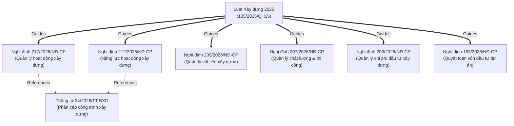

## Relationship Diagram

```mermaid
graph TD
    Main["Luật Xây dựng 2025<br>(135/2025/QH15)"]
    
    ND217["Nghị định 217/2026/NĐ-CP<br>(Quản lý hoạt động xây dựng)"]
    ND212["Nghị định 212/2026/NĐ-CP<br>(Năng lực hoạt động xây dựng)"]
    ND209["Nghị định 209/2026/NĐ-CP<br>(Quản lý vật liệu xây dựng)"]
    ND207["Nghị định 207/2026/NĐ-CP<br>(Quản lý chất lượng & thi công)"]
    ND206["Nghị định 206/2026/NĐ-CP<br>(Quản lý chi phí đầu tư xây dựng)"]
    ND193["Nghị định 193/2026/NĐ-CP<br>(Quyết toán vốn đầu tư dự án)"]
    TT34["Thông tư 34/2026/TT-BXD<br>(Phân cấp công trình xây dựng)"]

    Main ==>|Guides| ND217
    Main ==>|Guides| ND212
    Main ==>|Guides| ND209
    Main ==>|Guides| ND207
    Main ==>|Guides| ND206
    Main ==>|Guides| ND193
    
    ND217 -.->|References| TT34
    ND212 -.->|References| TT34
```

