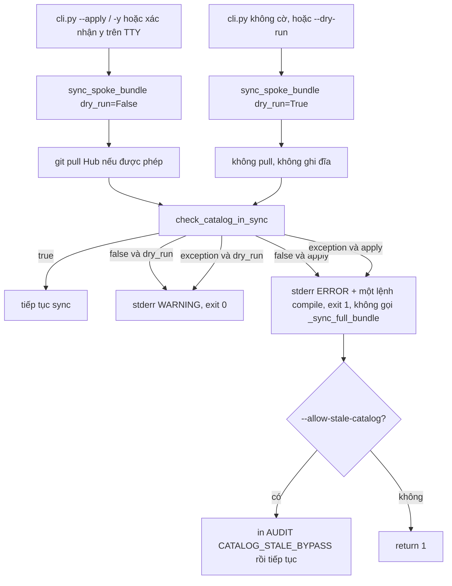
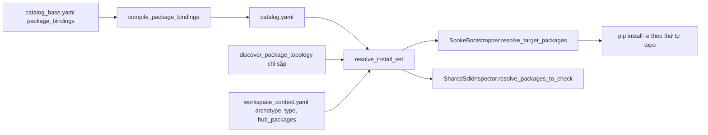
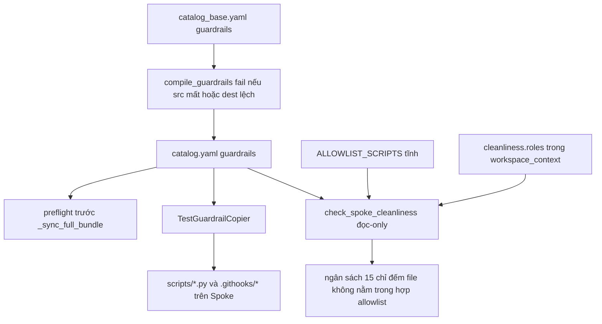

# Kế hoạch triển khai — 3 nâng cấp bảo đảm đồng bộ Hub → Spoke

> **Người lập kế Kế hoạch đã ghi tại `.md/peer_exchange/grok_plan_3_action_items.md`. Phán quyết `PLAN_SUBMITTED`, phiên bản Hub-Spoke v2.1, khối lượng M, rủi ro trung bình.

Ba quyết định chốt:

- **`--apply` fail-closed.** Catalog stale hoặc lỗi freshness thì thoát 1, trước khi ghi Spoke, kèm đúng một lệnh `python scripts/governance/compile_catalog.py --write`. Dry-run vẫn chỉ cảnh báo và thoát 0. `--force` không được dùng để vượt cổng này. Cửa khẩn là `--allow-stale-catalog`, có dòng `CATALOG_STALE_BYPASS`. Hub read-only không tự biên dịch.
- **Package chọn từ catalog, topo chỉ sắp.** Khóa mới `package_bindings`. `ccba-diagram` chỉ gắn bundle `_bim`, không gắn mọi archetype. Thiếu khóa thì giữ nguyên `ARCHETYPE_TIER1_DEFAULTS`. `hub_packages` khác rỗng vẫn chặn default archetype và bundle.
- **Guardrail một nguồn.** `guardrails: []` nghĩa là không copy. Fallback bảy mục chỉ khi khóa vắng. Cleanliness cộng tên `scripts/<file>.py` từ catalog vào allowlist, và vẫn giữ sàn tĩnh khi không thấy Hub. Loader này chỉ đọc, không gọi `HubDiscoverer` vì hàm đó có thể ghi `workspace_context.yaml`.

Thứ tự merge là PR-1 (cổng freshness) rồi PR-2 (guardrail và allowlist) rồi PR-3 (binding package). `check_catalog_in_sync` hiện chưa so khóa `guardrails`, nên PR-1 phải thêm field đó. File `docs/adr/0062-...md` chưa có trên đĩa. PR-1 tạo nó và thu hẹp điều kiện “cảnh báo không chặn” còn đúng dry-run.

Biên lai Seam: `NO_MATCH`, `index_sha256` `2e8e20af154fe217ef7f457c714ac2b817a4367fda2520e3d3f46431df111e66`. Không có thẻ năng lực cho việc này, nên kế hoạch sửa các hàm sẵn có và không thêm package mới.
audit_spoke_sync_guarantees.md` (mã ngày 2026-10-05, đọc lại trước khi viết plan này):

| Khẳng định cũ | Hiện trạng đã đọc |
|---|---|
| `catalog_base.yaml` không có khóa `guardrails` | Có. Khối tại dòng 89–121, bảy mục. `catalog.yaml` dòng 1424–1463 đã biên dịch cùng bảy mục. |
| Fallback 7 mục trong `TestGuardrailCopier` | Vẫn còn, dòng 70–119 của `scripts/spoke/sync/sdk_inspector.py`, kích hoạt khi list rỗng hoặc thiếu khóa. |
| `ALLOWLIST_SCRIPTS` là danh sách thứ ba | Đúng. `scripts/spoke/check_spoke_cleanliness.py` dòng 23–34. |
| Freshness nuốt lỗi và không chặn `--apply` | Đúng. `coordinator.py` dòng 1188–1203. `except Exception: pass`. Exit vẫn 0. |
| Freshness bao phủ guardrail | Sai. `check_catalog_in_sync` chỉ so `hub_path`, `hub_repo`, `notebook_ids`, `bundles`, `rules`, `knowledge` (dòng 687). Thêm guardrail vào `catalog_base.yaml` mà quên `--write` vẫn có thể trả `is_in_sync=True`. |
| File ADR-0062 | Không có trong `docs/adr/`. Quyết định đang sống ở peer review và comment mã. PR-1 ghi file ADR còn thiếu. |

Điểm lệch hành vi phải khóa bằng test, không được “sửa cho giống nhau” ngoài catalog:

- `resolve_target_packages()` bỏ qua Tier 1 khi `hub_packages` khác rỗng. Tier 0 (`ccba-harness`, `ccba-ai`) luôn có.
- `ccba-legal-intel` chỉ vào tập cài khi `is_legal_related_spoke(...)` đúng.
- `SharedSdkInspector.resolve_packages_to_check()` còn một nhánh riêng: `project_type == "Phần mềm"` (không có archetype) vẫn gợi ý `ccba-ooxml`, `ccba-pdf-prep`, `mdconverter`. Bootstrap thì không, vì `"Phần mềm"` không nằm trong `PROJECT_TYPE_TO_ARCHETYPE`. Khi `package_bindings` có mặt, hai hàm dùng một tập. Khi khóa vắng, mỗi hàm giữ đúng hành vi cũ của nó.

## 1. Kiến trúc và luồng dữ liệu

Thứ tự merge: **PR-1 (Action 1) → PR-2 (Action 3) → PR-3 (Action 2)**. Action 3 và Action 2 cùng sửa `sdk_inspector.py`. Action 3 làm cổng freshness nhìn thấy lệch guardrail. Action 2 thêm khóa catalog mới sau khi cổng đó đã cứng.

### 1.1 Action 1 — cổng cứng catalog stale



`--force` / `--ignore-dirty` giữ nguyên nghĩa “bỏ qua working tree bẩn của `.agents/`”. Nó không mở cổng catalog.

Hub read-only không đổi được phán quyết. `check_catalog_in_sync` chỉ đọc. Spoke không tự `compile_catalog.py --write`. Nếu `os.access(catalog_file, os.W_OK)` là false, thông báo thêm một câu: maintainer của Hub phải chạy lệnh và commit. Câu đó không phải lệnh thứ hai.

`sync_all_spokes` dùng cùng helper. Spoke đầu tiên pull. Nếu halt reason là `catalog_stale`, vòng lặp dừng. Các Spoke sau không bị ghi. Mã thoát batch vẫn là 1.

### 1.2 Action 2 — binding package qua catalog



Tập cài là hợp của các tầng sau, rồi mới đem đi sắp bằng topo hiện có:

1. `tier0` — luôn có, tối thiểu `ccba-harness` và `ccba-ai`.
2. `hub_packages` nếu khai báo khác rỗng. Khi tầng này có phần tử, archetype và bundle **không** được cộng thêm. Đây là hợp đồng hiện tại, giữ nguyên.
3. Nếu `hub_packages` rỗng: package của archetype, cộng package của mọi bundle mà `bundles[project.type]` và `additional_bundles` phân giải ra.
4. Phần tử có `when: legal_related` chỉ giữ khi `is_legal_related_spoke` đúng.

`ccba-diagram` không được thêm vào mọi archetype. Nó chỉ đứng trong `bundles._bim`. Spoke `project.type: BIM` nhận nó. Spoke `Pháp điển` không nhận nó. Fixture hồi quy chứng minh cả hai chiều.

### 1.3 Action 3 — một SSoT guardrail, allowlist là phép hợp



Ba nguồn allowlist cộng lại, không thay thế nhau:

- Sàn tĩnh `ALLOWLIST_SCRIPTS` — Spoke không mount được Hub vẫn chạy được hook.
- Tên file `scripts/<một cấp>.py` lấy từ `dest` của guardrail trong catalog — guardrail mới hết bị tính vào ngân sách 15.
- `cleanliness.allowed_scripts` và `cleanliness.roles` — ADR-0061, vai trò vẫn thắng tiền tố tạm.

`HubDiscoverer.discover()` không được gọi từ cleanliness. Hàm đó có thể ghi `hub_path` tương đối vào `workspace_context.yaml`. Cleanliness chỉ đọc `CCBA_HUB_PATH`, `HUB_PATH`, map `windows`/`linux`/`posix`, rồi thư mục anh em `ccba-agent-platform`. Không ghi gì.

### 1.4 Deep Seam

Giữ và thu hẹp call site, không khai báo seam package mới trong `packages/*/AGENTS.md`.

| Seam hiện có | Việc làm |
|---|---|
| `SpokeSynchronizer.sync` / `sync_spoke_bundle` | Gọi helper freshness trước mọi ghi Spoke. |
| `check_catalog_in_sync` | Thêm `guardrails` (PR-1) và `package_bindings` (PR-3) vào vòng so base. |
| `compile_guardrails` | Từ “cảnh báo rồi vẫn ghi” thành “từ chối biên dịch”. |
| `compile_catalog_dict` | Thêm khóa `package_bindings` đã kiểm. |
| `SpokeBootstrapper.resolve_target_packages` | Ủy quyền cho `resolve_install_set`. |
| `discover_package_topology` | Không đổi hợp đồng: chỉ sắp một tập đã chọn. |
| `TestGuardrailCopier.copy_if_needed` | Đọc catalog. Fallback chỉ khi khóa vắng. Tôn trọng `git_index`. |
| `SharedSdkInspector.resolve_packages_to_check` | Cùng `resolve_install_set` khi binding có mặt. |
| `check_script_count` | Hợp allowlist tĩnh với tên guardrail động. |

Hàm mới, nằm trong module cũ:

- `assess_catalog_freshness(...)` trong `coordinator.py`
- `compile_package_bindings(...)` trong `compile_catalog.py`
- `resolve_install_set(...)` trong `spoke_bootstrap.py`
- `load_catalog_guardrail_script_names(...)` trong `check_spoke_cleanliness.py`

Không có file `scripts/spoke/sync/package_bindings.py`. Một hàm dùng chung trong `spoke_bootstrap.py` là đủ. Inspector import lười bên trong hàm để tránh vòng import với `is_legal_related_spoke`.

## 2. Đặc tả từng file

Hằng lệnh khắc phục, một chỗ, dùng lại ở coordinator và ở nhánh `--check` của compiler:

```python
CATALOG_RECOMPILE_COMMAND = "python scripts/governance/compile_catalog.py --write"
```

Đặt trong `scripts/governance/compile_catalog.py`. Mọi thông báo lỗi của cổng sync in đúng chuỗi này, không in biến thể thiếu `--write`.

### 2.1 PR-1 — Action 1

**`scripts/governance/compile_catalog.py` — `check_catalog_in_sync`**

Sửa vòng lặp dòng 687:

```python
_BASE_FIELDS: tuple[str, ...] = (
    "hub_path",
    "hub_repo",
    "notebook_ids",
    "bundles",
    "rules",
    "knowledge",
    "guardrails",
)
```

`package_bindings` chưa thêm ở PR-1, vì khóa chưa tồn tại. PR-3 nối thêm một phần tử.

So sánh list/dict đã parse, không so chuỗi YAML. Lệch thứ tự phần tử là lệch thật và phải `--write`.

**`scripts/spoke/sync/coordinator.py` — `SpokeSynchronizer.sync_spoke_bundle`**

Thay khối dòng 1188–1203. Chữ ký thêm `allow_stale_catalog: bool = False`, luồn qua `sync()`, `sync_project()`, `sync_all_spokes()`.

```python
def assess_catalog_freshness(
    hub_root: Path,
    *,
    dry_run: bool,
    allow_stale_catalog: bool,
) -> str | None:
    """Return halt reason 'catalog_stale' when --apply must stop.

    Dry-run always returns None after printing a warning.
    """
    catalog_file = hub_root / ".agents" / "skills" / "platform-loader" / "catalog.yaml"
    try:
        from scripts.governance.compile_catalog import (
            CATALOG_RECOMPILE_COMMAND,
            check_catalog_in_sync,
        )

        is_in_sync, detail = check_catalog_in_sync(hub_root)
    except Exception as exc:
        if dry_run:
            print(
                f"[Sync] WARNING: catalog freshness check failed: {type(exc).__name__}: {exc}",
                file=sys.stderr,
            )
            return None
        print(
            f"[Sync] ERROR: catalog freshness check failed: {type(exc).__name__}: {exc}",
            file=sys.stderr,
        )
        print(
            "  Remediation (run in the Hub root):\n"
            f"    {CATALOG_RECOMPILE_COMMAND}",
            file=sys.stderr,
        )
        return "catalog_stale"

    if is_in_sync:
        return None

    reason = _truncate_detail(detail, max_lines=20)
    writable = os.access(catalog_file, os.W_OK)
    if dry_run:
        print(
            "[Sync] WARNING: catalog.yaml is stale. This preview uses the stale catalog. "
            "--apply will exit 1 until the Hub catalog is recompiled.",
            file=sys.stderr,
        )
        print(reason, file=sys.stderr)
        print(
            "  Remediation (run in the Hub root):\n"
            f"    {CATALOG_RECOMPILE_COMMAND}",
            file=sys.stderr,
        )
        return None

    print(
        "[Sync] ERROR: catalog.yaml is stale. Refusing --apply (fail-closed).",
        file=sys.stderr,
    )
    print(f"  Hub: {hub_root}", file=sys.stderr)
    print(reason, file=sys.stderr)
    print(
        "  Remediation (run in the Hub root):\n"
        f"    {CATALOG_RECOMPILE_COMMAND}",
        file=sys.stderr,
    )
    if not writable:
        print(
            "  Hub catalog path is not writable by this process. "
            "A Hub maintainer must run the remediation and commit catalog.yaml.",
            file=sys.stderr,
        )
    if allow_stale_catalog:
        print(
            "[Sync] AUDIT: CATALOG_STALE_BYPASS flag=--allow-stale-catalog",
            file=sys.stderr,
        )
        return None
    return "catalog_stale"
```

Trong `sync_spoke_bundle`, sau pull và sau khi đã chắc `catalog.yaml` tồn tại, trước `load_yaml` / `_sync_full_bundle` / `_sync_single_item`:

```python
self._halt_reason = ""
halt = assess_catalog_freshness(
    hub_root,
    dry_run=dry_run,
    allow_stale_catalog=allow_stale_catalog,
)
if halt:
    self._halt_reason = halt
    return 1
```

Cấm `except Exception: pass` quanh kiểm tra này.

`sync_all_spokes`: nếu `res != 0` và `getattr(engine, "_halt_reason", "") == "catalog_stale"` thì gán `total_exit_code = 1` và `break`.

**`scripts/spoke/sync/cli.py`**

Thêm cờ riêng, không gộp vào `--force`:

```python
parser.add_argument(
    "--allow-stale-catalog",
    action="store_true",
    help=(
        "Emergency override: proceed with --apply even when catalog.yaml is stale. "
        "Does not skip the dirty-tree guard. Default: refuse --apply."
    ),
)
```

Truyền `allow_stale_catalog=args.allow_stale_catalog` ở mọi call `sync_project` và `sync_all_spokes`, kể cả nhánh preview và nhánh xác nhận TTY. Preview vẫn `dry_run=True` nên không bị chặn. Nhánh người dùng gõ `y` gọi lại với `dry_run=False` và chịu cổng.

**Quyết định biên**

| Tình huống | Kết quả |
|---|---|
| `--dry-run` hoặc preview Safe-by-Default, catalog stale | Cảnh báo stderr, exit 0, không ghi Spoke. |
| `--apply` / `-y` / xác nhận `y`, catalog stale | Exit 1 trước `_sync_full_bundle`. Pull Hub có thể đã chạy, vì pull đứng trước cổng và có thể làm catalog tươi lại. |
| `--apply --force`, catalog stale, tree bẩn | `--force` chỉ bỏ qua tree bẩn. Cổng catalog vẫn trả 1. |
| `--apply --allow-stale-catalog` | In `CATALOG_STALE_BYPASS`, sync tiếp bằng catalog cũ. |
| Freshness ném exception, `--apply` | Exit 1. Không nuốt. |
| Freshness ném exception, dry-run | Cảnh báo, exit 0. |
| Hub mount read-only, catalog đã tươi | Sync bình thường. Không cần quyền ghi. |
| Hub mount read-only, catalog stale | Exit 1 kèm câu maintainer. Không tự biên dịch. |
| `catalog.yaml` không tồn tại | Giữ exit 1 hiện tại, trước cả cổng freshness. |
| `--sync-item` | Cùng cổng. Nhánh single-item không được đi vòng. |

**`docs/adr/0062-declarative-synchronization-registry-and-auto-discovery.md`**

File đang thiếu. PR-1 tạo bản Accepted ngắn. Ghi rõ sửa Điều kiện 3 của peer review `grok_review_declarative_sync_registry.md`: cảnh báo không chặn chỉ còn cho dry-run. `--apply` fail-closed. Lý do: agent đọc “Sync Completed Successfully” và bỏ qua stderr. Spoke read-only vẫn xem được preview.

Không sửa số ADR khác. Không đổi `TRACEABILITY_MATRIX` ngoài một dòng trỏ tới file mới nếu matrix đã có hàng 0062 trống. Nếu chưa có hàng, thêm một hàng. Đó là tài liệu, không phải logic.

### 2.2 PR-2 — Action 3

**Schema `guardrails` — giữ nguyên bảy mục hiện có.** Mỗi phần tử bắt buộc:

```yaml
- name: safe_pytest.py
  src: scripts/safe_pytest.py
  dest: scripts/safe_pytest.py
  applies_to: [python]
  # chmod: "0o755"   # chỉ khi cần bit thực thi
  # git_index: true  # chỉ khi cần git update-index --chmod=+x
```

`compile_guardrails` trả list đã kiểm, hoặc nâng lỗi để `main()` thoát 1 trước khi ghi `catalog.yaml`:

```python
_GUARDRAIL_APPLIES = frozenset({"python", "all"})
_CHMOD_RE = re.compile(r"^0o[0-7]{3,4}$")
_DEST_RE = re.compile(r"^(?:scripts/[A-Za-z0-9_.-]+\.py|\.githooks/[A-Za-z0-9_.-]+|conftest\.py)$")


def compile_guardrails(
    hub_root: Path, base_data: dict[str, Any]
) -> list[dict[str, Any]]:
    raw_guards = base_data.get("guardrails", [])
    if not isinstance(raw_guards, list):
        raise CatalogCompileError("guardrails must be a list")

    seen_names: set[str] = set()
    seen_dests: set[str] = set()
    valid: list[dict[str, Any]] = []
    for g in raw_guards:
        if not isinstance(g, dict):
            raise CatalogCompileError("guardrail entry must be a mapping")
        name = str(g.get("name") or "").strip()
        src_rel = str(g.get("src") or "").strip().replace("\\", "/")
        dest_rel = str(g.get("dest") or "").strip().replace("\\", "/")
        applies = g.get("applies_to") or []
        if not name or not src_rel or not dest_rel:
            raise CatalogCompileError(f"guardrail {name!r} requires name, src, dest")
        if name in seen_names or dest_rel in seen_dests:
            raise CatalogCompileError(f"duplicate guardrail name or dest: {name}")
        if ".." in Path(src_rel).parts or ".." in Path(dest_rel).parts:
            raise CatalogCompileError(f"guardrail path traversal: {src_rel} -> {dest_rel}")
        if Path(src_rel).is_absolute() or Path(dest_rel).is_absolute():
            raise CatalogCompileError(f"guardrail path must be relative: {dest_rel}")
        if not _DEST_RE.fullmatch(dest_rel):
            raise CatalogCompileError(f"guardrail dest not allowed: {dest_rel}")
        if not isinstance(applies, list) or not applies:
            raise CatalogCompileError(f"guardrail {name} applies_to must be a non-empty list")
        if any(str(a) not in _GUARDRAIL_APPLIES for a in applies):
            raise CatalogCompileError(f"guardrail {name} has unknown applies_to")
        chmod = g.get("chmod")
        if chmod is not None and not (isinstance(chmod, str) and _CHMOD_RE.fullmatch(chmod)):
            raise CatalogCompileError(f"guardrail {name} chmod must look like '0o755'")
        src_path = hub_root / src_rel
        if not src_path.is_file():
            raise CatalogCompileError(f"guardrail src missing: {src_rel}")
        seen_names.add(name)
        seen_dests.add(dest_rel)
        valid.append(g)
    return valid
```

`CatalogCompileError` là `ValueError` con. `main()` in lỗi ra stderr và trả 1. Không ghi nửa file.

Bẫy YAML: `chmod: "0o755"` phải đi qua `safe_load` thành `str`. Test vòng: `compile_catalog_dict` → dump → `check_catalog_in_sync` là true sau khi `guardrails` nằm trong `_BASE_FIELDS`. Nếu representer biến `0o755` thành số, ép representer chuỗi cho field này. Không dùng `chmod(0o600)`.

**`scripts/spoke/sync/sdk_inspector.py` — `TestGuardrailCopier.copy_if_needed`**

Quy tắc nạp:

| Catalog | Hành vi |
|---|---|
| File mất, YAML hỏng, hoặc không có khóa `guardrails` | Dùng `TIER0_GUARDRAIL_FALLBACK` (đúng bảy mục đang hardcode). |
| Khóa có mặt và là `[]` | Không copy gì. Không rơi về fallback. |
| Khóa có mặt, `src` không phải file | Action `status="MISSING_SRC"`. Không copy mục đó. |

Preflight trong `sync_spoke_bundle`, cùng chỗ với freshness, trước mọi copy skill: nếu apply và có `MISSING_SRC`, in đường dẫn và `return 1`. Dry-run in cảnh báo và đi tiếp. Như vậy thiếu file nguồn không xảy ra sau khi skill đã copy. `copy_if_needed` vẫn bỏ qua `MISSING_SRC` lúc copy để hàm tự an toàn khi bị gọi trực tiếp.

Thu hẹp fallback: chuyển list inline thành một hằng `TIER0_GUARDRAIL_FALLBACK` ngay trên class. Không xóa hằng ở PR này. Catalog hiện đã có khóa, nên đường chạy production không đụng hằng. Hằng chỉ còn cho catalog Spoke cũ và cho test tương thích.

`git_index` hôm nay bị gán vào `_git_idx` rồi bỏ. Sửa: với mỗi mục `git_index: true` và không dry-run, chạy `git -C <spoke> update-index --add --chmod=+x -- <dest posix>`. Nhận diện hook để gọi `_ensure_git_hook_activated` khi dest nằm dưới `.githooks/`, không chỉ khi `name in ("pre-commit", "pre-push")`.

`chmod` giữ nhánh hiện tại: `int(chmod_str, 8)` khi chuỗi bắt đầu bằng `0o`. Bọc `OSError`. Trên Windows bit thực thi đi qua `update-index`, không qua `os.chmod`.

**`scripts/spoke/check_spoke_cleanliness.py`**

```python
def guardrail_script_basename(dest: str) -> str | None:
    """Return scripts/<file>.py basename, else None. Rejects traversal."""
    normalized = dest.replace("\\", "/").lstrip("/")
    parts = [p for p in normalized.split("/") if p not in ("", ".")]
    if ".." in parts:
        return None
    if len(parts) == 2 and parts[0] == "scripts" and parts[1].endswith(".py"):
        return parts[1]
    return None


def load_catalog_guardrail_script_names(spoke_root: Path) -> set[str]:
    """Read-only. Empty set when the Hub catalog cannot be read."""
    hub = _resolve_hub_readonly(spoke_root)
    if hub is None:
        return set()
    catalog = hub / ".agents" / "skills" / "platform-loader" / "catalog.yaml"
    if not catalog.is_file():
        return set()
    try:
        import yaml

        data = yaml.safe_load(catalog.read_text(encoding="utf-8")) or {}
    except Exception:
        return set()
    names: set[str] = set()
    for entry in data.get("guardrails") or []:
        if not isinstance(entry, dict):
            continue
        dest = entry.get("dest")
        if isinstance(dest, str):
            base = guardrail_script_basename(dest)
            if base:
                names.add(base)
    return names
```

`_resolve_hub_readonly` lặp lại bước env và map OS của `HubDiscoverer` nhưng không ghi context, không gọi `discover()`.

`check_script_count` nhận thêm `catalog_allowlist: set[str] | None`. Hợp vào `effective_allowlist` cùng `ALLOWLIST_SCRIPTS` và custom. `scan_spoke_cleanliness` gọi loader một lần. Tiền tố `check_` vẫn được miễn như cũ. File `.githooks/*` không nằm trong ngân sách 15, không nhét tên hook vào allowlist script.

Sàn tĩnh không bị xóa. `safe_pytest.py` và `safe_runner.py` vẫn nằm trong sàn, vì đó là các file đã sync từ trước và CI Spoke có thể không thấy Hub.

### 2.3 PR-3 — Action 2

**`catalog_base.yaml` — khóa mới `package_bindings`.** Giá trị archetype sao chép đúng `ARCHETYPE_TIER1_DEFAULTS`, cộng binding bundle cho fixture `ccba-diagram`.

```yaml
package_bindings:
  schema_version: 1
  tier0:
    - ccba-harness
    - ccba-ai
  archetypes:
    knowledge_corpus:
      - name: ccba-legal-intel
        when: legal_related
    project_delivery:
      - ccba-qc-core
      - ccba-ooxml
      - ccba-pdf-prep
      - mdconverter
    enterprise_governance:
      - ccba-ooxml
      - ccba-pdf-prep
      - mdconverter
  bundles:
    _bim:
      - ccba-diagram
  categories:
    - name: AI Gateway SDKs
      packages: [ccba-harness, ccba-ai]
    - name: Engineering QC SDKs
      packages: [ccba-qc-core]
    - name: Office & Document Processing SDKs
      packages: [ccba-ooxml, ccba-pdf-prep, mdconverter]
    - name: Legal Intelligence SDKs
      packages: [ccba-legal-intel]
    - name: Diagram SDKs
      packages: [ccba-diagram]
    - name: Extension SDKs
      packages: [ccba-notebooklm, ccba-maskara]
```

Chuỗi trần nghĩa là `when: always`. Không đưa `ccba-diagram` vào `project_delivery`. ADR-0044 bảng Tier 1 thiếu `ccba-qc-core` so với mã; catalog theo mã, và PR-3 thêm một dòng vào bảng ADR-0044 cho `ccba-qc-core` cùng một dòng “bundle `_bim` → `ccba-diagram`”.

**`compile_package_bindings`**

- `tier0` phải chứa `ccba-harness` và `ccba-ai`. Thiếu thì `CatalogCompileError`.
- Mỗi tên package khớp `^[a-z0-9][a-z0-9-]*$` và có `packages/<name>/pyproject.toml`.
- Khóa archetype thuộc tập ADR-0041 đang dùng trong code: `knowledge_corpus`, `project_delivery`, `enterprise_governance`, cộng ba archetype dự trữ `research_lab`, `tooling_plugin`, `client_portal` nếu được khai báo. Khóa lạ thì lỗi biên dịch.
- Khóa bundle phải xuất hiện trong tập giá trị của `bundles:` (`_core`, `_software`, `_qc`, `_consulting`, `_bim`). `_bim` đã có trong project type `BIM`.
- `when` chỉ được `always` hoặc `legal_related`.
- Tên trùng trong cùng một list thì lỗi biên dịch.
- Hàm trả cấu trúc đã chuẩn hóa nhưng không thêm package nào từ `packages/*` một cách tự động. Quét đĩa chỉ để xác thực tên đã khai báo.
- `compile_catalog_dict` gắn khóa này. `check_catalog_in_sync` so nó trong `_BASE_FIELDS`.
- Cùng commit chạy `python scripts/governance/compile_catalog.py --write`. Diff `catalog.yaml` là đầu ra sinh, reviewer đọc `catalog_base.yaml`.

**`scripts/spoke/spoke_bootstrap.py` — `resolve_install_set`**

```python
def resolve_install_set(
    hub_root: Path,
    *,
    archetype: str,
    project_type: str,
    additional_bundles: Sequence[str] = (),
    declared_packages: Sequence[str] = (),
    legal_related: bool = False,
) -> list[str] | None:
    """Return None when catalog has no package_bindings, so callers keep legacy logic."""
    catalog_path = hub_root / ".agents" / "skills" / "platform-loader" / "catalog.yaml"
    data = _safe_load_yaml(catalog_path) if catalog_path.is_file() else {}
    bindings = data.get("package_bindings")
    if not isinstance(bindings, dict):
        return None

    selected: set[str] = set()
    for pkg in _binding_names(bindings.get("tier0")):
        selected.add(pkg)

    declared = [p.strip() for p in declared_packages if isinstance(p, str) and p.strip()]
    if declared:
        selected.update(declared)
    else:
        arch_map = bindings.get("archetypes") or {}
        if isinstance(arch_map, dict):
            selected.update(
                _names_passing_when(arch_map.get(archetype), legal_related=legal_related)
            )
        bundle_map = bindings.get("bundles") or {}
        if isinstance(bundle_map, dict):
            for bundle_name in _resolved_bundle_names(data, project_type, additional_bundles):
                selected.update(_binding_names(bundle_map.get(bundle_name)))

    return _order_by_topology(selected, discover_package_topology(hub_root))
```

`_resolved_bundle_names` đọc `data["bundles"][project_type]`, cộng `additional_bundles`, luôn hiểu các phần tử là tên bundle (`_bim`), không phải tên package.

`resolve_target_packages`:

```python
bound = resolve_install_set(
    self.hub_root,
    archetype=archetype,
    project_type=str(proj.get("type") or ""),
    additional_bundles=tuple(context.get("additional_bundles") or ()),
    declared_packages=tuple(declared) if isinstance(declared, list) else (),
    legal_related=legal_related,
)
if bound is not None:
    return bound
# else: khối ARCHETYPE_TIER1_DEFAULTS hiện tại, không sửa điều kiện
```

`ARCHETYPE_TIER1_DEFAULTS` và `DEFAULT_PACKAGE_TOPOLOGY_ORDER` giữ nguyên làm fallback. Không xóa.

**`SharedSdkInspector.resolve_packages_to_check`**

Nếu `resolve_install_set` trả list, trả đúng list đó. Nếu trả `None`, giữ nguyên nhánh if/elif hiện tại, gồm nhánh `"Phần mềm"`. Test parity chỉ bắt buộc khi binding có mặt.

`get_categorized_recommendations` đọc `package_bindings.categories` theo thứ tự YAML. Package thiếu mà không thuộc category nào vẫn rơi vào `"Other Shared SDKs"`. Khi khóa vắng, dùng dict category đang hardcode.

`additional_bundles` của lệnh sync hôm nay chỉ lọc skill trong coordinator. PR-3 đọc thêm từ `workspace_context.yaml`. Không thêm cờ CLI mới.

## 3. Đối soát 10 invariant và ADR

| Invariant | Action 1 | Action 2 | Action 3 |
|---|---|---|---|
| `SEAM_REUSE` | Gọi `check_catalog_in_sync` sẵn có. Biên lai NO_MATCH ở mục 0. | Không viết bộ chọn package thứ hai. `discover_package_topology` vẫn chỉ sắp. | Không nhân bản danh sách 7 mục thành file mới. Hằng fallback một chỗ. Cleanliness chỉ cộng tên từ catalog. |
| `DECOUPLED_CONNECTION` | Không thêm client. | Không import package domain vào compiler. Compiler chỉ đọc `pyproject.toml` bằng `tomllib` như topo hiện tại. | Không import `ccba_ai` vào hook vệ sinh. |
| `AST_SPAN_INSPECTION` | Không thêm import nhiều dòng, không marker quarantine. | Không bypass thư viện. `networkx` của `ccba-diagram` nằm trong package đó, không bị Spoke copy. | Không thêm import cấm. |
| `MULTI_KEY_SORT` | Cắt detail theo thứ tự dòng compiler đã sort tên skill. Không `reverse=True`. | Phần dư sau topo dùng `sorted(names)`, khóa là tên package tăng dần. Category giữ thứ tự list YAML. | Tên allowlist là `set` rồi so sánh membership, không phụ thuộc thứ tự duyệt `iterdir` ngoài `sorted` đã có của topo. |
| `INODE_INVARIANCE` | Không xây map từ `glob` không sort. | `compile_package_bindings` từ chối tên trùng. Quét `packages/` theo `sorted(path.name)`. | `compile_guardrails` từ chối `name` hoặc `dest` trùng trước khi thành dict. |
| `POSIX_PERMISSIONS` | Không chmod. | `pip install -e` không đổi mode script Hub. | `copy2` rồi chmod đúng chuỗi `0o755` đã khai. Cấm `0o600`. Windows lấy bit thực thi bằng `git update-index --chmod=+x` khi `git_index: true`. |
| `MACHINE_STATE_DECOUPLING` | In `hub_root` ra stderr để người vận hành thấy, không ghi path vào catalog hay `workspace_context.yaml`. | Binding chỉ chứa tên package, không chứa path ổ đĩa. | Loader cleanliness không ghi context. Không hardcode `/home/...` hay `D:\`. |
| `SECRETS_MASKARA` | Thông báo lỗi không in env. | `pyproject.toml` của `ccba-diagram` không có secret. | Catalog guardrail không có credential. |
| `VERIFIER_TEST_PARITY` | Test cổng exit 1 / exit 0 bắt buộc trong cùng PR. | Test fixture `ccba-diagram` cả hai chiều trong cùng PR. | Test allowlist 15+1 trong cùng PR. |
| `ATOMIC_MICRO_PR` | PR-1 logic nhỏ, không đụng resolver. | PR-3 một seam chọn package. `catalog.yaml` sinh ra không tính vào trần 200 dòng logic. | PR-2 một seam guardrail. Tách khỏi PR-3 vì cùng file `sdk_inspector.py`. |

**ADR-0044.** Tier 0 vẫn bắt buộc với Spoke Python. Editable install và `requirements-hub.txt` gitignore không đổi. Branch guard `main`/`master` và `--force` của bootstrap không bị cờ `--allow-stale-catalog` làm thay nghĩa. Bảng Tier trong ADR được bổ sung `ccba-qc-core` và hàng “`_bim` → `ccba-diagram`” cho khớp registry. Import-depth và `__all__` không nằm trong ba PR này.

**ADR-0061.** Không tạo adapter quarantine. Allowlist vai trò vẫn thắng `EPHEMERAL_PREFIXES`. Ngân sách 15 giữ nguyên; guardrail sync chỉ được miễn, không được nới trần. Regex máy tuyệt đối trong cleanliness không sửa. Biên lai mục 0 là receipt của plan này.

**ADR-0062.** PR-1 viết file ADR còn thiếu và sửa Điều kiện 3: non-blocking chỉ cho dry-run. Điều kiện fallback guardrail (khóa vắng) được giữ. Điều kiện “list rỗng cũng fallback” bị thu hẹp có chủ đích: `guardrails: []` nghĩa là không sync guardrail. Kahn neo `ccba-harness` rồi `ccba-ai` không đổi trong ba PR. Các lỗi parser extra / PEP 503 / chu trình nằm ngoài phạm vi, ghi trong mục 6.

## 4. Chiến lược kiểm thử

Chạy trong từng PR, trước khi báo xong. Mã thoát khác 0 là chưa xong (ADR-0058).

```bash
python -m pytest scripts/tests/test_catalog_freshness_gate.py \
  scripts/tests/test_declarative_sync_registry.py \
  scripts/tests/test_guardrail_cleanliness_allowlist.py \
  tests/governance/test_catalog_compiler.py \
  tests/governance/test_taxonomy_integrity.py -q
python -m ccba_harness verify-patch --preset code
```

PR-3 thêm một lần `python scripts/governance/compile_catalog.py --check` và phải exit 0.

Fixture dùng `tmp_path`. Không trỏ vào Hub thật ngoại trừ test đọc `catalog_base.yaml` của repo. Xóa `CCBA_HUB_PATH` và `HUB_PATH` ở đầu test loader cleanliness, rồi set lại trong case cần Hub (RULE-2.9).

### 4.1 `scripts/tests/test_catalog_freshness_gate.py` (PR-1)

Dựng Hub tối thiểu: một skill trên đĩa, `catalog.yaml` thiếu skill đó, một Spoke trống có `.git` sạch.

| Test | Kỳ vọng |
|---|---|
| `test_apply_stale_catalog_exits_1_and_writes_nothing` | `sync_project(..., dry_run=False)` trả 1. Thư mục skill trên Spoke không xuất hiện. stderr chứa đúng `python scripts/governance/compile_catalog.py --write` và không chứa lệnh compile thứ hai. |
| `test_dry_run_stale_catalog_exits_0` | Exit 0. stderr chứa `preview` và `--apply will exit 1`. Không có file mới trên Spoke. |
| `test_apply_fresh_catalog_reaches_sync` | Catalog khớp `compile_catalog_dict`. Exit không phải halt `catalog_stale`. |
| `test_force_does_not_bypass_stale_catalog` | `--force=True`, `allow_stale_catalog=False`, exit 1. |
| `test_allow_stale_catalog_bypasses_and_audits` | Exit khác halt stale. stderr chứa `CATALOG_STALE_BYPASS`. |
| `test_freshness_exception_is_fail_closed_on_apply` | Monkeypatch `check_catalog_in_sync` ném `RuntimeError`. Exit 1. |
| `test_freshness_exception_warns_on_dry_run` | Exit 0. |
| `test_guardrail_field_drift_is_stale` | Hai dict chỉ khác `guardrails`. `check_catalog_in_sync` trả false. Test này đỏ nếu PR-1 quên thêm field. |
| `test_batch_stops_after_stale_hub` | Registry hai Spoke. Sau Spoke 1, `_halt_reason == "catalog_stale"`, Spoke 2 không được gọi `sync`. Exit batch 1. |
| `test_readonly_hint_uses_access_flag` | Monkeypatch `os.access` trả false. stderr chứa câu maintainer. Không gọi compile. |

Không dùng `chmod` trên file catalog để giả lập read-only. Trên Windows mode đó không khóa ghi. Monkeypatch `os.access` chạy được cả hai OS.

### 4.2 `scripts/tests/test_guardrail_cleanliness_allowlist.py` (PR-2)

| Test | Kỳ vọng |
|---|---|
| `test_missing_guardrails_key_uses_fallback` | Giữ nguyên tinh thần `test_test_guardrail_copier_tier0_fallback`. |
| `test_empty_guardrails_list_copies_nothing` | Catalog `guardrails: []`, có `conftest.py` trên Hub. `copy_if_needed` trả `[]`. File Spoke không tạo. |
| `test_missing_src_is_reported` | Entry trỏ `scripts/missing_gate.py`. Action `MISSING_SRC`. Apply preflight trả 1 và không tạo thư mục skill. |
| `test_compile_rejects_missing_src_and_bad_dest` | `compile_guardrails` ném `CatalogCompileError` với `../evil.py` và với src không tồn tại. |
| `test_new_guardrail_is_outside_script_budget` | Spoke có 15 file `.py` bị đếm, cộng `scripts/new_gate.py`. Catalog dest là `scripts/new_gate.py`. `scan_spoke_cleanliness` không fail ngân sách. Bỏ catalog đi thì cùng cây thư mục fail. |
| `test_unreadable_hub_keeps_static_floor` | Không env, không context. `new_gate.py` bị đếm. `safe_pytest.py` vẫn được sàn tĩnh miễn. |
| `test_role_exemption_still_wins_over_ephemeral_prefix` | `audit_memory.py` trong `cleanliness.roles.audits` không bị flag ephemeral. |
| `test_git_index_flag_runs_update_index` | Subprocess git bị mock. Mục `git_index: true` gọi `--chmod=+x`. Mục không có cờ thì không gọi. |

### 4.3 Fixture `ccba-diagram` (PR-3)

Thêm vào `scripts/tests/test_declarative_sync_registry.py` và một assert trong `tests/governance/test_taxonomy_integrity.py`.

Hub giả có đủ `packages/ccba-harness`, `ccba-ai`, `ccba-diagram` với `pyproject.toml` tên khớp thư mục. `ccba-diagram` không phụ thuộc nội bộ. Catalog có `package_bindings` như mục 2.3 và `bundles: { BIM: [_core, _bim], Pháp điển: [_core, _software, _consulting] }`.

| Test | Kỳ vọng |
|---|---|
| `test_bindings_absent_matches_legacy_archetype_defaults` | Catalog không có khóa. Với từng archetype, `resolve_target_packages()` bằng kết quả tính từ `ARCHETYPE_TIER1_DEFAULTS` cộng Tier 0, đã qua topo. `ccba-diagram` vắng. |
| `test_bim_spoke_installs_ccba_diagram` | `project.type: BIM`, không `hub_packages`. Cả bootstrap và inspector trả cùng list. Có `ccba-harness`, `ccba-ai`, `ccba-diagram`. Index harness < ai < diagram. |
| `test_legal_spoke_does_not_install_ccba_diagram` | Type `Pháp điển`, archetype `knowledge_corpus`, có `legal_registry.yaml`. Có `ccba-legal-intel`. Không có `ccba-diagram`. |
| `test_knowledge_corpus_without_legal_marker_skips_legal_intel` | Không marker pháp lý. Không có `ccba-legal-intel`. |
| `test_declared_hub_packages_suppress_bundle_bindings` | `hub_packages: [ccba-maskara]`. Kết quả là harness, ai, maskara. Không diagram, không qc-core. |
| `test_compile_rejects_unknown_package_name` | Binding `not-a-real-pkg` làm `compile_package_bindings` ném lỗi. |
| `test_compile_rejects_tier0_without_harness` | Lỗi biên dịch. |
| `test_inspector_category_for_diagram` | Package thiếu `ccba-diagram` ra lệnh nằm dưới `Diagram SDKs`, không dưới `Other Shared SDKs`. |

`test_spoke_bootstrap_archetype_defaults_validity` giữ nguyên: khóa trong `ARCHETYPE_TIER1_DEFAULTS` vẫn là archetype hợp lệ, vì hằng fallback còn đó.

Test điều kiện Spoke thật không cần `pip install`. Chỉ assert danh sách tên. Một test tích hợp tùy chọn, đánh dấu không chạy trên CI offline, mới gọi `pip` — không bắt buộc để đóng PR.

## 5. Ma trận rủi ro và rollback

| ID | Rủi ro | OS | Ứng phó |
|---|---|---|---|
| R1 | Agent và cron đang coi `--apply` exit 0 dù catalog stale. Sau PR-1 chúng dừng. | Cả hai | Đúng mục tiêu. Thông báo một lệnh. Người trực Hub chạy `--write` và commit `catalog.yaml` cùng PR skill. |
| R2 | Hub mount read-only hoặc clone Spoke trên máy không có quyền ghi Hub. | Linux mount, Windows ACL | Cổng chỉ đọc nên vẫn phát hiện stale. Không tự ghi. Câu maintainer trong stderr. Việc khẩn: `--allow-stale-catalog`, có dòng AUDIT. Không dùng `--force` cho việc này. |
| R3 | `os.access` báo writable nhưng ghi vẫn fail, hoặc root bỏ qua mode bit. | Linux root, một số SMB | Writability chỉ là câu hướng dẫn. Quyết định dừng dựa vào nội dung catalog, không dựa vào quyền. |
| R4 | `chmod` khai báo không có hiệu lực thực thi trên NTFS. | Windows | `git update-index --chmod=+x` khi `git_index: true`. Test mock subprocess, không phụ thuộc FS Windows. |
| R5 | Spoke hook cleanliness chạy khi không có `CCBA_HUB_PATH`. | CI Spoke | Sàn `ALLOWLIST_SCRIPTS` còn đủ bảy tên cũ. Dynamic rỗng. Không làm Spoke đang xanh bị đỏ. |
| R6 | Guardrail mới tên không bắt đầu bằng `check_` làm vỡ ngân sách 15. | Cả hai | Đây là lỗ hổng đang có. PR-2 đóng bằng allowlist động. Test 15+1. |
| R7 | `guardrails: []` hết fallback, Spoke Python mất `conftest.py` ở lần sync sau. | Cả hai | Chỉ xảy ra khi maintainer cố ý ghi list rỗng và compile. Compiler chấp nhận list rỗng. Review PR catalog phải thấy diff đó. Test khóa nghĩa mới. |
| R8 | Inspector hết gợi ý Office SDK cho Spoke `"Phần mềm"` không archetype, sau khi binding có mặt. | Cả hai | Hội tụ có chủ đích với bootstrap. Ghi trong changelog PR-3. Muốn giữ gợi ý thì khai `hub_packages` hoặc archetype, không thêm lại nhánh hardcode. |
| R9 | `catalog.yaml` regenerate đụng diff lớn, dễ conflict. | Git | Chỉ PR-3 ghi lại catalog vì thêm `package_bindings`. PR-1 và PR-2 không cần rewrite nếu nội dung guardrail không đổi và vòng so dict vẫn xanh. |
| R10 | Batch `--all` dừng sớm khi Hub stale, Spoke sau không được preview lỗi riêng. | Cả hai | Chấp nhận. Lỗi thuộc Hub, không thuộc từng Spoke. Dry-run batch vẫn đi hết và cảnh báo một lần nếu pre-check được gọi; apply thì break. |
| R11 | Người dùng tưởng `ccba-diagram` sẽ được cài cho mọi Spoke. | Cả hai | Không. Chỉ bundle `_bim` / type `BIM`, và chỉ khi `hub_packages` rỗng. Test âm với `Pháp điển`. |
| R12 | Vòng lặp import bootstrap ↔ inspector. | Cả hai | `resolve_install_set` không import inspector ở mức module. Predicate pháp lý import trong hàm, như `resolve_target_packages` đang làm. |

Rollback từng PR, không cần migrate dữ liệu:

- PR-1: revert helper và cờ. Spoke không đổi schema. Catalog trên đĩa không bị PR-1 ghi lại nếu `--check` đã xanh.
- PR-2: revert copier và cleanliness. Catalog bảy guardrail vẫn đọc được bởi code cũ, vì code cũ đã hiểu khóa `guardrails`.
- PR-3: revert resolver. Code cũ bỏ qua khóa `package_bindings` không đọc. Chiều ngược lại, code mới gặp catalog cũ thiếu khóa thì `resolve_install_set` trả `None` và đi fallback. Hai chiều đều chạy được. Revert an toàn nhất là revert cả commit compiler lẫn `catalog.yaml` trong cùng PR.

Hub không ghi được lúc đang rollback: không có bước ghi nào ngoài `compile_catalog.py --write` do người maintainer chạy trên máy có quyền. Spoke không giữ bản sao catalog để tự vá.

## 6. Ngoài phạm vi

Các mục sau đứng trong audit nhưng không thuộc ba action item. Không làm trong các PR này:

- Khớp `direct_url.json` / `.pth` với `hub_root` vừa discover.
- Copy hoặc chủ đích bỏ `rules:` và `rule_path`.
- `uv sync` thay `pip install -e`, extra, `[tool.uv.sources]`.
- Chuẩn hóa PEP 503, bóc `[extra]`, và fail đúng khi Kahn gặp chu trình.
- Wheel CI cho Issue #457 / thin client.
- Sửa docstring fallback của `discover_package_topology` cho khớp chỗ nó nối phần tử còn `in_degree > 0`.

`/ccba-update-spoke` sau ba PR vẫn không được mô tả là nhận diện mọi tính năng mới. Nó nhận diện đúng mặt cắt đã khai báo trong catalog, và nó từ chối `--apply` khi mặt cắt đó chưa được biên dịch.
