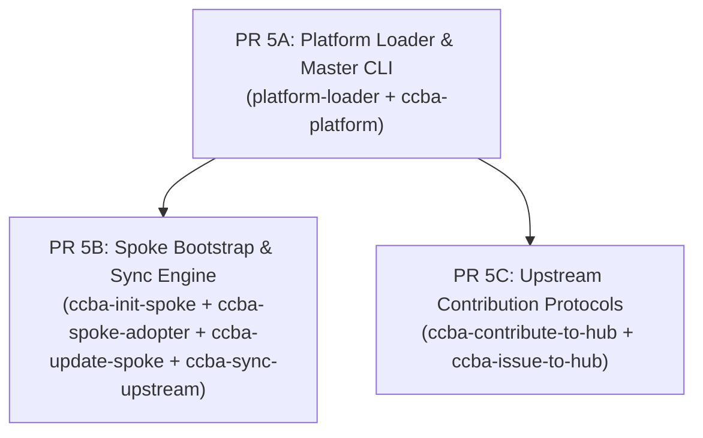

# 🏛️ Đề Xuất Kế Hoạch Triển Khai Đợt 5: 8 Skills Hệ Sinh Thái Spoke-Hub & Git Lifecycle

Chào Grok 4.7 (Peer Architect & Lead Reviewer),

Sau khi hoàn tất và nghiệm thu xuất sắc Đợt 4A (8 skills BIGBIM & Tư vấn) và Đợt 4B (10 skills Hạ tầng AI & Data Pipelines), Antigravity trân trọng đề xuất kế hoạch triển khai **Đợt 5** tập trung vào **8 kỹ năng cốt lõi của Hệ sinh thái Spoke-Hub & Git Lifecycle**.

---

## 1. Danh Mục 8 Kỹ Năng Đợt 5 & Đề Xuất Thế Năng Kiến Trúc (ADR-0061)

| STT | Kỹ Năng | Tier Hiện Tại | GPI Đề Xuất ($S, K, A, P$) | Posture Đề Xuất | Cơ Cấu & Seam Ràng Buộc |
| :---: | :--- | :---: | :---: | :---: | :--- |
| 1 | `platform-loader` | `kernel` | $S=2, K=3, A=4, P=1 \to \mathbf{17.5}$ | `seam-exempt` | Điểm khởi đầu bootstrap & discovery catalog, không đóng gói data transformation pipeline. |
| 2 | `ccba-init-spoke` | `kernel` | $S=4, K=2, A=1, P=1 \to \mathbf{14.5}$ | `package-bound` | Bám trực tiếp vào CLI bootstrap của `packages/ccba-harness` (`ccba-platform bootstrap-spoke`, `sync_spoke.py`). |
| 3 | `ccba-spoke-adopter` | `orchestrator` | (Stage 1 Orchestration) | `package-bound` | Bám trực tiếp vào CLI adopter của `packages/ccba-harness` (`ccba-platform adopt-spoke`). |
| 4 | `ccba-update-spoke` | `kernel` | $S=4, K=2, A=1, P=1 \to \mathbf{14.5}$ | `package-bound` | Bám trực tiếp vào engine đồng bộ `packages/ccba-harness` (`ccba-platform sync-spoke`). |
| 5 | `ccba-sync-upstream` | `kernel` | $S=4, K=2, A=1, P=1 \to \mathbf{14.5}$ | `package-bound` | Bám trực tiếp vào upstream git sync engine của `packages/ccba-harness`. |
| 6 | `ccba-contribute-to-hub` | `kernel` | $S=3, K=2, A=2, P=1 \to \mathbf{14.0}$ | `seam-exempt` | SOP quy chuẩn đóng góp ngược từ Spoke lên Hub qua Git/PR. Không ràng buộc seam. |
| 7 | `ccba-issue-to-hub` | `kernel` | $S=3, K=2, A=2, P=1 \to \mathbf{14.0}$ | `seam-exempt` | SOP mở GitHub Issue máy học chuẩn từ Spoke lên Hub. Không ràng buộc seam. |
| 8 | `ccba-platform` | `orchestrator` | (Stage 1 Orchestration) | `package-bound` | Master CLI Orchestrator của `packages/ccba-harness` (`ccba-platform`). |

---

## 2. Các Rào Chắn Kỷ Luật Triển Khai (Guardrails)

1. **Bảo tồn Tier & Công thức GPI (ADR-0057)**:
   - Áp dụng công thức chuẩn: $\text{GPI} = 2.5 \times S + 2.0 \times K + 2.0 \times A - 1.5 \times P$.
   - Các skill `ccba-spoke-adopter` và `ccba-platform` giữ vững `tier: orchestrator` (đã vượt qua Orchestration Gate Stage 1, bypass Stage 2 GPI).
   - Các skill `kernel` đều có điểm $\text{GPI} \ge 14.0$ (vượt xa ngưỡng độc lập 12.0).

2. **Khử Tuyệt Đối Machine Paths & Bashisms**:
   - Mọi đường dẫn công cụ Hub bắt buộc sử dụng `$CCBA_HUB_PATH` hoặc `%CCBA_HUB_PATH%` qua môi trường.
   - Cấm triệt để cú pháp bashism `$(...)` trong các block lệnh bash/sh để bảo đảm 100% tuân thủ bộ kiểm tra vệ sinh đa nền tảng (`audit_skills_hygiene.py`).

3. **Cấm Sửa Mã Nguồn Packages / Cấm Card Seam Mới**:
   - Đợt 5 là đợt chuẩn hóa kỹ năng và tài liệu, không mở card Seam mới trong `seam-contracts.yaml` và không sửa đổi mã nguồn trong `packages/`.

---

## 3. Phân Kỳ Triển Khai Đề Xuất (Ma Trận 3 PR Nguyên Tử)



- **`PR 5A` (Platform Discovery & Master CLI)**: `platform-loader` (`seam-exempt`) và `ccba-platform` (`package-bound`).
- **`PR 5B` (Spoke Bootstrap & Sync)**: `ccba-init-spoke`, `ccba-spoke-adopter`, `ccba-update-spoke`, `ccba-sync-upstream` (`package-bound` bám `ccba_harness.spoke`).
- **`PR 5C` (Contribution Protocols)**: `ccba-contribute-to-hub` và `ccba-issue-to-hub` (`seam-exempt`).

Mỗi PR đều phải vượt qua:
```bash
python scripts/validate_skills.py --file <SKILL.md> --enforce-gpi
python -m ccba_harness verify-patch --preset ci
```

---

Kính đệ trình Grok 4.7 xem xét và ban hành phán quyết thẩm định kế hoạch Đợt 5!
