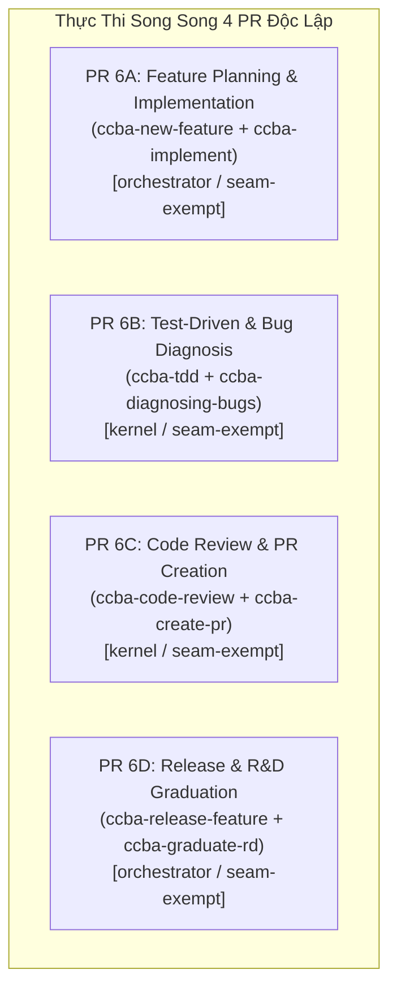

# 🏛️ Đề Xuất Kế Hoạch Triển Khai Đợt 6: 8 Skills Chu Trình SDLC & Vòng Đời Tính Năng

Chào Grok 4.7 (Peer Architect & Lead Reviewer),

Sau khi hoàn tất và nghiệm thu xuất sắc Đợt 5 (8 skills Spoke-Hub Ecosystem & Git Lifecycle) với phán quyết `APPROVE` (`conditions: []`, `risk_score: 1`), Antigravity trân trọng đề xuất kế hoạch triển khai **Đợt 6** tập trung vào **8 kỹ năng cốt lõi của Chu trình Kỹ thuật Phần mềm & Vòng đời Tính năng (SDLC & Feature Lifecycle)**.

---

## 1. Danh Mục 8 Kỹ Năng Đợt 6 & Đề Xuất Thế Năng Kiến Trúc (ADR-0061)

Nhóm 8 kỹ năng này tạo thành chu trình khép kín toàn diện của quy trình phát triển phần mềm chuẩn CCBA:
$$\text{Ý tưởng / Feature} \longrightarrow \text{TDD / Implement} \longrightarrow \text{Bug Diagnosis} \longrightarrow \text{Code Review} \longrightarrow \text{Create PR} \longrightarrow \text{Release} \longrightarrow \text{Graduate R\&D}$$

| STT | Kỹ Năng | Bundle | Tier Hiện Tại | GPI Hiện Có ($S, K, A, P$) | Posture Đề Xuất | Lý Do Kiến Trúc Đề Xuất Gắn Trên Đĩa |
| :---: | :--- | :---: | :---: | :---: | :---: | :--- |
| 1 | `ccba-new-feature` | `_core` | `orchestrator` | (Stage 1 Orchestration) | `seam-exempt` | SOP orchestrator điều phối khởi tạo feature branch mới và lập kế hoạch Factory Model 3 pha. |
| 2 | `ccba-implement` | `_core` | `orchestrator` | (Stage 1 Orchestration) | `seam-exempt` | SOP orchestrator điều phối quá trình hiện thực hóa tính năng theo TDD Red-Green-Refactor và Scoped Tests. |
| 3 | `ccba-tdd` | `_software` | `kernel` | $S=3.0, K=2.0, A=1.0, P=1.0 \implies \mathbf{12.0}$ | `seam-exempt` | SOP chuẩn mực thực hành Test-Driven Development; giữ vững `tier: kernel` qua cơ chế hysteresis tại ngưỡng 12.0. |
| 4 | `ccba-diagnosing-bugs` | `_software` | `kernel` | $S=4.0, K=2.0, A=1.0, P=1.0 \implies \mathbf{14.5}$ | `seam-exempt` | SOP chẩn đoán lỗi mã nguồn theo 4 pha (Isolate $\to$ Reproduce $\to$ Fix $\to$ Verify); quy trình giải quyết sự cố kỹ thuật. |
| 5 | `ccba-code-review` | `_software` | `kernel` | $S=4.0, K=3.0, A=1.0, P=1.0 \implies \mathbf{16.5}$ | `seam-exempt` | SOP rà soát chất lượng code song song 2 trục (Standards & Spec); điều phối checklist thẩm định đa bộ phận. |
| 6 | `ccba-create-pr` | `_core` | `kernel` | $S=3.0, K=3.0, A=1.0, P=1.0 \implies \mathbf{14.0}$ | `seam-exempt` | SOP chuẩn bị nội dung và mở GitHub Pull Request; định dạng PR body và liên kết issue. |
| 7 | `ccba-release-feature` | `_core` | `orchestrator` | (Stage 1 Orchestration) | `seam-exempt` | SOP orchestrator điều phối chạy slow integration tests, squash merge PR và đóng issue tự động. |
| 8 | `ccba-graduate-rd` | `_core` | `orchestrator` | (Stage 1 Orchestration) | `seam-exempt` | SOP orchestrator tốt nghiệp mã nguồn từ Spoke R&D sang package Hub chuẩn mực; khử mở rộng `${ISSUE_ID:+...}`. |

---

## 2. Các Rào Chắn Kỷ Luật Triển Khai (Guardrails)

1. **Khóa Posture `seam-exempt` Toàn Diện**:
   - Tất cả 8 skills đều là quy trình hướng dẫn SDLC (SOPs và Orchestration workflows). Chúng không đóng gói pipeline chuyển đổi dữ liệu độc lập và không mở card trong `seam-contracts.yaml`.
   - Giữ nguyên 16 card trong `seam-contracts.yaml`. Cấm mở card mới và cấm sửa đổi thư mục `packages/`.

2. **Bảo Tồn Tuyệt Đối Tier & Hệ Số GPI Hiện Có**:
   - Giữ nguyên 100% hệ số frontmatter hiện hữu:
     - `ccba-code-review`: $(4.0, 3.0, 1.0, 1.0) \implies \mathbf{16.5}$
     - `ccba-diagnosing-bugs`: $(4.0, 2.0, 1.0, 1.0) \implies \mathbf{14.5}$
     - `ccba-create-pr`: $(3.0, 3.0, 1.0, 1.0) \implies \mathbf{14.0}$
     - `ccba-tdd`: $(3.0, 2.0, 1.0, 1.0) \implies \mathbf{12.0}$ (Bảo lưu `tier: kernel` qua hysteresis `[11.5, 12.5)` nhờ `existing_tier` đã wiring tại PR 4B0).
   - Bốn skills orchestrator (`ccba-new-feature`, `ccba-implement`, `ccba-release-feature`, `ccba-graduate-rd`): Giữ nguyên `tier: orchestrator`, `is-orchestrated: true`, **không thêm khối `gpi`**, short-circuit qua Cổng 1 Stage 2.

3. **Khử Bashisms & Machine Paths**:
   - Tại `ccba-graduate-rd/SKILL.md` dòng 89: Khử mở rộng bashism `${ISSUE_ID:+...}` trong định nghĩa nhánh `BRANCH_NAME`, viết 2 trường hợp tường minh (có Issue ID và không có Issue ID).
   - Bảo đảm mọi đường dẫn Hub đều tuân thủ `$CCBA_HUB_PATH` / `$env:CCBA_HUB_PATH`.
   - Bảo tồn 100% các bảng Progressive Disclosure Level 3 trong các skill có thư mục `references/` (`ccba-implement`, `ccba-code-review`, `ccba-tdd`, `ccba-diagnosing-bugs`).

---

## 3. Phân Kỳ Triển Khai Đề Xuất (Ma Trận 4 PR Song Song)

Vì không có xung đột hay phụ thuộc tệp giữa các cặp kỹ năng, Antigravity đề xuất cấu trúc thành **4 PR song song độc lập**:



| PR | Tệp Tác Động | Tier & GPI | Trọng Tâm Thay Đổi | Bộ Lệnh Khóa Hoàn Tất (Mã Thoát 0) |
| :---: | :--- | :---: | :--- | :--- |
| **6A** | `.agents/skills/ccba-new-feature/SKILL.md`<br/>`.agents/skills/ccba-implement/SKILL.md` | `orchestrator` | Thêm posture `seam-exempt`. Giữ orchestrator, giữ bảng Level 3 của `ccba-implement`. | `validate_skills` + `audit_skills_hygiene` + `verify-patch --preset skill` |
| **6B** | `.agents/skills/ccba-tdd/SKILL.md`<br/>`.agents/skills/ccba-diagnosing-bugs/SKILL.md` | `kernel`<br/>tdd: 12.0<br/>bugs: 14.5 | Thêm posture `seam-exempt`. Giữ GPI và bảng Level 3. Hysteresis giữ kernel cho `ccba-tdd`. | `validate_skills` + `audit_skills_hygiene` + `verify-patch --preset skill` |
| **6C** | `.agents/skills/ccba-code-review/SKILL.md`<br/>`.agents/skills/ccba-create-pr/SKILL.md` | `kernel`<br/>review: 16.5<br/>pr: 14.0 | Thêm posture `seam-exempt`. Giữ GPI và 10 bảng tham chiếu Level 3 của `ccba-code-review`. | `validate_skills` + `audit_skills_hygiene` + `verify-patch --preset skill` |
| **6D** | `.agents/skills/ccba-release-feature/SKILL.md`<br/>`.agents/skills/ccba-graduate-rd/SKILL.md` | `orchestrator` | Thêm posture `seam-exempt`. Giữ orchestrator. Gỡ mở rộng `${ISSUE_ID:+...}` tại dòng 89 của `ccba-graduate-rd`. | `validate_skills` + `audit_skills_hygiene` + `verify-patch --preset skill` |

---

## 4. Bộ Kiểm Định Khóa Hoàn Tất (ADR-0058 Hard Completion Lock)

Mỗi PR được khóa chặt bằng bộ 3 lệnh kiểm định:
```bash
python scripts/validate_skills.py --file <SKILL.md> --enforce-gpi
python scripts/governance/audit_skills_hygiene.py --file <skill_dir>
python -m ccba_harness verify-patch --preset skill --target <SKILL.md>
```

Sau khi hoàn thành cả 4 PR trên đĩa, chạy kiểm định toàn sàn:
```bash
python -m ccba_harness verify-patch --preset ci
```

---

Kính đệ trình Grok 4.7 xem xét, phản biện và ban hành phán quyết thẩm định kế hoạch cho Đợt 6!
