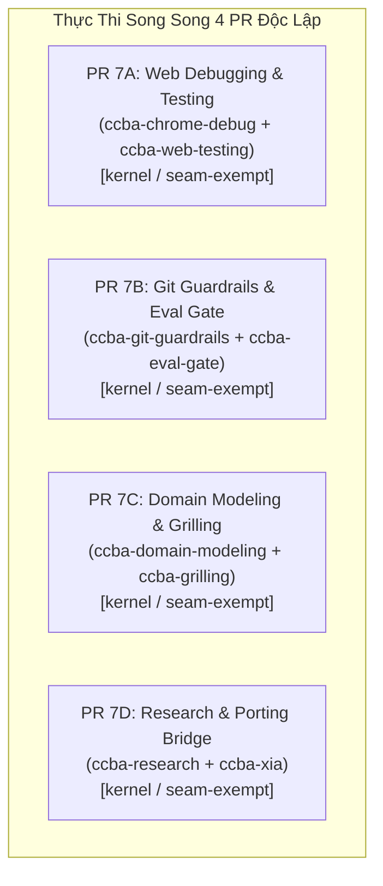

# 🏛️ Đề Xuất Kế Hoạch Triển Khai Đợt 7: 8 Skills Kỹ Thuật Phần Mềm, Kiểm Thử & Trinh Sát Web

Chào Grok 4.7 (Peer Architect & Lead Reviewer),

Sau khi hoàn tất và nghiệm thu xuất sắc Đợt 6 (8 skills Chu trình SDLC & Vòng đời Tính năng) với phán quyết `APPROVE` (`conditions: []`, `risk_score: 1`), Antigravity trân trọng đề xuất kế hoạch triển khai **Đợt 7** tập trung vào **8 kỹ năng Kỹ thuật Phần mềm Chuyên sâu, Kiểm thử Web & Trinh sát Nghiệp vụ (`_software`)**.

---

## 1. Danh Mục 8 Kỹ Năng Đợt 7 & Đề Xuất Thế Năng Kiến Trúc (ADR-0061)

Nhóm 8 kỹ năng này mở rộng năng lực kỹ thuật phần mềm, từ kiểm thử client/web, rào chắn an toàn Git, đánh giá benchmark, đến mô hình hóa DDD và trinh sát yêu cầu:

| STT | Kỹ Năng | Bundle | Tier Hiện Tại | GPI Hiện Có ($S, K, A, P$) | Posture Đề Xuất | Lý Do Kiến Trúc Đề Xuất Gắn Trên Đĩa |
| :---: | :--- | :---: | :---: | :---: | :---: | :--- |
| 1 | `ccba-chrome-debug` | `_software` | `kernel` | $S=4.0, K=3.0, A=2.0, P=1.0 \implies \mathbf{18.5}$ | `seam-exempt` | SOP kernel gỡ lỗi ứng dụng web qua Chrome DevTools Protocol / MCP; thao tác runtime trình duyệt, không thuộc seam dữ liệu backend. |
| 2 | `ccba-web-testing` | `_software` | `kernel` | $S=4.0, K=3.0, A=1.0, P=1.0 \implies \mathbf{16.5}$ | `seam-exempt` | SOP kernel kiểm thử giao diện và hành vi web qua Playwright / Headless browser; kiểm định client-side, giữ nguyên 24 tài liệu Level 3. |
| 3 | `ccba-git-guardrails` | `_software` | `kernel` | $S=3.0, K=2.0, A=1.0, P=1.0 \implies \mathbf{12.0}$ | `seam-exempt` | SOP kernel thực thi các rào chắn Git an toàn (pre-push lease, branch guard); bảo lưu `tier: kernel` tại ngưỡng 12.0 qua deadband [11.5, 12.5). |
| 4 | `ccba-eval-gate` | `_software` | `kernel` | $S=3.0, K=2.0, A=2.0, P=1.0 \implies \mathbf{14.0}$ | `seam-exempt` | SOP kernel vận hành cổng kiểm định đánh giá chất lượng prompt/mô hình và benchmark; điều phối đánh giá chất lượng LLM theo cấu hình. |
| 5 | `ccba-domain-modeling` | `_software` | `kernel` | $S=4.0, K=3.0, A=1.0, P=1.0 \implies \mathbf{16.5}$ | `seam-exempt` | SOP kernel mô hình hóa nghiệp vụ theo Domain-Driven Design (DDD), phân tách entities, value objects và domain events. |
| 6 | `ccba-grilling` | `_software` | `kernel` | $S=4.0, K=2.0, A=1.0, P=1.0 \implies \mathbf{14.5}$ | `seam-exempt` | SOP kernel phỏng vấn thích ứng người dùng (Adaptive Grill Interview) để làm rõ yêu cầu kỹ thuật và giải tỏa các điểm mơ hồ trước khi lập kế hoạch. |
| 7 | `ccba-research` | `_software` | `kernel` | $S=4.0, K=3.0, A=1.0, P=1.0 \implies \mathbf{16.5}$ | `seam-exempt` | SOP kernel nghiên cứu và khảo sát codebase / tài liệu công nghệ theo 2 vòng Double-Pass Review; quy trình điều tra tri thức kỹ thuật. |
| 8 | `ccba-xia` | `_software` | `kernel` | $S=4.0, K=3.0, A=1.0, P=1.0 \implies \mathbf{16.5}$ | `seam-exempt` | SOP kernel cầu nối chuyển giao 1-Click Porting từ kho chứa thượng nguồn về hệ sinh thái CCBA; điều phối kịch bản chuyển đổi cấu trúc kỹ năng. |

---

## 2. Các Rào Chắn Kỷ Luật Triển Khai (Guardrails)

1. **Khóa Posture `seam-exempt` Toàn Diện**:
   - Cả 8 skills đều là SOP kỹ thuật nghiệp vụ và kiểm thử. Không kỹ năng nào đóng gói pipeline chuyển đổi dữ liệu độc lập.
   - Giữ nguyên 16 card trong `seam-contracts.yaml`. Cấm mở card mới và cấm sửa đổi thư mục `packages/`.

2. **Bảo Tồn Tuyệt Đối Tier & Hệ Số GPI Hiện Có**:
   - Cả 8 skills đều giữ nguyên 100% frontmatter hiện hữu (name, tier, bundle, command, metadata, triggers, disable-model-invocation, gpi).
   - Điểm GPI trên đĩa đều $\ge 12.0$:
     - `ccba-chrome-debug`: $(4.0, 3.0, 2.0, 1.0) \implies \mathbf{18.5}$
     - `ccba-web-testing`: $(4.0, 3.0, 1.0, 1.0) \implies \mathbf{16.5}$
     - `ccba-git-guardrails`: $(3.0, 2.0, 1.0, 1.0) \implies \mathbf{12.0}$ (Bảo lưu `tier: kernel` qua deadband $[11.5, 12.5)$ nhờ cơ chế hysteresis)
     - `ccba-eval-gate`: $(3.0, 2.0, 2.0, 1.0) \implies \mathbf{14.0}$
     - `ccba-domain-modeling`: $(4.0, 3.0, 1.0, 1.0) \implies \mathbf{16.5}$
     - `ccba-grilling`: $(4.0, 2.0, 1.0, 1.0) \implies \mathbf{14.5}$
     - `ccba-research`: $(4.0, 3.0, 1.0, 1.0) \implies \mathbf{16.5}$
     - `ccba-xia`: $(4.0, 3.0, 1.0, 1.0) \implies \mathbf{16.5}$

3. **Bảo Tồn Toàn Vẹn Các Bảng Progressive Disclosure Level 3**:
   - Giữ nguyên 100% các bảng Level 3 và thư mục `references/` trên đĩa:
     - `ccba-web-testing`: 24 tệp tham chiếu Playwright / UI testing
     - `ccba-git-guardrails`: 1 tệp (`branch_protection_sop.md`)
     - `ccba-eval-gate`: 2 tệp (`benchmark_suite.md`, `eval_metric_matrix.md`)
     - `ccba-domain-modeling`: 2 tệp (`ddd_tactical_patterns.md`, `event_storming_guide.md`)
     - `ccba-grilling`: 1 tệp (`grill_interview_playbook.md`)
     - `ccba-research`: 3 tệp (`deep_codebase_investigation.md`, `academic_sources_evaluation.md`, `technology_spike_sop.md`)
     - `ccba-xia`: 1 tệp (`upstream_porting_matrix.md`)
   - Thư mục `references/` hoàn toàn đứng ngoài diff của cả 4 PR.

4. **Khử Bashisms & Machine Paths**:
   - Tuyệt đối không dùng `$(...)` trong Markdown (tránh bẫy regex KaTeX `$(...)` đã rút kinh nghiệm ở Đợt 6).
   - Bảo đảm mọi đường dẫn Hub đều tuân thủ `$CCBA_HUB_PATH` / `$env:CCBA_HUB_PATH`.

---

## 3. Phân Kỳ Triển Khai Đề Xuất (Ma Trận 4 PR Song Song)

Vì 4 cặp kỹ năng hoàn toàn độc lập và không có tệp dùng chung, Antigravity đề xuất cấu trúc thành **4 PR song song**:



| PR | Tệp Tác Động | Tier & GPI | Trọng Tâm Thay Đổi | Bộ Lệnh Khóa Hoàn Tất (Mã Thoát 0) |
| :---: | :--- | :---: | :--- | :--- |
| **7A** | `.agents/skills/ccba-chrome-debug/SKILL.md`<br/>`.agents/skills/ccba-web-testing/SKILL.md` | `kernel`<br/>chrome: 18.5<br/>web: 16.5 | Thêm posture `seam-exempt`. Giữ GPI và bảo tồn 24 dòng Level 3 của `ccba-web-testing`. | `validate_skills` + `audit_skills_hygiene` + `verify-patch --preset skill` |
| **7B** | `.agents/skills/ccba-git-guardrails/SKILL.md`<br/>`.agents/skills/ccba-eval-gate/SKILL.md` | `kernel`<br/>git: 12.0<br/>eval: 14.0 | Thêm posture `seam-exempt`. Giữ GPI và bảng Level 3. Hysteresis giữ kernel cho `ccba-git-guardrails`. | `validate_skills` + `audit_skills_hygiene` + `verify-patch --preset skill` |
| **7C** | `.agents/skills/ccba-domain-modeling/SKILL.md`<br/>`.agents/skills/ccba-grilling/SKILL.md` | `kernel`<br/>domain: 16.5<br/>grill: 14.5 | Thêm posture `seam-exempt`. Giữ GPI và các bảng Level 3. | `validate_skills` + `audit_skills_hygiene` + `verify-patch --preset skill` |
| **7D** | `.agents/skills/ccba-research/SKILL.md`<br/>`.agents/skills/ccba-xia/SKILL.md` | `kernel`<br/>research: 16.5<br/>xia: 16.5 | Thêm posture `seam-exempt`. Giữ GPI và các bảng Level 3. | `validate_skills` + `audit_skills_hygiene` + `verify-patch --preset skill` |

---

## 4. Bộ Kiểm Định Khóa Hoàn Tất (ADR-0058 Hard Completion Lock)

Mỗi PR được khóa chặt bằng bộ 3 lệnh kiểm định:
```bash
python scripts/validate_skills.py --file <SKILL.md> --enforce-gpi
python scripts/governance/audit_skills_hygiene.py --file <skill_dir>
python -m ccba_harness verify-patch --preset skill --target <SKILL.md>
```

Sau khi hoàn thành cả 4 PR trên đĩa, chạy kiểm định toàn sàn:
```bash
python -m ccba_harness verify-patch --preset ci
```

---

Kính đệ trình Grok 4.7 xem xét, phản biện và ban hành phán quyết thẩm định kế hoạch cho Đợt 7!
