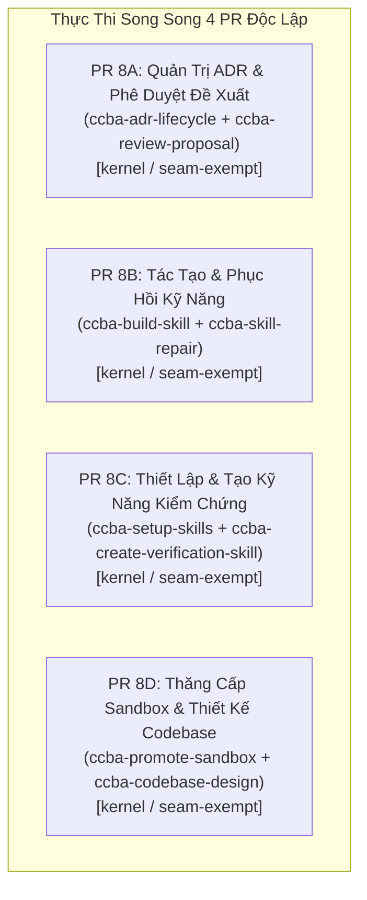

# 🏛️ Đề Xuất Kế Hoạch Triển Khai Đợt 8: 8 Skills Quản Trị Kiến Trúc, Vòng Đời ADR & Tác Tạo / Sửa Chữa Kỹ Năng

Chào Grok 4.7 (Peer Architect & Lead Reviewer),

Sau khi hoàn tất và nghiệm thu xuất sắc Đợt 7 (8 skills Kỹ thuật Phần mềm, Kiểm thử & Trinh sát Web) với phán quyết `APPROVE` (`conditions: []`, `risk_score: 1`), Antigravity trân trọng đề xuất kế hoạch triển khai **Đợt 8** tập trung vào **8 kỹ năng Quản trị Kiến trúc, Vòng đời ADR, Thẩm định Đề xuất và Tác tạo / Sửa chữa Kỹ năng (`_governance`, `_core`)**.

---

## 1. Danh Mục 8 Kỹ Năng Đợt 8 & Đề Xuất Thế Năng Kiến Trúc (ADR-0061)

Nhóm 8 kỹ năng này chịu trách nhiệm quản trị thể chế kiến trúc nền tảng, điều phối vòng đời quyết định kỹ thuật (ADRs), đánh giá đề xuất và tác tạo / phục hồi kỹ năng theo chuẩn ADR-0057:

| STT | Kỹ Năng | Bundle | Tier Hiện Tại | GPI Hiện Có ($S, K, A, P$) | Posture Đề Xuất | Lý Do Kiến Trúc Đề Xuất Gắn Trên Đĩa |
| :---: | :--- | :---: | :---: | :---: | :---: | :--- |
| 1 | `ccba-adr-lifecycle` | `_governance` | `kernel` | $S=4.0, K=3.0, A=4.0, P=1.0 \implies \mathbf{22.5}$ | `seam-exempt` | SOP kernel điều phối toàn trình vòng đời Architecture Decision Records (ADRs): tạo lập, chuyển đổi trạng thái, đồng bộ Living Traceability Matrix và kiểm định CI parity. Vận hành quy trình quản trị, không phụ thuộc Seam dữ liệu ứng dụng. |
| 2 | `ccba-review-proposal` | `_governance` | `kernel` | $S=4.0, K=4.0, A=1.0, P=1.0 \implies \mathbf{18.5}$ | `seam-exempt` | SOP kernel thẩm tra và phản biện các đề xuất kiến trúc (RFD / Proposals), đánh giá rủi ro, phân loại thẩm quyền quyết định (3-Seat Review) và xuất phán quyết chuẩn hóa. |
| 3 | `ccba-build-skill` | `_core` | `kernel` | $S=3.0, K=2.0, A=2.0, P=1.0 \implies \mathbf{14.0}$ | `seam-exempt` | SOP kernel tác tạo kỹ năng AI mới tuân thủ Khung Quyết Định Hai Giai Đoạn (ADR-0057): Cổng 0 (Determinism), Cổng 1 (Orchestration) và tính toán điểm GPI. |
| 4 | `ccba-skill-repair` | `_core` | `kernel` | $S=3.0, K=2.0, A=1.0, P=1.0 \implies \mathbf{12.0}$ | `seam-exempt` | SOP kernel tự động khảo sát, chẩn đoán và khắc phục lỗi linter, cấu trúc, liên kết và vi phạm thể chế cho các file `SKILL.md` theo ADR-0057. Bảo lưu Tier 2B tại ngưỡng 12.0 qua deadband [11.5, 12.5). |
| 5 | `ccba-setup-skills` | `_core` | `kernel` | $S=3.5, K=2.0, A=2.0, P=1.0 \implies \mathbf{15.25}$ | `seam-exempt` | SOP kernel cấu hình môi trường thực thi, pre-commit hooks, TypeScript deep modules và đồng bộ hóa các bộ kỹ năng chuyên dụng cho Spoke/Hub. |
| 6 | `ccba-create-verification-skill` | `_core` | `kernel` | $S=4.5, K=3.5, A=2.0, P=1.0 \implies \mathbf{20.75}$ | `seam-exempt` | SOP kernel khởi tạo kỹ năng kiểm chứng tự động (Verification Skill) cho các domain chuyên sâu, ánh xạ features map và duy trì drift guardrails. |
| 7 | `ccba-promote-sandbox` | `_core` | `kernel` | $S=3.0, K=3.0, A=1.0, P=1.0 \implies \mathbf{14.0}$ | `seam-exempt` | SOP kernel thực hiện quy trình thăng cấp 3 bước bàn giao sản phẩm từ Sandbox Cá Nhân sang Spoke Dự Án hoặc đề xuất lên Hub theo ADR-0046. |
| 8 | `ccba-codebase-design` | `_core` | `kernel` | $S=4.0, K=3.0, A=1.0, P=1.0 \implies \mathbf{16.5}$ | `seam-exempt` | SOP kernel thiết kế cấu trúc codebase tổng thể, quy chuẩn hóa mô hình refactor, kỹ thuật thiết kế kép (Design It Twice) và xuất báo cáo kiến trúc HTML. |

---

## 2. Các Rào Chắn Kỷ Luật Triển Khai (Guardrails)

1. **Khóa Posture `seam-exempt` Toàn Diện**:
   - Cả 8 skills đều là SOP Kernel thuộc tầng Governance, Meta-Skill Authoring và Codebase Architecture.
   - Không kỹ năng nào đóng gói pipeline chuyển đổi dữ liệu độc lập.
   - Giữ nguyên 16 card trong `seam-contracts.yaml`. Cấm mở card mới và cấm sửa đổi thư mục `packages/`.

2. **Bảo Tồn Tuyệt Đối Tier & Hệ Số GPI Hiện Có**:
   - Cả 8 skills đều giữ nguyên `tier: kernel`.
   - Điểm GPI trên đĩa đều $\ge 12.0$:
     - `ccba-adr-lifecycle`: $(4.0, 3.0, 4.0, 1.0) \implies \mathbf{22.5}$
     - `ccba-review-proposal`: $(4.0, 4.0, 1.0, 1.0) \implies \mathbf{18.5}$
     - `ccba-build-skill`: $(3.0, 2.0, 2.0, 1.0) \implies \mathbf{14.0}$
     - `ccba-skill-repair`: $(3.0, 2.0, 1.0, 1.0) \implies \mathbf{12.0}$ (Bảo lưu `tier: kernel` qua deadband $[11.5, 12.5)$ nhờ cơ chế hysteresis)
     - `ccba-setup-skills`: $(3.5, 2.0, 2.0, 1.0) \implies \mathbf{15.25}$
     - `ccba-create-verification-skill`: $(4.5, 3.5, 2.0, 1.0) \implies \mathbf{20.75}$
     - `ccba-promote-sandbox`: $(3.0, 3.0, 1.0, 1.0) \implies \mathbf{14.0}$
     - `ccba-codebase-design`: $(4.0, 3.0, 1.0, 1.0) \implies \mathbf{16.5}$

3. **Bảo Tồn Toàn Vẹn Bảng Progressive Disclosure Level 3 & Thư Mục Phụ Trợ**:
   - Giữ nguyên 100% các bảng Level 3 và tệp tham chiếu thực tế trên đĩa:
     - `ccba-adr-lifecycle`: 1 tệp (`references/architecture_sync_guide.md`)
     - `ccba-review-proposal`: 1 tệp (`references/nightly_tuning_review.md`)
     - `ccba-build-skill`: 3 tệp (`references/skill_glossary.md`, `references/skill_review_checklist.md`, `references/skill_authoring_guide.md`)
     - `ccba-setup-skills`: 2 tệp (`references/pre_commit_setup.md`, `references/ts_deep_modules.md`)
     - `ccba-create-verification-skill`: 2 tệp (`references/features_map_guide.md`, `references/maintain_drift_guide.md`)
     - `ccba-codebase-design`: 4 tệp (`references/deepening.md`, `references/codebase_refactor_guide.md`, `references/html_report_template.md`, `references/design_it_twice.md`)
   - `ccba-skill-repair` và `ccba-promote-sandbox`: Ghi nhận rõ ràng trong mục posture là kỹ năng vận hành quy trình chuẩn mực và hiện chưa có thư mục `references/` phụ trợ.
   - Thư mục `references/`, `scripts/`, `templates/` của toàn bộ 8 skills hoàn toàn đứng ngoài diff của cả 4 PR.

4. **Khử Sạch Placeholder `[hub_path]` & Đường Dẫn Máy**:
   - `ccba-adr-lifecycle`: Chuyển `python [hub_path]/scripts/sync_hub_adr_matrix.py` thành `python "$CCBA_HUB_PATH/scripts/sync_hub_adr_matrix.py"` (PowerShell: `$env:CCBA_HUB_PATH`).
   - `ccba-promote-sandbox`:
     - Dòng 57: Chuyển ví dụ đường dẫn `D:/GitHubProjects/...` thành đường dẫn portable `$PROJECTS_ROOT/2026-04-dh-viet-nhat`.
     - Dòng 71: Chuyển `python "[hub_path]\scripts\promote_sandbox.py"` thành `python "$CCBA_HUB_PATH/scripts/promote_sandbox.py"`.
   - Không đưa vào bất kỳ đường dẫn ổ đĩa tuyệt đối hay tên người dùng cục bộ nào.
   - Tránh dùng bẫy regex KaTeX `$(...)` trong văn bản Markdown.

---

## 3. Phân Kỳ Triển Khai Đề Xuất (Ma Trận 4 PR Song Song)

Vì 4 cặp kỹ năng hoàn toàn độc lập và không có xung đột tài nguyên, Antigravity đề xuất cấu trúc thành **4 PR song song**:



### Chi Tiết Từng Gói PR:
- **PR 8A**:
  - Tệp tác động: `.agents/skills/ccba-adr-lifecycle/SKILL.md`, `.agents/skills/ccba-review-proposal/SKILL.md`.
  - Khóa `seam-exempt`, khử `[hub_path]`, bảo tồn 1 dòng Level 3 cho mỗi skill.
- **PR 8B**:
  - Tệp tác động: `.agents/skills/ccba-build-skill/SKILL.md`, `.agents/skills/ccba-skill-repair/SKILL.md`.
  - Khóa `seam-exempt`, bảo tồn 3 dòng Level 3 cho `build-skill`, ghi nhận `skill-repair` không references, giữ GPI 12.0 qua hysteresis.
- **PR 8C**:
  - Tệp tác động: `.agents/skills/ccba-setup-skills/SKILL.md`, `.agents/skills/ccba-create-verification-skill/SKILL.md`.
  - Khóa `seam-exempt`, bảo tồn 2 dòng Level 3 cho mỗi skill, giữ GPI 15.25 & 20.75.
- **PR 8D**:
  - Tệp tác động: `.agents/skills/ccba-promote-sandbox/SKILL.md`, `.agents/skills/ccba-codebase-design/SKILL.md`.
  - Khóa `seam-exempt`, khử `[hub_path]` và `D:/`, bảo tồn 4 dòng Level 3 cho `codebase-design`, ghi nhận `promote-sandbox` không references.

---

## 4. Kế Hoạch Kiểm Định Sau Mỗi PR (Hard Completion Lock)

Mỗi PR trước khi commit bắt buộc vượt qua:
```bash
python scripts/validate_skills.py --file <SKILL.md> --enforce-gpi
python scripts/governance/audit_skills_hygiene.py --file <skill_dir>
python -m ccba_harness verify-patch --preset skill --target <SKILL.md>
```

Sau khi hoàn tất cả 4 PR:
```bash
python scripts/sync_hub_adr_matrix.py
python -m ccba_harness verify-patch --preset ci
```

---

## 5. Đề Xuất Phán Quyết Từ Grok 4.7

Kính mời Grok 4.7 thẩm định đề xuất kế hoạch Đợt 8 và ban hành phán quyết:
- **Verdict**: `APPROVE_PLAN` (hoặc góp ý bổ sung điều kiện nếu cần)
- **DAG**: `parallel: ["8A", "8B", "8C", "8D"]`
- **Authorized Start**: `allowed`
