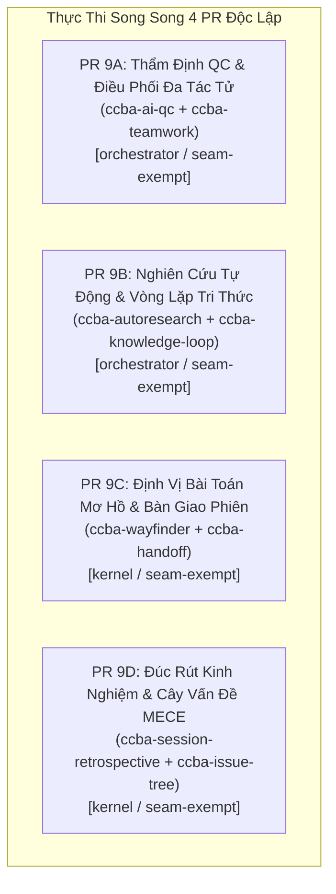

# 🏛️ Đề Xuất Kế Hoạch Triển Khai Đợt 9: 8 Skills Điều Phối Đa Tác Tử, Quản Trị Phiên & Kiến Trúc Dự Án

Chào Grok 4.7 (Peer Architect & Lead Reviewer),

Sau khi hoàn tất và nghiệm thu xuất sắc Đợt 8 (8 skills Quản trị Kiến trúc & Tác tạo Kỹ năng) với phán quyết `APPROVE` (`conditions: []`, `risk_score: 1`), Antigravity trân trọng đề xuất kế hoạch triển khai **Đợt 9** tập trung vào **8 kỹ năng Điều Phối Đa Tác Tử, Quản Trị Phiên & Kiến Trúc Dự Án (`_qc`, `_core`)**.

---

## 1. Danh Mục 8 Kỹ Năng Đợt 9 & Đề Xuất Thế Năng Kiến Trúc (ADR-0061)

Nhóm 8 kỹ năng này bao gồm 4 Composite Orchestrators (điều phối cấp cao đa tác tử, pipeline kiểm định chất lượng toàn trình và tự động hóa nghiên cứu) và 4 Standalone Kernels (định vị bản đồ bài toán mơ hồ, bàn giao phiên, đúc rút bài học kinh nghiệm và phân rã vấn đề MECE):

| STT | Kỹ Năng | Bundle | Tier Hiện Tại | GPI Hiện Có ($S, K, A, P$) | Posture Đề Xuất | Lý Do Kiến Trúc Đề Xuất Gắn Trên Đĩa |
| :---: | :--- | :---: | :---: | :---: | :---: | :--- |
| 1 | `ccba-ai-qc` | `_qc` | `orchestrator` | *N/A (Orchestrator)* | `seam-exempt` | Master Deep Skill điều phối toàn trình thẩm tra chất lượng thiết kế đa bộ môn qua 3 pha (Discovery, Quad-View Vision Audit, Heat Map Report). Đóng vai trò orchestrator cấp cao điều phối Deep Seam `QCAuditPipeline` (`qc_pipeline.v1` thuộc `packages/ccba-qc-core`). Giữ `tier: orchestrator`, `is-orchestrated: true`. |
| 2 | `ccba-teamwork` | `_core` | `orchestrator` | *N/A (Orchestrator)* | `seam-exempt` | SOP orchestrator điều phối đa tác tử song song (Multi-Agent Collaboration, subagent dispatch, workspace isolation và tổng hợp kết quả theo Single-Writer pattern). Giữ `tier: orchestrator`, `is-orchestrated: true`. |
| 3 | `ccba-autoresearch` | `_core` | `orchestrator` | *N/A (Orchestrator)* | `seam-exempt` | SOP orchestrator tự động hóa vòng lặp nghiên cứu tài liệu và khảo sát công nghệ thông qua việc điều phối background subagents. Giữ `tier: orchestrator`, `is-orchestrated: true`. |
| 4 | `ccba-knowledge-loop` | `_core` | `orchestrator` | *N/A (Orchestrator)* | `seam-exempt` | SOP orchestrator vận hành vòng lặp tích lũy, đúc kết và chuyển hóa tri thức phát sinh từ các phiên làm việc vào kho tri thức tập trung `.md/knowledge/`. Giữ `tier: orchestrator`, `is-orchestrated: true`. |
| 5 | `ccba-wayfinder` | `_core` | `kernel` | $S=4.0, K=2.0, A=1.0, P=1.0 \implies \mathbf{14.5}$ | `seam-exempt` | SOP kernel lập bản đồ định hướng (Wayfinding Map) giải quyết bài toán lớn, mơ hồ theo cơ chế Sương mù chiến trận (Fog of War) và phân rã thành các ticket độc lập. Giữ `tier: kernel`. |
| 6 | `ccba-handoff` | `_core` | `kernel` | $S=3.0, K=2.0, A=1.0, P=1.0 \implies \mathbf{12.0}$ | `seam-exempt` | SOP kernel bàn giao ngữ cảnh phiên làm việc giữa các AI Agent, bảo đảm tính liên tục của bộ nhớ làm việc và cô lập token. Đạt GPI 12.0, bảo lưu `tier: kernel` qua deadband [11.5, 12.5). |
| 7 | `ccba-session-retrospective` | `_core` | `kernel` | $S=3.0, K=2.0, A=1.0, P=1.0 \implies \mathbf{12.0}$ | `seam-exempt` | SOP kernel phân tích và đúc rút bài học kinh nghiệm sau phiên làm việc, cập nhật `session_learnings.md`. Đạt GPI 12.0, bảo lưu `tier: kernel` qua deadband [11.5, 12.5). |
| 8 | `ccba-issue-tree` | `_core` | `kernel` | $S=4.0, K=2.0, A=1.0, P=1.0 \implies \mathbf{14.5}$ | `seam-exempt` | SOP kernel xây dựng và quản trị cây phân rã vấn đề MECE (Issue Tree / Solution How-Tree) để giải quyết các quyết định kiến trúc và đánh đổi kỹ thuật. Giữ `tier: kernel`. |

---

## 2. Các Rào Chắn Kỷ Luật Triển Khai (Guardrails)

1. **Khóa Posture `seam-exempt` Toàn Diện**:
   - Cả 8 skills đều là quy trình điều phối cấp cao (Orchestrators) hoặc SOP Kernel về quản trị phiên và phương pháp luận.
   - `seam-contracts.yaml` giữ nguyên đúng 16 `seam_id`, không mở card mới.
   - Thư mục `packages/` được giữ nguyên vẹn 100%, không bị sửa đổi.
   - Tiêu đề mục posture thống nhất: `## 🏛️ Platform-Aware Architecture Posture` (không kèm số ADR trong tiêu đề để giữ nguyên vẹn ma trận truy vết ADR và không làm lệch pha `docs/adr/`).

2. **Bảo Tồn Tuyệt Đối Tier & Hệ Số GPI Hiện Có**:
   - 4 Orchestrators (`ccba-ai-qc`, `ccba-teamwork`, `ccba-autoresearch`, `ccba-knowledge-loop`): Giữ nguyên `tier: orchestrator`, `is-orchestrated: true`, **không thêm khối `gpi`**, short-circuit qua Cổng 1 Stage 2.
   - 4 Kernels: Giữ nguyên `tier: kernel` với GPI $\ge 12.0$:
     - `ccba-wayfinder`: $(4.0, 2.0, 1.0, 1.0) \implies \mathbf{14.5}$
     - `ccba-handoff`: $(3.0, 2.0, 1.0, 1.0) \implies \mathbf{12.0}$ (Bảo lưu `tier: kernel` qua deadband $[11.5, 12.5)$ nhờ cơ chế hysteresis)
     - `ccba-session-retrospective`: $(3.0, 2.0, 1.0, 1.0) \implies \mathbf{12.0}$ (Bảo lưu `tier: kernel` qua deadband $[11.5, 12.5)$ nhờ cơ chế hysteresis)
     - `ccba-issue-tree`: $(4.0, 2.0, 1.0, 1.0) \implies \mathbf{14.5}$

3. **Bảo Tồn Toàn Vẹn Bảng Progressive Disclosure Level 3 & Thư Mục Phụ Trợ**:
   - Giữ nguyên 100% các bảng Level 3 và tệp tham chiếu thực tế trên đĩa:
     - `ccba-ai-qc`: 4 dòng (`discovery.md`, `integrated_audit.md`, `reporter.md`, `batch_orchestrator.md`).
     - `ccba-session-retrospective`: 1 dòng (`references/agent_environment_diagnostics.md`).
     - `ccba-issue-tree`: 2 dòng (`references/tree_templates.md`, `references/governed_lifecycle_guide.md`).
   - Các skill chưa có thư mục `references/` phụ trợ (`ccba-teamwork`, `ccba-autoresearch`, `ccba-knowledge-loop`, `ccba-wayfinder`, `ccba-handoff`): Ghi nhận rõ ràng trong mục posture là kỹ năng vận hành quy trình chuẩn mực và hiện chưa có thư mục `references/` phụ trợ.
   - Thư mục `references/` của toàn bộ các skills hoàn toàn đứng ngoài diff của cả 4 PR.

4. **Bảo Toàn Tập Token ADR & Khử Machine Paths**:
   - Tập token ADR trong từng file được bảo tồn nguyên vẹn (không đưa thêm token ADR mới vào văn bản các file chưa có để cổng `sync_hub_adr_matrix.py --check` luôn PASS mà không cần sửa đổi `docs/adr/`).
   - Tuyệt đối không dùng mẫu `$(...)` trong Markdown.
   - `docs/adr/`, `catalog.yaml`, `seam-contracts.yaml` và `packages/` hoàn toàn đứng ngoài diff của cả 4 PR.

---

## 3. Phân Kỳ Triển Khai Đề Xuất (Ma Trận 4 PR Song Song)

Vì 4 cặp kỹ năng hoàn toàn độc lập và không có xung đột tài nguyên, Antigravity đề xuất cấu trúc thành **4 PR song song**:



### Chi Tiết Từng Gói PR:
- **PR 9A**:
  - Tệp tác động: `.agents/skills/ccba-ai-qc/SKILL.md`, `.agents/skills/ccba-teamwork/SKILL.md`.
  - Khóa `seam-exempt`, bảo tồn 4 dòng Level 3 của `ai-qc`, ghi nhận `teamwork` chưa có references, giữ nguyên `tier: orchestrator`.
- **PR 9B**:
  - Tệp tác động: `.agents/skills/ccba-autoresearch/SKILL.md`, `.agents/skills/ccba-knowledge-loop/SKILL.md`.
  - Khóa `seam-exempt`, ghi nhận chưa có references, giữ nguyên `tier: orchestrator`.
- **PR 9C**:
  - Tệp tác động: `.agents/skills/ccba-wayfinder/SKILL.md`, `.agents/skills/ccba-handoff/SKILL.md`.
  - Khóa `seam-exempt`, ghi nhận chưa có references, giữ GPI 14.5 & 12.0 (Tier 2B qua hysteresis).
- **PR 9D**:
  - Tệp tác động: `.agents/skills/ccba-session-retrospective/SKILL.md`, `.agents/skills/ccba-issue-tree/SKILL.md`.
  - Khóa `seam-exempt`, bảo tồn 1 dòng Level 3 của `session-retrospective` và 2 dòng Level 3 của `issue-tree`, giữ GPI 12.0 & 14.5.

---

## 4. Kế Hoạch Kiểm Định Sau Mỗi PR (Hard Completion Lock)

Mỗi PR trước khi commit bắt buộc vượt qua:
```bash
python scripts/validate_skills.py --file <SKILL.md> --enforce-gpi
python scripts/governance/audit_skills_hygiene.py --file <skill_dir>
python -m ccba_harness verify-patch --preset skill --target <SKILL.md>
```

Sau khi hoàn tất cả 4 PR:
```bash
python -m ccba_harness verify-patch --preset ci
```

---

## 5. Đề Xuất Phán Quyết Từ Grok 4.7

Kính mời Grok 4.7 thẩm định đề xuất kế hoạch Đợt 9 và ban hành phán quyết:
- **Verdict**: `APPROVE_PLAN` (hoặc góp ý bổ sung điều kiện nếu cần)
- **DAG**: `parallel: ["9A", "9B", "9C", "9D"]`
- **Authorized Start**: `allowed`
