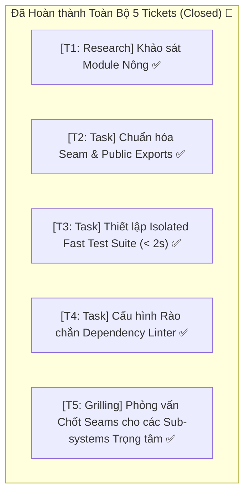

# 🗺️ Bản đồ Định hướng Wayfinder: Chuyển đổi Codebase Chuẩn AI-Loved (Deep Modules & Progressive Disclosure)

> **Tài liệu tham chiếu gốc**: [How To Make Codebases AI Agents Love — Matt Pocock (AI Hero)](https://www.aihero.dev/how-to-make-codebases-ai-agents-love)  
> **Ngữ cảnh thực thi**: CCBA Agent Services Platform (`ccba-agent-platform`)

---

## 1. Điểm đích (Destination)

Toàn bộ kiến trúc mã nguồn của **CCBA Agent Services Platform** (và tiêu chuẩn áp dụng cho các Spoke) được tổ chức theo triết lý **Deep Modules & Grey Box Seams**:
1. **Giao diện công khai tinh gọn (Thin Seam)**: Mỗi module/package chỉ bộc lộ một giao diện bề mặt tối giản (`__all__`, `__init__.py` hoặc type definitions), giấu toàn bộ độ phức tạp bên trong.
2. **Độ bộc lộ tiệm tiến (Progressive Disclosure)**: Cấu trúc thư mục phản chiếu sơ đồ tư duy (mental map), AI Agent mới khởi tạo (vốn không có bộ nhớ dài hạn) có thể nắm bắt toàn bộ năng lực hệ thống ngay từ layer trên cùng mà không bị quá tải token.
3. **Vòng phản hồi siêu tốc (Fast Feedback Loops < 2s)**: Mỗi deep module có bộ test suite cô lập (Fast Unit Tests) giúp AI Agent tự xác thực độc lập việc triển khai (Implementation) mà không làm vỡ các module khác.
4. **Rào chắn phụ thuộc (Dependency Boundaries)**: Nghiêm cấm rò rỉ logic hoặc import vòng giữa các module nông.

---

## 2. Ghi chú & Tri thức Nền tảng (Notes)

- **Triết lý Cốt lõi**:
  - *AI là "nhân viên mới không có trí nhớ" (Memento guy)*: Khi spawn ra, AI chỉ nhìn thấy cấu trúc file và mã nguồn trước mắt.
  - *3 Thiệt hại của Codebase thiết kế sai*: Phản hồi chậm (Poor feedback loop), Khó định hướng (Hard to navigate), Kiệt sức nhận thức (Cognitive burnout).
  - *Mô hình Hộp Xám (Grey Box Modules)*: Kỹ sư/Con người sở hữu và thiết kế Giao diện (Interface / Seam), AI sở hữu việc thực thi (Implementation), và Bộ kiểm thử (Tests) bảo đảm tính chính xác.
- **Kỹ năng liên quan**:
  - `/ccba-improve-codebase-architecture` (Quét và làm sâu module).
  - `/domain-modeling` (Chuẩn hóa ngôn ngữ và seam trong `CONTEXT.md`).
  - `/ccba-setup-ts-deep-modules` & Dependency Boundary Linters.
  - `/eval-gate` & `/tdd` (Kiểm thử nhanh và khép kín).

---

## 3. Quyết định đã chốt (Decisions so far)

- **[Đã chốt - 2026-08-15] Khởi lập Bản đồ Định hướng từ Bài giảng Matt Pocock**: Xác định 5 ticket trọng tâm bao phủ 3 trụ cột: (1) Khảo sát module nông, (2) Thiết lập Thin Seams, (3) Tối ưu hóa Fast Test Loops, (4) Rào chắn kiểm định Dependency, và (5) Chuẩn hóa Domain Vocabulary.
- **[Đã chốt - 2026-08-15] Hoàn thành Khảo sát Module Nông (Ticket 1)**: Đã quét toàn diện 8 packages, phát hiện 11 điểm nghẽn kiến trúc (dead code `adr.py`, `legal_knowledge.py`, trùng lặp `write_file` vs `ccba_maskara`, zombie `xlsx_recalc.py`, xung đột tên `TableReconstructor`, và xác định `ccba-notebooklm` là hình mẫu chuẩn mực 2-Tier Seam). Báo cáo chi tiết đã lưu tại [`.md/knowledge/shallow_modules_audit.md`](../knowledge/shallow_modules_audit.md).
- **[Đã chốt - 2026-08-15] Chuẩn hóa Seam & Public Exports (Ticket 2)**: Đã re-export `EvalOrchestrator` trong `ccba_harness`, xóa `legal_knowledge.py` & `write_file` trong `ccba_ai`, xóa `xlsx_recalc.py` trong `ccba_pdf_prep`, di chuyển `adr.py` sang `scripts/governance/adr_generator.py`, re-export toàn bộ deep seams trong `ccba_legal`, và tinh gọn `ccba_maskara.__all__`. Toàn bộ test suites cô lập và static checks (`ruff` + `mypy`) đạt 100% PASS.
- **[Đã chốt - 2026-08-15] Thiết lập Isolated Fast Test Suite (< 2s) cho Từng Package (Ticket 3)**: Đăng ký marker `fast` trong `pyproject.toml`, bổ sung cờ `--fast` (`-F`) vào `run_isolated_tests.py` và `safe_pytest.py`, gán nhãn unit tests nòng cốt cho toàn bộ 8 packages + scripts + root-tests. Thiết lập test tự động [`tests/governance/test_fast_test_suites.py`](../../tests/governance/test_fast_test_suites.py) xác thực 100% các package đều vượt qua kiểm thử trong thời gian siêu tốc.
- **[Đã chốt - 2026-08-15] Cấu hình Rào chắn Dependency Linter (Ticket 4)**: Thiết lập cấu hình kép: [`.importlinter`](../../.importlinter) (5 contracts chuẩn công nghiệp) và [`scripts/governance/check_dependency_contracts.py`](../../scripts/governance/check_dependency_contracts.py) (Native AST Linter, zero-dependency, tốc độ 0.3s). Toàn bộ 208 file nguồn Python và 5 bài kiểm tra tại [`tests/governance/test_dependency_contracts.py`](../../tests/governance/test_dependency_contracts.py) đạt 100% PASS. Đăng ký entrypoint CLI `ccba-lint-imports`.
- **[Đã chốt - 2026-08-15] Phỏng vấn Chốt Seams Cho 4 Sub-systems Trọng Tâm (Ticket 5)**: Hoàn thành phiên Grilling Socrates 4 vòng cùng Kỹ sư trưởng, thống nhất đóng gói 4 Deep Seams duy nhất (`QCAuditPipeline`, `VBHNEngine`, `TVPLCrawler`, `ConversionPipeline`), ban hành tài liệu quyết định kiến trúc [ADR-0011](../knowledge/adr/adr_20260815_224158_chuan_hoa_deep_seams_cho_4_sub_systems_t.md).

---

## 4. Các Ticket ở Biên giới (Frontier Unblocked Tickets)

### Ticket 1: [Research/AFK] `[Khảo sát Module Nông trong Codebase]` ✅
- **Mục tiêu**: Rà soát các packages (`packages/ccba-legal-intel`, `packages/ccba-ai`, `packages/ccba-qc-core`, `src/`) để xác định những nơi đang bị "xé lẻ" thành quá nhiều file nhỏ/hàm nhỏ rời rạc mà thiếu interface tổng thể bao bọc.
- **Đầu ra**: Báo cáo [`.md/knowledge/shallow_modules_audit.md`](../knowledge/shallow_modules_audit.md).
- **Trạng thái**: **Closed (Done)**

### Ticket 2: [Task/AFK] `[Chuẩn hóa Seam & Public Exports cho Monorepo Packages]` ✅
- **Mục tiêu**: Định hình rõ ràng public interface cho từng package thông qua `__all__` trong `__init__.py` và `AGENTS.md` cục bộ của package, loại bỏ việc bên ngoài import sâu vào các internal submodules.
- **Đầu ra**: Deep Seams chuẩn hóa tại 5 core packages (`ccba_harness`, `ccba_ai`, `ccba_pdf_prep`, `ccba_legal`, `ccba_maskara`).
- **Trạng thái**: **Closed (Done)**

### Ticket 3: [Task/AFK] `[Thiết lập Isolated Fast Test Suite (< 2s) cho từng Package]` ✅
- **Mục tiêu**: Tách biệt rõ ràng unit test nhanh (Pure Logic, Mock I/O) chạy dưới 2 giây khỏi các integration test nặng hoặc e2e. Đảm bảo Agent nhận được phản hồi tức thì sau mỗi lần sửa implementation.
- **Đầu ra**: Cấu hình `pytest -m fast`, nâng cấp `safe_pytest.py --fast`, `run_isolated_tests.py --fast` và bộ kiểm định SLA tự động `test_fast_test_suites.py`.
- **Trạng thái**: **Closed (Done)**

### Ticket 4: [Task/AFK] `[Cấu hình Rào chắn Dependency Linter]` ✅
- **Mục tiêu**: Cài đặt và cấu hình công cụ kiểm soát ranh giới phụ thuộc (`import-linter` và Native AST Linter) để tự động bắt lỗi khi có import vi phạm seam hoặc rò rỉ submodule `_*`.
- **Đầu ra**: [`.importlinter`](../../.importlinter), [`scripts/governance/check_dependency_contracts.py`](../../scripts/governance/check_dependency_contracts.py), [`tests/governance/test_dependency_contracts.py`](../../tests/governance/test_dependency_contracts.py), entrypoint `ccba-lint-imports`.
- **Trạng thái**: **Closed (Done)**

### Ticket 5: [Grilling/HITL] `[Phỏng vấn Chốt Seams cho các Sub-systems Trọng tâm]` ✅
- **Mục tiêu**: Thực hiện grilling với Kỹ sư trưởng để thống nhất boundary cho các hệ thống phức tạp: QC Pipeline, Legal Intel RAG, TVPL VIP Crawler, Document Conversion Pipeline.
- **Đầu ra**: Biên bản phỏng vấn Grilling và tài liệu quyết định kiến trúc [ADR-0011](../knowledge/adr/adr_20260815_224158_chuan_hoa_deep_seams_cho_4_sub_systems_t.md).
- **Trạng thái**: **Closed (Done)**

---

## 5. Các Hướng Đi Mở Rộng Tiềm Năng (Future Horizons)

1. **Agent Friction Index (Chỉ số Cản trở AI)**: Cơ chế tự động benchmark đo số lượng token tiêu tốn và số tool calls cần thiết để một Agent hoàn thành một tác vụ lập trình trước và sau khi làm sâu module.
2. **Auto-Generated Type Registry**: Cơ chế tự động trích xuất public API contracts thành định dạng siêu gọn dành riêng cho LLM System Prompt.
3. **Triển khai Code Refactoring cho 4 Deep Seams**: Tiến hành lập trình hoàn thiện ruột của 4 Deep Seams (`QCAuditPipeline`, `VBHNEngine`, `TVPLCrawler`, `ConversionPipeline`) theo đúng ADR-0011.

---

## 6. Ngoài phạm vi (Out of Scope)

- Thay đổi thuật toán core hoặc thay đổi quy trình nghiệp vụ đã được quy định trong các QCVN/Luật Xây dựng (chỉ thay đổi cách đóng gói cấu trúc module, seam, và harness kiểm thử).
