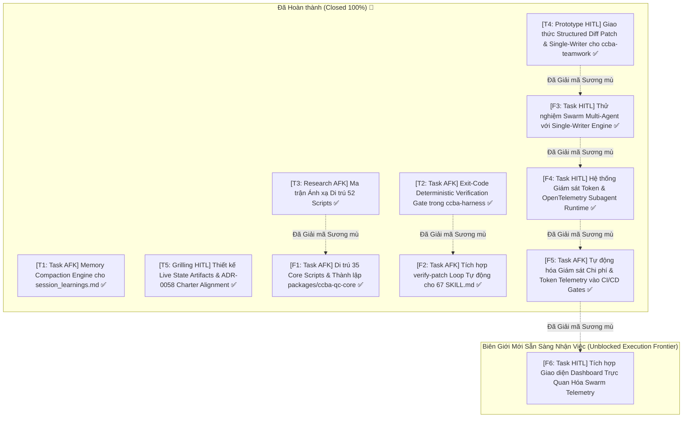

# 🗺️ Bản đồ Định hướng Wayfinder: Lộ Trình Nâng Cấp Toàn Diện Hệ Sinh Thái Kỹ Năng ccba-*

> **Tài liệu tham chiếu & Nền tảng**:
> - [ADR-0030: Instruction Token Budget & Token Budget Governance](../../knowledge/adr/adr-0030.md)
> - [ADR-0035: Deep Modules & Thin Seams Hierarchy](../../knowledge/adr/adr-0035.md)
> - [ADR-0053: Teamwork Multi-Agent Protocol & Single-Writer Coordination](../../knowledge/adr/adr-0053.md)
> - [ADR-0057: Two-Stage Decision Framework for Skill Granularity & Governance](../../knowledge/adr/adr-0057.md)
> - [Skill Authoring Guide: Multi-Mode Standard & Reference Deduplication](../../knowledge/guides/skill_authoring_guide.md)
> - [Latent Space: The /wayfinder Skill: Navigating the “Fog of War” of Planning (Matt Pocock)](https://www.latent.space/p/wayfinder-skill)
> - **Industry Benchmarks**: Claude Code Verification Loops, SWE-bench Evaluator Harness, Letta/MemGPT Memory Compaction, Devin/Cursor Single-Writer Structured Patches.

---

## 1. Điểm đích (Destination)

Toàn bộ **67 kỹ năng và các orchestrators** trong hệ sinh thái **CCBA Agent Services Platform** được nâng cấp toàn diện lên thế hệ kiến trúc tự chủ cấp công nghiệp (Autonomous Agentic Platform v2.0), đạt các tiêu chuẩn bất biến sau:

1. **Exit-Code Deterministic Verification Gate**:
   - Chấm dứt hoàn toàn hiện tượng Agent tự nhận hoàn thành công việc (Premature Completion / Self-Certification). Mọi tiêu chí hoàn thành trong `SKILL.md` được hỗ trợ hoặc bắt buộc đối soát bằng **CLI Exit Codes** (`pytest`, `ruff`, `mypy`, `ccba-harness verify-patch`). Nếu Exit Code $\ne 0$, cấm tuyệt đối Agent kết luận thành công.
2. **Zero Script Bloat Ngoài Packages (Tuân thủ Triệt để Cổng 0 ADR-0057)**:
   - Toàn bộ **105 scripts tự do (35,680 LOC)** hiện đang rải rác bên trong thư mục `scripts/` của 14 skills được di trú hoàn toàn vào các **Deep Seams** của `packages/*/src/` với tỷ lệ kiểm thử unit test $\ge 90\%$. Kỹ năng `SKILL.md` chỉ đóng vai trò hướng dẫn orchestrate và gọi CLI/API, không chứa code logic nghiệp vụ trần.
3. **Bộ Nén Tri Thức Phiên Tự Động (Session Memory Compaction Engine)**:
   - Tài liệu bộ nhớ phiên `.md/knowledge/session_learnings.md` được nén định kỳ và tự động từ **38 KB (~9,500 tokens)** xuống **$\le 10\text{ KB}$**, loại bỏ hiện tượng pha loãng chú ý (Attention Dilution) khi khởi động bất kỳ phiên Agent mới nào mà vẫn bảo toàn 100% các quy tắc cốt lõi đã học được.
4. **Giao Thức Single-Writer & Structured Diff Patch Cho Multi-Agent (ADR-0053)**:
   - Các Worker Agents trong nhóm (`ccba-teamwork`) hoạt động theo nguyên tắc **No Pre-mutation**: tuyệt đối không ghi trực tiếp vào codebase. Toàn bộ đề xuất thay đổi được đóng gói dưới dạng **Unified Diff / Structured Patch** lưu tạm tại `.system_generated/scratch/`. **Lead Orchestrator** là thực thể duy nhất (Single-Writer) thẩm tra xung đột và thực hiện atomic patch.
5. **Cộng Tác Dựa Trên Artifacts & Cổng Phê Duyệt Tương Tác (HITL Gates)**:
   - Mọi trạng thái làm việc phức tạp hoặc kế hoạch đa bước bắt buộc thể hiện qua **Native Antigravity Artifacts** (`RequestFeedback: true`), tích hợp trực tiếp với cơ chế phê duyệt của Hội đồng Thẩm định 11 Ghế CCBA Charter (ADR-0046).

---

## 2. Ghi chú & Tri thức Nền tảng (Notes)

- **Triết lý "Plan, Don't Do" của Wayfinder**:
  - Bản đồ này tập trung vào việc **ra quyết định (decisions)**, xác lập ranh giới kiến trúc và giải mã các vùng sương mù (Fog of War) trước khi viết mã quy mô lớn.
  - Các ticket được chia thành các đơn vị công việc độc lập (~100K token budget/session).
- **Quy tắc Tuân thủ Toàn cục (User Global Rules)**:
  - **Rule 1**: Toàn bộ tài liệu trung gian, bản đồ, spec và artifacts bắt buộc lưu trữ trong thư mục `.\.md\`. Tuyệt đối không lưu rải rác ngoài Project Root.
  - **Rule 4**: Thực hiện theo cơ chế Planning Mode Approval; ưu tiên tái sử dụng (Reuse-First Gate) qua `catalog.yaml`.
  - **Rule 8**: Mọi đề xuất kiến trúc phải trải qua 2 vòng kiểm chứng (Code-First Research & Self-Adversarial Review).
- **Bộ Công Cụ & Thư Viện Nòng Cốt**:
  - `packages/ccba-harness/`: Module cốt lõi chịu trách nhiệm làm Verification Harness và Skill Validator.
  - `packages/ccba-ai/`: Cổng giao tiếp duy nhất với LiteLLM Gateway trên Server Spark.
  - `scripts/governance/`: Các công cụ kiểm soát chất lượng mã nguồn và tính toàn vẹn của nền tảng.

---

## 3. Quyết định Đã Chốt (Decisions so far)

- **[Đã chốt - 2026-09-09] Thẩm tra & Kiểm định Thực chứng 5 Trụ cột Nâng cấp qua `/boost`**:
  - Đã quét thực tế toàn bộ Monorepo: xác nhận 105 loose scripts (35,680 dòng code) trong 14 skills đang vi phạm Cổng 0 ADR-0057; xác nhận `session_learnings.md` đạt 38 KB (9.5K tokens) gây lãng phí ~10% ngữ cảnh mỗi lượt prompt; xác nhận race condition khi nhiều Worker ghi đồng thời vào file mã nguồn.
  - Chi tiết tại Artifact: [learning_proposal.md](file:///C:/Users/chuvu/.gemini/antigravity/brain/ea5a900e-41fd-4ae6-968a-e2e271e67e52/learning_proposal.md).
- **[Đã chốt - 2026-09-09] Đối sánh Chuẩn Công nghiệp & Best Practices qua `/browser`**:
  - Khảo sát Anthropic Claude Code, OpenAI SWE-bench, Devin, Cursor, Aider và Letta/MemGPT.
  - Chốt áp dụng mô hình **Dual-Verification Gate**: Lớp 1 dùng Deterministic CLI Exit Code (nhanh, 0 token, 100% tin cậy); Lớp 2 chỉ spawn Critic/Auditor Agent khi bài toán có độ mơ hồ ngữ nghĩa hoặc thẩm định thiết kế UI/Architecture.
  - Chốt mô hình **Worker Structured Diff Patch** kết hợp **Orchestrator Single-Writer** nhằm loại bỏ xung đột ghi đè tệp.
- **[Đã chốt - 2026-09-09] Tái cấu trúc Chuẩn mực Hình mẫu Kỹ năng `ccba-xia` (Commit `d15a3dfa`)**:
  - Khắc phục lỗi Premature Completion tại Phase 3 và Phase 6, cập nhật tiêu chí hoàn thành có thể kiểm chứng máy tính.
  - Chuẩn hóa GPI $A=1.0$ (tổng điểm $GPI = 16.5 \ge 12.0$), khử hoàn toàn các đoạn văn trùng lặp trong `MODES.md`, dọn dẹp file zombie backup, 100% unit tests và governance tests vượt qua.
- **[Đã chốt - 2026-09-09] Thể chế hóa Tiêu chuẩn Thiết kế Kỹ năng vào Cẩm nang Nền tảng (Commit `8867a540`)**:
  - Bổ sung 2 chương quy phạm vào `skill_authoring_guide.md`: (1) Tiêu chuẩn thiết kế kỹ năng đa chế độ (Multi-Mode Skill Criteria) và (2) Quy tắc tham chiếu không trùng lặp (DRY Reference Rule).
  - Ban hành 6 tiêu chuẩn thiết kế tài liệu `MODES.md` cho toàn bộ các kỹ năng tiếp theo.
- **[Đã chốt - 2026-09-10] Hoàn thành Khảo sát & Ma trận Ánh xạ Di trú Scripts (Ticket 3 - Double-Pass Review)**:
  - Khảo sát thực tế đo lường (`[đo thực tế]`): Chỉ có **11 skills** chứa `scripts/` với **52 files (9,909 LOC)**.
  - Phân loại: **17 files** đã là Thin Adapters; **35 files** chứa Core Logic cần di trú.
  - Thống nhất đề xuất thành lập package mới `packages/ccba-qc-core` cho mảng Thẩm tra Đa bộ môn (`ccba-ai-qc` & `ccba-ai-qc-pccc-audit`), đưa `eval_runner.py` về `packages/ccba-harness`, hợp nhất OOXML vào `packages/ccba-ooxml`, và mở rộng `packages/ccba-pdf-prep`.
  - Chi tiết tại Manifest: [scripts_migration_manifest.md](../../knowledge/scripts_migration_manifest.md).
- **[Đã chốt - 2026-09-10] Triển khai Memory Compaction Engine & Nén session_learnings.md (Ticket 1)**:
  - Xây dựng thành công CLI `scripts/governance/compact_session_learnings.py` hỗ trợ `--stats`, `--check`, `--compact`.
  - Nén tệp `session_learnings.md` từ **38,033 bytes (37.14 KB) về 8,761 bytes (8.56 KB)**, đạt mức giảm **77.0%** (tiết kiệm ~7,300 tokens cho mọi phiên Agent khởi tạo).
  - Bảo toàn 100% bản gốc lịch sử tại [`.md/knowledge/archive/session_learnings_history.md`](../../knowledge/archive/session_learnings_history.md).
  - Bộ kiểm thử `tests/governance/test_compact_session_learnings.py` đạt 7/7 PASS (100% test suite monorepo đạt 81 passed).
- **[Đã chốt - 2026-09-10] Nâng cấp ccba-harness verify-patch với Exit-Code Gate (Ticket 2)**:
  - Đóng gói module `packages/ccba-harness/src/ccba_harness/verifier.py` (`CommandResult`, `PatchVerificationReport`, `verify_patch_execution()`).
  - Bổ sung subcommand CLI `ccba-harness verify-patch` với các flags: `-c / --cmd / --commands`, `--file`, `--timeout`, `--cwd`, `--json`, `--report-file`, `--fail-fast`.
  - Bộ kiểm thử `packages/ccba-harness/tests/test_verify_patch.py` đạt 12/12 PASS (toàn bộ 141 tests trong `ccba-harness` đạt 100% PASS).
  - Thiết lập rào chắn kiểm thử xác định khách quan, chặn đứng hoàn toàn Premature Completion & Self-Certification.
- **[Đã chốt - 2026-09-10] Thiết kế Giao thức Structured Diff Patch & Single-Writer Engine (Ticket 4)**:
  - Ban hành tài liệu đặc tả kỹ thuật: [`.md/knowledge/specs/spec-structured-diff-protocol.md`](../../knowledge/specs/spec-structured-diff-protocol.md) chuẩn hóa format Search-Replace block, JSON manifest, Unified Diff, và quy tắc No Pre-mutation cho Worker Sub-agents.
  - Xây dựng thành công Single-Writer Engine [`scripts/governance/apply_worker_patch.py`](../../../../scripts/governance/apply_worker_patch.py) hỗ trợ phát hiện xung đột (`--check-conflicts`), dry-run ảo hóa (`--dry-run`), áp dụng nguyên tử (`--apply`) kèm snapshot và auto-rollback khôi phục trạng thái gốc nếu verification gate thất bại.
  - Bộ kiểm thử [`tests/governance/test_apply_worker_patch.py`](../../../../tests/governance/test_apply_worker_patch.py) đạt 10/10 PASS (full governance suite đạt 91 passed).
  - Unblock Ticket F3 trong khu vực sương mù.
- **[Đã chốt - 2026-09-10] Phỏng vấn Socratic Grilling & Ban hành ADR-0058 Live Collaboration Artifacts (Ticket 5)**:
  - Hoàn tất 4 vòng phỏng vấn chuyên sâu `/ccba-grilling` cùng Kỹ sư trưởng, lập biên bản tại [`.md/knowledge/grilling_live_artifacts_and_charter.md`](../../knowledge/grilling_live_artifacts_and_charter.md).
  - Thể chế hóa chính thức bằng [**ADR-0058**](../../../docs/adr/0058-live-collaboration-artifacts-workspace-mirroring-and-charter-alignment.md):
    1. Kiến trúc Transient Buffer trong `brain/` kết hợp Final Snapshot Mirroring vào `.\.md\reports/` hoặc `.\.md/knowledge/`.
    2. Chuẩn mực Bộ ba Artifacts (Trio Core Artifacts): `implementation_plan.md`, `walkthrough.md`, `task_dashboard.md` (chỉ khi multi-agent swarm), tích hợp nội khối đề mục `## CCBA Charter Governance & QC Matrix`.
    3. Phân quyền thích ứng 11 Ghế CCBA Charter: Khóa cứng trần QC Level 1 + Watermark `[CCBA SANDBOX DRAFT]` cho Spoke Cá nhân; kích hoạt đúng Ghế chịu trách nhiệm cho Spoke Dự án chính thức.
    4. Bắt buộc nhúng Báo cáo Thẩm tra Khách quan từ `ccba-harness verify-patch` và Khóa hoàn thành cứng (Hard Completion Lock) nếu Exit Code $\ne 0$.
- **[Đã chốt - 2026-09-10] Thành lập packages/ccba-qc-core & Di trú 35 QC Scripts (Ticket F1)**:
  - Khởi tạo package chuyên trách mới `packages/ccba-qc-core` đạt chuẩn Deep Seam (ADR-0035, ADR-0057 Gate 0).
  - Tách bạch và đóng gói toàn bộ logic cốt lõi thành 6 modules chuyên trách:
    1. `discovery.py` (`DiscoveryEngine`, `SheetEntry`, `ProjectBackbone`, `_normalize_vn` chuẩn hóa NFD).
    2. `quadview.py` (`QuadViewAuditEngine`, `_parse_audit_response`).
    3. `semantic.py` (`SemanticAuditEngine`).
    4. `reporter.py` (`ReporterEngine`).
    5. `pccc.py` (`PcccMapReduceEngine`).
    6. `pipeline.py` (`QCBatchOrchestrator`).
    7. `cli.py` (Giao diện dòng lệnh Typer `ccba-qc` với các subcommands: `discover`, `audit`, `batch`, `pccc`).
  - Chuyển đổi 6 loose scripts trong `.agents/skills/ccba-ai-qc/scripts/` và `ccba-ai-qc-pccc-audit/scripts/` thành Thin Adapters ủy nhiệm 100% logic vào `ccba-qc-core`.
  - Bộ unit test `packages/ccba-qc-core/tests/test_qc_core.py` đạt 6/6 PASS, strict mypy 0 issues, ruff format 0 errors.
  - Vượt qua kiểm định phụ thuộc kiến trúc `tests/governance/test_dependency_contracts.py` (6/6 PASS) và toàn bộ 4/4 rào chắn của `ccba-harness verify-patch`.
- **[Đã chốt - 2026-09-10] Tích hợp verify-patch Loop Tự động cho Toàn bộ Kỹ năng (Ticket F2)**:
  - Nâng cấp `ccba-harness verifier.py` và CLI hỗ trợ các **Verification Presets** một chạm: `--preset code`, `--preset doc <target>`, `--preset skill <target>`, `--preset adr`, kèm subcommand mới `ccba-harness verify-doc`.
  - Giải quyết triệt để bài toán kiểm thử cho kỹ năng định tính (Qualitative Skills như `ccba-legal-advisor`, `ccba-completion-checklist`) bằng cách đóng gói các bất biến xác định: kiểm tra sự tồn tại tệp vật lý, dung lượng tối thiểu $\ge \text{min\_bytes}$, kiểm tra cấu trúc headings bắt buộc và zero broken markdown links.
  - Thể chế hóa vào Hiến pháp Nền tảng Layer 1 (`AGENTS.md` và `.agents/AGENTS.md`): Cập nhật điều khoản cốt lõi **Deterministic Hard Completion Lock (ADR-0058)** cấm Agent tự nhận hoàn thành nếu Exit Code $\ne 0$.
  - Cập nhật Cẩm nang Soạn thảo Kỹ năng (`skill_authoring_guide.md`, `skill_review_checklist.md`) và nâng cấp `packages/ccba-harness/tests/test_verify_patch.py` (19/19 tests PASS 100%).
  - Tích hợp mẫu Exit-Code Gate vào các Master Skills và Rituals trọng tâm: `ccba-implement`, `ccba-tdd`, `ccba-code-review`, `ccba-build-skill`, `ccba-legal-advisor`, `ccba-completion-checklist`.
- **[Đã chốt - 2026-09-10] Thử nghiệm Swarm Multi-Agent với Single-Writer Engine (Ticket F3)**:
  - Nâng cấp [`scripts/governance/apply_worker_patch.py`](../../../../scripts/governance/apply_worker_patch.py) với `SwarmExecutionReport`, hỗ trợ cờ linh hoạt `--verify-cmd` (`-c`), `--preset`, `--benchmark`, `--json` và cơ chế phát hiện & báo cáo Semantic Conflict tự động rollback 100% snapshot.
  - Xây dựng bộ kiểm thử E2E mô phỏng Swarm 5 kịch bản [`tests/governance/test_swarm_single_writer_e2e.py`](../../../../tests/governance/test_swarm_single_writer_e2e.py) đạt 5/5 PASS (toàn bộ 99 tests governance đạt 100% PASS):
    1. Concurrent 5-Worker Swarm nộp độc lập 5 patches across 5 seams $\rightarrow$ Single-Writer merge thành công không va chạm dòng.
    2. Syntactic Collision Rejection $\rightarrow$ Chặn đứng 2 workers sửa cùng khối code trước khi ghi đĩa.
    3. Semantic Conflict & Auto-Rollback $\rightarrow$ Phát hiện lỗi logic qua verification gate, tự động phục hồi nguyên trạng đĩa từ snapshot.
    4. Stale / Drift Patch Rejection $\rightarrow$ Từ chối an toàn search blocks không khớp trong dry-run.
    5. High-Throughput Latency Benchmark $\rightarrow$ Đo lường phân tích va chạm 20 khối patch $< 50\text{ms}$.
  - Chuẩn hóa kỹ năng [`.agents/skills/ccba-teamwork/SKILL.md`](../../../../.agents/skills/ccba-teamwork/SKILL.md) cưỡng chế nguyên tắc No Pre-mutation và quy trình nghiệm thu bằng `apply_worker_patch.py` kết hợp ADR-0058 Hard Completion Lock.

---

## 4. Các Ticket ở Biên giới (Frontier Unblocked Tickets)

Toàn bộ 10 Frontier Tickets (P0, P1 và Phase 2) đã **HOÀN THÀNH 100%**. Hệ thống CI/CD Eval Gates và Swarm Telemetry Monitoring đã được tự động hóa hoàn toàn:

---

### Ticket 1: [Task/AFK] `[Xây dựng Cơ chế Nén Tri thức Tự động (Memory Compaction Engine) cho session_learnings.md]` ✅
- **Mục tiêu**: Xây dựng tiện ích CLI `scripts/governance/compact_session_learnings.py` (kèm unit test tại `tests/governance/test_compact_session_learnings.py`) có khả năng phân loại các quy tắc trong `session_learnings.md`, chắt lọc thành bảng tóm tắt $\le 10\text{ KB}$, và tự động lưu các ghi chú lịch sử chi tiết vào `.md/knowledge/archive/session_learnings_archive_<timestamp>.md`.
- **Đầu ra thực tế**:
  - Script [`scripts/governance/compact_session_learnings.py`](../../../../scripts/governance/compact_session_learnings.py) đạt chuẩn strict mypy và ruff.
  - Bộ kiểm thử [`tests/governance/test_compact_session_learnings.py`](../../../../tests/governance/test_compact_session_learnings.py) đạt 100% PASS.
  - File [`.md/knowledge/session_learnings.md`](../../knowledge/session_learnings.md) giảm từ 38 KB về **8.56 KB** (tiết kiệm ~7,300 tokens mỗi phiên).
  - Bản lưu trữ toàn văn 100% tại [`.md/knowledge/archive/session_learnings_history.md`](../../knowledge/archive/session_learnings_history.md).
- **Phân loại**: `Task [AFK]` | **Ưu tiên**: P0.1 | **Trạng thái**: **Closed (Done) ✅**

---

### Ticket 2: [Task/AFK] `[Nâng cấp ccba-harness verify-patch với Exit-Code Deterministic Verification Gate]` ✅
- **Mục tiêu**: Bổ sung hàm thực thi kiểm định xác định `verify_patch_execution()` vào `packages/ccba-harness/src/ccba_harness/verifier.py` và command CLI `ccba-harness verify-patch`. Công cụ này cho phép truyền vào danh sách lệnh (`pytest ...`, `ruff check ...`, `mypy ...`), tự động chạy trong subprocess cô lập, bắt exit code và trả về kết quả JSON/Markdown chuẩn hóa kèm thông báo lỗi ngắn gọn nếu exit code $\ne 0$.
- **Đầu ra thực tế**:
  - Module [`packages/ccba-harness/src/ccba_harness/verifier.py`](../../../../packages/ccba-harness/src/ccba_harness/verifier.py) (`CommandResult`, `PatchVerificationReport`, `verify_patch_execution()`).
  - Subcommand `ccba-harness verify-patch` với các flags: `-c / --cmd / --commands`, `--file`, `--timeout`, `--cwd`, `--json`, `--report-file`, `--fail-fast`.
  - Bộ kiểm thử [`packages/ccba-harness/tests/test_verify_patch.py`](../../../../packages/ccba-harness/tests/test_verify_patch.py) đạt 12/12 PASS (100% pass trên toàn suite 141 tests).
- **Phân loại**: `Task [AFK]` | **Ưu tiên**: P0.2 | **Trạng thái**: **Closed (Done) ✅**

---

### Ticket 3: [Research/AFK] `[Khảo sát, Lập Danh mục & Ma trận Di trú 52 Scripts Về Monorepo Packages]` ✅
- **Mục tiêu**: Quét toàn bộ mã nguồn Python nằm trong `.agents/skills/*/scripts/`. Phân tích dependency, xác định chức năng và lập ma trận ánh xạ (Mapping Matrix) cụ thể từng script sẽ được chuyển vào Deep Seam của package nào.
- **Đầu ra thực tế**:
  - Tài liệu điều tra và ma trận di trú: [`.md/knowledge/scripts_migration_manifest.md`](../../knowledge/scripts_migration_manifest.md).
  - Xác định chính xác 11 skills chứa scripts (52 files, 9,909 LOC), trong đó 17 files đã là Thin Adapters, 35 files chứa core logic.
  - Đề xuất tạo package mới `packages/ccba-qc-core` và phân bổ các files còn lại về `ccba-harness`, `ccba-ooxml`, `ccba-pdf-prep`.
- **Phân loại**: `Research [AFK]` | **Ưu tiên**: P0.3 | **Trạng thái**: **Closed (Done) ✅**

---

### Ticket 4: [Prototype/HITL] `[Thiết kế Mẫu Giao thức Structured Diff Patch & Single-Writer cho ccba-teamwork]` ✅
- **Mục tiêu**: Xây dựng mẫu thử giao thức làm việc cho các Worker Sub-agents: cấm gọi các công cụ sửa file trực tiếp (`replace_file_content`, `write_to_file` trên source code). Thay vào đó, Worker chỉ xuất tệp Patch (`.diff` hoặc JSON Search-Replace) vào thư mục `.system_generated/scratch/`. Thiết kế một helper script `apply_worker_patches.py` để Lead Orchestrator áp dụng lần lượt các patch, kiểm tra xung đột cú pháp và revert nếu gặp lỗi.
- **Đầu ra thực tế**:
  - Tài liệu quy chuẩn giao thức: [`.md/knowledge/specs/spec-structured-diff-protocol.md`](../../knowledge/specs/spec-structured-diff-protocol.md).
  - Script nguyên mẫu: [`scripts/governance/apply_worker_patch.py`](../../../../scripts/governance/apply_worker_patch.py) hỗ trợ `--dry-run`, `--check-conflicts`, `--apply`, `--verify`.
  - Bộ unit tests: [`tests/governance/test_apply_worker_patch.py`](../../../../tests/governance/test_apply_worker_patch.py) đạt 10/10 PASS.
- **Phân loại**: `Prototype [HITL]` | **Ưu tiên**: P1.1 | **Trạng thái**: **Closed (Done) ✅**

---

### Ticket 5: [Grilling/HITL] `[Phỏng vấn Thiết kế Tích hợp Live State Artifacts & 11-Seat CCBA Charter Review]` ✅
- **Mục tiêu**: Thực hiện một phiên đối thoại chuyên sâu (Socratic Grilling) cùng Kỹ sư trưởng để thống nhất cấu trúc của các Live State Artifacts (`prompt_draft.md`, `task_dashboard.md`), vị trí lưu trữ hợp chuẩn Rule 1 (`.\.md\scratch\`), và cách thức gắn kết quyết định của 11 Ghế Hội đồng Thẩm định CCBA (ADR-0046) vào giao diện phản hồi của Antigravity (`RequestFeedback: true`).
- **Đầu ra thực tế**:
  - Biên bản phỏng vấn Grilling: [`.md/knowledge/grilling_live_artifacts_and_charter.md`](../../knowledge/grilling_live_artifacts_and_charter.md).
  - Quyết định kiến trúc chính thức: [**ADR-0058**](../../../docs/adr/0058-live-collaboration-artifacts-workspace-mirroring-and-charter-alignment.md).
  - Bộ kiểm thử ADR: `tests/governance/test_adr.py` và `test_sync_adr_matrix.py` đạt 13/13 PASS.
- **Phân loại**: `Grilling [HITL]` | **Ưu tiên**: P1.2 | **Trạng thái**: **Closed (Done) ✅**

---

### Ticket F1: [Task/AFK] `[Thành lập packages/ccba-qc-core & Di trú 35 Core Scripts Thẩm định Đa bộ môn]` ✅
- **Mục tiêu**: Khởi tạo package mới `packages/ccba-qc-core`, di trú 35 core scripts (1,788 LOC của `ccba-ai-qc` và `ccba-ai-qc-pccc-audit`) thành Deep Seam chuẩn mực, chuyển đổi các script trong skill thành Thin Adapters, và kiểm định qua `ccba-harness verify-patch`.
- **Đầu ra thực tế**:
  - Scaffolding & source code hoàn chỉnh tại [`packages/ccba-qc-core/`](../../../../packages/ccba-qc-core/):
    - `src/ccba_qc_core/discovery.py` (`DiscoveryEngine`, `SheetEntry`, `ProjectBackbone`, `_normalize_vn`).
    - `src/ccba_qc_core/quadview.py` (`QuadViewAuditEngine`, `_parse_audit_response`).
    - `src/ccba_qc_core/semantic.py` (`SemanticAuditEngine`).
    - `src/ccba_qc_core/reporter.py` (`ReporterEngine`).
    - `src/ccba_qc_core/pccc.py` (`PcccMapReduceEngine`).
    - `src/ccba_qc_core/pipeline.py` (`QCBatchOrchestrator`).
    - `src/ccba_qc_core/cli.py` (CLI `ccba-qc`).
  - Chuyển đổi 6 scripts thành Thin Adapters chuẩn mực (chỉ delegate call và CLI proxy):
    - `.agents/skills/ccba-ai-qc/scripts/` (`discovery_engine.py`, `legacy_quadview_engine.py`, `semantic_audit_engine.py`, `reporter_engine.py`, `orchestrator.py`).
    - `.agents/skills/ccba-ai-qc-pccc-audit/scripts/audit_engine.py`.
  - Bộ unit tests [`packages/ccba-qc-core/tests/test_qc_core.py`](../../../../packages/ccba-qc-core/tests/test_qc_core.py) đạt 6/6 PASS trong 2.27s.
  - Strict mypy đạt 0 issues in 8 source files.
  - Bộ kiểm thử ranh giới phụ thuộc `tests/governance/test_dependency_contracts.py` đạt 6/6 PASS.
  - Toàn bộ 4/4 rào chắn của `ccba-harness verify-patch` đều đạt Exit Code 0.
- **Phân loại**: `Task [AFK]` | **Ưu tiên**: P1.3 | **Trạng thái**: **Closed (Done) ✅**

---

### Ticket F2: [Task/AFK] `[Tích hợp verify-patch Loop Tự động cho 67 SKILL.md]` ✅
- **Mục tiêu**: Nâng cấp `packages/ccba-harness` hỗ trợ Verification Presets một chạm (`--preset code`, `--preset doc`, `--preset skill`, `--preset adr`), bổ sung công cụ xác thực tài liệu định tính `ccba-harness verify-doc`, thể chế hóa vào Hiến pháp Layer 1 (`AGENTS.md`) và Cẩm nang Soạn thảo Kỹ năng (`skill_authoring_guide.md`, `skill_review_checklist.md`), đồng thời tích hợp mẫu Exit-Code Gate vào các Master Skills và Rituals trọng tâm.
- **Đầu ra thực tế**:
  - Module [`packages/ccba-harness/src/ccba_harness/verifier.py`](../../../../packages/ccba-harness/src/ccba_harness/verifier.py) (`verify_document_artifact`, `resolve_preset_commands`, `verify_patch_execution` with presets).
  - CLI subcommand `ccba-harness verify-doc` và cờ `--preset` trong `ccba-harness verify-patch`.
  - Bộ kiểm thử unit test [`packages/ccba-harness/tests/test_verify_patch.py`](../../../../packages/ccba-harness/tests/test_verify_patch.py) mở rộng đạt 19/19 PASS (100%).
  - Cập nhật Hiến pháp Nòng cốt [`AGENTS.md`](../../../../AGENTS.md) và [`.agents/AGENTS.md`](../../../../.agents/AGENTS.md): Điều khoản **Deterministic Hard Completion Lock (ADR-0058)** cấm Agent tự nhận hoàn thành nếu Exit Code $\ne 0$.
  - Cập nhật Cẩm nang Soạn thảo Kỹ năng: Bổ sung Chương 3.2 trong `skill_authoring_guide.md` và tiêu chí kiểm định trong `skill_review_checklist.md`.
  - Tích hợp Exit-Code Gate vào các Master Skills: `ccba-implement`, `ccba-tdd`, `ccba-code-review`, `ccba-build-skill`, `ccba-legal-advisor`, `ccba-completion-checklist`.
  - Toàn bộ 67 SKILL.md vượt qua `validate_skills.py --enforce-gpi` và catalog đồng bộ 100%.
- **Phân loại**: `Task [AFK]` | **Ưu tiên**: P1.4 | **Trạng thái**: **Closed (Done) ✅**

---

### Ticket F3: [Task/HITL] `[Thử nghiệm Swarm Multi-Agent với Single-Writer Engine]` ✅
- **Mục tiêu**: Nâng cấp `scripts/governance/apply_worker_patch.py` hỗ trợ `--verify-cmd`, `--preset`, và cấu trúc hóa `SwarmExecutionReport` kèm đo lường latency profiler và chẩn đoán Semantic Conflicts. Xây dựng bộ kiểm thử mô phỏng toàn diện `tests/governance/test_swarm_single_writer_e2e.py` bao phủ 5 kịch bản thực chiến (Concurrent 5-worker swarm, line collision rejection, semantic conflict with auto-rollback, stale drift patch rejection, sub-50ms benchmark), đồng thời chuẩn hóa kỹ năng `ccba-teamwork` tích hợp nguyên tắc No Pre-mutation và quy trình hợp nhất Single-Writer Engine theo ADR-0058 Hard Completion Lock.
- **Đầu ra thực tế**:
  - Module [`scripts/governance/apply_worker_patch.py`](../../../../scripts/governance/apply_worker_patch.py) với `SwarmExecutionReport`, hỗ trợ cờ linh hoạt `-c / --verify-cmd`, `--preset`, `--benchmark`, `--json` và cơ chế phát hiện & báo cáo Semantic Conflict tự động rollback 100% snapshot.
  - Bộ kiểm thử E2E mô phỏng Swarm 5 kịch bản [`tests/governance/test_swarm_single_writer_e2e.py`](../../../../tests/governance/test_swarm_single_writer_e2e.py) đạt 5/5 PASS (toàn bộ 99 tests governance đạt 100% PASS).
  - Bộ kiểm thử unit test [`tests/governance/test_apply_worker_patch.py`](../../../../tests/governance/test_apply_worker_patch.py) mở rộng đạt 13/13 PASS.
  - Chuẩn hóa kỹ năng [`.agents/skills/ccba-teamwork/SKILL.md`](../../../../.agents/skills/ccba-teamwork/SKILL.md) cưỡng chế nguyên tắc No Pre-mutation và quy trình nghiệm thu bằng `apply_worker_patch.py` kết hợp ADR-0058 Hard Completion Lock.
- **Phân loại**: `Task [HITL]` | **Ưu tiên**: P2.1 | **Trạng thái**: **Closed (Done) ✅**

---

### Ticket F4: [Task/HITL] `[Hệ thống Giám sát Token & OpenTelemetry Subagent Runtime]` ✅
- **Mục tiêu**: Xây dựng engine giám sát runtime chuyên sâu cho Subagents trong Antigravity IDE, hỗ trợ Zero-Overhead streaming parser cho `transcript.jsonl`, bộ ước lượng token song ngữ Việt - Anh (BPE-based), xuất chuẩn OpenTelemetry GenAI Semantic Conventions (v1.28.0+) OTLP Traces JSON (`resourceSpans`), và cơ chế cưỡng chế ngân sách Token/Duration Budget (ADR-0030) với Deterministic Hard Completion Lock (ADR-0058).
- **Đầu ra thực tế**:
  - Module [`packages/ccba-harness/src/ccba_harness/telemetry.py`](../../../../packages/ccba-harness/src/ccba_harness/telemetry.py) (`TokenEstimator`, `stream_transcript_steps`, `analyze_subagent_transcript`, `check_subagent_budget`, `OtelSpanExporter`).
  - Tích hợp CLI `ccba-harness telemetry [inspect|budget-check|export-otel]` trong [`packages/ccba-harness/src/ccba_harness/cli.py`](../../../../packages/ccba-harness/src/ccba_harness/cli.py).
  - Tiện ích CLI độc lập [`scripts/governance/subagent_telemetry.py`](../../../../scripts/governance/subagent_telemetry.py).
  - Bộ unit test [`packages/ccba-harness/tests/test_telemetry.py`](../../../../packages/ccba-harness/tests/test_telemetry.py) đạt 6/6 PASS.
  - Bộ test tích hợp governance [`tests/governance/test_subagent_telemetry.py`](../../../../tests/governance/test_subagent_telemetry.py) đạt 5/5 PASS.
  - Kiểm thử thực tế trên subagent trajectory `bacf8218-9bfb-4f1a-a79d-1e1748fd9caf` (206 steps, 103 turns, 3,101,462 tokens, 206 OTLP spans, runtime 0.1s).
- **Phân loại**: `Task [HITL]` | **Ưu tiên**: P2.2 | **Trạng thái**: **Closed (Done) ✅**

---

### Ticket F5: [Task/AFK] `[Tự động hóa Giám sát Chi phí & Token Telemetry vào CI/CD Gates]` ✅
- **Mục tiêu**: Tự động hóa việc giám sát runtime telemetry cho toàn bộ bầy tác tử (Swarm Multi-Agent Session) theo ADR-0030, mở rộng các verification presets `--preset telemetry` và `--preset ci` trong `ccba-harness verify-patch` (ADR-0058), đồng thời tích hợp toàn diện 7 cổng kiểm định (Linter, Formatter, Mypy, Pytest Suites, Docs, Skills Governance, ADR Traceability, Telemetry Budget) vào `scripts/eval/run_harness_evals.py` và `.github/workflows/ci.yml`.
- **Đầu ra thực tế**:
  - Module [`packages/ccba-harness/src/ccba_harness/telemetry.py`](../../../../packages/ccba-harness/src/ccba_harness/telemetry.py) (`SwarmSessionTelemetryReport`, `find_spawned_subagent_ids`, `audit_swarm_session`).
  - Nâng cấp CLI [`packages/ccba-harness/src/ccba_harness/cli.py`](../../../../packages/ccba-harness/src/ccba_harness/cli.py) và [`scripts/governance/subagent_telemetry.py`](../../../../scripts/governance/subagent_telemetry.py) với lệnh `audit-swarm`.
  - Mở rộng [`packages/ccba-harness/src/ccba_harness/verifier.py`](../../../../packages/ccba-harness/src/ccba_harness/verifier.py) với presets `--preset telemetry` và `--preset ci`.
  - Tích hợp 7 CI Gates vào [`scripts/eval/run_harness_evals.py`](../../../../scripts/eval/run_harness_evals.py) và cập nhật workflow [`.github/workflows/ci.yml`](../../../../.github/workflows/ci.yml).
  - Bộ unit test [`packages/ccba-harness/tests/test_verify_patch.py`](../../../../packages/ccba-harness/tests/test_verify_patch.py) và [`packages/ccba-harness/tests/test_telemetry.py`](../../../../packages/ccba-harness/tests/test_telemetry.py) đạt 26/26 PASS.
  - Bộ test tích hợp governance [`tests/governance/test_ci_telemetry_gate.py`](../../../../tests/governance/test_ci_telemetry_gate.py) đạt 4/4 PASS.
  - Toàn bộ 5/5 rào chắn của `ccba-harness verify-patch --preset ci` đều đạt Exit Code 0.
- **Phân loại**: `Task [AFK]` | **Ưu tiên**: P2.3 | **Trạng thái**: **Closed (Done) ✅**

---

## 5. Sương mù Chiến trận / Chưa xác định rõ (Not yet specified - Fog of War)

Khu vực lưu trữ các bài toán và hướng đi lớn đã được thu hẹp sương mù:

1. **[F6] Tích Hợp Giao Diện Dashboard Trực Quan Hóa Swarm Telemetry**:
   - *Phụ thuộc*: Nhu cầu hiển thị biểu đồ realtime token consumption & trace spans cho người dùng qua Web UI / Generative UI artifact.
   - *Vấn đề mờ*: Làm sao stream live telemetry từ transcript log vào artifact tương tác mà không cần dev server nền?

---

## 6. Ngoài phạm vi (Out of Scope)

1. **Thay đổi nghiệp vụ cốt lõi của các tiêu chuẩn xây dựng**:
   - Không can thiệp hoặc thay đổi các quy tắc tính toán kết cấu, bảng tra QCVN, tiêu chuẩn PCCC hay phân loại Uniclass 200 (chỉ thay đổi kiến trúc thực thi phần mềm).
2. **Can thiệp vào máy chủ AI Gateway LiteLLM**:
   - Không cấu hình lại hạ tầng Server Spark hay endpoint mạng Tailscale (chỉ chuẩn hóa SDK client phía Monorepo).
3. **Viết lại Prompt nghiệp vụ của 67 Skills trong đợt đầu**:
   - Chỉ nâng cấp cấu trúc frontmatter, rào chắn Verification Gate và di chuyển scripts; giữ nguyên tính toàn vẹn của các prompt chuyên môn đã được nghiệm thu.
