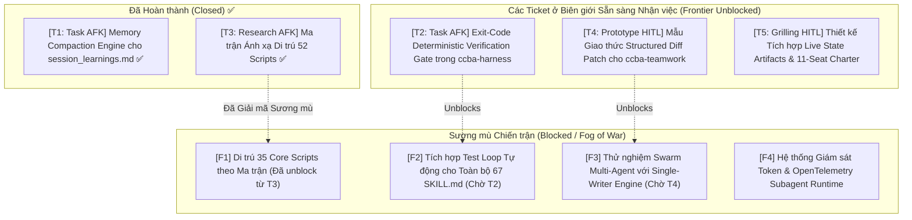

# 🗺️ Bản đồ Định hướng Wayfinder: Lộ Trình Nâng Cấp Toàn Diện Hệ Sinh Thái Kỹ Năng ccba-*

> **Tài liệu tham chiếu & Nền tảng**:
> - [ADR-0030: Instruction Token Budget & Token Budget Governance](../../knowledge/adr/adr-0030.md)
> - [ADR-0035: Deep Modules & Thin Seams Hierarchy](../../knowledge/adr/adr-0035.md)
> - [ADR-0053: Teamwork Multi-Agent Protocol & Single-Writer Coordination](../../knowledge/adr/adr-0053.md)
> - [ADR-0057: Two-Stage Decision Framework for Skill Granularity & Governance](../../knowledge/adr/adr-0057.md)
> - [Skill Authoring Guide: Multi-Mode Standard & Reference Deduplication](../../knowledge/guides/skill_authoring_guide.md)
> - [Latent Space: The /wayfinder Skill: Navigating the “Fog of War” of Planning (Matt Pocock)](https://www.latent.space/p/wayfinder-skill)
> - **Industry Benchmarks**: Claude Code Verification Loops, SWE-bench Evaluator Harness, Letta/MemGPT Memory Compaction, Devin/Cursor Single-Writer Structured Patches.

---

## 1. Điểm đích (Destination)

Toàn bộ **67 kỹ năng và các orchestrators** trong hệ sinh thái **CCBA Agent Services Platform** được nâng cấp toàn diện lên thế hệ kiến trúc tự chủ cấp công nghiệp (Autonomous Agentic Platform v2.0), đạt các tiêu chuẩn bất biến sau:

1. **Exit-Code Deterministic Verification Gate**:
   - Chấm dứt hoàn toàn hiện tượng Agent tự nhận hoàn thành công việc (Premature Completion / Self-Certification). Mọi tiêu chí hoàn thành trong `SKILL.md` được hỗ trợ hoặc bắt buộc đối soát bằng **CLI Exit Codes** (`pytest`, `ruff`, `mypy`, `ccba-harness verify-patch`). Nếu Exit Code $\ne 0$, cấm tuyệt đối Agent kết luận thành công.
2. **Zero Script Bloat Ngoài Packages (Tuân thủ Triệt để Cổng 0 ADR-0057)**:
   - Toàn bộ **105 scripts tự do (35,680 LOC)** hiện đang rải rác bên trong thư mục `scripts/` của 14 skills được di trú hoàn toàn vào các **Deep Seams** của `packages/*/src/` với tỷ lệ kiểm thử unit test $\ge 90\%$. Kỹ năng `SKILL.md` chỉ đóng vai trò hướng dẫn orchestrate và gọi CLI/API, không chứa code logic nghiệp vụ trần.
3. **Bộ Nén Tri Thức Phiên Tự Động (Session Memory Compaction Engine)**:
   - Tài liệu bộ nhớ phiên `.md/knowledge/session_learnings.md` được nén định kỳ và tự động từ **38 KB (~9,500 tokens)** xuống **$\le 10\text{ KB}$**, loại bỏ hiện tượng pha loãng chú ý (Attention Dilution) khi khởi động bất kỳ phiên Agent mới nào mà vẫn bảo toàn 100% các quy tắc cốt lõi đã học được.
4. **Giao Thức Single-Writer & Structured Diff Patch Cho Multi-Agent (ADR-0053)**:
   - Các Worker Agents trong nhóm (`ccba-teamwork`) hoạt động theo nguyên tắc **No Pre-mutation**: tuyệt đối không ghi trực tiếp vào codebase. Toàn bộ đề xuất thay đổi được đóng gói dưới dạng **Unified Diff / Structured Patch** lưu tạm tại `.system_generated/scratch/`. **Lead Orchestrator** là thực thể duy nhất (Single-Writer) thẩm tra xung đột và thực hiện atomic patch.
5. **Cộng Tác Dựa Trên Artifacts & Cổng Phê Duyệt Tương Tác (HITL Gates)**:
   - Mọi trạng thái làm việc phức tạp hoặc kế hoạch đa bước bắt buộc thể hiện qua **Native Antigravity Artifacts** (`RequestFeedback: true`), tích hợp trực tiếp với cơ chế phê duyệt của Hội đồng Thẩm định 11 Ghế CCBA Charter (ADR-0046).

---

## 2. Ghi chú & Tri thức Nền tảng (Notes)

- **Triết lý "Plan, Don't Do" của Wayfinder**:
  - Bản đồ này tập trung vào việc **ra quyết định (decisions)**, xác lập ranh giới kiến trúc và giải mã các vùng sương mù (Fog of War) trước khi viết mã quy mô lớn.
  - Các ticket được chia thành các đơn vị công việc độc lập (~100K token budget/session).
- **Quy tắc Tuân thủ Toàn cục (User Global Rules)**:
  - **Rule 1**: Toàn bộ tài liệu trung gian, bản đồ, spec và artifacts bắt buộc lưu trữ trong thư mục `.\.md\`. Tuyệt đối không lưu rải rác ngoài Project Root.
  - **Rule 4**: Thực hiện theo cơ chế Planning Mode Approval; ưu tiên tái sử dụng (Reuse-First Gate) qua `catalog.yaml`.
  - **Rule 8**: Mọi đề xuất kiến trúc phải trải qua 2 vòng kiểm chứng (Code-First Research & Self-Adversarial Review).
- **Bộ Công Cụ & Thư Viện Nòng Cốt**:
  - `packages/ccba-harness/`: Module cốt lõi chịu trách nhiệm làm Verification Harness và Skill Validator.
  - `packages/ccba-ai/`: Cổng giao tiếp duy nhất với LiteLLM Gateway trên Server Spark.
  - `scripts/governance/`: Các công cụ kiểm soát chất lượng mã nguồn và tính toàn vẹn của nền tảng.

---

## 3. Quyết định Đã Chốt (Decisions so far)

- **[Đã chốt - 2026-09-09] Thẩm tra & Kiểm định Thực chứng 5 Trụ cột Nâng cấp qua `/boost`**:
  - Đã quét thực tế toàn bộ Monorepo: xác nhận 105 loose scripts (35,680 dòng code) trong 14 skills đang vi phạm Cổng 0 ADR-0057; xác nhận `session_learnings.md` đạt 38 KB (9.5K tokens) gây lãng phí ~10% ngữ cảnh mỗi lượt prompt; xác nhận race condition khi nhiều Worker ghi đồng thời vào file mã nguồn.
  - Chi tiết tại Artifact: [learning_proposal.md](file:///C:/Users/chuvu/.gemini/antigravity/brain/ea5a900e-41fd-4ae6-968a-e2e271e67e52/learning_proposal.md).
- **[Đã chốt - 2026-09-09] Đối sánh Chuẩn Công nghiệp & Best Practices qua `/browser`**:
  - Khảo sát Anthropic Claude Code, OpenAI SWE-bench, Devin, Cursor, Aider và Letta/MemGPT.
  - Chốt áp dụng mô hình **Dual-Verification Gate**: Lớp 1 dùng Deterministic CLI Exit Code (nhanh, 0 token, 100% tin cậy); Lớp 2 chỉ spawn Critic/Auditor Agent khi bài toán có độ mơ hồ ngữ nghĩa hoặc thẩm định thiết kế UI/Architecture.
  - Chốt mô hình **Worker Structured Diff Patch** kết hợp **Orchestrator Single-Writer** nhằm loại bỏ xung đột ghi đè tệp.
- **[Đã chốt - 2026-09-09] Tái cấu trúc Chuẩn mực Hình mẫu Kỹ năng `ccba-xia` (Commit `d15a3dfa`)**:
  - Khắc phục lỗi Premature Completion tại Phase 3 và Phase 6, cập nhật tiêu chí hoàn thành có thể kiểm chứng máy tính.
  - Chuẩn hóa GPI $A=1.0$ (tổng điểm $GPI = 16.5 \ge 12.0$), khử hoàn toàn các đoạn văn trùng lặp trong `MODES.md`, dọn dẹp file zombie backup, 100% unit tests và governance tests vượt qua.
- **[Đã chốt - 2026-09-09] Thể chế hóa Tiêu chuẩn Thiết kế Kỹ năng vào Cẩm nang Nền tảng (Commit `8867a540`)**:
  - Bổ sung 2 chương quy phạm vào `skill_authoring_guide.md`: (1) Tiêu chuẩn thiết kế kỹ năng đa chế độ (Multi-Mode Skill Criteria) và (2) Quy tắc tham chiếu không trùng lặp (DRY Reference Rule).
  - Ban hành 6 tiêu chuẩn thiết kế tài liệu `MODES.md` cho toàn bộ các kỹ năng tiếp theo.
- **[Đã chốt - 2026-09-10] Hoàn thành Khảo sát & Ma trận Ánh xạ Di trú Scripts (Ticket 3 - Double-Pass Review)**:
  - Khảo sát thực tế đo lường (`[đo thực tế]`): Chỉ có **11 skills** chứa `scripts/` với **52 files (9,909 LOC)**.
  - Phân loại: **17 files** đã là Thin Adapters; **35 files** chứa Core Logic cần di trú.
  - Thống nhất đề xuất thành lập package mới `packages/ccba-qc-core` cho mảng Thẩm tra Đa bộ môn (`ccba-ai-qc` & `ccba-ai-qc-pccc-audit`), đưa `eval_runner.py` về `packages/ccba-harness`, hợp nhất OOXML vào `packages/ccba-ooxml`, và mở rộng `packages/ccba-pdf-prep`.
  - Chi tiết tại Manifest: [scripts_migration_manifest.md](../../knowledge/scripts_migration_manifest.md).
- **[Đã chốt - 2026-09-10] Triển khai Memory Compaction Engine & Nén session_learnings.md (Ticket 1)**:
  - Xây dựng thành công CLI `scripts/governance/compact_session_learnings.py` hỗ trợ `--stats`, `--check`, `--compact`.
  - Nén tệp `session_learnings.md` từ **38,033 bytes (37.14 KB) về 8,761 bytes (8.56 KB)**, đạt mức giảm **77.0%** (tiết kiệm ~7,300 tokens cho mọi phiên Agent khởi tạo).
  - Bảo toàn 100% bản gốc lịch sử tại [`.md/knowledge/archive/session_learnings_history.md`](../../knowledge/archive/session_learnings_history.md).
  - Bộ kiểm thử `tests/governance/test_compact_session_learnings.py` đạt 7/7 PASS (100% test suite monorepo đạt 81 passed).

---

## 4. Các Ticket ở Biên giới (Frontier Unblocked Tickets)

Dưới đây là các ticket mở, độc lập, không bị chặn bởi bất kỳ ticket nào khác, sẵn sàng được nhận (claim) và thực thi trong từng phiên độc lập:

---

### Ticket 1: [Task/AFK] `[Xây dựng Cơ chế Nén Tri thức Tự động (Memory Compaction Engine) cho session_learnings.md]` ✅
- **Mục tiêu**: Xây dựng tiện ích CLI `scripts/governance/compact_session_learnings.py` (kèm unit test tại `tests/governance/test_compact_session_learnings.py`) có khả năng phân loại các quy tắc trong `session_learnings.md`, chắt lọc thành bảng tóm tắt $\le 10\text{ KB}$, và tự động lưu các ghi chú lịch sử chi tiết vào `.md/knowledge/archive/session_learnings_archive_<timestamp>.md`.
- **Đầu ra thực tế**:
  - Script [`scripts/governance/compact_session_learnings.py`](../../../../scripts/governance/compact_session_learnings.py) đạt chuẩn strict mypy và ruff.
  - Bộ kiểm thử [`tests/governance/test_compact_session_learnings.py`](../../../../tests/governance/test_compact_session_learnings.py) đạt 100% PASS.
  - File [`.md/knowledge/session_learnings.md`](../../knowledge/session_learnings.md) giảm từ 38 KB về **8.56 KB** (tiết kiệm ~7,300 tokens mỗi phiên).
  - Bản lưu trữ toàn văn 100% tại [`.md/knowledge/archive/session_learnings_history.md`](../../knowledge/archive/session_learnings_history.md).
- **Phân loại**: `Task [AFK]` | **Ưu tiên**: P0.1 | **Trạng thái**: **Closed (Done) ✅**

---

### Ticket 2: [Task/AFK] `[Nâng cấp ccba-harness verify-patch với Exit-Code Deterministic Verification Gate]`
- **Mục tiêu**: Bổ sung hàm thực thi kiểm định xác định `verify_patch_execution()` vào `packages/ccba-harness/src/ccba_harness/skill_validator.py` và command CLI `ccba-harness verify-patch`. Công cụ này cho phép truyền vào danh sách lệnh (`pytest ...`, `ruff check ...`, `mypy ...`), tự động chạy trong subprocess cô lập, bắt exit code và trả về kết quả JSON chuẩn hóa kèm thông báo lỗi ngắn gọn nếu exit code $\ne 0$.
- **Đầu ra kỳ vọng**:
  - Tính năng `ccba-harness verify-patch` với các flags: `--commands`, `--json-report`, `--strict-exit-code`.
  - Unit tests trong `packages/ccba-harness/tests/` bao phủ kịch bản Pass, Fail và Timeout.
- **Phân loại**: `Task [AFK]` | **Ưu tiên**: P0.2 | **Trạng thái**: **Ready to Claim**

---

### Ticket 3: [Research/AFK] `[Khảo sát, Lập Danh mục & Ma trận Di trú 52 Scripts Về Monorepo Packages]` ✅
- **Mục tiêu**: Quét toàn bộ mã nguồn Python nằm trong `.agents/skills/*/scripts/`. Phân tích dependency, xác định chức năng và lập ma trận ánh xạ (Mapping Matrix) cụ thể từng script sẽ được chuyển vào Deep Seam của package nào.
- **Đầu ra thực tế**:
  - Tài liệu điều tra và ma trận di trú: [`.md/knowledge/scripts_migration_manifest.md`](../../knowledge/scripts_migration_manifest.md).
  - Xác định chính xác 11 skills chứa scripts (52 files, 9,909 LOC), trong đó 17 files đã là Thin Adapters, 35 files chứa core logic.
  - Đề xuất tạo package mới `packages/ccba-qc-core` và phân bổ các files còn lại về `ccba-harness`, `ccba-ooxml`, `ccba-pdf-prep`.
- **Phân loại**: `Research [AFK]` | **Ưu tiên**: P0.3 | **Trạng thái**: **Closed (Done) ✅**

---

### Ticket 4: [Prototype/HITL] `[Thiết kế Mẫu Giao thức Structured Diff Patch & Single-Writer cho ccba-teamwork]`
- **Mục tiêu**: Xây dựng mẫu thử giao thức làm việc cho các Worker Sub-agents: cấm gọi các công cụ sửa file trực tiếp (`replace_file_content`, `write_to_file` trên source code). Thay vào đó, Worker chỉ xuất tệp Patch (`.diff` hoặc JSON Search-Replace) vào thư mục `.system_generated/scratch/`. Thiết kế một helper script `apply_worker_patches.py` để Lead Orchestrator áp dụng lần lượt các patch, kiểm tra xung đột cú pháp và revert nếu gặp lỗi.
- **Đầu ra kỳ vọng**:
  - Tài liệu quy chuẩn giao thức: `.md/knowledge/specs/spec-structured-diff-protocol.md`.
  - Script nguyên mẫu: `scripts/governance/apply_worker_patch.py`.
  - Trình diễn thực nghiệm trên một ca kiểm thử đơn giản.
- **Phân loại**: `Prototype [HITL]` | **Ưu tiên**: P1.1 | **Trạng thái**: **Ready to Claim**

---

### Ticket 5: [Grilling/HITL] `[Phỏng vấn Thiết kế Tích hợp Live State Artifacts & 11-Seat CCBA Charter Review]`
- **Mục tiêu**: Thực hiện một phiên đối thoại chuyên sâu (Socratic Grilling) cùng Kỹ sư trưởng để thống nhất cấu trúc của các Live State Artifacts (`prompt_draft.md`, `task_dashboard.md`), vị trí lưu trữ hợp chuẩn Rule 1 (`.\.md\scratch\`), và cách thức gắn kết quyết định của 11 Ghế Hội đồng Thẩm định CCBA (ADR-0046) vào giao diện phản hồi của Antigravity (`RequestFeedback: true`).
- **Đầu ra kỳ vọng**:
  - Biên bản phỏng vấn Grilling: `.md/knowledge/grilling_live_artifacts_and_charter.md`.
  - Bản thảo quyết định kiến trúc ADR bổ sung về Live Collaboration Artifacts.
- **Phân loại**: `Grilling [HITL]` | **Ưu tiên**: P1.2 | **Trạng thái**: **Ready to Claim**

---

## 5. Sương mù Chiến trận / Chưa xác định rõ (Not yet specified - Fog of War)

Khu vực lưu trữ các bài toán và hướng đi lớn đã được thu hẹp sương mù:

1. **[F1] Di trú & Tái cấu trúc 35 Core Scripts thành Deep Seams**:
   - *Trạng thái*: **Đã Unblock từ Ticket 3**. Đã có ma trận chi tiết tại `scripts_migration_manifest.md`.
   - *Bước tiếp theo*: Chờ phê duyệt thành lập `packages/ccba-qc-core` từ Kỹ sư trưởng để tạo ticket thực thi (P0/P1).
   - *Vấn đề mờ*: Các script có import chéo nhau giữa các skill không? Cần bao nhiêu mock tests cho các hàm xử lý PDF/CAD/DOCX phức tạp?
2. **[F2] Tích hợp Test Loop Tự Động Vào Toàn Bộ 67 Kỹ Năng**:
   - *Phụ thuộc*: Ticket 2 (Cần hoàn thành công cụ `ccba-harness verify-patch` trước).
   - *Vấn đề mờ*: Các skill mang tính chất tư vấn định tính (như `ccba-legal-advisor`, `ccba-seminar-builder`) sẽ dùng assertion test nào để làm rào chắn Exit Code khách quan? (Có thể là bộ rubric validator hoặc schema assertion).
3. **[F3] Thử nghiệm Swarm Multi-Agent Chạy Thực Tế với Single-Writer Engine**:
   - *Phụ thuộc*: Ticket 4 (Cần có prototype structured diff hoàn chỉnh).
   - *Vấn đề mờ*: Tốc độ xử lý của Orchestrator khi nhận đồng thời 5 diff patches từ 5 workers; giải quyết semantic conflict như thế nào nếu 2 worker cùng sửa logic nhưng không xung đột dòng text?
4. **[F4] Hệ Thống Giám Sát OpenTelemetry & Dynamic Token Budgeting**:
   - *Phụ thuộc*: Sự ổn định của hạ tầng Subagents trên Antigravity IDE.
   - *Vấn đề mờ*: Làm sao trích xuất chính xác token consumption của từng tool call từ transcript log JSONL mà không gây overhead I/O?

---

## 6. Ngoài phạm vi (Out of Scope)

1. **Thay đổi nghiệp vụ cốt lõi của các tiêu chuẩn xây dựng**:
   - Không can thiệp hoặc thay đổi các quy tắc tính toán kết cấu, bảng tra QCVN, tiêu chuẩn PCCC hay phân loại Uniclass 200 (chỉ thay đổi kiến trúc thực thi phần mềm).
2. **Can thiệp vào máy chủ AI Gateway LiteLLM**:
   - Không cấu hình lại hạ tầng Server Spark hay endpoint mạng Tailscale (chỉ chuẩn hóa SDK client phía Monorepo).
3. **Viết lại Prompt nghiệp vụ của 67 Skills trong đợt đầu**:
   - Chỉ nâng cấp cấu trúc frontmatter, rào chắn Verification Gate và di chuyển scripts; giữ nguyên tính toàn vẹn của các prompt chuyên môn đã được nghiệm thu.
