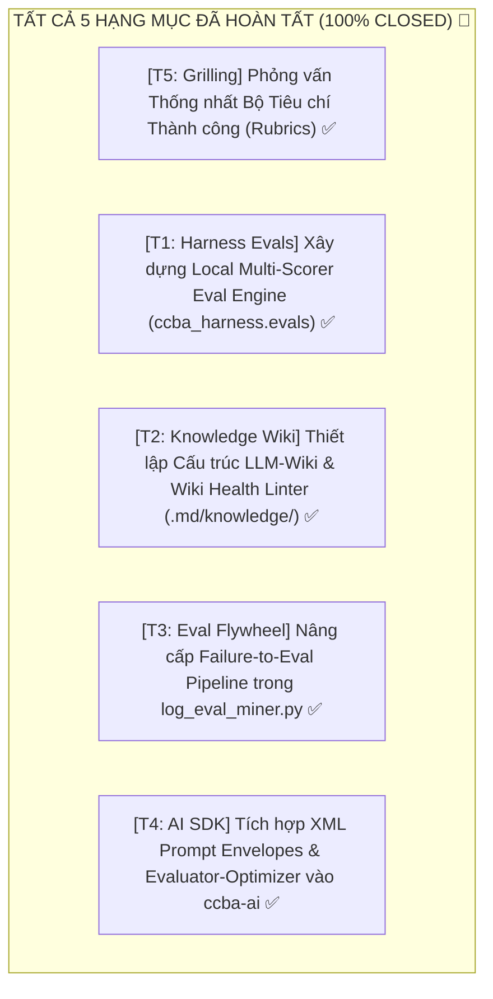

# 🗺️ Bản đồ Định hướng Wayfinder: Nâng Cấp Hệ Thống Evals Đa Tầng & LLM-Wiki Compounding Knowledge

> **Nguồn nghiên cứu tổng hợp**:
> 1. [The AI Engineer Mindset — Matt Pocock (AI Hero)](https://www.aihero.dev/the-ai-engineer-mindset)
> 2. [Your App Is Only As Good As Its Evals — Matt Pocock (AI Hero)](https://www.aihero.dev/what-are-evals)
> 3. [Define Success Criteria and Build Evaluations — Anthropic Claude Platform Docs](https://platform.claude.com/docs/en/test-and-evaluate/develop-tests)
> 4. [Building Evals Cookbook — Anthropic Claude Cookbook](https://platform.claude.com/cookbook/misc-building-evals)
> 5. [17 Techniques For Improving Your LLM-Powered App — Matt Pocock (AI Hero)](https://www.aihero.dev/how-to-improve-your-llm-powered-app)
> 6. [LLM-Wiki: Persistent Knowledge Base Pattern — Andrej Karpathy (Gist)](https://gist.github.com/karpathy/442a6bf555914893e9891c11519de94f)

---

## 1. Điểm đích (Destination)

Nâng cấp toàn diện năng lực **Kiểm định Chất lượng AI (AI Evals)** và **Quản trị Tri thức Tích lũy (Compounding Knowledge)** cho CCBA Agent Services Platform:
1. **Local-First Multi-Scorer Eval Framework (`ccba_harness.evals`)**: Cung cấp bộ công cụ đánh giá năng lực các kỹ năng và pipelines AI trong nền tảng (Data + Task + Scorers $\rightarrow$ Score 0–100%), hỗ trợ cả Code-based Scorers siêu tốc (< 1ms) và Model-based Rubric Scorers (`<thinking>...<correctness>`) với rào chắn chi phí và thời gian nghiêm ngặt.
2. **Failure-to-Eval Automated Flywheel (Vòng quay Dữ liệu Tự cải tiến)**: Mở rộng `log_eval_miner.py` từ việc trích xuất regex thô thành quy trình tự động biến các lỗi thực tế / disclaimer mismatch từ `transcript.jsonl` thành bộ Eval Test Cases hoàn chỉnh có rubric đối chuẩn.
3. **LLM-Wiki Persistent Compounding Knowledge Engine cho `.md/knowledge/`**: Chuyển đổi mô hình lưu trữ tài liệu phân tán sang cấu trúc LLM-Wiki 3 tầng chuẩn Karpathy với 3 nghiệp vụ tự động (`Ingest` $\rightarrow$ `Query` $\rightarrow$ `Lint`), sở hữu danh mục nội dung `index.md`, nhật ký dòng thời gian `log.md`, và bộ kiểm định sức khỏe tri thức `WikiHealthLinter` (phát hiện mâu thuẫn, orphan notes, stale knowledge).
4. **Standardized Prompt Envelopes & Evaluator-Optimizer SDK Helper trong `ccba-ai`**: Chuẩn hóa việc sử dụng XML Tags delimiters trên các core prompts và tích hợp helper lặp `Evaluator-Optimizer` cho các tác vụ thẩm tra thiết kế và trích xuất bảng biểu phức tạp.

---

## 2. Ghi chú & Tri thức Nền tảng (Notes)

### A. 4 Trụ cột Lý thuyết Đúc kết từ 6 Nguồn Nghiên cứu:

1. **AI Engineer Mindset & Data Flywheel (Matt Pocock)**:
   - Hệ thống AI mang tính xác suất (probabilistic), không thể dựa vào cảm tính ("vibes-only"). Cần chỉ số thành công đo lường được (Quantitative Success Metrics).
   - Evals chính là "Unit Tests" của AI Engineer. Vòng lặp cải tiến: User interaction $\rightarrow$ Failure detection $\rightarrow$ Synthetic Eval Case $\rightarrow$ Optimize Prompt/Pipeline $\rightarrow$ Re-eval $\rightarrow$ Ship.

2. **Thiết kế & Chấm điểm Evals (Anthropic Claude Docs & Cookbook)**:
   - Cấu trúc 4 thành phần của một Eval: `Input Prompt`, `Model Output`, `Golden Answer/Rubric`, `Score`.
   - 3 Phương pháp chấm điểm:
     - *Code-based Grading* (Exact match, Regex, JSON Schema, Token length): Siêu tốc, tin cậy tuyệt đối, chi phí = 0.
     - *Human Grading*: Chất lượng cao nhưng đắt và chậm (chỉ dùng cho benchmark khởi đầu).
     - *Model-based Grading (LLM-as-a-judge)*: Linh hoạt, hỗ trợ đánh giá sắc thái. **Bắt buộc** có Rubric rõ ràng, thang điểm chuẩn (1–5 hoặc Boolean `correct/incorrect`), và ép mô hình suy luận trước (`<thinking>`) rồi mới đưa kết luận (`<correctness>`).

3. **Cầu thang Độ phức tạp (Staircase of Complexity - Matt Pocock)**:
   - Thứ tự ưu tiên giải pháp từ đơn giản $\rightarrow$ phức tạp: Prompt rõ ràng $\rightarrow$ XML Tags $\rightarrow$ Structured Outputs $\rightarrow$ Chain-of-Thought $\rightarrow$ Few-shot $\rightarrow$ Tool Calling $\rightarrow$ Chaining $\rightarrow$ RAG / Hybrid Search $\rightarrow$ Agent Loops $\rightarrow$ Evaluator-Optimizer $\rightarrow$ LLM Router $\rightarrow$ Fine-Tuning.
   - Luôn thử kỹ thuật ở đầu cầu thang trước, chỉ bước xuống khi các bước đơn giản đã cạn kiệt tiềm năng.

4. **LLM-Wiki Pattern (Andrej Karpathy)**:
   - Stateless RAG chỉ tìm kiếm lại từ đầu mỗi query mà không có sự tích lũy.
   - LLM-Wiki là tầng tri thức trung gian bền vững (persistent, compounding): LLM là người bảo trì (maintainer), Obsidian/IDE là giao diện đọc, Markdown files là cơ sở dữ liệu.
   - 3 Tầng: Raw Sources (bất biến) $\rightarrow$ The Wiki (do LLM viết & cập nhật chéo) $\rightarrow$ The Schema (`AGENTS.md` / `CLAUDE.md`).
   - 3 Nghiệp vụ: Ingest (hấp thụ tài liệu, cập nhật 10–15 trang liên quan, ghi log), Query (tìm kiếm + tổng hợp có citation, lưu kết quả xuất sắc ngược lại wiki), Lint (quét phát hiện mâu thuẫn, claim cũ, orphan pages).

---

## 3. Quyết định Đã chốt & Hiện trạng Codebase (Decisions so far)

- **[Đã kiểm chứng - 2026-08-16] Codebase CCBA hiện tại đã có nền tảng vững chắc**:
  - `packages/ccba-ai`: Đã có Circuit Breaker, Think-tag stripping (`strip_think_tags`), Pydantic Structured Outputs, Routing Archetypes, và dynamic timeout.
  - `scripts/eval/run_harness_evals.py` & `safe_pytest.py`: Đã có rào chắn CI Gates 4 tầng, sandbox isolation, và SLA Fast Test < 2.0s (`pytest -m "not slow"`).
  - `scripts/eval/log_eval_miner.py`: Đã có module quét `transcript.jsonl`, che giấu PII (Maskara) và phát hiện router failures.
  - `packages/ccba-legal-intel`: Đã có bộ benchmark 5 trường (`qa_benchmark.json`) và AST VBHN Engine.
  - `skills/hybrid-rag-search`: Đã có Hybrid BM25 + Vector + RRF search.
- **[Đã đối chiếu - 2026-08-16] Xác định các khoảng trống (Gaps) cần nâng cấp**:
  - *Gap 1 (Evals)*: Chưa có một Local Eval Runner độc lập, chuẩn hóa (Data + Task + Scorers) để chạy benchmark các pipeline nghiệp vụ và chấm điểm tự động bằng code/LLM rubrics.
  - *Gap 2 (Flywheel)*: `log_eval_miner.py` mới chỉ tạo regex assertions thô, chưa sinh ra đầy đủ cấu trúc Eval có Rubric & Reasoning check.
  - *Gap 3 (Knowledge)*: Thư mục `.md/knowledge/` chứa nhiều file markdown rời rạc, chưa có cơ chế vận hành như một LLM-Wiki với `index.md`, `log.md` và công cụ `wiki_linter.py`.
  - *Gap 4 (SDK Utility)*: Chưa có XML Envelope Prompt Helpers và Evaluator-Optimizer loop trong `ccba-ai`.

- **[Đã chốt - 2026-08-16] Hoàn thành Phỏng vấn Grilling Thống nhất Bộ Tiêu chí Thành công (Ticket 5)**: Hoàn tất phiên phỏng vấn Socrates 5 vòng cùng Kỹ sư trưởng, ban hành tài liệu quy chuẩn chính thức [`.md/knowledge/guidelines/domain_success_criteria_rubrics.md`](../knowledge/guidelines/domain_success_criteria_rubrics.md). Đã chốt mô hình chấm điểm Hybrid (Code-based + Likert 1-5 quy đổi % có rào chắn Điểm Liệt), phân bổ trọng số cho 3 miền nghiệp vụ (QC PCCC 40/30/20/10, Legal VBHN 35/35/20/10, Academic Writing 35/25/25/15), và xác lập SLA 2-Tier (< 2s Fast vs 90s Deep) kèm ngưỡng Self-Healing tối đa 3 vòng lặp.

---

## 4. Các Ticket ở Biên giới (Frontier Unblocked Tickets)

---

### Ticket 1: [Task/AFK] `[Xây dựng Local Multi-Scorer Eval Engine (ccba_harness.evals)]` ✅
- **Mục tiêu**: Xây dựng module `ccba_harness.evals` cung cấp framework chạy eval cục bộ chuẩn hóa:
  - Class `EvalRunner`: Nhận `dataset: list[EvalItem]`, `task: Callable[[Any], Awaitable[Any]]`, `scorers: list[BaseScorer]`.
  - `CodeScorer`: ExactMatch, RegexMatch, JsonSchemaMatch, LengthBounds (< 1ms).
  - `LLMRubricScorer`: Áp dụng cấu trúc prompt Anthropic (`<rubric>`, `<answer>`, `<thinking>`, `<correctness>` / Likert 1–5).
  - Rào chắn Điểm Liệt (Fail Fast) & Trọng số Đa chiều theo chuẩn [`domain_success_criteria_rubrics.md`](../knowledge/guidelines/domain_success_criteria_rubrics.md).
- **Kết quả**: 9 unit tests PASS trong 0.20s, 100% CI Gates PASS.
- **Trạng thái**: **Closed (Done) ✅**

---

### Ticket 2: [Task/AFK] `[Thiết lập Cấu trúc LLM-Wiki & Wiki Health Linter (.md/knowledge/)]` ✅
- **Mục tiêu**: Nâng cấp toàn bộ hệ thống tri thức `.md/knowledge/` thành một LLM-Wiki bền vững theo mô hình Karpathy:
  - Khởi tạo tệp danh mục tự động [`index.md`](../knowledge/index.md) (phân nhóm 8 trục tri thức chuẩn hóa).
  - Khởi tạo tệp nhật ký dòng thời gian append-only [`log.md`](../knowledge/log.md) (`## [YYYY-MM-DD] [operation] | Title`).
  - Xây dựng công cụ kiểm định sức khỏe tri thức [`wiki_health_linter.py`](../../scripts/governance/wiki_health_linter.py):
    - Quét liên kết gãy / orphan notes (ghi chú mồ côi không có link trỏ tới).
    - Quét tính nguyên vẹn của log mutation headers.
    - Tích hợp `WikiHealthLinter` vào `scripts/doc_auditor.py` và CI Governance Gate.
- **Kết quả**: 5 unit tests PASS trong 0.27s, 0 orphan notes, 100% CI Gates PASS.
- **Trạng thái**: **Closed (Done) ✅**

---

### Ticket 3: [Task/AFK] `[Nâng cấp Failure-to-Eval Pipeline trong log_eval_miner.py]` ✅
- **Mục tiêu**: Nâng cấp `scripts/eval/log_eval_miner.py` để hiện thực hóa vòng quay dữ liệu (AI Native Flywheel):
  - Nhận diện 3 loại lỗi (`ROUTER_DISCLAIMER`, `TOOL_EXCEPTION`, `OUTDATED_CITATION`).
  - Che giấu toàn bộ thông tin nhạy cảm theo chuẩn Maskara.
  - Sinh ca kiểm thử định dạng `EvalItem` tương thích 100% với `ccba_harness.evals`.
  - Hỗ trợ cờ CLI `--auto-inject` với cơ chế chống trùng lặp (Idempotent).
- **Kết quả**: 6 unit tests PASS trong 0.17s, 100% CI Gates PASS.
- **Trạng thái**: **Closed (Done) ✅**

---

### Ticket 4: [Task/AFK] `[Tích hợp XML Prompt Envelopes & Evaluator-Optimizer vào ccba-ai]` ✅
- **Mục tiêu**: Bổ sung các công cụ hỗ trợ prompt và kiến trúc lặp vào SDK `packages/ccba-ai`:
  - `xml_envelope(tags: dict[str, Any]) -> str`: Helper bọc ngữ cảnh, dữ liệu đầu vào và luật vào các thẻ XML (`<context>`, `<documents>`, `<instructions>`, `<rubric>`).
  - `evaluator_optimizer_loop(generator_fn, evaluator_fn, max_iterations=3)`: Mẫu lặp tự sửa lỗi (Technique 15) cho các bài toán tạo tài liệu chất lượng cao hoặc trích xuất bảng phức tạp.
- **Kết quả**: 7 unit tests PASS trong 0.18s, 100% CI Gates PASS.
- **Trạng thái**: **Closed (Done) ✅**

---

### Ticket 5: [Grilling/HITL] `[Phỏng vấn Thống nhất Bộ Tiêu chí Thành công (Success Criteria Rubrics)]` ✅
- **Mục tiêu**: Phỏng vấn Kỹ sư trưởng và Domain Experts qua `/ccba-grilling` để thiết lập bộ tiêu chuẩn định lượng (Quantitative Success Rubrics) cho 3 domain cốt lõi:
  - *Domain 1: Thẩm tra QC Thiết kế PCCC/MEP* (Độ chính xác viện dẫn QCVN, tỷ lệ False Positive, định dạng bảng kiểm soát).
  - *Domain 2: Pháp điển Xây dựng (Legal Intel & VBHN)* (Độ phủ trích dẫn điều khoản, phát hiện hiệu lực văn bản).
  - *Domain 3: Viết Học thuật & Báo cáo Seminar* (Văn phong IMRAD, cấu trúc luận điểm, không hallucination).
- **Đầu ra**: Tài liệu quy chuẩn [`.md/knowledge/guidelines/domain_success_criteria_rubrics.md`](../knowledge/guidelines/domain_success_criteria_rubrics.md) đã ban hành.
- **Trạng thái**: **Closed (Done) ✅**

---

## 5. Sương mù chiến trận / Chưa xác định rõ (Not yet specified)

- **Semantic Memory Graph over SQLite-vec**: Cân nhắc tích hợp vector database cục bộ siêu nhẹ (như `sqlite-vec` hoặc `qmd`) để mở rộng khả năng tra cứu của LLM-Wiki khi số lượng ghi chú trong `.md/knowledge/` vượt quá 500 files. Sẽ quyết định sau khi hoàn thành Ticket 2 và đo lường kích thước corpus thực tế.
- **Synthetic Data Generation for Skills Benchmark**: Kỹ thuật dùng LLM sinh hàng trăm câu hỏi đa dạng dựa trên tài liệu pháp lý mẫu để kiểm tra độ bền vững của Skills (Volume over quality). Sẽ định hình sau khi chốt Ticket 5.

---

## 6. Ngoài phạm vi (Out of Scope)

- **Cloud/SaaS Eval Platforms (Braintrust, LangSmith, Weights & Biases)**: Không đưa các SaaS cloud vào vòng lặp local nhằm bảo vệ tuyệt đối bí mật dữ liệu công trình, tránh quota limit và tuân thủ nguyên tắc độc lập của hệ thống CCBA.
- **Fine-Tuning Models từ đầu**: Chưa triển khai fine-tuning ở giai đoạn này do chi phí và độ phức tạp cao, tuân thủ nguyên tắc "Cầu thang Độ phức tạp (Staircase of Complexity Hell)" — tập trung tối ưu Prompt, Structured Outputs, Evals và LLM-Wiki trước.
