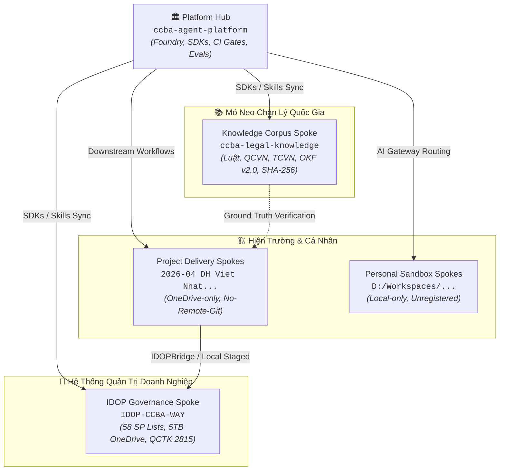
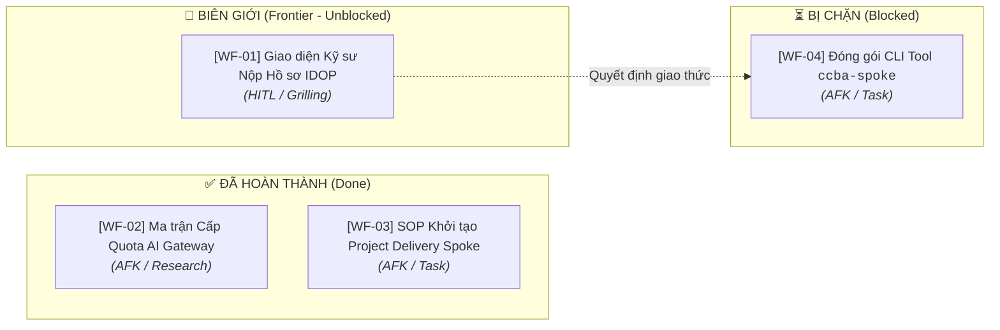

# 🗺️ Bản đồ Định hướng Wayfinder: Hệ Sinh Thái IDOP Hub-Spoke & Phân Phối Tri Thức CCBA

> **Tham chiếu nền tảng**:
> - [ADR 0041: Hub-Spoke Ecosystem Taxonomy & 4 Core Archetypes](../../docs/adr/0041-hub-spoke-ecosystem-taxonomy-and-archetypes.md)
> - [ADR 0042: Tri-Repo Sync & Tiered AI Pre-Submission Gate](../../docs/adr/0042-tiered-ai-pre-submission-gate-and-tri-repo-sync.md)
> - [ADR 0043: Decoupled Resilience & IDOP Local Staging Queue](../../docs/adr/0043-idop-active-dev-resilience-and-fallback.md)
> - [ADR 0044: Standard Editable Package Bootstrap](../../docs/adr/0044-spoke-hub-package-bootstrap-standard.md)
> - Ubiquitous Language: [CONTEXT.md](../../CONTEXT.md)

---

## 1. Điểm đích (Destination)

Thiết lập bản đồ chiến lược và hoàn thiện mô hình tổ chức, phân bổ, cấp quyền và đồng bộ hóa toàn diện mạng lưới CCBA Hub-Spoke tích hợp nền tảng doanh nghiệp IDOP:
1. **Định danh & Ranh giới Thẩm quyền**: Phân định ranh giới rõ ràng, không chồng chéo giữa Hub (`ccba-agent-platform`), Spoke Quản trị Doanh nghiệp (`IDOP-CCBA-WAY`), Spoke Mỏ neo Chân lý Pháp lý (`ccba-legal-knowledge`), các Spoke Triển khai Dự án (`project_delivery`), và Spoke Không gian Cá nhân (`personal_workspace`).
2. **Giao thức Chuyển tiếp Dữ liệu Nháp $\rightarrow$ IDOP (Local Staging & Ingestion)**: Quy chuẩn luồng công việc từ file soạn thảo/kiểm tra cục bộ của Kỹ sư lên 58 SharePoint Lists và 5TB Master OneDrive qua `IDOPBridge` với khả năng Zero-Downtime, Offline-First và Idempotent Replay.
3. **Cơ chế Quản trị & Phân bổ Năng lượng AI Gateway**: Chuẩn hóa chính sách định tuyến đa mô hình, cấp phát Quota và Virtual Keys cho các vai trò/kỹ sư thông qua LiteLLM Gateway trên Server Spark (`100.83.192.30:8090`).
4. **SOP Vận hành Golden Layout**: Hướng dẫn chuẩn mực cho Kỹ sư thiết lập môi trường làm việc trên ổ đĩa `D:\`, đồng bộ hóa xuôi (Downstream Sync) và tham gia vòng lặp đóng góp ngược (Upstream Loop).

---

## 2. Ghi chú & Tri thức Nền tảng (Notes)

### A. Mô Hình 4 Core Archetypes & Ranh Giới Dữ Liệu

### B. Quy Chuẩn Golden Layout Ổ Đĩa `D:\`
- `D:\GitHubProjects\ccba-agent-platform`: Tổng hành dinh Hub (Monorepo chứa Skills, Workflows, Packages Python).
- `D:\GitHubProjects\ccba-legal-knowledge`: Kho tri thức pháp điển hóa quốc gia (Single Source of Truth về Luật/Tiêu chuẩn).
- `D:\idop-ccba-way`: Hệ điều hành nội bộ CCBA (Quy chế 2815, 3209, Data Models, Scripts kết nối M365).
- `D:\OneDrive - IBST BIM\00 Works\[Mã_Dự_Án]`: Không gian Spoke triển khai dự án thực tế (đồng bộ qua OneDrive, không dùng Git remote).
- `D:\Workspaces\[Tên_Kỹ_Sư]`: Không gian nháp cá nhân (Local Git, dùng AI Gateway 1 chiều từ Server Spark, không đăng ký remote lên Hub).

---

## 3. Quyết định Đã chốt (Decisions so far)

- **[Đã chốt - 2026-08-22] Vị trí Antigravity SDK (`google-antigravity v0.1.13`)**:
  SDK đóng vai trò động cơ CI/CD và Auto-Tuner cấp cao, chỉ cài đặt và thực thi tại Hub (`ccba-agent-platform` / `ccba-harness`), không đưa vào các Spoke dữ liệu nhẹ.
- **[Đã chốt - 2026-08-22] Phân định Thẩm quyền Dữ liệu**:
  - `ccba-legal-knowledge` = "Hiến pháp & Pháp luật Quốc gia" (OKF v2.2, SHA-256 PDF Anchors).
  - `IDOP-CCBA-WAY` = "Luật Doanh nghiệp & Quy chế CCBA" (QCTK 2815, Phân bổ dòng tiền 3 tầng, PGV, 15 Vai trò, 58 SP Lists).
- **[Đã chốt - 2026-08-22] Phương thức Vận hành Phòng ban Hành chính**:
  KHKT, TCKT, TCHC không sử dụng Git Spoke; toàn bộ hoạt động giao tiếp và kiểm soát diễn ra trực tiếp qua 58 SharePoint Lists và OneDrive.
- **[Đã chốt - 2026-08-22] Chính sách Personal Sandbox Spoke**:
  Kỹ sư được phép khởi tạo Spoke cá nhân cục bộ để ghi chú, học tập và chạy thử nghiệm AI, hưởng thụ hạ tầng AI Gateway từ Server Spark, nhưng tuyệt đối không đăng ký vào `spoke_registry.yaml` trên GitHub của Hub.
- **[Đã chốt - 2026-08-22] Cơ chế Đệm & Tái phát Bất biến (ADR 0043)**:
  Tích hợp `IDOPBridge` với Local Staging Queue tại `.md/idop_staged/` đảm bảo khả năng Zero-Downtime khi MS 365 bảo trì hoặc khi kỹ sư làm việc offline.
- **[Đã chốt - 2026-08-23] Ma Trận Cấp Phát Quota 3 Tầng & Graceful Auto-Fallback (`[WF-02]`)**:
  - Personal Sandbox (`Tier 1`): Không giới hạn Local GPU (vLLM Qwen 35B / reasoning-gemma); Capped $5/tháng Cloud (~50k tokens/ngày). Tự động giáng cấp (Graceful Fallback) về Qwen 35B khi cạn quota Cloud mà không làm đứt gãy tiến trình.
  - Project Delivery (`Tier 2`): Phân bổ theo ngân sách dự án ($50-$200/dự án); cấp quyền Full Multimodal Vision Quad-view.
  - Platform Hub & Daemon (`Tier 3`): Dynamic Budget $10/đêm, ưu tiên chạy 00:00-05:00 kết hợp Circuit Breaker.
  - Chi tiết tại: [`ai_gateway_quota_matrix_and_routing_architecture.md`](../knowledge/research_and_studies/ai_gateway_quota_matrix_and_routing_architecture.md).
- **[Đã chốt - 2026-08-23] Quy Chuẩn Khởi Tạo Project Delivery Spoke (`[WF-03]`)**:
  - Mọi Spoke dự án (tư vấn/thẩm tra/kiểm định) vận hành trên OneDrive/SharePoint tuân thủ SOP 4 bước, không dùng Git remote.
  - Sử dụng tệp mẫu [`templates/workspace_context.delivery.yaml`](../../templates/workspace_context.delivery.yaml) và tài liệu SOP [`docs/sop/project_delivery_spoke_setup.md`](../../docs/sop/project_delivery_spoke_setup.md).
  - Tự động kế thừa toàn bộ quy trình thẩm tra chuyên sâu (`/workflow_pccc_cdt_tuthamdinh`, `/ccba-ai-qc-pccc-audit`) từ Hub.

---

## 4. Sương mù Chiến trận / Chưa xác định rõ (Not yet specified)

- **Sương mù 1 (Giao diện Kỹ sư Nộp Hồ sơ IDOP)**: Chưa thống nhất hình thức tương tác tối ưu cho Kỹ sư khi muốn đẩy báo cáo/tiến độ từ Spoke dự án vào SharePoint IDOP (dùng lệnh CLI `ccba idop push`, hay kéo thả file vào thư mục watcher `.md/idop_staged/`, hay form web). *(Giải quyết tại `[WF-01]`)*.

---

## 5. Ngoài phạm vi (Out of scope)

- Tái thiết kế cấu trúc 58 SharePoint Lists và sơ đồ cơ sở dữ liệu trên M365 (đã được định hình trong `IDOP-CCBA-WAY`).
- Thay đổi cấu trúc cốt lõi OKF v2.0 của `ccba-legal-knowledge`.
- Triển khai các Extension Archetypes tương lai (`research_lab`, `tooling_plugin`, `client_portal`) trong giai đoạn này.

---

## 6. Danh sách Ticket Định hướng (Wayfinder Tickets)

### 🎯 Các Ticket ở Biên giới (Frontier - Ready to Work)

1. **`[WF-01]` [HITL / Grilling] [Giao diện Tương tác Nộp Hồ sơ IDOP cho Kỹ sư](tickets/wf_01_idop_submission_interface.md)**
   - **Loại**: `Grilling` (Chất vấn Socrates với Kỹ sư trưởng)
   - **Mục tiêu**: Làm rõ hành vi người dùng mong muốn nhất: Kỹ sư muốn chạy lệnh CLI dòng lệnh (`ccba idop submit --file ...`), hay để Agent tự động quét và đẩy ngầm khi hoàn thành task, hay kéo thả file vào thư mục đệm `.md/idop_staged/`?
   - **Trạng thái**: `OPEN` (Frontier)

### ⏳ Các Ticket Bị Chặn (Blocked)

2. **`[WF-04]` [AFK / Task] [Đóng gói Tiện ích CLI `ccba-spoke` Hỗ trợ Kỹ sư Thao tác Staging và Đồng bộ](tickets/wf_04_ccba_spoke_cli.md)**
   - **Loại**: `Task` (Triển khai code trong `packages/ccba-core` hoặc script standalone)
   - **Bị chặn bởi**: `[WF-01]` (Cần chốt giao diện tương tác trước khi viết code CLI)
   - **Trạng thái**: `BLOCKED`

### ✅ Các Ticket Đã Đóng (Closed)

3. **`[WF-02]` [AFK / Research] [Ma trận Cấp phát Quota & Routing Rule cho AI Gateway Server Spark](tickets/wf_02_ai_gateway_quota_matrix.md)**
   - **Trạng thái**: `CLOSED` (Xem báo cáo tại [`ai_gateway_quota_matrix_and_routing_architecture.md`](../knowledge/research_and_studies/ai_gateway_quota_matrix_and_routing_architecture.md))

4. **`[WF-03]` [AFK / Task] [Bộ Quy Chuẩn & SOP Khởi Tạo Project Delivery Spoke trên OneDrive](tickets/wf_03_project_delivery_spoke_sop.md)**
   - **Trạng thái**: `CLOSED` (Xem SOP tại [`project_delivery_spoke_setup.md`](../../docs/sop/project_delivery_spoke_setup.md))

---

*Tạo bởi CCBA — Trung tâm Tư vấn và Ứng dụng BIM trong Xây dựng*
