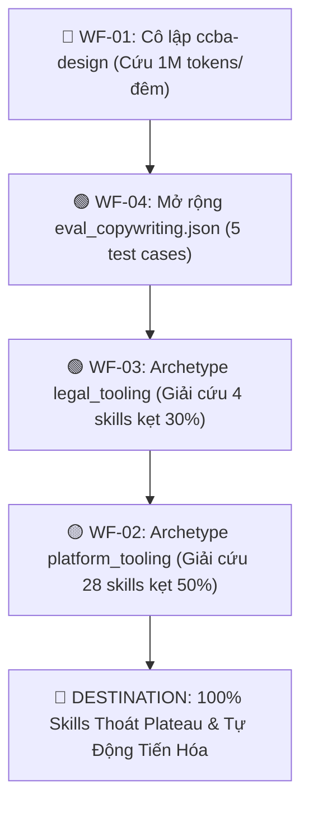

# 🗺️ Wayfinder Map: Lộ Trình Giải Phóng Plateau Cho Toàn Bộ Skills

> **Mã định danh:** `plateau-resolution-roadmap`  
> **Trạng thái:** `IN_PROGRESS` (Active Frontier)  
> **Khởi tạo:** 2026-09-26  
> **Kỹ năng điều phối:** `/ccba-wayfinder`

---

## 1. 🎯 Điểm Đích (Destination)

Toàn bộ **74 kỹ năng (skills)** trong nền tảng CCBA Agent Services Platform được ánh xạ chính xác 100% vào đúng **Domain Archetype** và **Evaluation Dataset** tương thích với bản chất nghiệp vụ chuyên môn; triệt tiêu hoàn toàn hiện tượng kẹt điểm trần giả tạo (Plateau) do thi nhầm đề thi (như 30% ở Legal Tooling, 44–60% ở Platform Utilities, 67.6% ở Design), bảo đảm hệ thống Auto-Tuner vận hành tiết kiệm token và thúc đẩy các kỹ năng tự động tiến hóa thực chất.

---

## 2. 📝 Ghi Chú & Thể Chế (Notes & Guardrails)

- **SSOT Archetype Routing Invariant (ADR-0058):** Mọi quy tắc ánh xạ bắt buộc phải quy về `packages/ccba-harness/src/ccba_harness/evals/archetypes.py`. Các bộ từ khóa nhận diện phải tách bạch (disjoint), không được chồng lấn.
- **Bảo toàn Cổng Nghiệm thu (ADR-0058 Hard Completion Lock):** Mọi thay đổi về archetype và dataset phải vượt qua `python -m ccba_harness verify-patch --preset code`.
- **Nguyên tắc Tiết Kiệm Token Tối Đa:** Ưu tiên số 1 là cô lập ngay `ccba-design` để không tiếp tục lãng phí ~1 triệu tokens mỗi đêm vào tập dữ liệu rác `eval_general_domain.json`.
- **Kỹ năng bổ trợ cần nạp:** `/ccba-grilling`, `/ccba-research`, `/ccba-implement`, `/ccba-tdd`.

---

## 3. ✅ Quyết Định Đã Chốt (Decisions So Far)

| Ticket / PR | Tên Quyết Định | Tóm Tắt & Kết Quả |
| :--- | :--- | :--- |
| **PR #378 / #379** | [`Dedicated skill_repair Archetype & Dataset`](file:///home/vvc/ccba/ccba-agent-platform/packages/ccba-harness/src/ccba_harness/evals/archetypes.py) | Tách `skill-repair` khỏi `orchestration`, tạo archetype `skill_repair`, bộ chấm điểm YAML/GPI/Gate 0 và dataset `eval_skill_repair.json` (5 test cases). Điểm baseline nhảy vọt từ 0.0% lên **100.0%**. |
| **PR #382 / #383** | [`Defense-in-Depth 2-Tier DriftAuditor`](file:///home/vvc/ccba/ccba-agent-platform/scripts/governance/drift_auditor.py) | Khử triệt để False Positive của CI khi bổ sung tệp dữ liệu test case (`eval_*.json`) vào thư mục `test_cases/` của skill. Dọn đường an toàn cho việc mở rộng các bộ test cases mới. |
| **Issue #384 / WF-01** | [`Dedicated visual_design Archetype & Dataset`](file:///home/vvc/ccba/ccba-agent-platform/packages/ccba-harness/src/ccba_harness/evals/archetypes.py) | Cô lập `ccba-design` khỏi `eval_general_domain.json`, tạo archetype `visual_design`, bộ chấm điểm Design Tokens/Hex/Brand/Typography và dataset `eval_visual_design.json` (5 test cases). Cứu ~1.000.000 tokens mỗi đêm và phá vỡ plateau 67.6%. |
| **Issue #388 / WF-04** | [`Office Domain Benchmark Dataset & Scorers Expansion`](file:///home/vvc/ccba/ccba-agent-platform/packages/ccba-harness/src/ccba_harness/evals/scorers.py) | Mở rộng `eval_copywriting.json` (5 test cases), hoàn thiện `OfficeStandardScorer` bao quát NĐ 30/2020, GFM markdown table, PPTX slide outline, seminar curriculum và BIM technical copywriting; củng cố mock simulation giải phóng 5 skills văn phòng khỏi plateau 30%–75%. |
| **Issue #390 / WF-03** | [`Dedicated legal_tooling Archetype, Dataset & ADR-0059 Scorers`](file:///home/vvc/ccba/ccba-agent-platform/packages/ccba-harness/src/ccba_harness/evals/archetypes.py) | Thiết lập archetype `legal_tooling` tách biệt hoàn toàn với tư vấn luật lý thuyết `legal`; xây dựng dataset `eval_legal_tooling.json` (5 test cases); phát triển bộ chấm điểm `LegalToolingIntegrityScorer` và `Sha256ProvenanceScorer` (ADR-0059 Critical Hard Floor); giải phóng 4 skills kỹ thuật pháp lý khỏi plateau 30%. |

---

## 4. 🌫️ Sương Mù Chiến Trận / Chưa Xác Định Rõ (Not Yet Specified)

1. **[Fog 1] Tiêu chí đánh giá cho nhóm Platform Utilities:**
   - Các kỹ năng như `ccba-create-pr`, `ccba-git-guardrails`, `ccba-youtube-learn`, `ccba-notebooklm-connector` không tạo ra bài văn bản xuôi mà chủ yếu gọi công cụ (tool calling) hoặc xuất định dạng JSON/YAML/CLI.
   - *Vấn đề chưa rõ:* Scorer cho nhóm này nên dựa trên Regex kiểm tra tham số gọi tool, hay dựa trên tính toàn vẹn của artifact xuất ra?
2. **[Fog 2 - ĐÃ GIẢI QUYẾT] Phân tách Legal Engineering vs Legal Advisory:**
   - Đã thống nhất thiết lập Domain Archetype `legal_tooling` đứng trước `legal` trong SSOT `DOMAIN_ARCHETYPES` để đón đầu các kỹ năng cào dữ liệu, xử lý pipeline ingest, tracker và checklist.
   - Tích hợp rào chắn bắt buộc ADR-0059 `Sha256ProvenanceScorer` làm critical hard floor (ngắt 0 điểm nếu sinh văn bản luật giả định hoặc thiếu mã băm SHA-256).
3. **[Fog 3 - ĐÃ GIẢI QUYẾT] Tiêu chuẩn đánh giá cho Multimodal / Visual Design:**
   - Đã chốt bộ chấm điểm 4 tiêu chí tại `get_visual_design_scorers()`: Cấu trúc Design Tokens & Hex Colors, Brand Guidelines & Safe Zone (Critical Hard Floor), Typography & Image Prompt Specifications, và Content Depth.

---

## 5. 🚫 Ngoài Phạm Vi (Out Of Scope)

- **Không viết lại SKILL.md thủ công cho 74 skills:** Mục tiêu là chuẩn hóa "Đề thi" và "Giám thị chấm thi" (Dataset & Scorers), để Nightly Auto-Tuner tự động tối ưu hóa SKILL.md.
- **Không thay đổi kiến trúc thuật toán Git-Ratchet Optimizer:** Giữ nguyên vòng lặp ratchet bất biến đã được chứng minh hiệu quả tại PR #377.
- **Không can thiệp vào các skills đã đạt 100%:** `ccba-llm-pipeline-patterns`, `ccba-academic-writing`, `ccba-adr-lifecycle`, `ccba-api-circuit-breaker`, `ccba-ai-pdf-preprocessor`, `ccba-skill-repair`.

---

## 6. 🎫 Danh Sách Ticket Tại Biên Giới (Frontier Tickets)

### ✅ Ticket WF-01: [DONE] Cô Lập Khẩn Cấp `ccba-design` Khỏi Dataset Rác (Issue #384)
- **Mục tiêu:** Cắt đứt ngay lập tức việc tiêu hao ~1M tokens/đêm vào `eval_general_domain.json`.
- **Hành động & Kết quả:**
  1. Thêm `VISUAL_DESIGN_ARCHETYPE_KEYWORDS` và DomainArchetype `visual_design` vào `archetypes.py` (SSOT), bảo đảm disjoint keyword routing loại trừ `codebase-design`.
  2. Tạo bộ dataset benchmark chuẩn `eval_visual_design.json` (5 test cases: Color & Tokens, Typography Scale, Logo Safe Zone, Image Prompt Specs, CIP Program).
  3. Xây dựng scorer `get_visual_design_scorers()` và nhánh giả lập `visual_design` trong `simulation.py`.
- **Đầu ra:** PR giải phóng `ccba-design`, vượt qua ADR-0058 Hard Completion Lock.

### 🟡 Ticket WF-02: [Research & Phân Loại] Tách Nhóm Developer Utilities Khỏi `orchestration` [AFK]
- **Mục tiêu:** Giải phóng 28 skills đang bị kẹt ở mức 44%–60% do phải làm bài thi Forensic Auditor.
- **Hành động:**
  1. Phân loại 28 skills thành 2 nhóm:
     - *Nhóm Pure Orchestration (giữ lại):* `ccba-teamwork`, `ccba-handoff`, `ccba-platform`, `ccba-review-proposal`.
     - *Nhóm Developer / Platform Utilities (tách ra):* `ccba-create-pr`, `ccba-git-guardrails`, `ccba-sync-upstream`, `ccba-youtube-learn`, `ccba-notebooklm-connector`, `ccba-ask`, `ccba-wayfinder`, `ccba-build-skill`, `ccba-setup-skills`...
  2. Thiết lập archetype mới `platform_tooling` với dataset `eval_platform_tooling.json`.
  3. Scorer đánh giá khả năng thực thi lệnh, rào chắn an toàn và tuân thủ giao thức công cụ.
- **Đầu ra:** Báo cáo phân loại chi tiết và bản thiết kế archetype `platform_tooling`.

### ✅ Ticket WF-03: [DONE] Định Hình Archetype `legal_tooling` (Issue #390)
- **Mục tiêu:** Cứu 4 skills (`ccba-tvpl-vip-crawler`, `ccba-legal-ingest`, `ccba-legal-document-tracker`, `ccba-completion-checklist`) thoát khỏi bài thi câu hỏi Luật Xây dựng 2025 lý thuyết (kẹt 30%).
- **Hành động & Kết quả:**
  1. Thiết lập archetype `legal_tooling` với từ khóa `("crawler", "vip", "ingest", "document-tracker", "tracker", "checklist", "hsht")`, đứng trước `legal` trong `DOMAIN_ARCHETYPES` để bảo đảm SSOT routing chính xác.
  2. Xây dựng dataset benchmark `eval_legal_tooling.json` với 5 test cases đặc thù chuẩn mực:
     - Case 1: Thu thập VIP Crawler & Backoff Retry (`test_legal_tooling_vip_crawler_retry_and_session`).
     - Case 2: Phân tích OKF v2.4 & Dấu vết SHA-256 Provenance Stamp (`test_legal_tooling_okf_v24_and_sha256_provenance`).
     - Case 3: So khớp Diff VBHN & Bản đồ điều khoản sửa đổi (`test_legal_tooling_diff_engine_and_vbhn_consolidation`).
     - Case 4: Cây thư mục Hồ sơ Hoàn thành & Tiêu chí nghiệm thu NĐ 06/2021 (`test_legal_tooling_completion_checklist_and_tree_structure`).
     - Case 5: Cơ chế Verbatim Grounding & Rào chắn Anti-Synthetic (ADR-0059) (`test_legal_tooling_verbatim_grounding_and_acquisition_guard`).
  3. Phát triển bộ chấm điểm `LegalToolingIntegrityScorer` (trọng số 0.45) và `Sha256ProvenanceScorer` (trọng số 0.25, critical hard floor).
  4. Củng cố nhánh giả lập `legal_tooling` trong `simulation.py`, tích hợp SSOT resolution trong `runner.py` và cập nhật toàn diện test suites `test_tuner.py`, `test_tuner_daemon.py`, `test_tuner_ssot_fix.py`.
- **Đầu ra:** PR giải phóng 4 skills kỹ thuật pháp lý, vượt qua ADR-0058 Hard Completion Lock.

### ✅ Ticket WF-04: [DONE] Mở Rộng Dataset Văn Phòng & Bộ Chấm Điểm Office (Issue #388)
- **Mục tiêu:** Xóa bỏ tình trạng dataset chỉ có 1 câu hỏi vô lý về "prompt nhiễu", giải phóng `ccba-copywriting`, `ccba-markdown-document-processing`, `ccba-pptx`, `ccba-seminar-builder`, `ccba-xu-ly-van-phong` (kẹt 30%–75%).
- **Hành động & Kết quả:**
  1. Mở rộng dataset benchmark `eval_copywriting.json` với 5 test cases thực tế chuẩn mực:
     - Case 1: Thể thức công văn hành chính chuẩn NĐ 30/2020 (`test_office_administrative_document_format_nd30`).
     - Case 2: Chuẩn hóa Markdown bảng biểu GFM từ Word (`test_office_markdown_table_standardization`).
     - Case 3: Dàn ý và cấu trúc slide thuyết trình PPTX (`test_office_presentation_slide_outline_structure`).
     - Case 4: Đề cương bài giảng và khung chương trình Seminar kỹ thuật (`test_office_seminar_curriculum_and_agenda`).
     - Case 5: Soạn thảo bài viết truyền thông chuyên môn kỹ thuật BIM & CTA (`test_office_bim_technical_copywriting_and_article`).
  2. Nâng cấp bộ chấm điểm `OfficeStandardScorer` bao quát hài hòa thể thức NĐ 30/2020, typography hierarchy, markdown tables, layout slide PPTX, seminar curriculum và hook/CTA copywriting.
  3. Củng cố nhánh giả lập `office` trong `simulation.py`, di chuyển lên trước generic BIM để ngăn chặn triệt để prompt hijacking.
  4. Bổ sung unit và regression tests tại `test_tuner_ssot_fix.py`, xác nhận 100% composite score và 0 critical failure trên cả 5 test cases.
- **Đầu ra:** Tệp `eval_copywriting.json` hoàn chỉnh với 5 test cases chuẩn mực, PR tích hợp vượt qua ADR-0058 Hard Completion Lock.

---

## 7. 🚀 Thứ Tự Ưu Tiên Thực Hiện (Execution Sequence)

