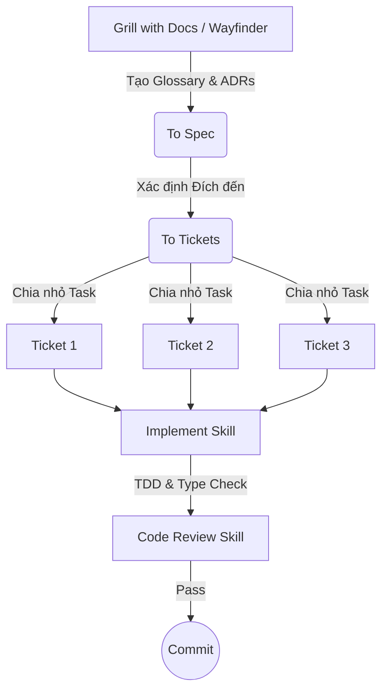
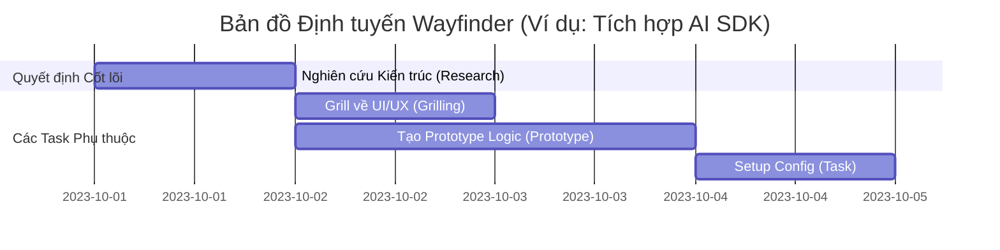

# Tài liệu Tóm tắt Kiến thức (Concept Notes): Cập nhật Skills Repo v1.1 & Quy trình Phát triển Phần mềm với AI

**Đơn vị thực hiện:** Trợ lý Nghiên cứu Học thuật Cao cấp tại CCBA
**Chủ đề:** Phân tích chuyên sâu bản cập nhật v1.1 của AI Skills Repo, chuẩn hóa quy trình SDLC (Software Development Life Cycle) với AI Agent, và các kỹ năng lập kế hoạch/triển khai mã nguồn nâng cao.

---

## 1. Tổng quan Bản cập nhật v1.1

Bản cập nhật phiên bản 1.1 mang đến một sự thay đổi lớn về tư duy sử dụng AI Agent trong lập trình. Thay vì chỉ là các công cụ hỗ trợ rời rạc, hệ thống kỹ năng (skills) nay được liên kết thành một vòng đời phát triển phần mềm (SDLC) hoàn chỉnh. Trọng tâm của bản cập nhật bao gồm việc chuẩn hóa thuật ngữ, cải thiện độ ổn định của các kỹ năng tương tác (Grilling), và đặc biệt là sự ra mắt của phương pháp định tuyến dự án **Wayfinder**.


---

## 2. Chuẩn hóa Thuật ngữ: Từ "PRD/Issues" sang "Spec/Tickets"

Một trong những thay đổi mang tính triết lý nhất trong v1.1 là việc đổi tên hai kỹ năng cốt lõi để phản ánh đúng bản chất của quy trình kỹ thuật phần mềm.

*   **`to PRD` $\rightarrow$ `to spec`**: PRD (Product Requirements Document) thường thiên về khía cạnh sản phẩm và kinh doanh. Trong khi đó, thứ mà AI và lập trình viên thực sự tạo ra là một **Đặc tả (Specification)**. Một Spec bao hàm phạm vi rộng hơn: nó có thể là kỹ thuật, phi kỹ thuật, hoặc sự pha trộn của cả hai.
*   **`to issues` $\rightarrow$ `to tickets`**: Thuật ngữ "Issues" mang định kiến phụ thuộc vào các nền tảng cụ thể như GitHub hay Linear. "Tickets" là một khái niệm trung lập hơn, đại diện cho "hành trình" (journey) các bước nhỏ cần thực hiện để hiện thực hóa bản Spec.


**Lưu ý cập nhật:** Do sự thay đổi tên thư mục, trình cài đặt tự động có thể không nhận diện được. Người dùng cần xóa các kỹ năng cũ và chạy lại lệnh sau để đảm bảo an toàn:

```bash
npx skills add mapco skills
# Sau đó kiểm tra lại thư mục skills để đảm bảo không còn file rác
```


---

## 3. Cải tiến Kỹ năng Tương tác "Grill" (Grill me & Grill with docs)

Kỹ năng "Grill" (AI đặt câu hỏi để khai thác thông tin từ người dùng) đã được tinh chỉnh để giải quyết các lỗi (bugs) phổ biến, dựa trên mô hình toán học về trạng thái hội thoại.

### 3.1. Giới hạn Không gian Câu hỏi
Trước đây, AI thường hỏi dồn dập nhiều câu cùng lúc gây quá tải nhận thức. Hệ thống nay áp đặt ràng buộc nghiêm ngặt:
Giả sử $Q$ là tập hợp các câu hỏi AI muốn hỏi. Tại bất kỳ bước thời gian $t$ nào, số lượng câu hỏi được đưa ra $q_t$ phải thỏa mãn:
$$|q_t| = 1 \quad \forall t$$

### 3.2. Cổng Xác nhận (Confirmation Gate)
Nhiều người dùng báo cáo AI tự động chuyển sang bước triển khai (Implementation) khi chưa thống nhất. Một "cổng logic" được thêm vào:
$$ \text{Trạng thái tiếp theo} = \begin{cases} \text{Triển khai}, & \text{nếu } \text{User\_Confirm} = \text{True} \\ \text{Tiếp tục Grill}, & \text{nếu } \text{User\_Confirm} = \text{False} \end{cases} $$
*Prompt chỉ thị:* "Do not enact the plan until I confirm we've reached a shared understanding."


### 3.3. Phân định "Sự thật" (Facts) và "Quyết định" (Decisions)
Để tránh việc AI "tự nướng" (tự hỏi tự trả lời bằng cách đọc codebase), hệ thống phân định rõ:
*   **Facts (Sự thật):** Những thông tin AI tự tìm được bằng cách khám phá codebase.
*   **Decisions (Quyết định):** Những lựa chọn bắt buộc phải do người dùng (User) đưa ra.


---

## 4. Quy trình Phát triển Phần mềm Tiêu chuẩn (The Main Flow)

Tác giả đã chính thức hóa luồng làm việc (Workflow) chuẩn khi sử dụng AI Agents, chuyển từ việc lập kế hoạch lỏng lẻo sang một SDLC chặt chẽ.




---

## 5. Kỹ năng Triển khai (Implement) & Đánh giá Mã (Code Review)

### 5.1. Kỹ năng Implement
Đây là một kỹ năng mới, đơn giản nhưng đóng vai trò chốt chặn trong quy trình. Nó hướng dẫn AI thực hiện công việc theo một tiêu chuẩn khắt khe:
1. Sử dụng TDD (Test-Driven Development) tại các điểm nối (seams) đã thỏa thuận.
2. Chạy kiểm tra kiểu dữ liệu (Type checking) thường xuyên.
3. Chạy test đơn lẻ liên tục và chạy toàn bộ test suite ở cuối.
4. Gọi kỹ năng `Code Review` trước khi commit.


### 5.2. Kỹ năng Code Review (Phiên bản 2)
Kỹ năng này sử dụng cơ chế Sub-agent chạy song song để đánh giá mã nguồn trên 2 trục (Axes) độc lập:

| Trục Đánh giá (Axis) | Mục tiêu | Nguồn tham chiếu |
| :--- | :--- | :--- |
| **Tiêu chuẩn (Standards)** | Đảm bảo code tuân thủ quy chuẩn của dự án. | File `coding_standards.md` (nằm ngoài `agents.md`). |
| **Đặc tả (Spec)** | Đảm bảo code thực thi chính xác yêu cầu ban đầu. | Issue gốc, PRD, hoặc Spec. |


**Tích hợp "Code Smells" của Martin Fowler:**
Kỹ năng này nay được nhúng sâu các khái niệm từ cuốn sách *Refactoring* kinh điển của Martin Fowler. Bằng cách chỉ cần nhắc đến tên các "mùi mã nguồn" (Code Smells), AI sẽ tự động kích hoạt kiến thức nền (prior knowledge) để phát hiện và sửa chữa:
*   *Mysterious name* (Tên khó hiểu)
*   *Duplicated code* (Mã lặp lặp)
*   *Feature envy* (Ghen tị tính năng)
*   *Message chains* (Chuỗi thông điệp)
*   *Middleman* (Người trung gian)


---

## 6. Kỹ năng Wayfinder: Lập bản đồ Định tuyến Dự án

**Wayfinder** là tính năng mang tính cách mạng nhất trong v1.1, được thiết kế để thay thế `Grill with Docs` trong các dự án lớn.

**Vấn đề giải quyết:** Khi một ý tưởng quá lớn, nó sẽ vượt qua "vùng xử lý thông minh" (smart zone) hoặc giới hạn ngữ cảnh (context window) của một phiên làm việc AI.
**Giải pháp:** Wayfinder đóng vai trò như một người vẽ bản đồ. Nó không viết code, mà chia nhỏ dự án thành một mạng lưới các GitHub Issues có quan hệ ràng buộc (blocking relationships).




**Phân loại Ticket trong Wayfinder:**
1.  **Research (Nghiên cứu):** Tác vụ AFK (Away From Keyboard) để AI tự đọc tài liệu và tóm tắt.
2.  **Grilling (Tương tác):** Cần một phiên hỏi đáp với người dùng để chốt quyết định.
3.  **Prototype (Nguyên mẫu):** Tạo ra các bản nháp thô (UI hoặc Logic) để nâng cao độ trung thực của cuộc thảo luận. *Bắt buộc dùng cho các task liên quan đến Front-end.*
4.  **Tasks (Tác vụ thường):** Cấu hình, cấp quyền, di chuyển dữ liệu (không cần AI suy luận sâu).

Sau khi tất cả các ticket trên bản đồ được đóng, toàn bộ thông tin sẽ được tổng hợp lại thành một **Spec** hoàn chỉnh.

---

## 7. Các Kỹ năng Hỗ trợ Mới: Research, Prototype & TDD

### 7.1. Kỹ năng Research
*   Tạo một background agent để nghiên cứu các nguồn tài liệu gốc (primary sources).
*   Xuất kết quả ra file Markdown và lưu đúng vào cấu trúc thư mục ghi chú hiện tại của dự án.

### 7.2. Kỹ năng Prototype
Được AI tự động gọi (model invoked) thông qua Wayfinder. Cung cấp 2 lựa chọn:
*   **Logic Prototype:** Thử nghiệm luồng xử lý dữ liệu.
*   **UI Prototype:** Thử nghiệm giao diện người dùng.


### 7.3. Cập nhật Kỹ năng TDD
Kỹ năng TDD nay chỉ đóng vai trò là **Tài liệu tham khảo (Reference material)** thay vì ép buộc AI theo các bước cứng nhắc.
*   **Thay đổi cốt lõi:** Chuyển từ vòng lặp `Red -> Green -> Refactor` sang chỉ còn `Red -> Green`.
*   **Lý do:** Việc Refactor (tái cấu trúc) được chuyển giao hoàn toàn cho kỹ năng `Code Review` để tránh làm quá tải (overload) quá trình Implement.


---

## 8. Khóa học AI Coding Crash Course

Để hỗ trợ cộng đồng tiếp cận phương pháp lập trình mới này, tác giả công bố khóa học **AI Coding Crash Course**.
*   **Đặc điểm:** Tự học theo nhịp độ cá nhân (Self-paced), chi phí thấp hơn các cohort thông thường, hỗ trợ qua Discord.
*   **Đối tượng:**
    *   *Senior Engineers:* Khóa học chuyển đổi (Conversion course) để áp dụng AI vào quy trình chuyên nghiệp.
    *   *Người mới (Non-developers):* Cách tiếp cận thực tế để tạo ra sản phẩm bằng các công cụ AI hiện đại.

