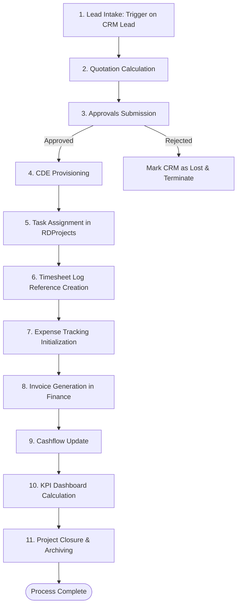

# Power Automate 11-Step Workflow Specification
## Project: SharePoint IDOP Deployment Support Toolkit

This document specifies the end-to-end Power Automate workflow that automates the project and document lifecycle across CRM, Contracts, Finance, Approvals, HRAdmin, LegalQA, and RDProjects.

---

### Workflow Overview & Flowchart

---

### Step-by-Step Details

#### Step 1: Lead Intake
- **Trigger**: When a new item is created in the **CRM** list.
- **Actions**:
  - Get item details.
  - Set status variable.
- **Variables**: `LeadID` (String), `LeadStatus` (String).

#### Step 2: Quotation
- **Trigger**: Step 1 completion.
- **Actions**:
  - Retrieve pricing matrices.
  - Calculate `EstimatedValue` based on customer requirements.
  - Update **CRM** list status to "Proposal".
- **Variables**: `QuotationAmount` (Float/Currency).

#### Step 3: Approvals
- **Trigger**: Status changed to "Proposal".
- **Actions**:
  - Create approval request (Start and wait for approval).
  - Assign to designated manager from CRM `AssignedTo` or dynamic mapping.
  - Record approval response in **Approvals** list.
  - If approved, transition status to "Contracted". If rejected, set status to "Lost".
- **Variables**: `ApprovalOutcome` (String), `ApproverEmail` (String).

#### Step 4: CDE Provisioning
- **Trigger**: Approval Outcome equals "Approved".
- **Actions**:
  - Create folder structure in CDE Document Library:
    - `/01_WIP/{LeadName}_{LeadID}`
    - `/02_Shared/{LeadName}_{LeadID}`
    - `/03_Published/{LeadName}_{LeadID}`
  - Initialize permissions.
- **Variables**: `CDEFolderPath` (String).

#### Step 5: Task Assignment
- **Trigger**: Folder creation completion.
- **Actions**:
  - Create a new project record in the **RDProjects** list.
  - Add tasks and assign them to the Project Manager from CRM.
- **Variables**: `ProjectID` (String), `TaskManagerEmail` (String).

#### Step 6: Timesheet
- **Trigger**: Project task generation.
- **Actions**:
  - Register initial timesheet tracking reference block in HR system or dynamic SharePoint log.
- **Variables**: `TimesheetStatus` (String).

#### Step 7: Expense
- **Trigger**: Timesheet registration.
- **Actions**:
  - Log initial setup expenses under **Finance** list.
- **Variables**: `SetupExpenseAmount` (Float/Currency).

#### Step 8: Invoice
- **Trigger**: Expense validation.
- **Actions**:
  - Create first milestone invoice entry in the **Finance** list.
  - Link invoice to the **Contracts** using the Lookup field.
- **Variables**: `InvoiceNumber` (String).

#### Step 9: Cashflow
- **Trigger**: Invoice entry.
- **Actions**:
  - Recalculate cashflow indicators.
  - Update Finance statistics.
- **Variables**: `ProjectedCashflow` (Float/Currency).

#### Step 10: KPI
- **Trigger**: Cashflow update.
- **Actions**:
  - Calculate team performance ratios and delivery schedules in **RDProjects**.
- **Variables**: `KPIScore` (Float).

#### Step 11: Project Closure
- **Trigger**: Project deliverables verified.
- **Actions**:
  - Move/archive WIP files to `/04_Archive/`.
  - Mark CRM status to "Completed" and Contracts status to "Active" (or "Expired").
- **Variables**: `ClosureStatus` (String).
