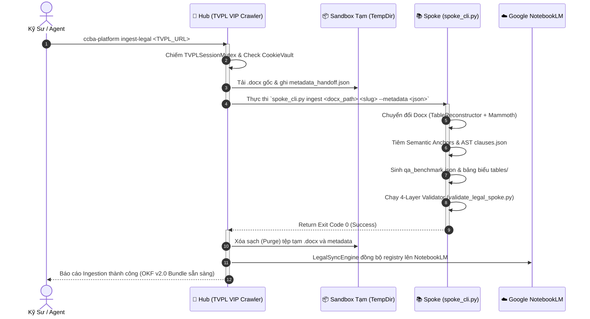

# ADR 0039: Giao Thức Chuyển Giao Tự Động Từ VIP Crawler (Hub) Sang Ingestion Engine (Spoke)

## Bối cảnh (Context)
Hiện tại:
- **Hub (`ccba-agent-platform`):** Sở hữu hạ tầng crawler VIP mạnh mẽ (`TVPLCrawlerEngine`, `CookieVault`, `TVPLSessionMutex`, `ChromeCDP`) có khả năng tải tài liệu gốc `.docx` và trích xuất siêu dữ liệu pháp điển.
- **Spoke (`ccba-legal-knowledge`):** Sở hữu pipeline chuyển đổi Gold Standard OKF v2.0 (`docx_converter.py`, `gold_standard_processor.py`, `validate_legal_spoke.py`).
- Cần một giao thức chuẩn hóa (Autonomous Handoff Protocol) để khi người dùng hoặc hệ thống kích hoạt thu thập một văn bản mới tại Hub, toàn bộ quy trình từ Crawl $\rightarrow$ Ingest $\rightarrow$ Pack OKF v2.0 $\rightarrow$ Validate $\rightarrow$ Cloud Sync diễn ra tự động 100% mà không để lại rác dữ liệu trên Hub.

---

## Quyết định Kiến trúc (Decisions)

### 1. Kiến Trúc 4 Bước Chuyển Giao Tự Động (4-Step Autonomous Protocol)



### 2. Định Dạng Payload Chuyển Giao (Handoff Payload Contract)
Khi Hub hoàn thành việc cào văn bản, nó sinh tệp payload trung gian trong thư mục sandbox tạm:
```json
{
  "source_url": "https://thuvienphapluat.vn/van-ban/...",
  "doc_id": "nghi_dinh_217_2026_nd_cp",
  "doc_number": "217/2026/NĐ-CP",
  "title": "Nghị định quy định chi tiết một số điều của Luật Xây dựng...",
  "doc_type": "vbpl",
  "category": "Nghị định",
  "issuer": "Chính phủ",
  "issued_date": "2026-06-19",
  "effective_date": "2026-07-01",
  "raw_docx_path": "/tmp/sandbox_123/source.docx",
  "sha256": "e3b0c44298fc1c149afbf4c8996fb92427ae41e4649b934ca495991b7852b855"
}
```

### 3. Rào Chắn Vệ Sinh Ngữ Cảnh & Dữ Liệu (Zero-Duplication Sandboxing)
- **Tạo tệp tạm:** Tệp `.docx` và payload trung gian bắt buộc tạo trong `tempfile.TemporaryDirectory()` trên máy trạm.
- **Tự động làm sạch (Auto-Purge Invariant):** Ngay sau khi Spoke trả về mã `Exit Code 0`, Hub tự động hủy bỏ toàn bộ thư mục sandbox tạm. Hub không lưu trữ bất kỳ bản sao nào của file `.docx` hay `.md`, tuân thủ 100% nguyên tắc Zero-Duplication SSOT (ADR 0037).

### 4. Giao Diện Dòng Lệnh Toàn Cục (CLI Seam)
Bổ sung lệnh hợp nhất vào Launcher `ccba-platform`:
```bash
ccba-platform ingest-legal <TVPL_URL> [--spoke <path_or_registered_name>] [--doc-type <type>]
```

---

## Hệ Quả & Đánh Đổi (Consequences)

### Tích cực (Positive)
- **Tự động hóa hoàn toàn:** Kỹ sư chỉ cần cung cấp 1 đường link TVPL duy nhất, toàn bộ chu trình xử lý, bóc tách cấu trúc AST, sinh QA benchmark và cập nhật registry tại Spoke được thực thi tự động.
- **Khóa an toàn:** Phiên VIP được bảo vệ bởi `TVPLSessionMutex`, dữ liệu sau khi ingest được xác thực ngay bởi `validate_legal_spoke.py`.
- **Tuyệt đối không rò rỉ dữ liệu:** Dữ liệu chỉ tồn tại ở Spoke (SSOT) và đám mây (NotebookLM), Hub luôn sạch sẽ.

---
*Ghi nhận bởi CCBA Platform Architecture Board — 2026-08-15*
