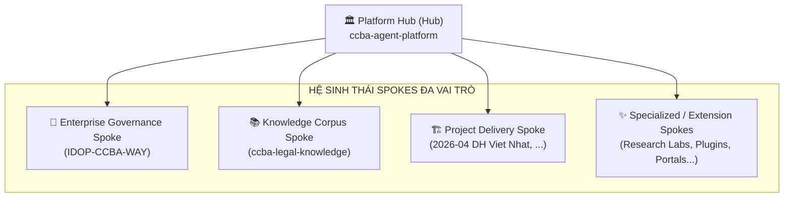

# ADR 0041: Hub-Spoke Ecosystem Taxonomy, Spoke Archetypes, and Extensibility Framework

## Context
As the CCBA Agent Platform scales, the network of repositories (Hub and Spokes) is diversifying beyond simple construction project deliverables. Repositories serve distinct purposes across enterprise operations, national legal intelligence, engineering software tools, and field project execution.

Without a formal classification taxonomy, AI Agents risk confusing operational boundaries (e.g. attempting to duplicate legal documents into project spokes, or conflating internal enterprise governance with public tech tooling).

## Decision
We formally establish the **CCBA Hub-Spoke Archetype Taxonomy** and an **Extensibility Framework** for registering existing and future specialized Spokes.

### 1. The 4 Core Archetypes



| Archetype Code | Archetype Name | Primary Purpose | Examples |
| :--- | :--- | :--- | :--- |
| `platform_hub` | **Platform Hub** | Engineering Foundry, Agent Skill Catalog, Python SDKs, Quality & Auto-Tuner Gates. | `ccba-agent-platform` |
| `enterprise_governance` | **Enterprise Governance Spoke** | Internal Enterprise OS ("The CCBA Way"): QCTK 2815, 3-Tier Cash Allocation, PGV, 15 Standard Roles, SharePoint 58 Lists. | `IDOP-CCBA-WAY` |
| `knowledge_corpus` | **Knowledge Corpus Spoke** | National Legal & Engineering Standards SSOT: OKF v2.0 Bundles, Flat ASTs, Table CSVs, Q&A Benchmarks. | `ccba-legal-knowledge` |
| `project_delivery` | **Project Delivery Spoke** | Physical Project Execution: Building BIM models, PCCC QC audits, local design briefs, completion checklists. | `2026-04 DH Viet Nhat` |

### 2. Extensibility Framework for Future Specialized Spokes

To support future organizational expansion, the platform reserves and standardizes the following **Future Specialized Archetypes**:

1. `research_lab` (**R&D & Academic Spoke**):
   - Dedicated spaces for academic papers, algorithmic experiments (e.g. structural calculation engines, automated generative drafting), and university collaboration.
2. `tooling_plugin` (**Plugin & CAD/BIM Connector Spoke**):
   - Dedicated repositories for Revit Add-ins, AutoCAD Plugins, Rhino/Grasshopper scripts, or OpenBIM IFC parser binaries.
3. `client_portal` (**Client Extranet Spoke**):
   - Read-only or restricted-access repositories provided to external clients/investors for real-time audit report dashboards and compliance reviews.

### 3. Registry Schema Extension (`spoke_registry.yaml`)

Every registered Spoke in `.md/data/spoke_registry.yaml` MUST specify its `archetype`:

```yaml
spokes:
  ccba-legal-knowledge:
    archetype: knowledge_corpus
    description: "Kho Tri thức Pháp luật Xây dựng & PCCC Chuẩn OKF v2.0"
    path: "D:/GitHubProjects/ccba-legal-knowledge"
    
  IDOP-CCBA-WAY:
    archetype: enterprise_governance
    description: "Hệ Điều Hành Doanh Nghiệp & Quản Trị Nội Bộ CCBA"
    path: "D:/idop-ccba-way"
    
  2026-04 DH Viet Nhat:
    archetype: project_delivery
    description: "Dự Án Tư Vấn & Thẩm Tra Thiết Kế ĐH Việt Nhật"
    path: "D:/OneDrive - IBST BIM/00 Works/2026-04 DH Viet Nhat"
```

## Consequences
- **Positive**: AI Agents instantly know the scope and boundary of any workspace upon inspecting its archetype.
- **Positive**: Zero confusion between internal company rules (`IDOP-CCBA-WAY`) and national legal frameworks (`ccba-legal-knowledge`).
- **Positive**: High extensibility for new business lines (R&D, Plugins, Portals).
