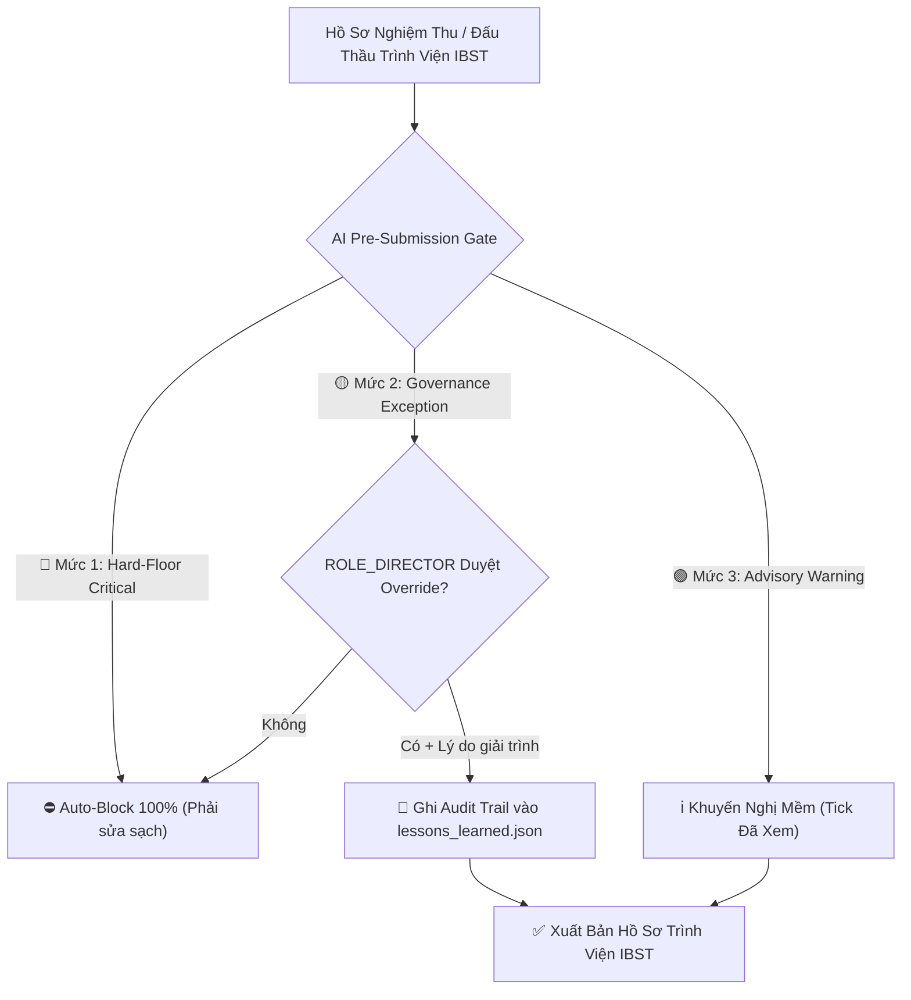

# ADR 0042: Tiered Multi-Severity AI Pre-Submission Gate and Tri-Repo Server Synchronization Protocol

## Context
As the CCBA Agent Platform integrates closely with the enterprise governance operating system (`IDOP-CCBA-WAY`) and interfaces with the functional departments of the Institute for Building Science and Technology (Viện IBST: KHKT, TCKT, TCHC), we must ensure:
1. Continuous synchronization between Hub tooling, National Legal Knowledge, and Enterprise Governance on Server Spark (`100.83.192.30`).
2. Zero administrative and financial submission rejections from Viện IBST without imposing rigid mechanical bottlenecks that impair business agility.

## Decision
We formally establish the **Tri-Repo Server Synchronization Protocol**, the **Headless Python IDOPBridge SDK**, and the **3-Tiered Multi-Severity AI Pre-Submission Gate**.

### 1. Tri-Repo Server Topology & Synchronization Protocol
Server Spark maintains three core sibling repositories under `~/ccba/`:
- `ccba-agent-platform` (Platform Hub)
- `ccba-legal-knowledge` (National Legal & Standards SSOT)
- `IDOP-CCBA-WAY` (Enterprise Governance & Cash Flow OS)

Prior to the nightly Auto-Tuner run at 00:00, the daemon executes a **Sequential Tri-Repo Pull Gate**:
```bash
cd ~/ccba/ccba-legal-knowledge && git checkout main && git pull origin main
cd ~/ccba/IDOP-CCBA-WAY && git checkout main && git pull origin main
cd ~/ccba/ccba-agent-platform && git checkout main && git pull origin main
```

### 2. Headless Python IDOPBridge SDK
Spoke projects communicate with 58 IDOP SharePoint Lists via a headless Python SDK using Microsoft Graph REST API and the App-Only Certificate (`c055c7a4-9150-4bd5-bf01-445c65467feb`).
- Syncs project deliverables directly into `CdeDocuments` (ISO 19650).
- Updates project WBS stages into `Projects` and `JobAssignments`.

### 3. 3-Tiered AI Pre-Submission Gate



| Severity Tier | Trigger Conditions | Enforcement Mechanism | Authorization |
| :--- | :--- | :---: | :---: |
| 🔴 **Tier 1: Hard-Floor Auto-Block** | • Obsolete laws (e.g. Decree 136/2020).<br/>• Advance request $> 90\%$.<br/>• 3-Tier cash allocation sum $\neq 100\%$ of contract. | ⛔ **Strict System Block** (Zero bypass allowed) | System Enforced |
| 🟡 **Tier 2: Governance Override** | • Urgent contract signing prior to full stage signoff.<br/>• Custom Tier-3 project incentive allocation. | ✍️ **Director Override** with mandatory explanation log | **`ROLE_DIRECTOR`** (Giám đốc CCBA) |
| 🟢 **Tier 3: Advisory Warnings** | • Formatting refinements (Yale/APA style).<br/>• Non-blocking milestone reminders. | ℹ️ **Soft Warning** (Acknowledge & proceed) | **`ROLE_HEAD_ADMIN`** (Trưởng phòng TH) |

## Consequences
- **Positive**: Eliminates 100% of illegal or mathematically flawed submittals to Viện IBST.
- **Positive**: Preserves executive flexibility for edge cases while guaranteeing full audit transparency.
- **Positive**: Automated 3-repo synchronization prevents code drift across the AI ecosystem.
